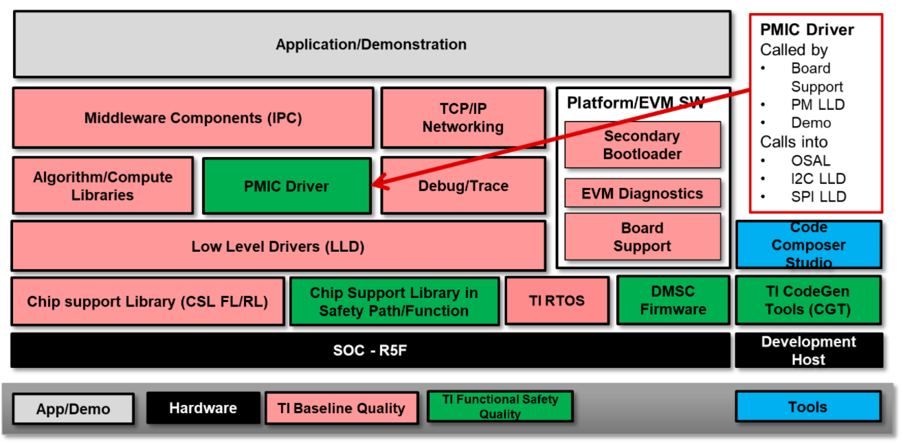
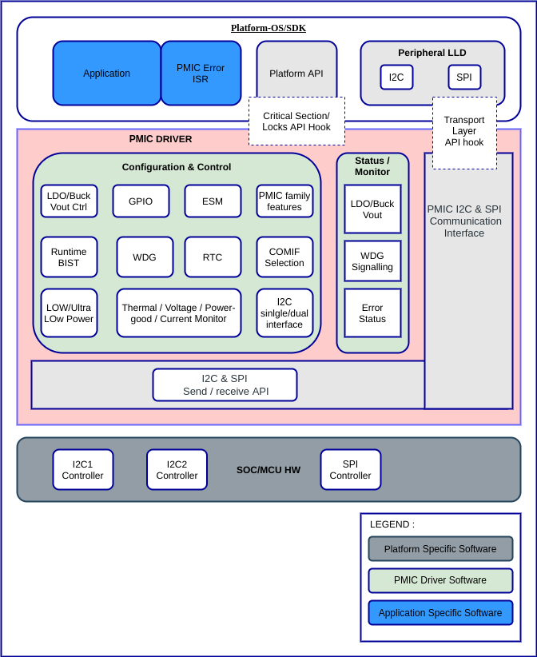
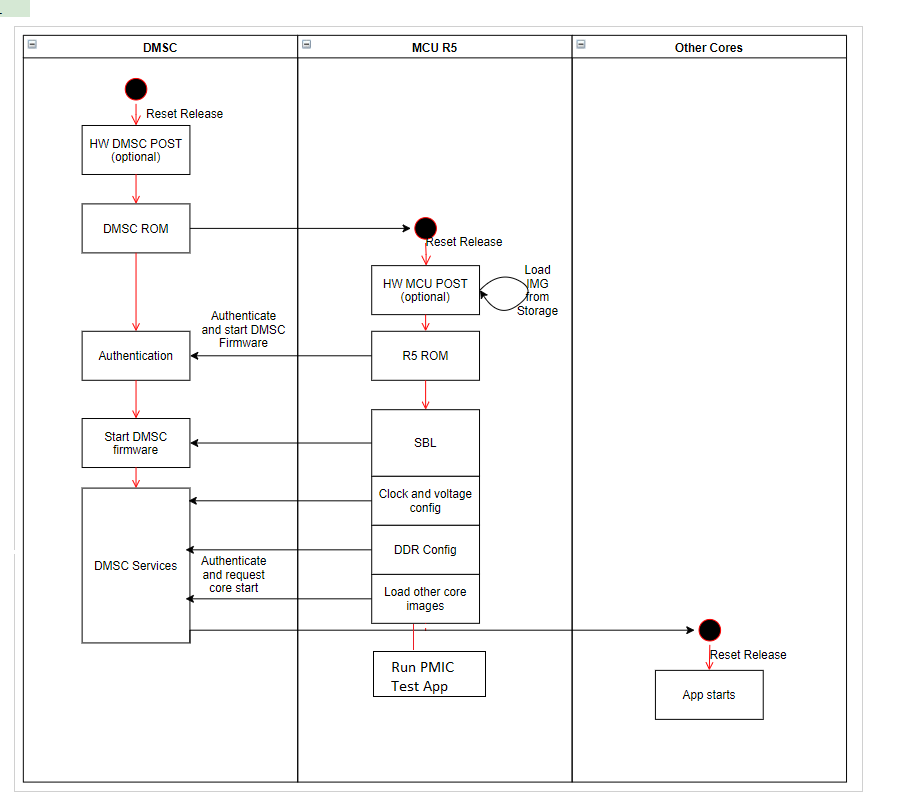

########################################################
PMIC LLD Software Architecture Document
########################################################
.. table:: Revision History
    :class: longtable
    :widths: 10 20 20 40 10

    +--------+-------------+--------------+------------------------+-------------+
    |Version | Date        |  Author      |    Change History      |   Status    |
    +========+=============+==============+========================+=============+
    |0.1     | 08 Nov 2021 |Deepa Gopinath|  Initial draft         | Released    |
    +--------+-------------+--------------+------------------------+-------------+
    |0.2     | 08 Nov 2021 |Deepa Gopinath|  Addressed review      | Released    |
    |        |             |              |  comments              |             |
    +--------+-------------+--------------+------------------------+-------------+

.. table:: Terms and Abbreviations
    :class: longtable
    :widths: 10 20 20 40 10

    +------------------------+-------------------------------------------+
    |    Term/Abbreviation   |  Meaning / Explanation                    |
    +------------------------+-------------------------------------------+
    |    PMIC                |  Power Management Integrated Circuit      |
    +------------------------+-------------------------------------------+
    |    CSP                 |  Compliance Support Package               |
    +------------------------+-------------------------------------------+
    |    FSQ                 |  Functional Safety Quality                |
    +------------------------+-------------------------------------------+
    |    SoC                 |  System on a Chip                         |
    +------------------------+-------------------------------------------+
    |    ASIL                |  Automotive Safety Integrity Level        |
    +------------------------+-------------------------------------------+
    |    MCU                 |  Micro Controller Unit                    |
    +------------------------+-------------------------------------------+
    |    LLD                 |  Low Level Driver                         |
    +------------------------+-------------------------------------------+
   
    
Introduction
============

Overview
--------

This is the architecture document for the PMIC Low Level Driver (PMIC LLD)
software for the J7ES family of devices. The J7ES family of devices are targeted
for use in functional safety applications. Each DRA829/TDA4VM product was 
developed as a functional Safety Element Out Of Context (SEooC) and was 
developed according to the relevant requirements of ISO 26262:2018 and IEC 61508

The PMIC Low Level Driver provides a software module that interfaces with
TPS6594x (Leo) PMIC and LP8764x (Hera) PMIC. 

Purpose and Scope
-----------------
The PMIC Low Level Driver provides a software module that interfaces with
TPS6594x (Leo) PMIC and LP8764x (Hera) PMIC. It is scalable for future PMIC
chips and SoCs, easing porting across devices. This document captures the
overall software architecture to be used for the PMIC Low Level Driver. This
document is to be used as a reference for designing and implementing the
software module used for realizing the features of the PMIC. 

Note that more detailed design and implementation details will be captured in
the design documents.

PMIC LLD component is released with CSP (Compliance Support Package). PMIC LLD
will be assessed to ensure it meets the ISO26262 requirements for a functional 
safety SW components.

Stakeholders
-------------
.. table:: Stakeholders
    :class: longtable
    :widths: 10 20 20 40 10

    +-------------------------------+-------------------------------------------+
    |    Name                       |  Role                                     |
    +-------------------------------+-------------------------------------------+
    |  Gagan Maur                   |  Program/Safety Manager                   |
    +-------------------------------+-------------------------------------------+
    |  Vivek Dhande                 |  SW Technical Lead /Application Manager   |
    +-------------------------------+-------------------------------------------+
    |  Jacco van Oevelen            |  PMIC Technical Lead / Marketing Manager  |
    +-------------------------------+-------------------------------------------+
    |  Chris Sterzik                |  PMIC Applications Manager                |
    +-------------------------------+-------------------------------------------+
    |  Anand Balagopalakrishnan     |  Test Lead                                |
    +-------------------------------+-------------------------------------------+
    |  Krishna Gopalakrishnan       |  SQA Lead /Software Quality Assurance     |
    +-------------------------------+-------------------------------------------+
    |  Deepa Gopinath               | Project Lead                              |
    +-------------------------------+-------------------------------------------+
    |  Abhishek Kumar               | Development Engineer                      |
    +-------------------------------+-------------------------------------------+

References
-----------
- PMIC LLD Functional Requirements
- DRA829/TDA4VM/AM752x Technical Reference Manual (Rev. A)
- SPS Document - https://confluence.itg.ti.com/display/ProcSW/PMIC+LLD%3A+SW+Prod.+Spec
- TPS6594x TRM -  http://www.ti.com/lit/ug/slvubs7a/slvubs7a.pdf 
- LP8764x TRM -  http://www.ti.com/lit/ug/snvu700/snvu700.pdf  

Software Architecture Overview
==============================

PMIC LLD Software Architecture
------------------------------

J721E/J7200 family of devices (DRA829, TDA4VM, DRA821) from TI are targeted 
towards automotive and industrial application . This software product enables
customers to program the hardware and safety mechanisms; the companion quality
evidence (CSP) assists the customer in their pursuit of safety certification.
The specific end equipment system may utilize portions of the software relevant
to the particular use case, and may even append with additional functionalities.

| Architecture Id: (aid_pmic_tps6594x_lp8764x_support)
| Requirement: REQ_TAG(PDK-5811), REQ_TAG(PDK-5853)

PMIC LLD is designed to meet the power management requirements of the J721E and
J7200 platforms. TPS6594x(Leo) and LP8764x(Hera) PMIC is an integrated
power-management device for automotive and industrial applications.

PMIC Low Level Driver (LLD) runs on J7ES/J7200 SoC and provides a software
module that interfaces with TPS6594x (Leo) and LP8764x(Hera) PMIC. There is
a well-defined API that abstracts low-level details of SoC . The API follows a
consistent, uniform style across different processor architectures and are
independent of the Operating System.

Following figure shows the Software Block Diagram

Figure Software Block Diagram

Design Considerations
======================
PMIC Low Level Driver (LLD) provides well-defined API that abstracts low-level
details of SoC allowing user to configure, control, and have read/write access
to peripherals.

Variants, Configuration and System family concepts
--------------------------------------------------
The PMIC Low Level Driver provides a software module that interfaces with
TPS6594x (Leo) PMIC on J721E and J7200 device and LP8764x (Hera) PMIC J7200
device. Note, however, that care is taken to abstract the device-specific
aspects to folders in order to more easily add new devices in the future.

The PMIC LLD functions shall be designed to be executed on R5 core.

Reusability, modularity and expandability
-----------------------------------------
| Architecture Id: (aid_pmic_multiple_pmic_support)
| Requirement: REQ_TAG(PDK-5825)

PMIC LLD is designed to meet the power management requirements of the J721E and
J7200 platforms. It is scalable for future PMIC chips and SoCs, easing porting
across devices. The PMIC LLD is designed and implemented in a modular fashion to
be able to support the reduced feature set of LP8764x (Hera) PMIC. There shall
be a common API for different devices and functionality tuned to the device.

| Architecture Id: (aid_pmic_standalone_support)
| Requirement: REQ_TAG(PDK-5816)

PMIC LLD is designed such that it is independent on TI Processor SDK for 
standalone use case so that PMIC LLD can be integrated to non TI SDK  

| Architecture Id: (aid_pmic_stateless_reentrant_support)
| Requirement: REQ_TAG(PDK-5820)

PMIC LLD shall be designed and implemented such that it is reentrant and does
not contain any state information.

| Architecture Id: (aid_pmic_pre_emption_support)
| Requirement: REQ_TAG(PDK-5822)

PMIC LLD shall be designed and implemented such that a lock mechanism to ensure
that any sequence of transactions that needs to be atomic is protected
(e.g., by a semaphore) to disallow pre-emption. This can be a sequence of
read/write to PMIC

Software High Level Design
==========================
The PMIC LLD software consist of different blocks for Error Capture and Safety 
Mechanisms. Error response is managed by the Application based on the device
Safety Manual requirements. The interface for the Application will be in the
form of software APIs. 

The following figure shows software architecture of PMIC driver along with
application and hardware layers

Figure PMIC Driver Software Architecture

Please refer the design document for further details

| Architecture Id: (aid_pmic_generic_support)
| Requirement: REQ_TAG(PDK-5817), REQ_TAG(PDK-5818), REQ_TAG(PDK-5819),
               REQ_TAG(PDK-5823), REQ_TAG(PDK-5856), REQ_TAG(PDK-5857),
               REQ_TAG(PDK-9159), REQ_TAG(PDK-9149)

The PMIC LLD will be delivered as driver along with Processor SDK and shall
follow TI Coding Guidelines “OneMCU Coding Standard” while coding for APIs,
Datatypes, etc., 

Additionally, a CSP package that can be used for requalification efforts will be
provided through mySecureSW. It will include the following documents:

- Software FMEA
- Architecture and design documents
- Requirements, test plan and reports
- Traceability data
- Dynamic code coverage analysis report
- Static code analysis report
- His Metrics report
- User Guide
- Release notes

PMIC module documentation template shall follow TI Processor SDK style and shall
integrate customer deliverables in Processor SDK RTOS. PMIC module shall support
customer deliverables independent of Processor SDK. 

PMIC LLD shall follow the Functional Safety process and supports customer
deliverables for functional safety

Data structures and resources
-----------------------------
Global data structure to store the Register address and Register Bit field Shift
values of PMIC Power resource configuration, GPIO Configuration and Interrupt
configuration. This global structure will be internal to PMIC Module

Operating System Details
------------------------
| Architecture Id: (aid_pmic_baremetal_support)
| Requirement: REQ_TAG(PDK-5811), REQ_TAG(PDK-5853)

PMIC LLD is OS-agnostic, and can be run on bare-metal environments as well as OS
(freeRTOS, safeRTOS, etc.) This is accomplished by defining an OSAL interface 
which must be provided by the application. 

The PMIC LLD does not depend on any operating system and supports execution with
baremetal application

Task Details
------------
PMIC LLD will not create any tasks

Data Flow Diagram
-----------------
The PMIC LLD APIs takes input configuration parameters and then configures PMIC
hardware registers for all the sub modules except for WDG module

For WDG module, PMIC LLD computes answer based on question and WDG configuration
when the application sends request to write answer to PMIC Module

Control Flow Diagram
---------------------
| Architecture Id: (aid_pmic_comm_intf_i2c_spi_cfg)
| Requirement: REQ_TAG(PDK-5814), REQ_TAG(PDK-5810), REQ_TAG(PDK-5813),
               REQ_TAG(PDK-5824), REQ_TAG(PDK-5843), REQ_TAG(PDK-5858)

PMIC LLD shall have a configuration option to enable the interface type
supported, either I2C(I2C1,I2C2) or SPI. PMIC LLD supports either single
I2C(I2C1) interface or Dual I2C(I2C1,I2C2) or SPI interface. I2C1,I2C2 and SPI
interfaces  are used to configure, monitor and control various components in
PMIC module

PMIC LLD will provide ability to use the I2C/SPI interface to communicate with
PMIC. The API will be the TI Processor SDK LLD for I2C/SPI.

The application has responsibility to implement the transport logic. The
application's transport logic is registered with the PMIC driver when the driver
is initialized. The application's transport logic functions will be placed into
the driver call tables.

Memory Assignment
------------------
| Architecture Id: (aid_pmic_dynamic_alloc_mem_not_supported)
| Requirement: REQ_TAG(PDK-5811), REQ_TAG(PDK-5853)

PMIC LLD is a library and memory placement of code and data is done by
application. It is expected that the application places PMIC LLD in RAM. PMIC
LLD shall not do any dynamic allocation of memory 

Build Configuration
--------------------
| Architecture Id: (aid_pmic_build_infra_cfg)
| Requirement: REQ_TAG(PDK-5821)

PMIC LLD shall compile and link via make on Linux and XDC-provided gmake on
Window. The build infrastructure shall be standalone to integrate with non TI
SDKs

Debugability/traceability/Visibility
------------------------------------
| Architecture Id: (aid_pmic_debug_release_profile_support)
| Requirement: REQ_TAG(PDK-5811), REQ_TAG(PDK-5853)

The code shall be buildable in debug mode so that it may be stepped
through using a debugger and a program such as Code Composer Studio
(CCS).

For testing, display of results of the test code will need access to
UART port

Dynamic Behavior
----------------
The J7ES architecture has a separate processor that is the Device Management
Security Controller (DMSC). The DMSC processor is the first to come up on
boot-up and expected to bring the MCU core out of reset. As part of the
power-up, the HW POST (Power-on Self Test) is executed for DMSC and/or MCU
depending on device settings and version. Once the R5F is booted, it executes
the Boot ROM and loads the Secondary Boot Loader (SBL). The SBL then performs
device configurations, and then loads the applications to the cores
(including loading the MCU R5F application to the same core).

DMSC firmware Boots up R5F R5F runs the Boot ROM R5F loads Secondary boot loader
loads the actual application.

The following diagram shows the boot sequence. The green box shows the point
where the Application which will execute the PMIC APIs begins. The rest of the
diagram is to illustrate the sequence which is used to start the application

Figure Boot Sequence

PMIC Core Functionality components
----------------------------------
| Architecture Id: (aid_pmic_gpio_cfg)
| Requirement: REQ_TAG(PDK-5808), REQ_TAG(PDK-5844), REQ_TAG(PDK-9157)

PMIC LLD has APIs that supports set/get GPIO configuration and supports Ultra
Low Power Standby with CAN Wake-Up for PMIC

| Architecture Id: (aid_pmic_rtc_cfg)
| Requirement: REQ_TAG(PDK-5831), REQ_TAG(PDK-9141), REQ_TAG(PDK-9142),
               REQ_TAG(PDK-9145), REQ_TAG(PDK-9155), REQ_TAG(PDK-5855)

PMIC LLD has APIs that supports set/get RTC configuration, supports Ultra Low
Power Standby with RTC Wake-Up, read and clear RTC Power-up/Reset status and
read status of RTC is started or not

| Architecture Id: (aid_pmic_power_cfg)
| Requirement: REQ_TAG(PDK-5829), REQ_TAG(PDK-5840), REQ_TAG(PDK-5841),
               REQ_TAG(PDK-5847), REQ_TAG(PDK-5848), REQ_TAG(PDK-9117),
               REQ_TAG(PDK-9163), REQ_TAG(PDK-5850)

PMIC LLD has APIs that supports set/get configuration and voltages of 
Power regulators (BUCK, LDO, VCCA, VMON), configures thermal monitoring/shutdown
of the PMIC, configures power good monitor, current monitor and short circuit
protection

PMIC LLD supports configuration of LDO slow ramp and VMON deglitch time only on
TPS6594x (Leo) PMIC PG2.0 Silicon revision

| Architecture Id: (aid_pmic_irq_cfg)
| Requirement: REQ_TAG(PDK-5805), REQ_TAG(PDK-5806), REQ_TAG(PDK-5812),
               REQ_TAG(PDK-5830), REQ_TAG(PDK-5832), REQ_TAG(PDK-5834),
               REQ_TAG(PDK-5835), REQ_TAG(PDK-5836), REQ_TAG(PDK-5842),
               REQ_TAG(PDK-5845), REQ_TAG(PDK-5846), REQ_TAG(PDK-5852),
               REQ_TAG(PDK-9122), REQ_TAG(PDK-9147), REQ_TAG(PDK-9148),
               REQ_TAG(PDK-9152), REQ_TAG(PDK-5838), REQ_TAG(PDK-9153),
               REQ_TAG(PDK-5807), REQ_TAG(PDK-5828), REQ_TAG(PDK-9120),
               REQ_TAG(PDK-9113)

PMIC LLD supports to decipher error events and call out to application with
error code. PMIC LLD supports to read PMIC registers to decipher a startup
source, Watchdog Error, GPIO detection, Catastrophic Error, LDO Error, Warning,
Runtime BIST Error, FSM error, Severe Error, Buck Error, Boot BIST Error, ESM
Error, Moderate Error, Soft Reboot Error

PMIC LLD shall read mask status of GPIO Rise or Fall Interrupt and PMIC
Interrupts

PMIC LLD shall support NRSTOUT_READBACK_INT and NINT_READBACK_INT as part of
INT_READBACK_ERR register, RECOV_CNT_INT as part of INT_MODERATE_ERR and
supports write protection to clear the Interrupt registers only on 
TPS6594x (Leo) PMIC and LP8764x (Hera) PMIC PG1.0 Silicon revision

| Architecture Id: (aid_pmic_wdg_cfg)
| Requirement: REQ_TAG(PDK-5839), REQ_TAG(PDK-5854), REQ_TAG(PDK-9115),
               REQ_TAG(PDK-9116)

PMIC LLD has APIs that supports set/get WDG configuration and computes answer
based on question and WDG configuration when the application sends request to
write answer to PMIC Module. PMIC LLD supports watchdog in Q&A mode and trigger 
mode.

PMIC LLD shall support to configure Watchdog Long Window step size for a faster
WDOG error detection only on TPS6594x (Leo) PMIC PG2.0 Silicon revision

| Architecture Id: (aid_pmic_esm_cfg)
| Requirement: REQ_TAG(PDK-5833), REQ_TAG(PDK-9150), REQ_TAG(PDK-5829)

PMIC LLD has APIs that supports set/get ESM configuration, configures and
enable the ESM_MCU and ESC_SoC error monitors. 

| Architecture Id: (aid_pmic_fsm_cfg)
| Requirement: REQ_TAG(PDK-5837), REQ_TAG(PDK-5849), REQ_TAG(PDK-9123)
               REQ_TAG(PDK-9128), REQ_TAG(PDK-9144), REQ_TAG(PDK-9146),
               REQ_TAG(PDK-9151), REQ_TAG(PDK-9330), REQ_TAG(PDK-9563),
               REQ_TAG(PDK-9564), REQ_TAG(PDK-5851)

PMIC LLD has APIs that supports set/get FSM configuration and configures PFSM
states. PMIC LLD configures NSLEEP registers for Processor low power, read mask
status of Nsleep signal 

PMIC LLD supports SOC Power Error handing, supports DDR and GPIO Retention mode
and execute runtime-BIST only on TPS6594x (Leo) PMIC PG2.0 Silicon revision

| Architecture Id: (aid_pmic_core_misc_cfg)
| Requirement: REQ_TAG(PDK-5809), REQ_TAG(PDK-9109), REQ_TAG(PDK-9110),
               REQ_TAG(PDK-9111), REQ_TAG(PDK-9114), REQ_TAG(PDK-9119),
               REQ_TAG(PDK-9124), REQ_TAG(PDK-9125), REQ_TAG(PDK-9126),
               REQ_TAG(PDK-9129), REQ_TAG(PDK-9130), REQ_TAG(PDK-9131),
               REQ_TAG(PDK-9132), REQ_TAG(PDK-9133), REQ_TAG(PDK-9134),
               REQ_TAG(PDK-9135), REQ_TAG(PDK-9136), REQ_TAG(PDK-9137),
               REQ_TAG(PDK-9138), REQ_TAG(PDK-9139), REQ_TAG(PDK-9143),
               REQ_TAG(PDK-9149), REQ_TAG(PDK-9329), REQ_TAG(PDK-9162),
               REQ_TAG(PDK-9112), REQ_TAG(PDK-9127)

PMIC LLD has APIs that supports to query the error recovery count, to read TI
Device and NVM information, to configure and read the status of Register lock
and other miscellaneous configuration and read the status of miscellaneous
configuration parameters

PMIC LLD support Register Write Protection for control and configuration registers
only on TPS6594x (Leo) PMIC PG2.0 Silicon revision.

PMIC LLD shall enable CRC using TRIGER_I2C_2 and to read Customer NVM
information only on TPS6594x (Leo) PMIC PG2.0 Silicon revision.

Please refer PMIC design document for more details

Performance Objectives
======================
Resource Consumption Objectives
---------------------------------
PMIC LLD will not allocate any memory at runtime. The PMIC LLD is expected to be
run with code and data loaded in RAM. There is no specific requirement for
memory and CPU usage, , but the implementation need to quantify, measure and
document the memory foot prints used in PMIC LLD code.

Critical timing and Performance
-------------------------------
| Architecture Id: (aid_pmic_performance_support)
| Requirement: REQ_TAG(PDK-5859)

There is no specific requirement for performance, but the implementation needs
to also quantify, measure and document the performance for PMIC Initialization
and WDG Answer Computation

Testing
========
| Architecture Id: (aid_pmic_test_support)
| Requirement: REQ_TAG(PDK-5826), REQ_TAG(PDK-5827), REQ_TAG(PDK-5860)

The unit test application that runs on TI EVM shall be part of Processor SDK.
There will be glue code in the test application connecting the generic PMIC
Driver to the rest of Processor SDK dependent components and tools.

A unit test application will be created using the Unity test framework to test
all requirements in Processor SDK environement.

The SDK components that are dependencies include compiler, build infrastructure
and software components (LLD, OSAL, SBL, etc.).,

- Test application shall support booting using SBL using UART interface.
- Test application shall accept user inputs from UART interface.
- Test application shall display information on UART interface.
- Test application shall run on R5 core.

Stub functional shall be implemented for any functionality not testable on EVM

Testing will be performed for Unit (Design), Integration (Architecture) and
Qualification (Requirements). Each method of testing will consider positive,
negative, and boundary testing.

Static and Dynamic analysis will also be employed. Testing will be performed on
J721E and J7200 EVM. Tests will cover bare metal tests. For more information,
please refer the Test Plan document.

PMIC LLD tests should adhere to guidelines to enable test automation to the
extent possible.

PMIC Unit test applications for showing the usage of the PMIC LLD software
module in the application context will also be provided to ease customer
integration and understanding of the PMIC LLD software module.

