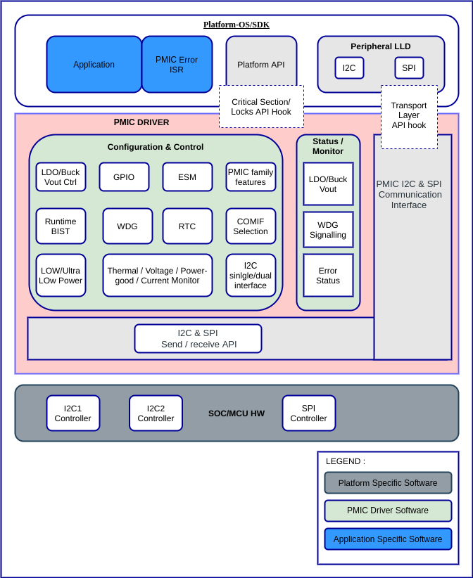
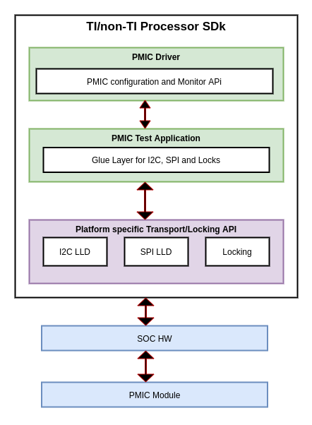
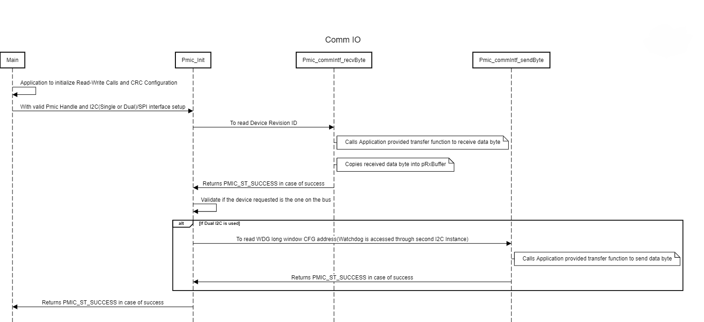
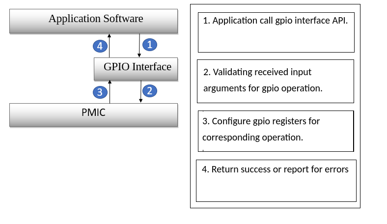
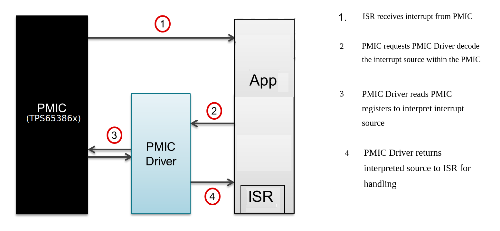
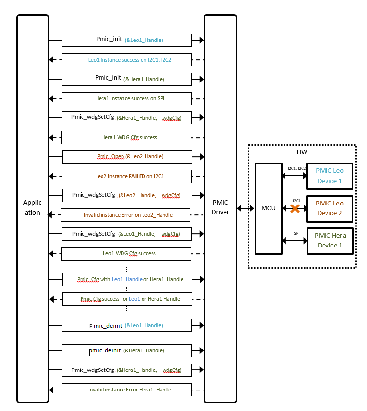

########################################################
PMIC LLD Software Design Document
########################################################

.. raw:: latex

    \newpage

**Revision History**

======= ============ =============== ======================== ========
Version Date         Author          Change History            Status
======= ============ =============== ======================== ========
1.0     23 Dec 2019   Amit Agarwal    Initial draft            Released
------- ------------ --------------- ------------------------ --------
2.0     07 Jan 2020  Amit Agarwal    Design and requirement   Released
                                     handling updated as
                                     per initial review and
                                     feature support
                                     clarifications
------- ------------ --------------- ------------------------ --------
2.1     11 Jan 2020  Amit Agarwal    -  Updated Watchdog QA   Released
                                        API description
                                     -  Updated Integration
                                        Details in Figure 2
                                     -  Added DAR section
                                        ‘Watchdog QA Window
                                        Timing’
                                     -  Updated API
                                        description for
                                        Regulator Voltage
                                        configuration API
------- ------------ --------------- ------------------------ --------
2.2     21-Jan-2020  Amit Agarwal    -  Updated as per        Released
                                        review comments for
                                        document template,
                                        Design IDs and
                                        content correction
------- ------------ --------------- ------------------------ --------
2.3     23-Jan-2020  Amit Agarwal    -  Updated DAR for       Released
                                        Critical Section
                                     -  Corrected few API
                                        descriptions
                                     -  Updated Design ID
                                        maps for API Data
                                        Types
------- ------------ --------------- ------------------------ --------
2.4     04-Feb-2020  Amit Agarwal    -  Updated Design        Released
                                        document based on
                                        review feedback.
                                     -  Updated API details
------- ------------ --------------- ------------------------ --------
2.5     07-Feb-2020  Amit Agarwal    -  Fixed Review          Released
                                        comments
                                     -  Updated
                                        Non-supported
                                        requirement
                                        section.
                                     -  Details added
                                        related to multiple
                                        instance of PMIC
                                        driver.
------- ------------ --------------- ------------------------ --------
2.6     18-Feb-2020  Amit Agarwal    -  Fixed Review          Released
                                        comments
                                     -  Updated Low power
                                        standby mode
                                     -  Updated error
                                        recovery words.
------- ------------ --------------- ------------------------ --------
2.7     16-Mar-2020  Amit Agarwal    -  Added new design ID   Released
                                        to accommodate
                                        newly added
                                        requirements.
                                     -  API table updated
------- ------------ --------------- ------------------------ --------
2.8     20-Oct-2020  Rahul Rawat     Updated the following
                                     sections:

                                     -  Design
                                        Requirements
                                     -  Design Description
                                     -  PMIC Core
                                        Functionality
                                        Components
                                     -  PMIC Driver Setup and
                                        Instance Management
                                     -  PMIC CRC Validation
                                        Feature
                                     -  API Definitions
                                     -  API Function
                                        Descriptions
======= ============ =============== ======================== ========

.. raw:: latex

    \newpage

Introduction
============

Overview
--------

The purpose of this document is to define the software design for *PMIC*
LLD development for Leo and Hera (from Texas Instruments). The document
shall be a reference for software developers who use TI’s Leo or Hera
PMIC module on their Hardware to understand the various LLD aspects
like:

-  LLD architecture
-  LLD Features
-  PMIC Communication interfaces and modes
-  Functional Safety Compliance and other related details

Assumptions and Constraints
---------------------------

Based on requirements, the following list is a brief of the Assumptions

1. The design and development of PMIC shall be done to have no state
   management; LLD shall not expect any IO sequence for any PMIC
   functionality. Application shall take care of this
2. TI Coding Guidelines “TI84_Plus_CE_ProgrammingGuide_EN.pdf” shall be used
   while coding for APIs, Datatypes, etc.
3. LLD software shall be stateless and shall not have any event/error
   handling functionality, it shall just provide API to read and
   decipher events/errors
4. LLD shall be independent of any platform, i.e., no platform/OS
   specific routines/symbols shall be referenced in the LLD software
5. No platform specific I2C/SPI LLD code is present inside PMIC LLD; it
   is application’s responsibility to provide platform specific I2C/SPI
   API for the PMIC LLD before building the LLD
6. No platform specific Locking/Critical Section code required for
   I2C/SPI IO is present inside PMIC LLD; it is application’s
   responsibility to provide platform specific Locking/Critical Section
   API for the PMIC LLD before building the LLD
7. The design and development of PMIC shall be done to have no state management;
   LLD shall not expect any IO sequence for any PMIC functionality.
   Application shall take care of this

Based on requirements, Constraints are None

Stakeholders
---------------------------

This document is meant for software developers who will use the design information as reference
for software implementation.

Notational Conventions
---------------------------

See `Directory`_.

Glossary
---------------------------

See `Directory`_.

References
---------------------------

See `Directory`_.

Design Requirements
~~~~~~~~~~~~~~~~~~~~

Some of the designs IDs drawn from requirement IDs are redundant as
different requirements categorize/classify in different manner and same
configuration/event/interrupt/status item could be part of 2 or more
requirements, in which case the redundant design IDs are marked as
Redundant and moved to Unsupported Design Requirements Table

Following table lists all the Design Requirements IDs supported by PMIC
LLD.

+------------------------------------+----------------+----------------+----------------+
| Design ID                          | Requirements   | Requirement    | Description    |
|                                    | ID             | Type           |                |
+====================================+================+================+================+
+------------------------------------+----------------+----------------+----------------+
| did_pmic_tps6594x_j721e_support    | PDK-5811       | Safety         | LLD shall      |
|                                    |                | Functional     | support        |
|                                    |                |                | TPS6594x       |
|                                    |                |                | (Leo). Testing |
|                                    |                |                | will be on     |
|                                    |                |                | J721E EVM with |
|                                    |                |                | Leo PMIC       |
|                                    |                |                |                |
+------------------------------------+----------------+----------------+----------------+
| did_pmic_lp8764x_j7vcl_support     | PDK-5853       | Safety         | LLD design &   |
|                                    |                | Functional     | implementation |
|                                    |                |                | shall be       |
|                                    |                |                | modular to     |
|                                    |                |                | support        |
|                                    |                |                | reduced        |
|                                    |                |                | feature set of |
|                                    |                |                | LP8764 (Hera). |
|                                    |                |                | Testing will   |
|                                    |                |                | be on J7VCL    |
|                                    |                |                | EVM with Hera  |
|                                    |                |                | PMIC           |
+------------------------------------+----------------+----------------+----------------+
| did_pmic_power_cfg_readback        | PDK-5850       | Safety         | LLD API to     |
|                                    |                | Functional     | take human     |
|                                    |                |                | readable       |
|                                    |                |                | value, convert |
|                                    |                |                | and configure  |
|                                    |                |                | the target     |
|                                    |                |                | Buck/LDO       |
|                                    |                |                | Voltage        |
+------------------------------------+----------------+----------------+----------------+
| did_pmic_power_cfg_readback        | PDK-5841       | Safety         | Driver shall   |
|                                    |                | Functional     | implement an   |
|                                    |                |                | API to         |
|                                    |                |                | configure buck |
|                                    |                |                | and LDO        |
|                                    |                |                | regulator      |
|                                    |                |                | outputvoltages |
|                                    |                |                |                |
+------------------------------------+----------------+----------------+----------------+
| did_pmic_power_cfg_readback        | PDK-5829       | Safety         | Driver shall   |
|                                    |                | Functional     | configure for  |
|                                    |                |                | voltage monitor|
|                                    |                |                | for over/under |
|                                    |                |                | voltage        |
+------------------------------------+----------------+----------------+----------------+
| did_pmic_power_cfg_readback        | PDK-5848       | Safety         | Driver shall   |
|                                    |                | Functional     | configure for  |
|                                    |                |                | current        |
|                                    |                |                | monitor and    |
|                                    |                |                | short circuit  |
|                                    |                |                | protection     |
+------------------------------------+----------------+----------------+----------------+
| did_pmic_power_thermal_cfg_readback| PDK-5840       | Safety         | Driver shall   |
|                                    |                | Functional     | configure      |
|                                    |                |                | thermal        |
|                                    |                |                | monit          |
|                                    |                |                | oring/shutdown |
|                                    |                |                | of the PMIC    |
+------------------------------------+----------------+----------------+----------------+
| did_pmic_power_pgood_cfg_readback  | PDK-5847       | Safety         | Driver shall   |
|                                    |                | Functional     | read back      |
|                                    |                |                | Power Good     |
|                                    |                |                | Monitor        |
|                                    |                |                | Configuration  |
|                                    |                |                | of Buck/LDO    |
+------------------------------------+----------------+----------------+----------------+
| did_pmic_comm_intf_cfg             | PDK-5814       | Safety         | Driver shall   |
|                                    |                | Functional     | have a runtime |
|                                    |                |                | configuration  |
|                                    |                |                | option to      |
|                                    |                |                | enable the     |
|                                    |                |                | interface type |
|                                    |                |                | supported,     |
|                                    |                |                | either I2C or  |
|                                    |                |                | SPI            |
+------------------------------------+----------------+----------------+----------------+
| did_pmic_comm_single_i2c_cfg       | PDK-5810       | Safety         | Driver shall   |
|                                    |                | Functional     | support single |
|                                    |                |                | I2C interface  |
|                                    |                |                | in which only  |
|                                    |                |                | I2C1 will be   |
|                                    |                |                | used to        |
|                                    |                |                | configure and  |
|                                    |                |                | monitor the    |
|                                    |                |                | PMIC           |
+------------------------------------+----------------+----------------+----------------+
| did_pmic_comm_dual_i2c_cfg         | PDK-5813       | Safety         | Driver shall   |
|                                    |                | Functional     | support dual   |
|                                    |                |                | I2C interface  |
|                                    |                |                | in which       |
|                                    |                |                | I2C1 will      |
|                                    |                |                | help to do     |
|                                    |                |                | PMIC           |
|                                    |                |                | configuration  |
|                                    |                |                | and monitor    |
|                                    |                |                | except WDG     |
|                                    |                |                | QA,I2C2 will   |
|                                    |                |                | help to do     |
|                                    |                |                | WDG QA         |
+------------------------------------+----------------+----------------+----------------+
| did_pmic_comm_spi_cfg              | PDK-5843       | Safety         | Driver shall   |
|                                    |                | Functional     | support SPI    |
|                                    |                |                | interface      |
|                                    |                |                | which will be  |
|                                    |                |                | used to        |
|                                    |                |                | configure and  |
|                                    |                |                | monitor the    |
|                                    |                |                | PMIC           |
+------------------------------------+----------------+----------------+----------------+
| did_pmic_gpio_cfg_readback         | PDK-5808       | Safety         | Driver shall   |
|                                    |                | Functional     | configure PMIC |
|                                    |                |                | GPIO pins as:  |
|                                    |                |                | NSLEEP         |
|                                    |                |                | Triggers,      |
|                                    |                |                | Reset pin      |
|                                    |                |                | for SOC,       |
|                                    |                |                | WKUP           |
|                                    |                |                | sources,       |
|                                    |                |                | General        |
|                                    |                |                | Input/output   |
|                                    |                |                | pins,          |
|                                    |                |                | I2C2 SCLK      |
|                                    |                |                | and SDA        |
|                                    |                |                | lines,         |
|                                    |                |                | SPI CS or      |
|                                    |                |                | SDO lines,     |
|                                    |                |                | Watchdog       |
|                                    |                |                | Trigger        |
|                                    |                |                | line,          |
|                                    |                |                | ESM Error      |
|                                    |                |                | Pins for       |
|                                    |                |                | SOC/MCU,       |
|                                    |                |                | SPMI,          |
|                                    |                |                | SCLK/SDATA,    |
|                                    |                |                | SYNCCLKOUT,    |
|                                    |                |                | SYNCLKIN       |
|                                    |                |                | and            |
|                                    |                |                | CLK32KOUT,     |
|                                    |                |                | Watchdog       |
|                                    |                |                | Disable        |
|                                    |                |                | Pin,           |
|                                    |                |                | Power Good     |
|                                    |                |                | Indication     |
|                                    |                |                | Line           |
+------------------------------------+----------------+----------------+----------------+
| did_pmic_gpio_cfg_readback         | PDK-5808       | Safety         | Driver shall   |
|                                    |                | Functional     | configure PMIC |
|                                    |                |                | GPIO pin       |
|                                    |                |                | functionality  |
+------------------------------------+----------------+----------------+----------------+
| did_pmic_irq_cfg_readback          | PDK-5805       | Safety         | PMIC: Driver   |
|                                    |                | Functional     | shall decipher |
|                                    |                |                | error events   |
|                                    |                |                | and call out   |
|                                    |                |                | to application |
|                                    |                |                | with error code|
+------------------------------------+----------------+----------------+----------------+
| did_pmic_irq_cfg_readback          | PDK-5838       | Safety         | Driver shall   |
|                                    |                | Functional     | read PMIC      |
|                                    |                |                | registers to   |
|                                    |                |                | decipher a     |
|                                    |                |                | Severe Error   |
+------------------------------------+----------------+----------------+----------------+
| did_pmic_irq_cfg_readback          | PDK-5842       | Safety         | Driver shall   |
|                                    |                | Functional     | read PMIC      |
|                                    |                |                | registers to   |
|                                    |                |                | decipher a Buck|
|                                    |                |                | Error          |
+------------------------------------+----------------+----------------+----------------+
| did_pmic_irq_cfg_readback          | PDK-5832       | Safety         | Driver shall   |
|                                    |                | Safety         | read PMIC      |
|                                    |                |                | registers to   |
|                                    |                |                | decipher a LDO |
|                                    |                |                | Error          |
+------------------------------------+----------------+----------------+----------------+
| did_pmic_irq_cfg_readback          | PDK-5852       | Safety         | Driver shall   |
|                                    |                | Functional     | read PMIC      |
|                                    |                |                | registers to   |
|                                    |                |                | decipher a     |
|                                    |                |                | Moderate Error |
+------------------------------------+----------------+----------------+----------------+
| did_pmic_irq_cfg_readback          | PDK-5834       | Safety         | Driver shall   |
|                                    |                | Functional     | read PMIC      |
|                                    |                |                | registers to   |
|                                    |                |                | decipher a     |
|                                    |                |                | Warning        |
+------------------------------------+----------------+----------------+----------------+
| did_pmic_irq_cfg_readback          | PDK-5806       | Safety         | Driver shall   |
|                                    |                | Functional     | read PMIC      |
|                                    |                |                | registers to   |
|                                    |                |                | decipher a     |
|                                    |                |                | startup source |
+------------------------------------+----------------+----------------+----------------+
| did_pmic_irq_cfg_readback          | PDK-5828       | Safety         | Driver shall   |
|                                    |                | Functional     | read PMIC      |
|                                    |                |                | registers to   |
|                                    |                |                | decipher a     |
|                                    |                |                | FSM ERROR      |
+------------------------------------+----------------+----------------+----------------+
| did_pmic_irq_cfg_readback          | PDK-5807       | Safety         | Driver shall   |
|                                    |                | Functional     | read PMIC      |
|                                    |                |                | registers to   |
|                                    |                |                | decipher a     |
|                                    |                |                | Watchdog error |
+------------------------------------+----------------+----------------+----------------+
| did_pmic_irq_cfg_readback          | PDK-5846       | Safety         | Driver shall   |
|                                    |                | Functional     | read PMIC      |
|                                    |                |                | registers to   |
|                                    |                |                | decipher a     |
|                                    |                |                | ESM error      |
+------------------------------------+----------------+----------------+----------------+
| did_pmic_esm_cfg_readback          | PDK-5833       | Safety         | Driver API to  |
|                                    |                | Functional     | configure ESM  |
|                                    |                |                | MCU by         |
|                                    |                |                | resetting      |
|                                    |                |                | ESM_MCU_START  |
|                                    |                |                | to 0, update   |
|                                    |                |                | ESM MCU        |
|                                    |                |                | Configuration  |
|                                    |                |                | registers and  |
|                                    |                |                | setting        |
|                                    |                |                | ESM_MCU_START  |
|                                    |                |                | to 1           |
+------------------------------------+----------------+----------------+----------------+
| did_pmic_esm_cfg_readback          | PDK-5833       | Safety         | Driver API to  |
|                                    |                | Functional     | configure ESM  |
|                                    |                |                | SOC by         |
|                                    |                |                | resetting      |
|                                    |                |                | ESM_SOC_START  |
|                                    |                |                | to 0, update   |
|                                    |                |                | ESM SOC        |
|                                    |                |                | Configuration  |
|                                    |                |                | registers and  |
|                                    |                |                | setting        |
|                                    |                |                | ESM_SOC_START  |
|                                    |                |                | to 1           |
+------------------------------------+----------------+----------------+----------------+
| did_pmic_esm_cfg_readback          | PDK-5833       | Safety         | Driver API to  |
|                                    |                | Functional     | Stop ESM MCU   |
|                                    |                |                | Monitor by     |
|                                    |                |                | resetting      |
|                                    |                |                | ESM_MCU_START  |
|                                    |                |                | to 0           |
+------------------------------------+----------------+----------------+----------------+
| did_pmic_esm_cfg_readback          | PDK-5833       | Safety         | Driver API to  |
|                                    |                | Functional     | Stop ESM SOC   |
|                                    |                |                | Monitor by     |
|                                    |                |                | resetting      |
|                                    |                |                | ESM_SOC_START  |
|                                    |                |                | to 0           |
+------------------------------------+----------------+----------------+----------------+
| did_pmic_esm_cfg_readback          | PDK-5833       | Safety         | Driver API to  |
|                                    |                | Functional     | read ESM MCU   |
|                                    |                |                | Configuration  |
+------------------------------------+----------------+----------------+----------------+
| did_pmic_esm_cfg_readback          | PDK-5833       | Safety         | Driver API to  |
|                                    |                | Functional     | read ESM SOC   |
|                                    |                |                | Configuration  |
+------------------------------------+----------------+----------------+----------------+
| did_pmic_wdg_cfg_readback          | PDK-5854       | Safety         | Driver API to  |
|                                    |                | Functional     | configure      |
|                                    |                |                | Watchdog in    |
|                                    |                |                | Trigger mode   |
+------------------------------------+----------------+----------------+----------------+
| did_pmic_wdg_cfg_readback          | PDK-5854       | Safety         | Driver API to  |
|                                    |                | Functional     | read back      |
|                                    | PDK-5839       |                | Watchdog       |
|                                    |                |                | configuration  |
+------------------------------------+----------------+----------------+----------------+
| did_pmic_wdg_cfg_readback          | PDK-5839       | Safety         | Driver API to  |
|                                    |                | Functional     | configure      |
|                                    |                |                | Watchdog in QA |
|                                    |                |                | mode           |
+------------------------------------+----------------+----------------+----------------+
| did_pmic_wdg_cfg_readback          | PDK-5839       | Safety         | Driver API to  |
|                                    |                | Functional     | perform        |
|                                    |                |                | Watchdog QA    |
|                                    |                |                | with PMIC      |
+------------------------------------+----------------+----------------+----------------+
| did_pmic_wdg_cfg_readback          | PDK-5854       | Safety         | Driver API to  |
|                                    |                | Functional     | perform        |
|                                    | PDK-5839       |                | Watchdog       |
|                                    |                |                | Enable/Disable |
+------------------------------------+----------------+----------------+----------------+
| did_pmic_fsm_cfg                   | PDK-5837       | Safety         | Driver shall   |
|                                    |                | Functional     | support        |
|                                    |                |                | configuring    |
|                                    |                |                | NSLEEP         |
|                                    |                |                | registers for  |
|                                    |                |                | Processor low  |
|                                    |                |                | power.         |
+------------------------------------+----------------+----------------+----------------+
| did_pmic_fsm_cfg                   | PDK-5837       | Safety         | Driver shall   |
|                                    |                | Functional     | readback       |
|                                    |                |                | NSLEEP         |
|                                    |                |                | registers to   |
|                                    |                |                | get wake or    |
|                                    |                |                | sleep status.  |
+------------------------------------+----------------+----------------+----------------+
| did_pmic_rtc_cfg_readback          | PDK-5855       | Safety         | Driver shall   |
|                                    |                | Functional     | configure RTC  |
|                                    |                |                | Alarm          |
|                                    |                |                | Interrupts and |
|                                    |                |                | enable RTC     |
+------------------------------------+----------------+----------------+----------------+
| did_pmic_rtc_cfg_readback          | PDK-5855       | Safety         | Driver shall   |
|                                    |                | Functional     | readback RTC   |
|                                    |                |                | Alarm          |
|                                    |                |                | configuration  |
+------------------------------------+----------------+----------------+----------------+
| did_pmic_rtc_cfg_readback          | PDK-5855       | Safety         | Driver shall   |
|                                    |                | Functional     | configure RTC  |
|                                    |                |                | Timer          |
|                                    |                |                | Interrupts and |
|                                    |                |                | enable RTC     |
+------------------------------------+----------------+----------------+----------------+
| did_pmic_rtc_cfg_readback          | PDK-5855       | Safety         | Driver shall   |
|                                    |                | Functional     | readback RTC   |
|                                    |                |                | Timer          |
|                                    |                |                | Configuration  |
+------------------------------------+----------------+----------------+----------------+
| did_pmic_rtc_cfg_readback          | PDK-5855       | Safety         | Driver shall   |
|                                    |                | Functional     | disable RTC    |
|                                    |                |                | module         |
+------------------------------------+----------------+----------------+----------------+
| did_pmic_rtc_cfg_readback          | PDK-5855       | Safety         | Driver shall   |
|                                    |                | Functional     | enable RTC     |
|                                    |                |                | module         |
+------------------------------------+----------------+----------------+----------------+
| did_pmic_rtc_cfg_readback          | PDK-5855       | Safety         | Driver shall   |
|                                    |                | Functional     | configure RTC  |
|                                    |                |                | time calendar  |
|                                    |                |                | registers      |
+------------------------------------+----------------+----------------+----------------+
| did_pmic_rtc_cfg_readback          | PDK-5855       | Safety         | Driver shall   |
|                                    |                | Functional     | readback RTC   |
|                                    |                |                | time calendar  |
|                                    |                |                | registers.     |
+------------------------------------+----------------+----------------+----------------+
| did_pmic_rtc_cfg_readback          | PDK-5855       | Safety         | Driver shall   |
|                                    |                | Functional     | enable RTC     |
|                                    |                |                | Frequency      |
|                                    |                |                | compensation.  |
+------------------------------------+----------------+----------------+----------------+
| did_pmic_rtc_cfg_readback          | PDK-5855       | Safety         | Driver shall   |
|                                    |                | Functional     | configure RTC  |
|                                    |                |                | Frequency      |
|                                    |                |                | compensation   |
|                                    |                |                | readback.      |
+------------------------------------+----------------+----------------+----------------+
| did_pmic_rtc_cfg_readback          | PDK-5855       | Safety         | Driver API     |
|                                    |                | Functional     | shall read the |
|                                    |                |                | current status |
|                                    |                |                | of RTC         |
+------------------------------------+----------------+----------------+----------------+
| did_pmic_rtc_cfg_readback          | PDK-5855       | Safety         | Driver API to  |
|                                    |                | Functional     | support        |
|                                    |                |                | Enable/Disable |
|                                    |                |                | of RTC Alarm   |
|                                    |                |                | Interrupt      |
+------------------------------------+----------------+----------------+----------------+
| did_pmic_rtc_cfg_readback          | PDK-5855       | Safety         | Driver API to  |
|                                    |                | Functional     | support        |
|                                    |                |                | Enable/Disable |
|                                    |                |                | of RTC Timer   |
|                                    |                |                | Interrupt      |
+------------------------------------+----------------+----------------+----------------+
| did_pmic_lpstandby_wkup_cfg        | PDK-5844       | Safety         | Driver shall   |
|                                    |                | Functional     | support Ultra  |
|                                    |                |                | Low Power      |
|                                    |                |                | Standby with   |
|                                    |                |                | CAN WakeUp for |
|                                    |                |                | PMIC           |
|                                    |                |                |                |
|                                    |                |                | Note:          |
|                                    |                |                | Ultra-Low      |
|                                    |                |                | Power Mode is  |
|                                    |                |                | synonymous to  |
|                                    |                |                | LP_STANDBY     |
|                                    |                |                | state in the   |
|                                    |                |                | TRM.           |
+------------------------------------+----------------+----------------+----------------+
| did_pmic_lpstandby_wkup_cfg        | PDK-5831       | Safety         | Driver shall   |
|                                    |                | Functional     | support Ultra  |
|                                    |                |                | Low Power      |
|                                    |                |                | Standby with   |
|                                    |                |                | RTC WakeUp for |
|                                    |                |                | PMIC           |
|                                    |                |                |                |
|                                    |                |                | Note:          |
|                                    |                |                | Ultra-Low      |
|                                    |                |                | Power Mode is  |
|                                    |                |                | synonymous to  |
|                                    |                |                | LP_STANDBY     |
|                                    |                |                | state in the   |
|                                    |                |                | TRM.           |
+------------------------------------+----------------+----------------+----------------+
| did_pmic_lpstandby_cfg             | PDK-5851       | Safety         | Driver must    |
|                                    |                | Functional     | allow          |
|                                    |                |                | configuration  |
|                                    |                |                | of the PMIC    |
|                                    |                |                | low power LP   |
|                                    |                |                | STANDBY state  |
|                                    |                |                | by writing to  |
|                                    |                |                | I2C_TRIGGER_0. |
+------------------------------------+----------------+----------------+----------------+
| did_pmic_err_recov_cnt_cfg_readback| PDK-5809       | Safety         | Driver shall   |
|                                    |                | Functional     | provide an API |
|                                    |                |                | to query the   |
|                                    |                |                | error recovery |
|                                    |                |                | count.         |
+------------------------------------+----------------+----------------+----------------+

Design Description
==================

Architecture
------------

Following figure shows the Software architecture of PMIC driver along
with application and hardware layers.

It is required that HW Interface Drivers (I2C, SPI and GPIO) and
Critical Section/Locking Mechanisms are not designed or implemented
inside the PMIC Driver. Instead the Platform-OS/SDK is holding the
Driver implementation. The PMIC Driver just takes a Platform API Hooks
for these features.

Figure PMIC Driver Software Architecture

Platform Integration
--------------------

During Integration on non-TI platform, integrator shall take care to
properly define API Hooks to fulfill proper integration aspects as given
below:

1. I2C LLD API Hooks
2. SPI LLD API Hooks
3. Critical Section/Locking API Hooks

Following illustrates the integration specific details for any
platform/SDK.

Figure Platform Integration - TI / non-TI SDK platform

Interrupt Service Routines
--------------------------

PMIC Driver Requirement specifies that PMIC Driver software shall not
provide any Interrupt Service Routines, demanding the Application layer
provide and maintain the ISRs without driver intervention.

Driver shall provide API to read error/status information from PMIC
registers and return a corresponding deciphered code. The API also gives
a feature to clear the Interrupts from within the same function call
using a control flag. This API can be invoked by application layer after
receiving an event/error Interrupt.

Error Handling
--------------

Driver shall provide API just to read error information from PMIC
registers and return a corresponding deciphered error code. This API can
be invoked by application layer depending on info taken from error ISR.

PMIC driver API shall be able to decode various errors detected in PMIC
hardware and provide the relevant error code to Application.

Components
----------

This section gives an overview of all components in PMIC module which
are divided into two categories:

1. PMIC Communication Interface
2. PMIC Core Functionality

PMIC Communication Interface Components
~~~~~~~~~~~~~~~~~~~~~~~~~~~~~~~~~~~~~~~

| Design Id: (did_pmic_comm_intf_cfg)
| Requirement: REQ_TAG(PDK-5814)

PMIC contains I2C1,I2C2 and SPI interfaces to configure, monitor and
control various components in PMIC module.

**LLD for Communication Interface Components**

PMIC Driver software doesn’t provide driver code for I2C and SPI IO
operations as it is designed to be platform independent.Application has
to provide all necessary LLD API for I2C and SPI API prototypes as given
in PSDK and Those API will be used by PMIC driver to drive I2C or SPI
interface.

I2C Interface
^^^^^^^^^^^^^^

PMIC supports two I2C interfaces for PMIC communication.

The I2C-compatible synchronous serial interface provides access to the
configurable functions and registers on the device. This protocol uses a
two-wire interface for bidirectional communications between the devices
connected to the bus. The two interface lines are the serial data line
(SDA), and the serial clock line (SCL).

User application can configure the type of I2C interface to be used,
whether to use Single Mode or Dual Interface mode thus enabling or
disabling I2C2 interface.

I2C1 is always enabled in case I2C interface is selected for PMIC
communication.

**I2C Single Interface mode**
'''''''''''''''''''''''''''''

| Design Id: (did_pmic_comm_single_i2c_cfg)
| Requirement: REQ_TAG(PDK-5810)

This mode is used when only one I2C interface is enough to communicate
with PMIC module. I2C2 lines shall be configured to function as GPIO
only for this mode.

PMIC registers are fully accessible by I2C1. I2C1 is used by the PMIC to
accept IO requests to help MCU configure and monitor PMIC components and
states..

**I2C Dual Interface mode**
'''''''''''''''''''''''''''

| Design Id: (did_pmic_comm_dual_i2c_cfg)
| Requirement: REQ_TAG(PDK-5813)

This mode is used when both I2C interfaces are required to communicate
with PMIC module. Corresponding GPIO lines shall be configured by the application to
function as I2C Clock and Data lines for this mode.

I2C2 interface will become the dedicated interface for the Q/A watchdog
communication, while I2C1 interface will no longer have access to the
watchdog registers. This will isolate the watchdog messages from the
control messages, to ensure real-time performance for watchdog.

PMIC register access is distributed between I2C1 and I2C2. In Dual
Interface mode:

-  I2C1: Used to accept IO requests to help MCU configure and monitor
   PMIC components and states as listed below:

   -  Power Sequencer control
   -  State/Output control of Power Rails (including DVFS)
   -  Device Operating State control
   -  RTC

-  I2C2: Used to accept IO requests to help MCU do watchdog Trigger and
   Q/A communication with PMIC

SPI Interface
^^^^^^^^^^^^^

| Design Id: (did_pmic_comm_spi_cfg)
| Requirement: REQ_TAG(PDK-5843)

The device supports SPI serial-bus interface and it operates as a slave.
A single read and write transmissions consist of 24-bit write and read
cycles (32-bit if CRC is enabled).

PMIC gives one SPI interface for configuration and monitor from SOC/MCU.
The SPI has full access to all PMIC configurations and monitor
registers. When SPI is selected as the PMIC Interface, I2C2 lines are
configured to function as GPIO lines only and further communication is
done via SPI only.

Communication Interface call- graph
^^^^^^^^^^^^^^^^^^^^^^^^^^^^^^^^^^^

PMIC Core Functionality Components
~~~~~~~~~~~~~~~~~~~~~~~~~~~~~~~~~~

GPIO
^^^^

| Design Id: (did_pmic_gpio_cfg_readback)
| Requirement: REQ_TAG(PDK-5808)

PMIC GPIO Driver has APIs that covers all GPIO features Like, set/get
gpio pin functions, pull up/down, drive strength, output drain, pin
value, enable/disable gpio interrupt and configure nPWRON or ENABLE pin
features

For more details please refer PMIC API Guide

Figure 4 gpio control/operation flow

RTC
^^^

| Design Id: (did_pmic_rtc_cfg_readback)
| Requirement: REQ_TAG(PDK-5855)

PMIC RTC  Driver has APIs to cover all PMIC RTC features.like, set/get RTC time, Alarm
time, RTC frequncy compensation, timer interrupt period and enable or disable RTC and RTC/Alarm interrupts.

For more details please refer PMIC API Guide

For more details please refer PMIC API Guide

Watchdog
^^^^^^^^

| Design Id: (did_pmic_wdg_cfg_readback)
| Requirement: REQ_TAG(PDK-5854), REQ_TAG(PDK-5839)

PMIC WatchDog Driver has APIs that covers all WatchDog features Like,
set/get watchdog configuration, Enable  or disable watchdog,
Get watchdog error status, Get watchdog fail-count, start watchdog  QA
sequence and start watchdog trigger mode.

Watchdog Trigger Mode
'''''''''''''''''''''

For Watchdog Trigger Mode, User has to ensure, configure all Watchdog
trigger parameters properly using Pmic_wdgSetCfg() API, before starting
watchdog trigger mode using this API. User can use Pmic_wdgSetCfg() API
to stop watchdog trigger mode.

For more details please refer PMIC API Guide

Watchdog QA Mode
''''''''''''''''

To start watchdog sequence and continues till the given
num_of_sequences. User has to ensure, configure all Watchdog QA
parameters properly using Pmic_wdgSetCfg() API, before starting QA
sequence using this API.

For more details please refer PMIC API Guide

Runtime BIST
^^^^^^^^^^^^

| Design Id: (did_pmic_runtime_bist_cfg)
| Requirement: REQ_TAG(PDK-5849)

PMIC Driver has API that initiates a request to exrecise runtime BIST.

For more details please refer PMIC API Guide

Power Management
^^^^^^^^^^^^^^^^

| Design Id: (did_pmic_power_cfg_readback)
| Requirement: REQ_TAG(PDK-5850), REQ_TAG(PDK-5848), REQ_TAG(PDK-5841), REQ_TAG(PDK-5829)

PMIC Power covers all power resources feature APIs,
which includes set/get BUCK and LDO regulator output voltage
configurations, set/get volatge monitor, current monitor,
short circuit protection configuration for external power
sources of the PMIC module. APIs to configure regulator and VMON
interrupts to notify the application when PMIC power related
errors are found on the power Rails

For more details please refer PMIC API Guide

Power-Good
^^^^^^^^^^

| Design Id: (did_pmic_power_pgood_cfg_readback)
| Requirement: REQ_TAG(PDK-5847)

PMIC Power covers power resources feature APIs,
which includes power good monitor of the PMIC module

For more details please refer PMIC API Guide

Thermal Monitoring
^^^^^^^^^^^^^^^^^^

| Design Id: (did_pmic_power_thermal_cfg_readback)
| Requirement: REQ_TAG(PDK-5840)

PMIC Power covers all power resources feature APIs,
which includes  set/get thermal monitoring/shutdown of the PMIC module.

For more details please refer PMIC API Guide

Interrupts
^^^^^^^^^^

| Design Id: (did_pmic_irq_cfg_readback)
| Requirement: REQ_TAG(PDK-5805), REQ_TAG(PDK-5842), REQ_TAG(PDK-5832), REQ_TAG(PDK-5838), REQ_TAG(PDK-5852), REQ_TAG(PDK-5834), REQ_TAG(PDK-5806), REQ_TAG(PDK-5828), REQ_TAG(PDK-5807), REQ_TAG(PDK-5846), REQ_TAG(PDK-5830), REQ_TAG(PDK-5812), REQ_TAG(PDK-5845), REQ_TAG(PDK-5835), REQ_TAG(PDK-5836)

PMIC Interrupt Driver module covers all Interrupt feature APIs, which
includes Get/clear Interrupt status, extract the Interrupt status as per
Interrupt hierarchy, masking/unmasking of all Interrupts and a separate
API for GPIO Interrupt masking/unmasking.

For more details please refer PMIC API Guide

Figure Interrupt Handling

Error Signal Monitor (ESM)
^^^^^^^^^^^^^^^^^^^^^^^^^^

| Design Id: (did_pmic_esm_cfg_readback)
| Requirement: REQ_TAG(PDK-5833)

PMIC ESM Driver module covers all ESM feature APIs which includes
Start/stop ESM, Enable/Disable ESM mode, set/get ESM configurations,
enable/diable ESM interrupts and reading current ESM error count.

For more details please refer PMIC API Guide

Finite State Machine (FSM)
^^^^^^^^^^^^^^^^^^^^^^^^^^

| Design Id: (did_pmic_fsm_cfg)
| Requirement: REQ_TAG(PDK-5837)

PMIC FSM Driver module covers all FSM features APIs. Like, set/get FSM
states, enable FSM I2C Triggers, Mask and UnMask Nsleep Signals and
trigger Runtime BIST

For more details please refer PMIC API Guide

LP Standby State
^^^^^^^^^^^^^^^^

| Design Id: (did_pmic_lpstandby_cfg)
| Requirement: REQ_TAG(PDK-5851)

PMIC FSM Driver module covers  FSM features APIs. Like, set/get FSM
states, enable FSM I2C Triggers, Mask and UnMask Nsleep Signals.

For more details please refer PMIC API Guide

LP Standby WAKE UP
^^^^^^^^^^^^^^^^^^^

| Design Id: (did_pmic_lpstandby_wkup_cfg)
| Requirement: REQ_TAG(PDK-5831), REQ_TAG(PDK-5844)

PMIC FSM Driver module covers LP standby APIs.using set FSM
states, enable FSM I2C Triggers, Mask Nsleep Signals.

PMIC RTC Driver has APIs that covers wakeup functionalities using timer interrupt
and Alarm interrupts.
For more details please refer PMIC API Guide

Common
~~~~~~

This section explains design w.r.t the common driver and non-driver
features such as device support, build infrastructure and test
application. For test, unit test applications have been developed w.r.t
different modules. These unit-tests covers all possible test-cases,
such as functional, boundary value analysis, fault injection, stress,
performance and requirement analysis.

The driver build infrastructure has been provided in such a way that it
supports TI processor SDK build as well as standalone build on windows
and Linux platform. For standalone setup, a separate makefile has been
provided.

For functionalities which cannot be tested due to hardware limitation
such as SPI, stub implementation has been created to meet functional
safety code coverage requirement.

PMIC Driver Setup and Instance Management
-----------------------------------------

Hera Support
-------------

| Design Id: (did_pmic_lp8764x_j7vcl_support)
| Requirement: REQ_TAG(PDK-5853)

This section explains design w.r.t the multiple Driver instance support
to handle a system with two or more PMIC devices of different kinds
(e.g. Leo and Hera) which could be configured and monitored using the
same driver software, although device specific feature sets control the
internal functionality of the driver software.

All PMIC module Configuration API functions are properly described along
with prototypes and relevant parameter information in later sections of
document.

Figure 7 PMIC Driver Instance Management

LEO Support
-------------

| Design Id: (did_pmic_tps6594x_j721e_support)
| Requirement: REQ_TAG(PDK-5811)

This section explains design w.r.t the multiple Driver instance support
to handle a system with two or more PMIC devices of different kinds
(e.g. Leo ) which could be configured and monitored using the
same driver software, although device specific feature sets control the
internal functionality of the driver software.

PMIC CRC Validation Feature
---------------------------

This feature is controlled by NVM register bits EN_I2C_CRC or
I2C1_SPI_CRC_EN. The CRC is factory defaulted to ENABLED or DISABLED
as per customer requirement.

It is user responsibility to enable or disable the CRC as per NVM
configuration at the application during PMIC Handle creation.

PMIC Recovery Count
-------------------

| Design Id: (did_pmic_err_recov_cnt_cfg_readback)
| Requirement: REQ_TAG(PDK-5809)

PMIC common Driver API contains miscellaneous APIs like pmic recovery count
API.

For more details please refer PMIC API Guide

Decision Analysis & Resolution (DAR)
====================================

I2C/SPI LLD and Critical-Section-locks Transport Layer
------------------------------------------------------

DAR Criteria
~~~~~~~~~~~~

PMIC driver design w.r.t LLD and Locking Transport Layer should be such
that minimal effort is required for TI and non-TI SDKs/platform
integration.

Available Alternatives
~~~~~~~~~~~~~~~~~~~~~~

Using TI’s Processor SDK Prototypes
^^^^^^^^^^^^^^^^^^^^^^^^^^^^^^^^^^^

Use existing I2C/SPI LLD API, Critical-Section-locking and relevant data
types from TI’s Processor-SDK, use the prototypes for LLD API to be
called from within PMIC driver.

This requires non-TI platform developer to use Processor-SDK defined
prototypes and data types for LLD, adding more effort in integration as
platform APIs are to be called in another set of wrapper functions and
new TI-Processor SDK specified data structures are to be used for the
LLDs.

Defining generic LLD API Prototypes
^^^^^^^^^^^^^^^^^^^^^^^^^^^^^^^^^^^

Prototypes for the APIs for I2C and SPI communication and
Critical-Section-locking are declared by the driver and allow TI or
non-TI integrators to define custom functions using these prototypes
with platform code and structures for platform LLD API.

This makes it easier for non-TI platform developer to easily add
platform API code and data types and it makes driver truly platform
independent.

Final Decision
~~~~~~~~~~~~~~

‘Defining LLD Read/Write Interface’ is opted for driver design as it
removes dependency on platform completely.

Timing requirements for Watchdog-QA
-----------------------------------

.. _dar-criteria-1:

DAR Criteria
~~~~~~~~~~~~

PMIC driver/application software shall ensure Timing of operations, as
in Watchdog-QA session so it is properly executed as specified in TRM.

**Watchdog-QA:** Timing for QA Windows 1 and 2 shall be followed
properly while sending out ANSWER bytes in respective Windows for
Successful Watchdog QA.

.. _available-alternatives-1:

Available Alternatives
~~~~~~~~~~~~~~~~~~~~~~

.. _using-tis-processor-sdk-prototypes-1:

Using TI’s Processor SDK Prototypes
^^^^^^^^^^^^^^^^^^^^^^^^^^^^^^^^^^^

Use existing API and relevant data types from TI’s Processor-SDK and
invoke Timer operations from within driver API functions.

This requires non-TI platform developer to use Processor-SDK defined
prototypes and data types for LLD, adding more effort in integration as
platform APIs are to be called in another set of wrapper functions and
new TI-Processor SDK specified data structures are to be used for the
LLDs. Moreover, with this approach the timing is not under application
control.

Timing in Application
^^^^^^^^^^^^^^^^^^^^^

In this case, application takes care of using delay logic and the values
will be known to application:

**Watchdog QA**: Since application decides the Watchdog QA Window 1 and
2 registers, it already knows the timing values for QA.

Once the application knows the delay values, platform Timer API can be
used to start a delay as required.

This makes it easier for PMIC driver as no timing operation is required
to be done. And application has more control and it has relevant timing
details already to do this.

.. _final-decision-1:

Final Decision
~~~~~~~~~~~~~~

‘Timing in Application’ is better since driver shall not include Timer
API calls and application can easily do the delay (as it already has
enough data and control and integrated with Platform API).

Watchdog QA Window Timing
-------------------------

This is related to section above - ‘Timing requirements for
Watchdog-QA’.

.. _dar-criteria-2:

DAR Criteria
~~~~~~~~~~~~

PMIC driver design w.r.t Watchdog QA, Long window, Windows 1 and 2 time
interval should be provided properly while triggering WDG QA Sequence

.. _available-alternatives-2:

Available Alternatives
~~~~~~~~~~~~~~~~~~~~~~

Using Platform Timers
^^^^^^^^^^^^^^^^^^^^^

WDOG-QA driver API will need WINDOW1 and WINDOW2 values as function
parameters, and platform specific timers can be used inside Driver
function to measure the time as per given WINDOW parameter values to
make sure relevant ANSWER bytes are transferred in WINDOWS 1 and 2.

This requires Platform API Hooks (as done for I2C/SPI LLD) so that
Driver can do timing operations correctly. This adds some effort in
Driver implementation as Timer API is included. Driver will need to
store the PMIC WDG configuration parameters internally. Application need
not do Window timing in this case.

Running simple QA Sequence
^^^^^^^^^^^^^^^^^^^^^^^^^^

Configure WDG long window, Windows 1 and 2 time intervals and other QA
parameters using WDG Configuration API. QA Start sequence API reads the
question, feedback values of WDG QA. Depending upon the question, driver
API has to evaluate and compute the Answers. For each Answer, driver API
has to check for WDG good or bad Events. If it is finds the good event
continue with the sequence else returns an error. Depending upon the
error, user has to tune the long window, Windows 1 and 2 time intervals
at the Application

.. _final-decision-2:

Final Decision
~~~~~~~~~~~~~~

Running simple QA Sequence is better for PMIC driver
design/implementation as it makes driver independent on platform API.
Since application knows the Window 1 and 2 timing values, it would be
easier for application developer to add code for timing while using
Watchdog-QA API.

PMIC Critical Sections
----------------------

.. _dar-criteria-3:

DAR Criteria
~~~~~~~~~~~~

Critical Sections for PMIC Driver

.. _available-alternatives-3:

Available Alternatives
~~~~~~~~~~~~~~~~~~~~~~

Application Level Critical Sections
^^^^^^^^^^^^^^^^^^^^^^^^^^^^^^^^^^^

   Here, the driver design and implementation doesn’t consider Critical
   section making it easier, no code for the same is required for this.
   Application software shall ensure each driver call will be done from
   within a Critical Section.

   Platform developer needs to implement all necessary code for this in
   application software.

Driver Level Critical Sections
^^^^^^^^^^^^^^^^^^^^^^^^^^^^^^

The application defined functions to Start/End Critical Section can be
updated with platform specific code by the platform developer to have
platform specific code.

.. _final-decision-3:

Final Decision
~~~~~~~~~~~~~~

Driver Level Critical Sections approach is chosen due to the following
merits:

-  Covers Application Level Critical Section approach - No platform code
   needs to be added in Critical Section Dummy functions given by driver
   and then platform developer can call driver API within platform
   specific Critical Sections and this requires Critical Section coding
   at application level.
-  Easier application software design/development - Platform developer
   shall add platform code inside the Critical Section Dummy functions
   given by driver and application will not have burden of Critical
   Sections.
-  Choice - it helps platform developers during integration to choose
   Critical Section code handling in driver or application software.

Risks
=====

-  All the register and bit fields referred from TRM are assumed to be
   correct. If any register mapping found not correct may lead to
   implementation change.
-  Few PMIC requirements are not possible to test on J721E and J7VCL EVM
   due to HW connections

Requirements Traceability
=========================

-  All requirements are traceable starting from the Requirements
   Document to the test specification.
-  Each functional requirement ID shall have at least one Design ID and
   one Test ID mapped to it.

PMIC LLD Directory Structure
============================

::

   PMIC_LLD
        |__docs
        |__src
        |    |__cfg
        |       |__lp8764x (device specific source)
        |       |__tps6594x (device specific source)
        |__include
        |    |__cfg
        |       |__lp8764x (device specific header)
        |       |__tps6594x (device specific header)
	|
	|__test

..

API Definitions
===============

This section describes the API exposed by PMIC driver, necessary API
specific data types and LLD requirements.

The driver API design and development are controlled/limited by
following factors:

-  **Platform LLD for SPI, I2C:** Driver API shall be platform
   independent and hence driver shall use existing platform specific LLD
   API for communicating with PMIC via SPI/I2C
-  **Critical Sections:** Since Driver API is platform independent, any
   critical section implementation using Locks, semaphores, etc. shall
   be taken care by application developer on which the driver is ported
   and built. Driver shall simply use the defined prototypes required
   for these functions.

LLD Requirements
----------------

It is IMPORTANT for API users to ensure the following are taken care
before invoking Driver API.

PMIC handle
-----------

Few callbacks need to be intialized by the application before calling
the driver API

Interface handle
~~~~~~~~~~~~~~~~

This is required to identify IO interface used (SPI/I2C). This is
generally a pointer to a platform structure which is used further by
the LLD driver APIs for SPI/I2C interfaces.

Application provides handles to relevant interfaces - SPI, I2C1, I2C2
(optional) as per hardware configuration to the PMIC handle.
This requires all API functions need PMIC handle as primary parameter
to perform IO on application with chosen interface handle.
Driver API shall not need to maintain an internal structure and it is
up to application to carefully call the API functions with correct interface.
E.g. If SPI is chosen for PMIC IO, caller MUST give platform interface
handle only for SPI, not I2C, otherwise API will fail.

I2C based IO: Slave Address is used to direct the I2C INTERFACE with proper
I2C Slave address
SPI based IO: Slave Address is not required and hence may
be omitted when SPI LLD API is used

TI’s PMIC devices support different Slave Addresses with default Slave
address as 0x48 but supporting 0x58. This is because of the possibility
that other Slave devices could have same address as PMIC and it is all
dependent on Hardware configuration. Since the Driver API doesn’t
initially know what address is targeted, it is up to the platform and
application caller to give the slave address details each time PMIC
Driver services are required.

A structure is defined for Interface handle to contain all Interface
information that could be used internally and invoke relevant LLD API
with required parameters extracted from Interface Handle structure.

The interface should be properly set before using any other PMIC
API functions since all other functions are dependent on interface
ontext, so this interface setup is expected during INIT before
calling other driver API functions.

Critical Sections
-----------------
Multiple Asynchronous calls: There may be different tasks in the application
software which can call specific driver API at the same time.

E.g. System Monitor task calls Watchdog-Session and Pmic gpio configuration
task may try to change PMIC GPIO2 functionality from I2C2 to GPIO at the same
instant (this has indirect effect on Watchdog-sessions). This may result in
undefined behavior of software and PMIC hardware.
Multiple Register accesses in API: Multiple I2C/SPI transfers may be involved
for each API to complete the desired configuration/monitor operation. If two
API functions are invoked and trying to access to same set of registers,
there may be stale/bad data. So, the critical section cannot be inside
Transport Layer (I2C/SPI LLD).
Task Prioritization calls: When a high priority task like System monitor
(that uses WDOG-triggers) pre-empts a lower priority task
(like the one that deals with RTC configuration), Critical sections should be
able to handle it. Disabling preemption (scheduling) may help, but higher
priority task gets delayed.

For more details refer "PMIC Critical Sections" DAR section.

Driver API Data Types
---------------------

This section gives the definitions of various data types used by driver
API as inputs or outputs based on required functionality.

API Function Return Status
~~~~~~~~~~~~~~~~~~~~~~~~~~

#define PMIC_ST_SUCCESS (0)

#define PMIC_ST_ERR_INV_HANDLE (-((int32_t)1))

#define PMIC_ST_ERR_NULL_PARAM (-((int32_t)2))

#define PMIC_ST_ERR_INV_PARAM (-((int32_t)3))

#define PMIC_ST_ERR_INV_DEVICE (-((int32_t)4))

#define PMIC_ST_ERR_NULL_FPTR (-((int32_t)5))

#define PMIC_ST_ERR_INV_SUBSYSTEM (-((int32_t)6))

#define PMIC_ST_ERR_INSUFFICIENT_CFG (-((int32_t)7))

#define PMIC_ST_ERR_I2C_COMM_FAIL (-((int32_t)8))

#define PMIC_ST_ERR_SPI_COMM_FAIL (-((int32_t)9))

#define PMIC_ST_ERR_DATA_IO_CRC (-((int32_t)10))

#define PMIC_ST_ERR_INTF_SETUP_FAILED (-((int32_t)11))

#define PMIC_ST_ERR_COMM_INTF_INIT_FAIL (-((int32_t)12))

#define PMIC_ST_ERR_UNINIT (-((int32_t)13))

#define PMIC_ST_ERR_INV_VOLTAGE (-((int32_t)14))

#define PMIC_ST_ERR_INV_REGULATOR (-((int32_t)15))

#define PMIC_ST_ERR_INV_PGOOD_LEVEL (-((int32_t)16))

#define PMIC_ST_ERR_INV_TEMP_THRESHOLD (-((int32_t)17))

#define PMIC_ST_ERR_INV_GPIO (-((int32_t)18))

#define PMIC_ST_ERR_INV_GPIO_FUNC (-((int32_t)19))

#define PMIC_ST_ERR_INV_GPIO_LINE_PARAMS (-((int32_t)20))

#define PMIC_ST_ERR_PIN_NOT_GPIO (-((int32_t)21))

#define PMIC_ST_ERR_INV_WDG_WINDOW (-((int32_t)22))

#define PMIC_ST_ERR_INV_WDG_ANSWER (-((int32_t)23))

#define PMIC_ST_ERR_WDG_EARLY_ANSWER (-((int32_t)24))

#define PMIC_ST_ERR_INV_ESM_TARGET (-((int32_t)25))

#define PMIC_ST_ERR_INV_ESM_MODE (-((int32_t)26))

#define PMIC_ST_ERR_INV_INT (-((int32_t)27))

#define PMIC_ST_ERR_CLEAR_INT_FAILED (-((int32_t)28))

#define PMIC_ST_ERR_INV_TIME (-((int32_t)29))

#define PMIC_ST_ERR_INV_DATE (-((int32_t)30))

#define PMIC_ST_ERR_RTC_STOP_FAIL (-((int32_t)31))

#define PMIC_ST_ERR_FAIL (-((int32_t)32))

#define PMIC_ST_ERR_ESM_STARTED (-((int32_t)33))

#define PMIC_ST_ERR_INV_ESM_VAL (-((int32_t)34))

#define PMIC_ST_WARN_INV_DEVICE_ID (-((int32_t)35))

PMIC Device Type
~~~~~~~~~~~~~~~~

#define PMIC_DEV_LEO_TPS6594X (0U)

#define PMIC_DEV_HERA_LP8764X (1U)

PMIC Interface Configuration
~~~~~~~~~~~~~~~~~~~~~~~~~~~~

#define PMIC_INTF_SINGLE_I2C (0U)

#define PMIC_INTF_DUAL_I2C (1U)

#define PMIC_INTF_SPI (2U)

Driver Configuration
~~~~~~~~~~~~~~~~~~~~

All the application defined functions for Transport Layer and Critical
Section API are expected to be shared by application to PMIC driver
during driver Initialization.

PMIC Driver Handle
^^^^^^^^^^^^^^^^^^

Following is the main structure that encapsulates all PMIC driver setup
time configuration for target PMIC device selection, LLD API and
Critical Section API list and relevant LLD handles.

.. code-block:: ruby

     /*!
      * \brief  PMIC configuration structure.
      *         Contains various parameters which are needed to prepare
      *         PMIC driver handle using Valid params.
      *         like, PMIC device type, PMIC interface mode, Slave address,
      *         various application defined API function pointers for
      *         LLD and Critical sections.
      *         Application has to set the corresponding bit in validParams
      *         structure member to update the driver with Pmic_CoreCfg_t
      *         structure fields.
      *         For Example, If the Application needs to configure the PMIC driver
      *         pmicDeviceType member of the structure then application has
      *         to set PMIC_CFG_DEVICE_TYPE_VALID bit of validParams struct
      *         and then call pmic_init().
      *
      *  \param   validParams                  Validate params Bits.
      *                                        Selection of structure parameters to
      *                                        be set, from the combination of
      *                                        \ref Pmic_ValidParamCfg and the
      *                                        corresponding member value must be
      *                                        updated.
      *  \param   instType                     Instance type.
      *                                        For Valid Values: \ref Pmic_InstType.
      *  \param   pmicDeviceType               PMIC device type.
      *                                        For Valid Values: \ref Pmic_DeviceType.
      *                                        Valid only when
      *                                        PMIC_CFG_DEVICE_TYPE_VALID bit of
      *                                        validParams is set.
      *  \param   commMode                     Interface mode - Single I2C, Dual
      *                                        I2C or SPI.
      *                                        For Valid Values: \ref Pmic_CommMode.
      *                                        Valid only when
      *                                        PMIC_CFG_COMM_MODE_VALID bit of
      *                                        validParams is set.
      *  \param   slaveAddr                    Main Interface Slave Address.
      *                                        Valid only when
      *                                        PMIC_CFG_SLAVEADDR_VALID bit of
      *                                        validParams is set.
      *  \param   qaSlaveAddr                  WDOG QA Interface Slave Address.
      *                                        Valid only when
      *                                        PMIC_CFG_QASLAVEADDR_VALID bit
      *                                        of validParams is set.
      *  \param   crcEnable                    Parameter to enable/disable CRC.
      *                                        Valid only when
      *                                        PMIC_CFG_CRC_ENABLE_VALID bit
      *                                        of validParams is set.
      *  \param   pFnPmicCommIoRead            Pointer to I2C/SPI Comm LLD Read
      *                                        Function. Valid only when
      *                                        PMIC_CFG_COMM_IO_RD_VALID bit
      *                                        of validParams is set.
      *  \param   pFnPmicCommIoWrite           Pointer to I2C/SPI Comm LLD Write
      *                                        Function. Valid only when
      *                                        PMIC_CFG_COMM_IO_WR_VALID bit
      *                                        of validParams is set.
      *  \param   pCommHandle                  Pointer to Handle for I2C1/SPI
      *                                        Main Interface. Valid only when
      *                                        PMIC_CFG_COMM_HANDLE_VALID bit
      *                                        of validParams is set.
      *  \param   pQACommHandle                Pointer to Handle for I2C2-QA
      *                                        Interface. Valid only when
      *                                        PMIC_CFG_QACOMM_HANDLE_VALID bit
      *                                        of validParams is set.
      *  \param   pFnPmicCritSecStart          Pointer to Pmic Critical-Section
      *                                        Start Function. Valid only when
      *                                        PMIC_CFG_CRITSEC_START_VALID bit
      *                                        of validParams is set.
      *  \param   pFnPmicCritSecStop           Pointer to Pmic Critical-Section
      *                                        Stop Function. Valid only when
      *                                        PMIC_CFG_CRITSECSTOP_VALID bit of
      *                                        validParams is set.
      */
     typedef struct Pmic_CoreCfg_s {
          uint32_t     validParams;
          uint32_t     instType;
          uint8_t      pmicDeviceType;
          uint8_t      commMode;
          uint8_t      slaveAddr;
          uint8_t      qaSlaveAddr;
          bool         crcEnable;
          void        *pCommHandle;
          void        *pQACommHandle;
          int32_t (*pFnPmicCommIoRead)(struct Pmic_CoreHandle_s  *pmicCorehandle,
                                              uint8_t                    instType,
                                              uint16_t                   regAddr,
                                              uint8_t                   *pRxBuf,
                                              uint8_t                    bufLen);
          int32_t (*pFnPmicCommIoWrite)(struct Pmic_CoreHandle_s *pmicCorehandle,
                                               uint8_t                   instType,
                                               uint16_t                  regAddr,
                                               uint8_t                  *pTxBuf,
                                               uint8_t                   bufLen);
          void (*pFnPmicCritSecStart)(void);
          void (*pFnPmicCritSecStop)(void);
     } Pmic_CoreCfg_t;

GPIO Configuration
~~~~~~~~~~~~~~~~~~

.. code-block:: ruby

     /*!
      * \brief   PMIC GPIO pin configuration structure.
      *
      * \param   validParams         Selection of structure parameters to be set,
      *                              from the combination of \ref Pmic_GpioCflag
      *                              and the corresponding member value must be
      *                              updated.
      *                              Valid values \ref Pmic_GpioCflag.
      * \param   pinDir              gpio pin Direction. Valid only for GPIO pins.
      *                              Valid values \ref Pmic_Gpio_SignalDir.
      *                                Valid only when PMIC_GPIO_CFG_DIR_VALID
      *                                bit is set.
      * \param   outputSignalType    output signal type.
      *                              Valid values \ref Pmic_Gpio_SignalType.
      *                                Valid only when PMIC_GPIO_CFG_OD_VALID
      *                                bit is set.
      * \param   pullCtrl            pullup/pull down control.
      *                              Valid values \ref Pmic_GpioPinPullCtrl.
      *                                Valid only when PMIC_GPIO_CFG_PULL_VALID
      *                                bit is set.
      * \param   deglitchEnable      signal deglitch time enable/disable.
      *                              Valid values \ref Pmic_Gpio_DeglitchTimeCfg.
      *                                Valid only when PMIC_GPIO_CFG_DEGLITCH_VALID
      *                                bit is set.
      * \param   pinFunc             pin mux function.
      *                              Valid values for TPS6594x Leo Device
      *                              \ref Pmic_Tps6594xLeo_GpioPinFunc.
      *                              Valid values for LP8764x HERA Device
      *                              \ref Pmic_Lp8764xHera_GpioPinFunc.
      *                                Valid only when PMIC_GPIO_CFG_PINFUNC_VALID
      *                                bit is set.
      * \param   pinPolarity         Configure pin polarity.
      *                              Valid only for NPWRON or Enable pin.
      *                                Valid only when PMIC_NPWRON_CFG_POLARITY_VALID
      *                                or PMIC_ENABLE_CFG_POLARITY_VALID bit is set.
      */
     typedef struct Pmic_GpioCfg_s
     {
          uint8_t                   validParams;
          uint8_t                   pinDir;
          uint8_t                   outputSignalType;
          uint8_t                   pullCtrl;
          uint8_t                   deglitchEnable;
          uint8_t                   pinFunc;
          uint8_t                   pinPolarity;

     } Pmic_GpioCfg_t

Watchdog Configuration
~~~~~~~~~~~~~~~~~~~~~~

.. code-block:: ruby

     /*!
      * \brief   PMIC Watchdog configuration structure
      *
      * \param   validParams         Selection of structure parameters to be
      *                              set from the combination of the
      *                              \ref Pmic_WdgCfgValidParamBitPos
      *                              and the corresponding member value will be
      *                              updated.
      * \param   longWinDuration_ms  Long Window duration in milli seconds.
      *                              To get more effective results user has to
      *                              program long window with multiples of 3000.
      *                              The valid range is (100, 3000, 6000, 9000,
      *                                      12000, ..., 765000).
      * \param   win1Duration_us     Window-1 duration in Micro Seconds.
      *                              To get more effective results user has to
      *                              program window1 with multiples of 550.
      *                              The valid range is (550, 1100, 1650, 2200,
      *                                      2750, ..., 70400).
      * \param   win2Duration_us     Window-2 duration in Micro Seconds.
      *                              To get more effective results user has to
      *                              program window1 with multiples of 550.
      *                              The valid range is (550, 1100, 1650, 2200,
      *                                      2750, ..., 70400).
      * \param   failThreshold       Fail threshold value.
      *                              For valid Values:
      *                                   \ref Pmic_WdgFailThresholdCount.
      * \param   rstThreshold        Reset threshold Value.
      *                              For valid Values:
      *                                   \ref Pmic_WdgResetThresholdCount.
      * \param   wdgMode             Value to set watchdog mode.
      *                              For valid Values:
      *                                   \ref Pmic_WdgTriggerQAMode.
      * \param   pwrHold             Value to Enable or disable  watchdog pwrHold.
      *                              For valid Values:
      *                                   \ref Pmic_WdgPwrHoldEnDisable.
      * \param   rstEnable           To enable or diable warm reset on fail.
      *                              For valid Values:
      *                                   \ref Pmic_WdgResetEnDisable.
      * \param   retLongWin          To enable or disable return to long window
      *                              after completion of the curent sequence.
      *                              For valid Values:
      *                                   \ref Pmic_WdgReturnLongWinEnDisable.
      * \param   qaFdbk              Configure QA feed back value.
      *                              For valid Values:
      *                                   \ref Pmic_WdgQaFdbkVal.
      * \param   qaLfsr              Configure QA LFSR value.
      *                              For valid Values:
      *                                   \ref Pmic_WdgQaLfsrVal.
      * \param   qaQuesSeed          Configure QA question seed value.
      *                              For valid Values:
      *                                   \ref Pmic_WdgQaQuestionSeedVal.
      */
     typedef struct Pmic_WdgCfg_s
     {
          uint32_t validParams;

          uint32_t  longWinDuration_ms;
          uint32_t  win1Duration_us;
          uint32_t  win2Duration_us;

          uint8_t  failThreshold;
          uint8_t  rstThreshold;

          bool     wdgMode;
          bool     pwrHold;
          bool     rstEnable;
          bool     retLongWin;

          uint8_t  qaFdbk;
          uint8_t  qaLfsr;
          uint8_t  qaQuesSeed;

     }Pmic_WdgCfg_t;

.. code-block:: ruby

     /*!
      * \brief   PMIC Watchdog error status structure
      *
      * \param   validParams         Selection of structure parameters to be
      *                              set from the combination of the
      *                              \ref Pmic_WdgErrStatCfgValidParamBitPos
      *                              and the corresponding member value will be
      *                              updated.
      * \param   wdLongWinTimeout    To get Long Window timeout error status.
      * \param   wdTimeout           To get Window1 and window2 timeout error status.
      * \param   wdTrigEarly         To get Watchdog trigger mode error status.
      * \param   wdAnswearly         To get Watchdog early answer error status.
      * \param   wdSeqErr            To get Watchdog QA sequence error status.
      * \param   wdAnswErr           To get Watchdog QA wrong Answer error status.
      * \param   wdFailInt           To get Watchdog fail error status.
      * \param   wdRstInt            To get Watchdog reset error status.
      */
     typedef struct Pmic_WdgErrStatus_s
     {
          uint32_t validParams;
          bool wdLongWinTimeout;
          bool wdTimeout;
          bool wdTrigEarly;
          bool wdAnswearly;
          bool wdSeqErr;
          bool wdAnswErr;
          bool wdFailInt;
          bool wdRstInt;
     }Pmic_WdgErrStatus_t;

RTC Configuration
~~~~~~~~~~~~~~~~~
.. code-block:: ruby

      /*!
      *  \brief  RTC time configuration.
      *          The Pmic_RtcTime_s structure contains set of time parameters to
      *          set/get the RTC time.
      *
      *  \param   validParams        Validate params Bits.
      *                              Depending on the parameters want to get/set,
      *                              corresponding bits should be set in validParam.
      *                                For valid values:
      *                                \ref Pmic_RtcTimeValidParamBits
      *  \param   seconds            Value to represent Seconds.
      *                                Valid only when PMIC_RTC_TIME_CFG_SEC_VALID
      *                                bit of validParams is set.
      *  \param   minutes            Value to represent Minutes.
      *                                Valid only when PMIC_RTC_TIME_CFG_MIN_VALID
      *                                bit of validParams is set.
      *  \param   hour               Value to represent Hours.
      *                                Valid only when PMIC_RTC_TIME_CFG_HRS_VALID
      *                                bit of validParams is set.
      *  \param   timeMode           Value to represent Time Mode.
      *                                For valid values: \ref Pmic_RtcTimeMode.
      *                                Valid only when
      *                                PMIC_RTC_TIME_CFG_TIMEMODE_VALID bit of
      *                                validParams is set.
      *  \param   meridianMode       Value to represent Maridian Mode.
      *                                For valid values: \ref Pmic_RtcMeridienMode.
      *                                Valid only when
      *                                PMIC_RTC_TIME_CFG_MERIDIAN_VALID bit of
      *                                validParams is set.
      */
     typedef struct Pmic_RtcTime_s
     {
          uint32_t validParams;
          uint8_t seconds;
          uint8_t minutes;
          uint8_t hour;
          uint8_t timeMode;
          uint8_t meridianMode;
     }Pmic_RtcTime_t;

     /*!
      *  \brief   RTC Date configuration.
      *           The Pmic_RtcDate_s structure contains set of date parameters to
      *           set/get the RTC Date.
      *
      *  \param   validParams        Validate params Bits.
      *                              Depending on the parameters want to get/set,
      *                              corresponding bits should be set in validParam.
      *  \param   day                Value to represent the day.
      *                                Valid only when PMIC_RTC_DATE_CFG_DAY_VALID
      *                                bit of validParams is set.
      *  \param   month              Value to represent the Month.
      *                                  For valid values \ref Pmic_RtcMonth.
      *                                Valid only when PMIC_RTC_DATE_CFG_MONTH_VALID
      *                                bit of validParams is set.
      *  \param   year               Value to represent the Year.
      *                                Valid only when PMIC_RTC_DATE_CFG_YEAR_VALID
      *                                bit of validParams is set.
      *  \param   weekday            Value to represent the weekday of the week.
      *                              For Valid Values: \ref Pmic_RtcWeekDay.
      *                                Valid only when
      *                                PMIC_RTC_DATE_CFG_WEEKDAY_VALID
      *                                bit of validParams is set.
      *
      */
     typedef struct Pmic_RtcDate_s
     {
          uint32_t validParams;
          uint8_t  day;
          uint8_t  month;
          uint16_t year;
          uint8_t  weekday;
     }Pmic_RtcDate_t;

     /*!
      *  \brief   RTC Live Status
      *           The Pmic_RtcStatus_s structure contains status of RTC and
      *           power-up status.
      *
      *  \param   validParams        Validate params Bits.
      *                              Depending on the parameters want to get,
      *                              corresponding bits should be set in validParam.
      *  \param   rtcStatus          Value of current status of RTC.
      *                                Valid only when PMIC_RTC_CFG_RTC_STATUS_VALID
      *                                bit of validParams is set.
      *                                  For valid values
      *                                      \ref Pmic_RtcStatus
      *  \param   powerupStatus      Value of power-up status of RTC.
      *                                Valid only when
      *                                PMIC_RTC_CFG_POWERUP_STATUS_VALID
      *                                bit of validParams is set.
      *                                  For valid values
      *                                      \ref Pmic_RtcPowerUpStatus
      */
     typedef struct Pmic_RtcStatus_s
     {
          uint32_t validParams;
          bool     rtcStatus;
          bool     powerupStatus;
     }Pmic_RtcStatus_t;

Power Configuration
~~~~~~~~~~~~~~~~~~~~
.. code-block:: ruby

     /*!
      *  \anchor  Pmic_PowerResourceCfg_s
      *  \brief   Pmic Power resources control and configuration structure.
      *
      *  \param   validParams         Selection of structure parameters to be set,
      *                               from the combination of
      *                               \ref Pmic_PowerResourcesValidParamCfg
      *                               and the corresponding member value must be
      *                               updated.
      *  \param   rvCheckEn           Enable/Disable residual voltage checking for
      *                               regulator/VMON pin.
      *                               Valid values for TPS6594x Leo Device
      *                               \ref Pmic_TPS6594x_Regulator_RV_Check.
      *                               Valid values for LP8764x HERA Device
      *                               \ref Pmic_LP8764x_Regulator_Vmon_RV_Check.
      *                               Valid only when
      *                               PMIC_CFG_REGULATOR_VMON_RV_SEL_VALID bit is
      *                               set.
      *  \param   buckPullDownEn      Enable/Disable output pull-down resistor when
      *                               BUCK is disabled.
      *                               Valid values for TPS6594x Leo Device
      *                               \ref Pmic_TPS6594x_Buck_Pull_Down_Resistor.
      *                               Valid values for LP8764x HERA Device
      *                               \ref Pmic_LP8764x_Buck_Pull_Down_Resistor.
      *                               Valid only when
      *                               PMIC_CFG_REGULATOR_BUCK_PLDN_EN_VALID bit is
      *                               set.
      *  \param   vmonEn              Enable /Disable the Voltage monitor feature.
      *                               For LDO, VCCA, VMON1 and VMON2:
      *                                   Enable/Disable OV and UV comparators.
      *                               For BUCK:
      *                                   Enable/Disable OV, UV, SC and ILIM
      *                                   comparators.
      *                               Note:  For VMON1 and VMON2, Need to configure
      *                               respective GPIO pin functionality before
      *                               enabling VMON feature
      *                               Valid values for TPS6594x Leo Device
      *                               \ref Pmic_TPS6594x_Vmon_Enable.
      *                               Valid values for LP8764x HERA Device
      *                               \ref Pmic_LP8764x_Vmon_Enable.
      *                               Valid only when PMIC_CFG_VMON_EN_VALID bit is
      *                               set.
      *  \param   buckVoutSel         Select output voltage register for BUCK.
      *                               Valid values for TPS6594x Leo Device
      *                               \ref Pmic_TPS6594x_Regulator_Buck_Vout_Sel.
      *                               Valid values for LP8764x HERA Device
      *                               \ref Pmic_LP8764x_Regulator_Buck_Vout_Sel.
      *                               Valid only when
      *                               PMIC_CFG_REGULATOR_BUCK_VOUT_SEL_VALID bit is
      *                               set.
      *  \param   buckFpwmMode        Select PWM or Auto Mode for BUCK.
      *                               Valid values for TPS6594x Leo Device
      *                               \ref Pmic_TPS6594x_Regulator_Pwm_Pfm_Mode.
      *                               Valid values for LP8764x HERA Device
      *                               \ref Pmic_LP8764x_Regulator_Pwm_Pfm_Mode.
      *                               Valid only when
      *                               PMIC_CFG_REGULATOR_BUCK_FPWM_VALID bit is set.
      *  \param   buckFpwmMpMode      Select between Multi phase with PWM OR AUTO
      *                               mode with Automatic phase adding and shedding
      *                               for BUCK.
      *                               Valid values for TPS6594x Leo Device
      *                               \ref Pmic_TPS6594x_Regulator_Pwm_Mp_Mode.
      *                               Valid values for LP8764x HERA Device
      *                               \ref PMIC_LP8764X_Regulator_Pwm_Mp_Mode.
      *                               Valid only when
      *                               PMIC_CFG_REGULATOR_BUCK_PWM_MP_VALID bit
      *                               is set.
      *  \param   regulatorEn         Enable/Disable the power regulators.
      *                               Valid values for TPS6594x Leo Device
      *                               \ref Pmic_TPS6594x_Power_Regulator_enable.
      *                               Valid values for LP8764x HERA Device
      *                               \ref Pmic_LP8764x_Buck_Regulator_enable.
      *                               Valid only when PMIC_CFG_REGULATOR_EN_VALID
      *                               bit is set.
      *  \param   ldoSlowRampEn       Enable/Disable Slow Ramp for LDO
      *                               Valid only for TPS6594X Leo. For Valid Values
      *                               \ref Pmic_TPS6594x_Regulator_Ldo_Slow_Ramp.
      *                               Valid only when
      *                               PMIC_CFG_REGULATOR_LDO_SLOW_RAMP_EN_VALID
      *                               bit is set.
      *  \param   ldoBypassModeEn     Selects Bypass/Linear Regulator LDO mode.
      *                               Valid only for TPS6594X Leo. For Valid Values
      *                               \ref Pmic_TPS6594x_Regulator_Ldo_Mode.
      *                               Valid only when
      *                               PMIC_CFG_REGULATOR_LDO_BYPASS_MODE_EN_VALID
      *                               bit is set.
      *  \param   vccaPwrGudLvl       Powergood level for VCCA pin.
      *                               Valid values for TPS6594x Leo Device
      *                               \ref Pmic_TPS6594x_VccaPowerGoodLimit.
      *                               Valid values for LP8764x HERA Device
      *                               \ref Pmic_LP8764x_VccaPowerGoodLimit.
      *                               Valid only when
      *                               PMIC_CFG_VCCA_PWR_GOOD_LVL_VALID bit is set.
      *  \param   vmonRange           Select OV/UV voltage monitoring range for
      *                               VMON
      *                               Valid only for LP8764X Hera. For Valid Values
      *                               \ref Pmic_LP8764x_Power_Vmon_Range.
      *                               Valid only when
      *                               PMIC_CFG_VMON_RANGE_VALID bit is set
      *  \param   buckCurrentLimit    Switch peak current limit for BUCK regulator.
      *                               Valid values for TPS6594x Leo Device
      *                               \ref Pmic_TPS6594x_Buck_Current_Limit.
      *                               Valid values for LP8764x HERA Device
      *                               \ref Pmic_LP8764x_Buck_Current_Limit.
      *                               Valid only when
      *                               PMIC_CFG_REGULATOR_BUCK_ILIM_VALID bit is set.
      *  \param   buckVmonSlewRate    Output voltage slew rate for BUCK/VMON
      *                               Valid values for TPS6594x Leo Device
      *                               \ref Pmic_TPS6594x_Buck_Slew_Rate.
      *                               Valid values for LP8764x HERA Device
      *                               \ref Pmic_LP8764x_Buck_Vmon_Slew_Rate.
      *                               Valid only when
      *                               PMIC_CFG_REGULATOR_BUCK_VMON_SLEW_RATE_VALID
      *                               bit is set
      *  \param   ldoPullDownSel      Selects the resistor value for output
      *                               pull-down resistor for LDO regulator
      *                               Valid only for TPS6594X Leo. For Valid Values
      *                               \ref Pmic_TPS6594x_Ldo_Pldn_Resistor_Val.
      *                               Valid only when
      *                               PMIC_CFG_REGULATOR_LDO_PLDN_SEL_VALID bit is
      *                               set.
      *  \param   ldoRvTimeoutSel     LDO residual voltage check timeout select.
      *                               Valid only for TPS6594X Leo. For Valid Values
      *                               \ref Pmic_TPS6594x_Ldo_RV_Timeout.
      *                               Valid only when
      *                               PMIC_CFG_REGULATOR_LDO_RV_TIMEOUT_SEL_VALID
      *                               bit is set.
      *  \param   pgUvThresholdLvl    Power good low threshold level for the power
      *                               resources.
      *                               Valid values for TPS6594x Leo Device
      *                               \ref Pmic_TPS6594x_Pg_Ov_Uv_Threshold_lvl.
      *                               Valid values for LP8764x HERA Device
      *                               \ref Pmic_LP8764x_Pg_Ov_Uv_Threshold_lvl.
      *                               Valid only when
      *                               PMIC_CFG_PWR_RESOURCE_PG_UV_THRESHOLD_LVL_VALID
      *                               bit is set.
      *  \param   pgOvThresholdLvl    Power good high threshold level for the power
      *                               resources.
      *                               Valid values for TPS6594x Leo Device
      *                               \ref Pmic_TPS6594x_Pg_Ov_Uv_Threshold_lvl.
      *                               Valid values for LP8764x HERA Device
      *                               \ref Pmic_LP8764x_Pg_Ov_Uv_Threshold_lvl.
      *                               PMIC_CFG_PWR_RESOURCE_PG_OV_THRESHOLD_LVL_VALID
      *                               bit is set.
      *  \param   railGrpSel          Rail group selection for the power resources
      *                               Valid values for TPS6594x Leo Device
      *                               \ref Pmic_TPS6594x_Power_Rail_Sel.
      *                               Valid values for LP8764x HERA Device
      *                               \ref Pmic_LP8764x_Power_Rail_Sel.
      *                               Valid only when
      *                               PMIC_CFG_PWR_RESOURCE_RAIL_GRP_SEL_VALID bit is
      *                               set
      *  \param   voltage_mV          For LDO/BUCK: Voltage level in mv.
      *                               For VMON1/VMON2: Powergood voltage level in mv
      *                               Valid only when
      *                               PMIC_CFG_REGULATOR_VMON_VOLTAGE_SET_VALID
      *                               bit is set
      */
     typedef struct Pmic_PowerResourceCfg_s
     {
          uint32_t validParams;
          bool     rvCheckEn;
          bool     buckPullDownEn;
          bool     vmonEn;
          bool     buckVoutSel;
          bool     buckFpwmMode;
          bool     buckFpwmMpMode;
          bool     regulatorEn;
          bool     ldoSlowRampEn;
          bool     ldoBypassModeEn;
          bool     vccaPwrGudLvl;
          bool     vmonRange;
          uint8_t  buckCurrentLimit;
          uint8_t  buckVmonSlewRate;
          uint8_t  ldoPullDownSel;
          uint8_t  ldoRvTimeoutSel;
          uint8_t  pgUvThresholdLvl;
          uint8_t  pgOvThresholdLvl;
          uint8_t  railGrpSel;
          uint16_t voltage_mV;
     }Pmic_PowerResourceCfg_t;

.. code-block:: ruby

     /*!
      *  \anchor  Pmic_PowerCommonCfg_s
      *  \brief   Power configuration
      *           The power control and config structure
      *
      *  \param   validParams         Selection of structure parameters to be set,
      *                               from the combination of
      *                               \ref Pmic_PowerCommonParamCfg
      *                               and the corresponding member value must be
      *                               updated
      *
      *  \param   pgoodWindow         Select the type of voltage monitoring for PGOOD
      *                               signal
      *                               For valid values
      *                               \ref Pmic_Power_Good_Window
      *                               Valid only when
      *                               PMIC_POWER_PGOOD_WINDOW_VALID bit set.
      *
      *  \param   pgoodPolarity       Select the PGOOD signal polarity
      *                               For valid values
      *                               Valid values
      *                               \ref Pmic_Power_Good_Polarity
      *                               Valid only when
      *                               PMIC_POWER_PGOOD_POL_VALID bit is set.
      *
      *  \param   deglitchTimeSel     Deglitch time select for all power resources
      *                               Valid values for TPS6594x Leo Device
      *                               \ref Pmic_TPS6594x_Vmon_DeglitchTime_Sel.
      *                               Valid values for LP8764x HERA Device
      *                               \ref Pmic_LP8764x_Vmon_DeglitchTime_Sel.
      *                               Valid only when
      *                               PMIC_CFG_DEGLITCH_TIME_SEL_VALID bit is set.
      *
      *  \param   severeErrorTrig     Select the trigger selection for severe Error
      *                               For valid values
      *                               \ref Pmic_Power_Trigger_Sel
      *                               Valid only when
      *                               PMIC_SEVERE_ERR_TRIG_VALID bit set.
      *
      *  \param   otherRailTrig       Select the trigger selection for other
      *                               rail group
      *                               For valid values
      *                               \ref Pmic_Power_Trigger_Sel
      *                               Valid only when
      *                               PMIC_OTHER_RAIL_TRIG_VALID bit set.
      *
      *  \param   socRailTrig         Select the trigger selection for soc rail group
      *                               For valid values
      *                               \ref Pmic_Power_Trigger_Sel
      *                               Valid only when
      *                               PMIC_SOC_RAIL_TRIG_VALID bit set.
      *
      *  \param   mcuRailTrig         Select the trigger selection for mcu rail group
      *                               For valid values
      *                               \ref Pmic_Power_Trigger_Sel
      *                               Valid only when
      *                               PMIC_MCU_RAIL_TRIG_VALID bit set.
      *
      *  \param   moderateRailTrig    Select the trigger selection for Moderate Error
      *                               For valid values
      *                               \ref Pmic_Power_Trigger_Sel
      *                               Valid only when
      *                               PMIC_MODERATE_ERR_TRIG_VALID bit set
      *
      */
     typedef struct Pmic_PowerCommonCfg_s
     {
          uint32_t validParams;
          bool     pgoodWindow;
          bool     pgoodPolarity;
          bool     deglitchTimeSel;
          uint8_t  severeErrorTrig;
          uint8_t  otherRailTrig;
          uint8_t  socRailTrig;
          uint8_t  mcuRailTrig;
          uint8_t  moderateRailTrig;
     }Pmic_PowerCommonCfg_t;

Thermal Configuration
~~~~~~~~~~~~~~~~~~~~~~
.. code-block:: ruby

     /*!
      *  \anchor  Pmic_PowerResourceStat_s
      *  \brief   PMIC power status.
      *           The PMIC power and thermal status structure.
      *
      *  \param   validParams         Selection of structure parameters to be set,
      *                               from the combination of
      *                               \ref Pmic_PowerStatusValidParamCfg
      *                               and the corresponding member value must be
      *                               updated
      *
      *  \param   currentLimitLvlStat Used to read the output current limit status
      *                               for LDO and buck regulators.
      *                               This checks if output current is above current limit level.
      *                               For valid values
      *                               Valid values for TPS6594x Leo Device
      *                               \ref Pmic_TPS6594x_Power_Current_Status
      *                               Valid values for LP8764x HERA Device
      *                               \ref Pmic_LP8764x_Power_Current_Status
      *                               Valid only when
      *                               PMIC_POWER_REGULATOR_ILIM_STAT_VALID bit set.
      *
      *  \param   underVoltageTholdStat
      *                               Used to read the output under voltage status
      *                               for LDO/BUCK and input under voltage status for
      *                               VCCA/VMON.
      *                               This is used to read if output/input voltage
      *                               is below under-voltage threshold/level
      *                               VCCA/VMON.
      *                               For valid values
      *                               Valid values for TPS6594x Leo Device
      *                               For Power Regulator(BUCK/LDO)
      *                               \ref Pmic_TPS6594x_Regulator_Under_Voltage_Status
      *                               For VCCA
      *                               \ref Pmic_TPS6594x_Vcca_Under_Voltage_Status
      *                               Valid values for LP8764x HERA Device
      *                               For Power Regulator(BUCK/LDO)
      *                               \ref Pmic_LP8764x_Regulator_Under_Voltage_Status
      *                               For VCCA/VMON
      *                               \ref Pmic_LP8764x_Vcca_Vmon_Under_Voltage_Status
      *                               Valid only when
      *                               PMIC_POWER_RESOURCE_UV_STAT_VALID bit set.
      *
      *  \param   overVoltageTholdStat
      *                               Used to read the output over voltage status
      *                               LDO/BUCK and input over voltage status for
      *                               VCCA/VMON.
      *                               This is used to read if output/input voltage
      *                               is above over-voltage threshold/level
      *
      *                               For valid values
      *                               Valid values for TPS6594x Leo Device
      *                               For Power Regulator(BUCK/LDO)
      *                               \ref Pmic_TPS6594x_Regulator_Over_Voltage_Status
      *                               For VCCA/VMON
      *                               \ref Pmic_TPS6594x_Vcca_Over_Voltage_Status
      *                               Valid values for LP8764x HERA Device
      *                               For Power Regulator(BUCK/LDO)
      *                               \ref Pmic_LP8764x_Regulator_Over_Voltage_Status
      *                               For VCCA/VMON
      *                               \ref Pmic_LP8764x_Vcca_Vmon_Over_Voltage_Status
      *                               Valid only when
      *                               PMIC_POWER_RESOURCE_OV_STAT_VALID bit set.
      *
      *  \param   overVoltageProtectionLvlStat
      *                               Used to read the voltage level status for
      *                               VCCA.
      *                               This is used to read if voltage is above
      *                               overvoltage protection level.
      *                               For valid values
      *                               Valid values for TPS6594x Leo Device
      *                               \ref Pmic_TPS6594x_Vcca_Voltage_Status
      *                               Valid values for LP8764x HERA Device
      *                               \ref Pmic_LP8764x_Vcca_Voltage_Status
      *                               Valid only when
      *                               PMIC_POWER_VCCA_OV_LVL_STAT_VALID bit set.
      */
     typedef struct Pmic_PowerResourceStat_s
     {
          uint32_t validParams;
          bool     currentLimitLvlStat;
          bool     underVoltageTholdStat;
          bool     overVoltageTholdStat;
          bool     overVoltageProtectionLvlStat;
     }Pmic_PowerResourceStat_t;

.. code-block:: ruby

     /*!
      *  \anchor  Pmic_PowerThermalCfg_s
      *  \brief   PMIC Power Thermal configuration structure
      *
      *  \param   validParams         Selection of structure parameters to be set,
      *                               from the combination of
      *                               \ref Pmic_PowerThermalThresholdValidParamCfg
      *                               and the corresponding member value must be
      *                               updated.
      *  \param   thermalWarnThold
      *                               Set/Get the thermal Warning Threshold
      *                               temperature value for PMIC.
      *                               For valid values
      *                               Valid values for TPS6594x Leo Device
      *                               \ref Pmic_TPS6594x_Power_Thermal_Warn_Level
      *                               Valid values for LP8764x HERA Device
      *                               \ref Pmic_LP8764x_Power_Thermal_Warn_Level
      *                               Valid only when
      *                               PMIC_THERMAL_WARN_VALID bit is set
      *
      *  \param   thermalShutdownThold
      *                               Set/Get the Thermal Shutdown Threshold
      *                               temperature value for PMIC.
      *                               Only supported by  TPS6594x Leo PMIC
      *                               For valid values
      *                               Valid values for TPS6594x Leo Device
      *                               \ref Pmic_TPS6594x_Power_Thermal_Shutdown_Level
      *                               Valid only when
      *                               PMIC_THERMAL_SHTDWN_VALID bit of
      *                               validParams is set.
      *
      */
     typedef struct Pmic_PowerThermalCfg_s
     {
          uint32_t validParams;
          bool     thermalWarnThold;
          bool     thermalShutdownThold;
     }Pmic_PowerThermalCfg_t;

     /*!
      *  \anchor  Pmic_PowerThermalStat_t
      *  \brief   PMIC Power Thermal status structure
      *
      *  \param   validParams         Selection of structure parameters to be set,
      *                               from the combination of
      *                               \ref Pmic_PowerThermalStatValidParamCfg
      *                               and the corresponding member value must be
      *                               updated.
      *  \param   thermalStateWarning
      *                               Set/Get the Thermal warning status
      *                               Status bit indicating that die junction
      *                               temperature is above the thermal warning level.
      *                               Valid only when
      *                               PMIC_THERMAL_STAT_WARN_VALID bit is set
      *
      *  \param   thermalStateOderlyShtDwn
      *                               Set/Get the Oderly Shutdown status
      *                               Status bit indicating that the die junction
      *                               temperature is above the thermal level causing
      *                               a sequenced shutdown.
      *                               Valid only when
      *                               PMIC_THERMAL_STAT_ORD_SHTDWN_VALID bit is set
      *
      *  \param   thermalStateImmShtDwn
      *                               Set/Get the Immediate Shutdown status
      *                               Status bit indicating that the die junction
      *                               temperature is above the thermal level causing
      *                               an immediate shutdown
      *                               Valid only when
      *                               PMIC_THERMAL_STAT_IMM_SHTDWN_VALID bit is set
      *
      */
     typedef struct Pmic_PowerThermalStat_s
     {
          uint16_t validParams;
          bool     thermalStateWarning;
          bool     thermalStateOderlyShtDwn;
          bool     thermalStateImmShtDwn;
     }Pmic_PowerThermalStat_t;

ESM Configuration
~~~~~~~~~~~~~~~~~
.. code-block:: ruby

     /*!
      * \brief   PMIC ESM Configuration structure
      *
      * \param   validParams          Selection of structure parameters to be set,
      *                               from the combination of \ref Pmic_EsmCflag
      *                               and the corresponding member value must be
      *                               updated.
      * \param   esmDelay1_us         ESM delay-1 time interval in micro seconds.
      *                               To get more effective results, user has to
      *                               program esmDelay1 with multiples of 2048.
      *                               The valid range is (0, 2048, 4096, 6144,
      *                               8192, ......., 522240).
      * \param   esmDelay2_us         ESM delay-2 time interval in micro seconds.
      *                               To get more effective results, user has to
      *                               program esmDelay2 with multiples of 2048.
      *                               The valid range is (0, 2048, 4096, 6144,
      *                               8192, ......., 522240).
      * \param   esmHmax_us           ESM Maximum high-pulse time-threshold value in
      *                               micro seconds.
      *                               To get more effective results, user has to
      *                               program esmHmax with multiples of 15.
      *                               The valid range is (15, 30, 45, 60, 75
       *                              ....., 3840).
      * \param   esmHmin_us           ESM Minimum high-pulse time-threshold value in
      *                               micro seconds.
      *                               To get more effective results, user has to
      *                               program esmHmin with multiples of 15.
      *                               The valid range is (15, 30, 45, 60, 75
      *                              ....., 3840).
      * \param   esmLmax_us           ESM Maximum low-pulse time-threshold value in
      *                               micro seconds.
      *                               To get more effective results, user has to
      *                               program esmLmax with multiples of 15.
      *                               The valid range is (15, 30, 45, 60, 75
      *                              ....., 3840).
      * \param   esmLmin_us           ESM Minimum low-pulse time-threshold value in
      *                               micro seconds.
      *                               To get more effective results, user has to
      *                               program esmLmin with multiples of 15.
      *                               The valid range is (15, 30, 45, 60, 75
      *                              ....., 3840).
      * \param   esmErrCntThr         ESM Error count Threshold value.
      * \param   esmEnDrv             ESM ENABLE_DRV clear configuration.
      *                               Valid values: \ref Pmic_EsmEnDrvSel.
      * \param   esmMode              ESM mode select.
      *                               Valid values: \ref Pmic_EsmMode.
      */
     typedef struct Pmic_EsmCfg_s
     {
          uint32_t        validParams;
          uint32_t        esmDelay1_us;
          uint32_t        esmDelay2_us;
          uint16_t        esmHmax_us;
          uint16_t        esmHmin_us;
          uint16_t        esmLmax_us;
          uint16_t        esmLmin_us;
          uint8_t         esmErrCntThr;
          bool            esmEnDrv;
          bool            esmMode;
     } Pmic_EsmCfg_t;

     /*!
      * \brief   PMIC ESM Interrupt Configuration Structure.
      *
      * \param   esmPinIntr             ESM Pin Interrupt configuration.
      *                                 Valid values: \ref Pmic_EsmIntr.
      * \param   esmFailIntr            ESM Fail Interrupt configuration.
      *                                 Valid values: \ref Pmic_EsmIntr.
      * \param   esmRstIntr             ESM Reset Interrupt configuration.
      *                                 Valid values: \ref Pmic_EsmIntr.
      */
     typedef struct Pmic_EsmIntrCfg_s
     {
          bool        esmPinIntr;
          bool        esmFailIntr;
          bool        esmRstIntr;
     } Pmic_EsmIntrCfg_t;

API Function Descriptions
-------------------------

.. _pmic-core-handle-initialization-1:

PMIC Core Handle Initialization
-------------------------------

+------------------------+--------------------------------------------+
| Prototype              | int32_t Pmic_init(const Pmic_CoreCfg_t     |
|                        | \*pPmicConfigData, Pmic_CoreHandle_t       |
|                        | \*pPmicCoreHandle);                        |
+========================+============================================+
| Design Id:             | (did_pmic_comm_intf_cfg),                  |
|                        | (did_pmic_comm_single_i2c_cfg),            |
|                        | (did_pmic_comm_dual_i2c_cfg),              |
|                        | (did_pmic_comm_spi_cfg),                   |
|                        | (did_pmic_tps6594x_j721e_support),         |
|                        | (did_pmic_lp8764x_j7vcl_support)           |
+------------------------+--------------------------------------------+
| Requirement:           | (PDK-5814), (PDK-5810), (PDK-5813),        |
|                        | (PDK-5843), (PDK-5853), (PDK-5811)         |
+------------------------+--------------------------------------------+
| Test IDs               | PDK-6187, PDK-5990, PDK-6109               |
|                        | PDK-6185, PDK-6186, PDK-6191               |
+------------------------+--------------------------------------------+
| Parameter              | 1. Pmic_CoreCfg_t \*pPmicConfigData        |
|                        |    –Handle to driver instance              |
|                        | 2. Pmic_CoreHandle_t \*pPmicCoreHandle     |
|                        |    –Pointer to hold pmic device subsystem  |
|                        |    info                                    |
+------------------------+--------------------------------------------+
| Return Code            | On Success:                                |
|                        |                                            |
|                        | 1. PMIC_ST_SUCCESS                         |
|                        |                                            |
|                        | On Failure:                                |
|                        |                                            |
|                        | 2. Appropriate error code                  |
|                        |    (Pmic_ErrorCodes)                       |
+------------------------+--------------------------------------------+
| Functional Description | This function gets device configuration    |
|                        | from pCoreCfgData and initializes device   |
|                        | specific information in pPmicCoreHandle    |
|                        | after validation of given params depends   |
|                        | on validParams bitfileds and does some     |
|                        | basic validation on PMIC interface         |
|                        | I2C/SPI, confirming that PMIC is           |
|                        | accessible for PMIC configuration and      |
|                        | monitor features.                          |
+------------------------+--------------------------------------------+
| Limitations            |                                            |
+------------------------+--------------------------------------------+

De-Initialize PMIC Core Handle
------------------------------

+------------------------+--------------------------------------------+
| Prototype              | int32_t Pmic_deinit(Pmic_CoreHandle_t      |
|                        | \*pPmicCoreHandle);                        |
+========================+============================================+
| Design Id:             | (did_pmic_comm_intf_cfg),                  |
|                        |                                            |
+------------------------+--------------------------------------------+
| Requirement:           | (PDK-5814)                                 |
|                        |                                            |
+------------------------+--------------------------------------------+
| Test IDs               | PDK-5990                                   |
+------------------------+--------------------------------------------+
| Parameter              |    Pmic_CoreHandle_t \*pPmicCoreHandle –   |
|                        |    PMIC Interface Handle.                  |
+------------------------+--------------------------------------------+
| Return Code            | On Success:                                |
|                        |                                            |
|                        | 1. PMIC_ST_SUCCESS                         |
|                        |                                            |
|                        | On Failure:                                |
|                        |                                            |
|                        | 2. Appropriate error code                  |
|                        |    (Pmic_ErrorCodes)                       |
+------------------------+--------------------------------------------+
| Functional Description | This function takes an existing Instance   |
|                        | pPmicCoreHandle and closes the LLD being   |
|                        | used for this Instance. It should be       |
|                        | called only once per valid                 |
|                        | pPmicCoreHandle. Should not be called if   |
|                        | Pmic_init() is not called                  |
+------------------------+--------------------------------------------+
| Limitations            | It should be called only once per valid    |
|                        | pPmicCoreHandle. Should not be called      |
|                        |                                            |
|                        | if Pmic_init() is not called               |
+------------------------+--------------------------------------------+

Start/Stop ESM Monitor
----------------------

+------------------------+--------------------------------------------+
| Prototype              | int32_t Pmic_esmStart(Pmic_CoreHandle_t    |
|                        | \*pPmicCoreHandle, const bool esmType,     |
|                        | const bool esmState);                      |
+========================+============================================+
| Design IDs             | (did_pmic_esm_cfg_readback)                |
+------------------------+--------------------------------------------+
| Requirements ID        | (PDK-5833)                                 |
+------------------------+--------------------------------------------+
| Test IDs               | PDK-7769, PDK-7770, PDK-7771, PDK-7853     |
+------------------------+--------------------------------------------+
| Parameter              | 1. Pmic_CoreHandle_t \*handle – Interface  |
|                        |    Handle structure pointer                |
|                        | 2. const bool esmType – PMIC ESM Type      |
|                        | 3. const bool esmState – To start or stop  |
|                        |    PMIC ESM                                |
+------------------------+--------------------------------------------+
| Return Code            | On Success:                                |
|                        |                                            |
|                        | 1. PMIC_ST_SUCCESS                         |
|                        |                                            |
|                        | On Failure:                                |
|                        |                                            |
|                        | 2. Appropriate error code                  |
|                        |    (Pmic_ErrorCodes)                       |
+------------------------+--------------------------------------------+
| Functional Description |    This function is used to Start/Stop the |
|                        |    PMIC ESM_MCU/ESM_SOC                    |
+------------------------+--------------------------------------------+
| Limitations            |                                            |
+------------------------+--------------------------------------------+

ESM Monitor Enable/Disable
--------------------------

+------------------------+--------------------------------------------+
| Prototype              | int32_t Pmic_esmEnable(Pmic_CoreHandle_t   |
|                        | \*pPmicCoreHandle, const bool esmType,     |
|                        | const bool esmToggle);                     |
+========================+============================================+
| Design IDs             | (did_pmic_esm_cfg_readback)                |
+------------------------+--------------------------------------------+
| Requirements ID        | (PDK-5833)                                 |
+------------------------+--------------------------------------------+
| Test IDs               | PDK-7772 PDK-7773 PDK-7774 PDK-7854        |
+------------------------+--------------------------------------------+
| Parameter              | 1. Pmic_CoreHandle_t \*handle – Interface  |
|                        |    Handle structure pointer                |
|                        | 2. const bool esmType – PMIC ESM Type      |
|                        | 3. const bool esmToggle – To               |
|                        |    Enable/Disable PMIC ESM_MCU/ESM_SOC     |
+------------------------+--------------------------------------------+
| Return Code            | On Success:                                |
|                        |                                            |
|                        | 1. PMIC_ST_SUCCESS                         |
|                        |                                            |
|                        | On Failure:                                |
|                        |                                            |
|                        | 2. Appropriate error code                  |
|                        |    (Pmic_ErrorCodes)                       |
+------------------------+--------------------------------------------+
| Functional Description | This function is used to Enable/Disable    |
|                        | the PMIC ESM_MCU/ESM_SOC                   |
+------------------------+--------------------------------------------+
| Limitations            | This API must be called only when ESM is   |
|                        | in STOP state.                             |
+------------------------+--------------------------------------------+

ESM Monitor Enable/Disable Readback
-----------------------------------

+------------------------+--------------------------------------------+
| Prototype              | int32_t                                    |
|                        | Pmic_esmGetEnableState(Pmic_CoreHandle_t   |
|                        | \*pPmicCoreHandle, const bool esmType,     |
|                        | bool*pEsmState);                           |
+========================+============================================+
| Design IDs             | (did_pmic_esm_cfg_readback)                |
+------------------------+--------------------------------------------+
| Requirements ID        | (PDK-5833)                                 |
+------------------------+--------------------------------------------+
| Test IDs               | PDK-7775, PDK-7776, PDK-7777, PDK-7778,    |
|                        | PDK-7859                                   |
+------------------------+--------------------------------------------+
| Parameter              | 1. Pmic_CoreHandle_t \*handle – Interface  |
|                        |    Handle structure pointer                |
|                        | 2. const bool esmType – PMIC ESM Type      |
|                        | 3. bool \*pEsmState – Pointer to store ESM |
|                        |    Enable State.                           |
+------------------------+--------------------------------------------+
| Return Code            | On Success:                                |
|                        |                                            |
|                        | 1. PMIC_ST_SUCCESS                         |
|                        |                                            |
|                        | On Failure:                                |
|                        |                                            |
|                        | 2. Appropriate error code                  |
|                        |    (Pmic_ErrorCodes)                       |
+------------------------+--------------------------------------------+
| Functional Description | This function is used to read the          |
|                        | Enable/Disable state of PMIC               |
|                        | ESM_MCU/ESM_SOC.                           |
+------------------------+--------------------------------------------+
| Limitations            |                                            |
+------------------------+--------------------------------------------+

.. _esm-configuration-1:

ESM Configuration
-----------------

+------------------------+--------------------------------------------+
| Prototype              | int32_t                                    |
|                        | Pmic_esmSetConfiguration(Pmic_CoreHandle_t |
|                        | \*pPmicCoreHandle,const bool esmType,      |
|                        | const Pmic_EsmCfg_t esmCfg);               |
+========================+============================================+
| Design IDs             | (did_pmic_esm_cfg_readback)                |
+------------------------+--------------------------------------------+
| Requirements ID        | (PDK-5833)                                 |
+------------------------+--------------------------------------------+
| Test IDs               | PDK-7779, PDK-7780, PDK-7781, PDK-7782,    |
|                        | PDK-7783, PDK-7784, PDK-7785, PDK-7786,    |
|                        | PDK-7787, PDK-7789, PDK-7790, PDK-7791,    |
|                        | PDK-7855                                   |
+------------------------+--------------------------------------------+
| Parameter              | 1. Pmic_CoreHandle_t \*handle – Interface  |
|                        |    Handle structure pointer                |
|                        | 2. const bool esmType – PMIC ESM Type      |
|                        | 3. const Pmic_EsmCfg_t esmCfg – PMIC ESM   |
|                        |    Configuration                           |
+------------------------+--------------------------------------------+
| Return Code            | On Success:                                |
|                        |                                            |
|                        | 1. PMIC_ST_SUCCESS                         |
|                        |                                            |
|                        | On Failure:                                |
|                        |                                            |
|                        | 2. Appropriate error code                  |
|                        |    (Pmic_ErrorCodes)                       |
+------------------------+--------------------------------------------+
| Functional Description | This function is used to set the ESM mode, |
|                        | delay-1 and delay-2 time time intervals,   |
|                        | Error Count Threshold value, HMAX, HMIN,   |
|                        | LMAX, LMIN and select EN DRV clear for     |
|                        | ESM_MCU and ESM_SOC.                       |
+------------------------+--------------------------------------------+
| Limitations            |                                            |
+------------------------+--------------------------------------------+

ESM Configuration Readback
--------------------------

+------------------------+--------------------------------------------+
| Prototype              | int32_t                                    |
|                        | Pmic_esmGetConfiguration(Pmic_CoreHandle_t |
|                        | \*pPmicCoreHandle, const bool esmType,     |
|                        | Pmic_EsmCfg_t \*pEsmCfg);                  |
+========================+============================================+
| Design IDs             | (did_pmic_esm_cfg_readback)                |
+------------------------+--------------------------------------------+
| Requirements ID        | (PDK-5833)                                 |
+------------------------+--------------------------------------------+
| Test IDs               | PDK-7792, PDK-7793, PDK-7794, PDK-7795,    |
|                        | PDK-7856                                   |
+------------------------+--------------------------------------------+
| Parameter              | 1. Pmic_CoreHandle_t \*handle – Interface  |
|                        |    Handle structure pointer                |
|                        | 2. const bool esmType – PMIC ESM Type      |
|                        | 3. Pmic_EsmCfg_t \*pEsmCfg – Pointer to    |
|                        |    store the ESM configuration.            |
+------------------------+--------------------------------------------+
| Return Code            | On Success:                                |
|                        |                                            |
|                        | 1. PMIC_ST_SUCCESS                         |
|                        |                                            |
|                        | On Failure:                                |
|                        |                                            |
|                        | 2. Appropriate error code                  |
|                        |    (Pmic_ErrorCodes)                       |
+------------------------+--------------------------------------------+
| Functional Description | This function is used to get the           |
|                        | configured ESM mode, delay-1 and delay-2   |
|                        | time intervals, Error Count Threshold      |
|                        | value, HMAX, HMIN, LMAX, LMIN and select   |
|                        | EN DRV clear for ESM_MCU and ESM_SOC.      |
+------------------------+--------------------------------------------+
| Limitations            |                                            |
+------------------------+--------------------------------------------+

ESM Interrupt Masking/Unmasking
-------------------------------

+------------------------+--------------------------------------------+
| Prototype              | int32_t                                    |
|                        | Pmic_esmSetInterrupt(Pmic_CoreHandle_t     |
|                        | \*pPmicCoreHandle, const bool esmType,     |
|                        | const Pmic_EsmIntrCfg_t esmIntrCfg);       |
+========================+============================================+
| Design IDs             | (did_pmic_esm_cfg_readback)                |
+------------------------+--------------------------------------------+
| Requirements ID        | (PDK-5833)                                 |
+------------------------+--------------------------------------------+
| Test IDs               | PDK-7836, PDK-7837, PDK-7838, PDK-7839,    |
|                        | PDK-7840, PDK-7841, PDK-7850,              |
|                        | PDK-7852, PDK-7858                         |
+------------------------+--------------------------------------------+
| Parameter              | 1. Pmic_CoreHandle_t \*handle – Interface  |
|                        |    Handle structure                        |
|                        | 2. const bool esmType – PMIC ESM Type      |
|                        | 3. const Pmic_EsmIntrCfg_t esmIntrCfg –    |
|                        |    PMIC ESM interrupts mask/               |
+------------------------+--------------------------------------------+
| Return Code            | On Success:                                |
|                        |                                            |
|                        | 1. PMIC_ST_SUCCESS                         |
|                        |                                            |
|                        | On Failure:                                |
|                        |                                            |
|                        | 2. Appropriate error code                  |
|                        |    (Pmic_ErrorCodes)                       |
+------------------------+--------------------------------------------+
| Functional Description | This function is used to mask/unmask the   |
|                        | ESM RST, FAIL and PIN Interrupts for both  |
|                        | ESM MCU and ESM SOC.                       |
+------------------------+--------------------------------------------+
| Limitations            |                                            |
+------------------------+--------------------------------------------+

ESM Error Count
---------------

+------------------------+--------------------------------------------+
| Prototype              | int32_t                                    |
|                        | Pmic_esmGetErrCnt(Pmic_CoreHandle_t        |
|                        | \*pPmicCoreHandle, const bool esmType,     |
|                        | uint8_t \*pEsmErrCnt);                     |
+========================+============================================+
| Design IDs             | (did_pmic_esm_cfg_readback)                |
+------------------------+--------------------------------------------+
| Requirements ID        | (PDK-5833)                                 |
+------------------------+--------------------------------------------+
| Test IDs               | PDK-7796, PDK-7797, PDK-7798, PDK-7799     |
+------------------------+--------------------------------------------+
| Parameter              | 1. Pmic_CoreHandle_t \*handle – Interface  |
|                        |    Handle structure pointer                |
|                        | 2. const bool esmType – PMIC ESM Type      |
|                        | 3. uint8_t \*pEsmErrCnt – Pointer to store |
|                        |    the Error Count.                        |
+------------------------+--------------------------------------------+
| Return Code            | On Success:                                |
|                        |                                            |
|                        | 1. PMIC_ST_SUCCESS                         |
|                        |                                            |
|                        | On Failure:                                |
|                        |                                            |
|                        | 2. Appropriate error code                  |
|                        |    (Pmic_ErrorCodes)                       |
+------------------------+--------------------------------------------+
| Functional Description | This function is used to get the current   |
|                        | Error count for ESM MCU ESM SOC.           |
+------------------------+--------------------------------------------+
| Limitations            |                                            |
+------------------------+--------------------------------------------+

Get PMIC Error Status
---------------------

+------------------------+--------------------------------------------+
| Prototype              | int32_t                                    |
|                        | Pmic_irqGetErrStatus(Pmic_CoreHandle_t     |
|                        | \*pPmicCoreHandle, Pmic_IrqStatus_t        |
|                        | \*pErrStat, const bool clearIRQ)           |
+========================+============================================+
| Design Id:             | (did_pmic_irq_cfg_readback)                |
+------------------------+--------------------------------------------+
| Requirement:           | (PDK-5805), (PDK-5842), (PDK-5832),        |
|                        | (PDK-5838), (PDK-5852), (PDK-5834),        |
|                        | (PDK-5806), (PDK-5828), (PDK-5807),        |
|                        | (PDK-5846)  (PDK-5812), (PDK-5830),        |
|                        | (PDK-5835), (PDK-5836), (PDK-5845)         |
+------------------------+--------------------------------------------+
| Test IDs               | PDK-6234, PDK-6235, PDK-6236, PDK-6237,    |
|                        | PDK-6240,                                  |
|                        | PDK-6241, PDK-6242, PDK-6243, PDK-6244,    |
|                        | PDK-6245, PDK-6246, PDK-6247,              |
|                        | PDK-6248, PDK-6249,                        |
|                        | PDK-6252, PDK-6253,                        |
|                        | PDK-6256, PDK-6257, PDK-6258,              |
|                        | PDK-6259, PDK-6266, PDK-6267,              |
|                        | PDK-7712, PDK-7713, PDK-7714, PDK-7715,    |
|                        | PDK-7358, PDK-7359, PDK-7374,              |
|                        | PDK-7375, PDK-7768, PDK-8014               |
+------------------------+--------------------------------------------+
| Parameter              | 1. Pmic_CoreHandle_t \*handle – PMIC       |
|                        |    Interface Handle.                       |
|                        | 2. Pmic_IrqStatus_t \*pErrStat – Pointer   |
|                        |    to store Error Status                   |
|                        | 3. const bool clearIRQ – Flag to clear     |
|                        |    Interrupt status after                  |
|                        |                                            |
|                        | deciphering the interrupt status.          |
+------------------------+--------------------------------------------+
| Return Code            | On Success:                                |
|                        |                                            |
|                        | 1. PMIC_ST_SUCCESS                         |
|                        |                                            |
|                        | On Failure:                                |
|                        |                                            |
|                        | 2. Appropriate error code                  |
|                        |    (Pmic_ErrorCodes)                       |
+------------------------+--------------------------------------------+
| Functional Description | This function does the following:          |
|                        |                                            |
|                        | 1. This function gets the interrupt status |
|                        | by reading pmic IRQ register as per IRQ    |
|                        | hierarchy defined in device TRM.           |
|                        |                                            |
|                        | 2. Decipher error from top register to     |
|                        | actual error code.                         |
|                        |                                            |
|                        | 3. Store the status of all Interrupts.     |
|                        |                                            |
|                        | 4. Support clearing interrupts depends on  |
|                        | clearIRQ flag.                             |
+------------------------+--------------------------------------------+
| Limitations            |                                            |
+------------------------+--------------------------------------------+

Clear PMIC Interrupt Status
---------------------------

+------------------------+--------------------------------------------+
| Prototype              | int32_t                                    |
|                        | Pmic_irqClrErrStatus(Pmic_CoreHandle_t     |
|                        | \*pPmicCoreHandle, const uint8_t irqNum);  |
+========================+============================================+
| Design Id:             | (did_pmic_irq_cfg_readback)                |
+------------------------+--------------------------------------------+
| Requirement:           | (PDK-5805)                                 |
+------------------------+--------------------------------------------+
| Test IDs               | PDK-6234, PDK-6235, PDK-6236, PDK-6237,    |
|                        | PDK-6240,                                  |
|                        | PDK-6241, PDK-6242, PDK-6243, PDK-6244,    |
|                        | PDK-6245, PDK-6246, PDK-6247,              |
|                        | PDK-6248, PDK-6249,                        |
|                        | PDK-6252, PDK-6253,                        |
|                        | PDK-6256, PDK-6257, PDK-6258,              |
|                        | PDK-6259, PDK-6266, PDK-6267,              |
|                        | PDK-7358, PDK-7359, PDK-7374, PDK-7375     |
+------------------------+--------------------------------------------+
| Parameter              | 1. Pmic_CoreHandle_t \*pPmicCoreHandle –   |
|                        |    PMIC Interface Handle.                  |
|                        | 2. const uint8_t irqNum – Interrupt Number |
|                        |    to clear                                |
|                        |                                            |
|                        | the status                                 |
+------------------------+--------------------------------------------+
| Return Code            | On Success:                                |
|                        |                                            |
|                        | 1. PMIC_ST_SUCCESS                         |
|                        |                                            |
|                        | On Failure:                                |
|                        |                                            |
|                        | 2. Appropriate error code                  |
|                        |    (Pmic_ErrorCodes)                       |
+------------------------+--------------------------------------------+
| Functional Description | This function does the following:          |
|                        |                                            |
|                        | 1. This function clears the IRQ status in  |
|                        | PMIC register for a given IRQ Number.      |
|                        |                                            |
|                        | 2. Validates given IRQ Number and find the |
|                        | IRQ register that is to be cleared.        |
|                        |                                            |
|                        | 3. Expected to be called after an IRQ      |
|                        | status is deciphered by                    |
|                        | Pmic_irqGetErrStatus().                    |
+------------------------+--------------------------------------------+
| Limitations            |                                            |
+------------------------+--------------------------------------------+

Mask/Unmask PMIC Interrupts
---------------------------

+------------------------+--------------------------------------------+
| Prototype              | int32_t Pmic_irqMaskIntr(Pmic_CoreHandle_t |
|                        | \*pPmicCoreHandle, const uint8_t irqNum,   |
|                        | const bool mask)                           |
+========================+============================================+
| Design Id:             | (did_pmic_irq_cfg_readback)                |
+------------------------+--------------------------------------------+
| Requirement:           | (PDK-5805)                                 |
+------------------------+--------------------------------------------+
| Test IDs               | PDK-7358, PDK-7359                         |
+------------------------+--------------------------------------------+
| Parameter              | 1. Pmic_CoreHandle_t \*pPmicCoreHandle –   |
|                        |    PMIC Interface Handle.                  |
|                        | 2. const uint8_t irqNum – Interrupt        |
|                        |    Number to be masked                     |
|                        | 3. const bool mask – Parameter to          |
|                        |    Mask/Unmask Interrupts                  |
|                        |                                            |
|                        |                                            |
+------------------------+--------------------------------------------+
| Return Code            | On Success:                                |
|                        |                                            |
|                        | 1. PMIC_ST_SUCCESS                         |
|                        |                                            |
|                        |                                            |
|                        | On Failure:                                |
|                        |                                            |
|                        | 2. Appropriate error code                  |
|                        |    (Pmic_ErrorCodes)                       |
+------------------------+--------------------------------------------+
| Functional Description | This function does the following:          |
|                        |                                            |
|                        | 1. This function mask/unmask the given IRQ |
|                        | Number.                                    |
|                        |                                            |
|                        | 2. Validates given IRQ Number and find the |
|                        | IRQ register that is to be                 |
|                        | masked/unmasked.                           |
+------------------------+--------------------------------------------+
| Limitations            |                                            |
+------------------------+--------------------------------------------+

Extract PMIC Interrupt
----------------------

+------------------------+--------------------------------------------+
| Prototype              | int32_t Pmic_getNextErrorStatus(const      |
|                        | Pmic_CoreHandle_t \*pPmicCoreHandle,       |
|                        | Pmic_IrqStatus_t \*pErrStat, uint8_t       |
|                        | \*pIrqNum)                                 |
+========================+============================================+
| Design Id:             | (did_pmic_irq_cfg_readback)                |
+------------------------+--------------------------------------------+
| Requirement:           | (PDK-5805)                                 |
+------------------------+--------------------------------------------+
| Test IDs               | PDK-6234, PDK-6235, PDK-6236, PDK-6237,    |
|                        | PDK-6240,                                  |
|                        | PDK-6241, PDK-6242, PDK-6243, PDK-6244,    |
|                        | PDK-6245, PDK-6246, PDK-6247,              |
|                        | PDK-6248, PDK-6249,                        |
|                        | PDK-6252, PDK-6253,                        |
|                        | PDK-6256, PDK-6257, PDK-6258,              |
|                        | PDK-6259, PDK-6266, PDK-6267,              |
|                        | PDK-7358, PDK-7359, PDK-7374, PDK-7375     |
+------------------------+--------------------------------------------+
| Parameter              | 1. Pmic_CoreHandle_t \*phandle – PMIC      |
|                        |    Interface Handle.                       |
|                        | 2. Pmic_irqStatus_t \*pErrStat – Pointer   |
|                        |    containing Error status                 |
|                        | 3. uint8_t \*pIrqNum – Pointer to store    |
|                        |    IRQ Number extracted                    |
+------------------------+--------------------------------------------+
| Return Code            | On Success:                                |
|                        |                                            |
|                        | 1. PMIC_ST_SUCCESS                         |
|                        |                                            |
|                        | On Failure:                                |
|                        |                                            |
|                        | 2. Appropriate error code                  |
|                        |    (Pmic_ErrorCodes)                       |
+------------------------+--------------------------------------------+
| Functional Description | This function is used to extract each      |
|                        | Error status from pErrStat as per the      |
|                        | hierarchy given in the TRM. This function  |
|                        | clears the Error status after the status   |
|                        | is extracted.                              |
+------------------------+--------------------------------------------+
| Limitations            | This API is expected to be                 |
|                        | called after Pmic_irqGetErrStatus.         |
+------------------------+--------------------------------------------+

Masking GPIO Interrupts
-----------------------

+------------------------+--------------------------------------------+
| Prototype              | int32_t                                    |
|                        | Pmic_irqGpioMaskIntr(Pmic_CoreHandle_t     |
|                        | \*pPmicCoreHandle, const uint8_t           |
|                        | irqGpioNum, const bool mask, const uint8_t |
|                        | gpioIntrType)                              |
+========================+============================================+
| Design Id:             | (did_pmic_irq_cfg_readback)                |
+------------------------+--------------------------------------------+
| Requirement:           | (PDK-5812)                                 |
+------------------------+--------------------------------------------+
| Test IDs               | PDK-6234, PDK-6235, PDK-6236, PDK-6237,    |
|                        | PDK-6240,                                  |
|                        | PDK-6241, PDK-6242, PDK-6243, PDK-6244,    |
|                        | PDK-6245, PDK-6246, PDK-6247,              |
|                        | PDK-6248, PDK-6249,                        |
|                        | PDK-6252, PDK-6253,                        |
|                        | PDK-6256, PDK-6257, PDK-6258,              |
|                        | PDK-6259, PDK-6266, PDK-6267,              |
|                        | PDK-7374, PDK-7375                         |
+------------------------+--------------------------------------------+
| Parameter              | 1. Pmic_CoreHandle_t \*phandle – PMIC      |
|                        |    Interface Handle.                       |
|                        | 2. const uint8_t irqGpioNum – GPIO         |
|                        |    Interrupt to be masked/unmasked         |
|                        | 3. const bool mask – Parameter to          |
|                        |    mask/unmask interrupt                   |
|                        | 4. const uint8_t gpioIntrType – Parameter  |
|                        |    to mask GPIO RISE and FALL Interrupt    |
+------------------------+--------------------------------------------+
| Return Code            | On Success:                                |
|                        |                                            |
|                        | 1. PMIC_ST_SUCCESS                         |
|                        |                                            |
|                        | On Failure:                                |
|                        |                                            |
|                        | 2. Appropriate error code                  |
|                        |    (Pmic_ErrorCodes)                       |
+------------------------+--------------------------------------------+
| Functional Description | This function is used to Mask or Unmask    |
|                        | GPIO Rise and Fall Interrupts based on the |
|                        | GPIO IRQ Number.                           |
+------------------------+--------------------------------------------+
| Limitations            |                                            |
+------------------------+--------------------------------------------+

GPIO set configuration
----------------------

+------------------------+--------------------------------------------+
| Prototype              | int32_t P                                  |
|                        | mic_gpioSetConfiguration(Pmic_CoreHandle_t |
|                        | \*pPmicCoreHandle,                         |
|                        |                                            |
|                        | const uint8_t pin,                         |
|                        |                                            |
|                        | const Pmic_GpioCfg_t gpioCfg);             |
+========================+============================================+
| Design Id:             | (did_pmic_gpio_cfg_readback)               |
|                        | (did_pmic_lpstandby_wkup_cfg)              |
+------------------------+--------------------------------------------+
| Requirement:           | (PDK-5808) (PDK-5844)                      |
+------------------------+--------------------------------------------+
| Test IDs               | PDK-6185, PDK-6186, PDK-6187, PDK-6188,    |
|                        | PDK-6189, PDK-6190, PDK-6191,              |
|                        | PDK-6192, PDK-6193, PDK-6195, PDK-6196,    |
|                        | PDK-6197, PDK-6199,                        |
|                        | PDK-6200, PDK-6201, PDK-6202, PDK-6203,    |
|                        | PDK-6204, PDK-6205, PDK-6206,              |
|                        | PDK-6207, PDK-6208, PDK-6209, PDK-6210,    |
|                        | PDK-6211, PDK-6212, PDK-6213,              |
|                        | PDK-6214, PDK-6215, PDK-6216, PDK-6217,    |
|                        | PDK-6218                                   |
+------------------------+--------------------------------------------+
| Parameter              | 1. Pmic_CoreHandle_t \*pPmicCoreHandle –   |
|                        |    PMIC Interface Handle                   |
|                        | 2. const uint8_t pin – PMIC GPIO Pin       |
|                        |    number                                  |
|                        | 3. const Pmic_GpioCfg_t gpioCfg – Set      |
|                        |    required configuration for the          |
|                        |    specified GPIO pin                      |
+------------------------+--------------------------------------------+
| Return Code            | On Success:                                |
|                        |                                            |
|                        | 1. PMIC_ST_SUCCESS                         |
|                        |                                            |
|                        | On Failure:                                |
|                        |                                            |
|                        | 2.  Appropriate error code                 |
|                        |     (Pmic_ErrorCodes)                      |
|                        |                                            |
+------------------------+--------------------------------------------+
| Functional Description | This function is used to set the required  |
|                        | configuration for the specified GPIO pin   |
|                        | when corresponding bit field is set.       |
+------------------------+--------------------------------------------+
| Limitations            |                                            |
+------------------------+--------------------------------------------+

Read GPIO configuration
-----------------------

+------------------------+--------------------------------------------+
| Prototype              | int32_t                                    |
|                        | Pmic_gpioGetConfiguration(Pmic_CoreHandle_t|
|                        | \*pPmicCoreHandle, const uint8_t pin,      |
|                        | Pmic_GpioCfg_t \*pGpioCfg);                |
+========================+============================================+
| Design Id:             | (did_pmic_gpio_cfg_readback)               |
+------------------------+--------------------------------------------+
| Requirement:           | (PDK-5808)                                 |
+------------------------+--------------------------------------------+
| Test IDs               | PDK-6219, PDK-6220, PDK-6221, PDK-6222     |
+------------------------+--------------------------------------------+
| Parameter              | 1. Pmic_CoreHandle_t \*pPmicCoreHandle –   |
|                        |    PMIC Interface Handle                   |
|                        | 2. const uint8_t pin – PMIC GPIO Pin       |
|                        |    number                                  |
|                        | 3. Pmic_GpioCfg_t \*pGpioCfg – Pointer to  |
|                        |    store specified GPIO pin configuration  |
+------------------------+--------------------------------------------+
| Return Code            | On Success:                                |
|                        |                                            |
|                        | 1. PMIC_ST_SUCCESS                         |
|                        |                                            |
|                        | On Failure:                                |
|                        |                                            |
|                        | 2.  Appropriate error code                 |
|                        |     (Pmic_ErrorCodes)                      |
|                        |                                            |
+------------------------+--------------------------------------------+
| Functional Description | This function is used to read the          |
|                        | configuration for the specified GPIO pin   |
|                        | when corresponding bit field is set        |
+------------------------+--------------------------------------------+
| Limitations            |                                            |
+------------------------+--------------------------------------------+

Set GPIO pin value
------------------

+------------------------+--------------------------------------------+
| Prototype              | int32_t                                    |
|                        | Pmic_gpioSetValue(Pmic_CoreHandle_t        |
|                        | \*pPmicCoreHandle, const uint8_t pin,      |
|                        | const uint8_t pinValue);                   |
+========================+============================================+
| Design Id:             | (did_pmic_gpio_cfg_readback)               |
+------------------------+--------------------------------------------+
| Requirement:           | (PDK-5808)                                 |
+------------------------+--------------------------------------------+
| Test IDs               | PDK-6227, PDK-6228, PDK-6229, PDK-6230,    |
|                        | PDK-6231                                   |
+------------------------+--------------------------------------------+
| Parameter              | 1. Pmic_CoreHandle_t \*pPmicCoreHandle –   |
|                        |    PMIC Interface Handle                   |
|                        | 2. const uint8_t pin – PMIC GPIO pin       |
|                        |    number                                  |
|                        | 3. const uint8_t pinValue – PMIC GPIO      |
|                        |    signal level                            |
+------------------------+--------------------------------------------+
| Return Code            | On Success:                                |
|                        |                                            |
|                        | 1. PMIC_ST_SUCCESS                         |
|                        |                                            |
|                        | On Failure:                                |
|                        |                                            |
|                        | 2.  Appropriate error code                 |
|                        |     (Pmic_ErrorCodes)                      |
|                        |                                            |
+------------------------+--------------------------------------------+
| Functional Description | This function is used to configure the     |
|                        | signal level of the specified GPIO pin.    |
+------------------------+--------------------------------------------+
| Limitations            |                                            |
+------------------------+--------------------------------------------+

Read GPIO pin value
-------------------

+------------------------+--------------------------------------------+
| Prototype              | int32_t                                    |
|                        | Pmic_gpioGetValue(Pmic_CoreHandle_t        |
|                        | \*pPmicCoreHandle, const uint8_t pin,      |
|                        | uint8_t \*pPinValue);                      |
+========================+============================================+
| Design Id:             | (did_pmic_gpio_cfg_readback)               |
+------------------------+--------------------------------------------+
| Requirement:           | (PDK-5808)                                 |
+------------------------+--------------------------------------------+
| Test IDs               | PDK-6223, PDK-6224, PDK-6225, PDK-6226     |
+------------------------+--------------------------------------------+
| Parameter              | 1. Pmic_CoreHandle_t \*pPmicCoreHandle –   |
|                        |    PMIC Interface Handle                   |
|                        | 2. const uint8_t pin – PMIC GPIO pin       |
|                        |    number                                  |
|                        | 3. uint8_t \*pPinValue – To store PMIC     |
|                        |    GPIO pin signal level High/Low          |
+------------------------+--------------------------------------------+
| Return Code            | On Success:                                |
|                        |                                            |
|                        | 1. PMIC_ST_SUCCESS                         |
|                        |                                            |
|                        | On Failure:                                |
|                        |                                            |
|                        | 2.  Appropriate error code                 |
|                        |     (Pmic_ErrorCodes)                      |
+------------------------+--------------------------------------------+
| Functional Description | This function is used to read the signal   |
|                        | level of the gpio pin                      |
+------------------------+--------------------------------------------+
| Limitations            |                                            |
+------------------------+--------------------------------------------+

GPIO Interrupt Configuration
----------------------------

+------------------------+--------------------------------------------+
| Prototype              | int32_t Pmic_gpioSetIntr(Pmic_CoreHandle_t |
|                        | \* phandle, const uint8_t pin, const       |
|                        | uint8_t intrType, const uint8_t maskPol)   |
+========================+============================================+
| Design Id:             | (did_pmic_gpio_cfg_readback)               |
+------------------------+--------------------------------------------+
| Requirement:           | (PDK-5808)                                 |
+------------------------+--------------------------------------------+
| Test IDs               | PDK-6234, PDK-6235, PDK-6236, PDK-6237,    |
|                        | PDK-6240,                                  |
|                        | PDK-6241, PDK-6242, PDK-6243, PDK-6244,    |
|                        | PDK-6245, PDK-6246, PDK-6247,              |
|                        | PDK-6248, PDK-6249,                        |
|                        | PDK-6252, PDK-6253,                        |
|                        | PDK-6256, PDK-6257, PDK-6258,              |
|                        | PDK-6259                                   |
+------------------------+--------------------------------------------+
| Parameter              | 1. Pmic_CoreHandle_t \*phandle - PMIC      |
|                        |    Interface Handle                        |
|                        | 2. uint8_t pin – PMIC GPIO Pin Number      |
|                        | 3. uint8_t intrType – To configure GPIO    |
|                        |    Rise Interrupt, Fall                    |
|                        | 4. uint8_t maskPol – FSM Trigger masking   |
|                        |    polarity select                         |
+------------------------+--------------------------------------------+
| Return Code            | On Success:                                |
|                        |                                            |
|                        | 1. PMIC_ST_SUCCESS                         |
|                        |                                            |
|                        | On Failure:                                |
|                        |                                            |
|                        | 2.  Appropriate error code                 |
|                        |     (Pmic_ErrorCodes)                      |
+------------------------+--------------------------------------------+
| Functional Description | This function is used to enable/disable    |
|                        | GPIO pin Interrupts                        |
+------------------------+--------------------------------------------+
| Limitations            |                                            |
+------------------------+--------------------------------------------+

Set NPWRON/Enable Pin Configuration
-----------------------------------

+------------------------+--------------------------------------------------+
| Prototype              | int32_t Pmic_gpioSetNPwronEnablePinConfiguration |
|                        | (Pmic_CoreHandle_t                               |
|                        | \*pPmicCoreHandle, const Pmic_GpioCfg_t          |
|                        | gpioCfg)                                         |
+========================+==================================================+
| Design Id:             | (did_pmic_gpio_cfg_readback)                     |
+------------------------+--------------------------------------------------+
| Requirement:           | (PDK-5808)                                       |
+------------------------+--------------------------------------------------+
| Test IDs               | PDK-6217, PDK-6218                               |
+------------------------+--------------------------------------------------+
| Parameter              | 1. Pmic_CoreHandle_t \*pPmicCoreHandle           |
|                        |    -PMIC Interface Handle                        |
|                        | 2. const Pmic_GpioCfg_t gpioCfg – Set            |
|                        |    NPWRON or ENABLE  GPIO pin configuration      |
+------------------------+--------------------------------------------------+
| Return Code            | On Success:                                      |
|                        |                                                  |
|                        | 1. PMIC_ST_SUCCESS                               |
|                        |                                                  |
|                        | On Failure:                                      |
|                        |                                                  |
|                        | 2.  Appropriate error code                       |
|                        |     (Pmic_ErrorCodes)                            |
+------------------------+--------------------------------------------------+
| Functional Description | This function is used to set the required        |
|                        | configuration for the NPWRON or ENABLE pin       |
|                        | when the corresponding bit field is set.         |
|                        | NPWRON is valid only for TPS6594x Leo            |
|                        | Device                                           |
+------------------------+--------------------------------------------------+
| Limitations            | NPWRON is valid only for TPS6594x Leo Device     |
+------------------------+--------------------------------------------------+

Read NPWRON/Enable Pin Configuration
------------------------------------

+------------------------+--------------------------------------------+
| Prototype              | int32_t                                    |
|                        | Pmic_gpioGetNPwronEnablePinConfiguration(  |
|                        |                                            |
|                        | Pmic_CoreHandle_t \*pPmicCoreHandle,       |
|                        | Pmic_GpioCfg_t \*pGpioCfg)                 |
+========================+============================================+
| Design Id:             | (did_pmic_gpio_cfg_readback)               |
+------------------------+--------------------------------------------+
| Requirement:           | (PDK-5808)                                 |
+------------------------+--------------------------------------------+
| Test IDs               | PDK-7880, PDK-7904, PDK-7905, PDK-7906     |
+------------------------+--------------------------------------------+
| Parameter              | 1. Pmic_CoreHandle_t \*pPmicCoreHandle     |
|                        |    -PMIC Interface Handle                  |
|                        | 2. const Pmic_GpioCfg_t \*pGpioCfg –       |
|                        |    Pointer to store NPWRON or ENABLE       |
|                        |    GPIO pin configuration                  |
+------------------------+--------------------------------------------+
| Return Code            | On Success:                                |
|                        |                                            |
|                        | 1. PMIC_ST_SUCCESS                         |
|                        |                                            |
|                        | On Failure:                                |
|                        |                                            |
|                        | 2.  Appropriate error code                 |
|                        |     (Pmic_ErrorCodes)                      |
+------------------------+--------------------------------------------+
| Functional Description | This function is used to read the          |
|                        | configuration for the NPWRON or ENABLE pin |
|                        | when the corresponding bit field is set.   |
|                        | NPWRON is valid only for TPS6594x Leo      |
|                        | Device.                                    |
+------------------------+--------------------------------------------+
| Limitations            | NPWRON is valid only for TPS6594x Leo      |
+------------------------+--------------------------------------------+

Read GPIO NPWRON Pin Value for TPS6594x Leo Device
--------------------------------------------------

+------------------------+--------------------------------------------+
| Prototype              | int32_t                                    |
|                        | Pmic_gpioTps6594xNPwronPinGetValue(        |
|                        | Pmic_CoreHandle_t \*pPmicCoreHandle,       |
|                        | uint8_t \*pPinValue)                       |
+========================+============================================+
| Design Id:             | (did_pmic_gpio_cfg_readback)               |
+------------------------+--------------------------------------------+
| Requirement:           | (PDK-5808)                                 |
+------------------------+--------------------------------------------+
| Test IDs               | PDK-7880, PDK-7904, PDK-7905, PDK-7906     |
+------------------------+--------------------------------------------+
| Parameter              | 1. Pmic_CoreHandle_t \*pPmicCoreHandle     |
|                        |    -PMIC Interface Handle                  |
|                        | 2. uint8_t \*pPinValue – Pointer to store  |
|                        |    PMIC GPIO Signal Level                  |
+------------------------+--------------------------------------------+
| Return Code            | On Success:                                |
|                        |                                            |
|                        | 1. PMIC_ST_SUCCESS                         |
|                        |                                            |
|                        | On Failure:                                |
|                        |                                            |
|                        | 2. Appropriate error code                  |
|                        |    (Pmic_ErrorCodes)                       |
+------------------------+--------------------------------------------+
| Functional Description | This function is used to read signal level |
|                        | of NPWRON pin.                             |
+------------------------+--------------------------------------------+
| Limitations            |                                            |
+------------------------+--------------------------------------------+

Watchdog Enable
---------------

+------------------------+--------------------------------------------+
| Prototype              | int32_t Pmic_wdgEnable(Pmic_CoreHandle_t   |
|                        | \*pPmicCoreHandle)                         |
+========================+============================================+
| Design IDs             | did_pmic_wdg_cfg_readback                  |
+------------------------+--------------------------------------------+
| Requirements ID        | PDK-5854, PDK-5839                         |
+------------------------+--------------------------------------------+
| Test IDs               | PDK-7343                                   |
+------------------------+--------------------------------------------+
| Parameter              | 1. Pmic_CoreHandle_t \*pPmicCoreHandle     |
|                        |    -PMIC Interface Handle                  |
+------------------------+--------------------------------------------+
| Return Code            | On Success:                                |
|                        |                                            |
|                        | 1. PMIC_ST_SUCCESS                         |
|                        |                                            |
|                        | On Failure:                                |
|                        |                                            |
|                        | 2. Appropriate error code                  |
|                        |    (Pmic_ErrorCodes)                       |
+------------------------+--------------------------------------------+
| Functional Description | API to Enable Watchdog timer.              |
|                        |                                            |
|                        | This function is used to Enable the PMIC   |
|                        | watchdog.                                  |
+------------------------+--------------------------------------------+
| Limitations            | Application has to ensure relevant GPIO(s) |
|                        | got configured for Watchdog Trigger or QA  |
|                        | mode n case of dual I2C interface mode     |
|                        | User ensure that, this function needs to   |
|                        | be called to enable watchdog timer before  |
|                        | configuring or starting watchdog trigger   |
|                        | or QA mode                                 |
+------------------------+--------------------------------------------+

Watchdog Disable
----------------

+------------------------+--------------------------------------------+
| Prototype              | int32_t Pmic_wdgDisable(Pmic_CoreHandle_t  |
|                        | \*pPmicCoreHandle);                        |
+========================+============================================+
| Design IDs             | did_pmic_wdg_cfg_readback                  |
+------------------------+--------------------------------------------+
| Requirements ID        | PDK-5854, PDK-5839                         |
+------------------------+--------------------------------------------+
| Test IDs               | PDK-7344                                   |
+------------------------+--------------------------------------------+
| Parameter              | 1. Pmic_CoreHandle_t \*pPmicCoreHandle     |
|                        |    -PMIC Interface Handle                  |
+------------------------+--------------------------------------------+
| Return Code            | On Success:                                |
|                        |                                            |
|                        | 1. PMIC_ST_SUCCESS                         |
|                        |                                            |
|                        | On Failure:                                |
|                        |                                            |
|                        | 1. Appropriate error code                  |
|                        |    (Pmic_ErrorCodes)                       |
+------------------------+--------------------------------------------+
| Functional Description | API to Disable Watchdog timer.             |
|                        | This function is used to Disable the PMIC  |
|                        | watchdog. User ensures that, after using   |
|                        | this function, complete watchdog           |
|                        | functionality and configuration will be    |
|                        | deactivated.                               |
+------------------------+--------------------------------------------+
| Limitations            | Application has to ensure relevant GPIO(s) |
|                        | got configured for Watchdog Trigger or QA  |
|                        | mode n case of dual I2C interface mode     |
+------------------------+--------------------------------------------+

.. _watchdog-configuration-1:

Watchdog Configuration
----------------------

+------------------------+--------------------------------------------+
| Prototype              | int32_t Pmic_wdgSetCfg(Pmic_CoreHandle_t   |
|                        | \*pPmicCoreHandle,                         |
|                        |                                            |
|                        | const Pmic_WdgCfg_t wdgCfg);               |
+========================+============================================+
| Design IDs             | did_pmic_wdg_cfg_readback                  |
+------------------------+--------------------------------------------+
| Requirements ID        | PDK-5854, PDK-5839                         |
+------------------------+--------------------------------------------+
| Test IDs               | PDK-7327,PDK-7328                          |
|                        | ,PDK-7329,PDK-7330,PDK-7331,PDK-7332,PDK-7 |
|                        | 333,PDK-7334,PDK-7335,PDK-7336,PDK-7337,PD |
|                        | K-7338,PDK-7339,PDK-7340,PDK-7341,PDK-7342 |
+------------------------+--------------------------------------------+
| Parameter              | 1. Pmic_CoreHandle_t \*pPmicCoreHandle –   |
|                        |    PMIC Interface Handle                   |
|                        | 2. Pmic_WdgCfg_t wdgCfg – Watchdog         |
|                        |    configuration                           |
+------------------------+--------------------------------------------+
| Return Code            | On Success:                                |
|                        |                                            |
|                        | 1. PMIC_ST_SUCCESS                         |
|                        |                                            |
|                        | On Failure:                                |
|                        |                                            |
|                        | 1. Appropriate error code                  |
|                        |    (Pmic_ErrorCodes)                       |
+------------------------+--------------------------------------------+
| Functional Description | API to set PMIC watchdog configurations.   |
|                        |                                            |
|                        | This function is used to configure the     |
|                        | watchdog parameters in the PMIC for        |
|                        | trigger mode or Q&A(question and answer)   |
|                        | mode, when corresponding validParam bit    |
|                        | fields are set in Pmic_WdgCfg_t structure. |
+------------------------+--------------------------------------------+
| Limitations            | Application has to ensure relevant GPIO(s) |
|                        | got configured for Watchdog Trigger or QA  |
|                        | mode n case of dual I2C interface mode.    |
|                        | User has to call Pmic_wdgEnable() before   |
|                        | set the configuration.                     |
+------------------------+--------------------------------------------+

Watchdog Configuration Readback
-------------------------------

+------------------------+--------------------------------------------+
| Prototype              | int32_t Pmic_wdgGetCfg(Pmic_CoreHandle_t   |
|                        | \*pPmicCoreHandle,                         |
|                        |                                            |
|                        | Pmic_WdgCfg_t \*pWdgCfg);                  |
+========================+============================================+
| Design IDs             | did_pmic_wdg_cfg_readback                  |
+------------------------+--------------------------------------------+
| Requirements ID        | PDK-5854, PDK-5839                         |
+------------------------+--------------------------------------------+
| Test IDs               | PDK-7327,PDK-7328                          |
|                        | ,PDK-7329,PDK-7330,PDK-7331,PDK-7332,PDK-7 |
|                        | 333,PDK-7334,PDK-7335,PDK-7336,PDK-7337,PD |
|                        | K-7338,PDK-7339,PDK-7340,PDK-7341,PDK-7342 |
+------------------------+--------------------------------------------+
| Parameter              | 1. Pmic_CoreHandle_t \*pPmicCoreHandle –   |
|                        |    PMIC Interface Handle                   |
|                        | 2. Pmic_WdgCfg_t \*pWdgCfg – Watchdog      |
|                        |    configuration pointer                   |
+------------------------+--------------------------------------------+
| Return Code            | On Success:                                |
|                        |                                            |
|                        | 1. PMIC_ST_SUCCESS                         |
|                        |                                            |
|                        | On Failure:                                |
|                        |                                            |
|                        | 2. Appropriate error code                  |
|                        |    (Pmic_ErrorCodes)                       |
+------------------------+--------------------------------------------+
| Functional Description | API to get PMIC watchdog configurations.   |
|                        |                                            |
|                        | This function is used to get configuration |
|                        | of the watchdog from the PMIC for trigger  |
|                        | mode or Q&A(question and answer) mode,     |
|                        | when corresponding validParam bit fields   |
|                        | are set in Pmic_WdgCfg_t structure.        |
+------------------------+--------------------------------------------+
| Limitations            | User has to call Pmic_wdgEnable() before   |
|                        | get the configuration.                     |
+------------------------+--------------------------------------------+

Watchdog Error Status
---------------------

+------------------------+--------------------------------------------+
| Prototype              | int32_t                                    |
|                        | Pmic_wdgGetErrorStatus(Pmic_CoreHandle_t   |
|                        | \*pPmicCoreHandle, Pmic_WdgErrStatus_t     |
|                        | \*pErrStatus);                             |
+========================+============================================+
| Design IDs             | did_pmic_wdg_cfg_readback                  |
+------------------------+--------------------------------------------+
| Requirements ID        | PDK-5854, PDK-5839                         |
+------------------------+--------------------------------------------+
| Test IDs               | PDK-7353,PDK-7354,PDK-7355                 |
+------------------------+--------------------------------------------+
| Parameter              | 1. Pmic_CoreHandle_t \*pPmicCoreHandle –   |
|                        |    PMIC Interface Handle                   |
|                        | 2. Pmic_WdgErrStatus_t \*pErrStatus –      |
|                        |    Watchdog error status pointer           |
+------------------------+--------------------------------------------+
| Return Code            | On Success:                                |
|                        |                                            |
|                        | 1. PMIC_ST_SUCCESS                         |
|                        |                                            |
|                        | On Failure:                                |
|                        |                                            |
|                        | 1. Appropriate error code                  |
|                        |    (Pmic_ErrorCodes)                       |
+------------------------+--------------------------------------------+
| Functional Description | API to get PMIC watchdog error status.     |
|                        |                                            |
|                        | This function is used to get the watchdog  |
|                        | error status from the PMIC for trigger     |
|                        | mode or Q&A(question and answer) mode.     |
+------------------------+--------------------------------------------+
| Limitations            | User has to call Pmic_wdgEnable() before   |
|                        | get the configuration.                     |
+------------------------+--------------------------------------------+

Watchdog Fail Count
-------------------

+------------------------+--------------------------------------------+
| Prototype              | int32_t                                    |
|                        | Pmic_wdgGetFailCount(Pmic_CoreHandle_t     |
|                        | \*pPmicCoreHandle, uint8_t \*pFailCount);  |
+========================+============================================+
| Design IDs             | did_pmic_wdg_cfg_readback                  |
+------------------------+--------------------------------------------+
| Requirements ID        | PDK-5854, PDK-5839                         |
+------------------------+--------------------------------------------+
| Test IDs               | PDK-7350,PDK-7351,PDK-7352                 |
+------------------------+--------------------------------------------+
| Parameter              | 1. Pmic_CoreHandle_t \*handle – Interface  |
|                        |    Handle structure pointer                |
|                        | 2. uint8_t \*pFailCount – Watchdog fail    |
|                        |    count pointer                           |
+------------------------+--------------------------------------------+
| Return Code            | On Success:                                |
|                        |                                            |
|                        | 1. PMIC_ST_SUCCESS                         |
|                        |                                            |
|                        | On Failure:                                |
|                        |                                            |
|                        | 2. Appropriate error code                  |
|                        |    (Pmic_ErrorCodes)                       |
+------------------------+--------------------------------------------+
| Functional Description | API to get PMIC watchdog fail count.       |
|                        |                                            |
|                        | This function is used to get the watchdog  |
|                        | fail count from the PMIC for trigger mode  |
|                        | or Q&A (question and answer) mode.         |
+------------------------+--------------------------------------------+
| Limitations            | User has to call Pmic_wdgEnable() before   |
|                        | get the configuration.                     |
+------------------------+--------------------------------------------+

.. _watchdog-qa-mode-1:

Watchdog QA Mode
----------------

+------------------------+--------------------------------------------+
| Prototype              | int32_t                                    |
|                        | Pmic_wdgStartQaSequence(Pmic_CoreHandle_t  |
|                        | \*pPmicCoreHandle, uint32_t                |
|                        | num_of_sequences , uint32_t maxCnt);       |
+========================+============================================+
| Design IDs             | did_pmic_wdg_cfg_readback                  |
+------------------------+--------------------------------------------+
| Requirements ID        | PDK-5839                                   |
+------------------------+--------------------------------------------+
| Test IDs               | PDK-7345, PDK-7346, PDK-7347, PDK-7348,    |
|                        | PDK-7349, PDK-7958                         |
+------------------------+--------------------------------------------+
| Parameter              | 1. Pmic_CoreHandle_t \*handle – Interface  |
|                        |    Handle structure pointer                |
|                        | 2. uint32_t num_of_sequences – number of   |
|                        |    QA sequences                            |
|                        | 3. uint32_t maxCnt – Number of iterations  |
|                        |    to wait for an Good/Bad event.          |
+------------------------+--------------------------------------------+
| Return Code            | On Success:                                |
|                        |                                            |
|                        | 1. PMIC_ST_SUCCESS                         |
|                        |                                            |
|                        | On Failure:                                |
|                        |                                            |
|                        | 2. Appropriate error code                  |
|                        |    (Pmic_ErrorCodes)                       |
+------------------------+--------------------------------------------+
| Functional Description | API to Start watchdog QA mode.             |
|                        |                                            |
|                        | This function is used to start watchdog    |
|                        | sequence and continues till the given      |
|                        | num_of_sequences                           |
+------------------------+--------------------------------------------+
| Limitations            | Note: To perform QA sequences, user has to |
|                        | adjust Long window time interval, Window1  |
|                        | time interval and Window2 time intervals   |
|                        | depends on errors given by API. If user    |
|                        | gets PMIC_ST_ERR_INV_WDG_WINDOW, then user |
|                        | has to increase the Long window or window1 |
|                        | time interval. If user gets                |
|                        | PMIC_ST_ERR_WDG_EARLY_ANSWER, then user    |
|                        | has to reduce the Window1 time interval.   |
|                        | User has to ensure,                        |
|                        | configure all Watchdog QA parameters       |
|                        | properly using Pmic_wdgSetCfg() API,       |
|                        | before starting QA sequence using this     |
|                        | API.                                       |
+------------------------+--------------------------------------------+

.. _watchdog-trigger-mode-1:

Watchdog Trigger Mode
---------------------

+------------------------+--------------------------------------------+
| Prototype              | int32_t Pmic                               |
|                        | \                                          |
|                        | _wdgStartTriggerSequence(Pmic_CoreHandle_t |
|                        | \*pPmicCoreHandle);                        |
+========================+============================================+
| Design IDs             | did_pmic_wdg_cfg_readback                  |
+------------------------+--------------------------------------------+
| Requirements ID        | PDK-5854                                   |
+------------------------+--------------------------------------------+
| Test IDs               | PDK-7343                                   |
+------------------------+--------------------------------------------+
| Parameter              | 1. Pmic_CoreHandle_t \*handle – Interface  |
|                        |    Handle structure pointer                |
+------------------------+--------------------------------------------+
| Return Code            | On Success:                                |
|                        |                                            |
|                        | 1. PMIC_ST_SUCCESS                         |
|                        |                                            |
|                        | On Failure:                                |
|                        |                                            |
|                        | 2. Appropriate error code                  |
|                        |    (Pmic_ErrorCodes)                       |
+------------------------+--------------------------------------------+
| Functional Description | API to Start watchdog Trigger mode.        |
|                        |                                            |
|                        | This function is used to start watchdog    |
|                        | trigger mode.                              |
|                        |                                            |
+------------------------+--------------------------------------------+
| Limitations            | Note: To perform watchdog trigger mode,    |
|                        | user has to adjust Long window time        |
|                        | interval, Window1 time interval and        |
|                        | Window2 time intervals as below, depends   |
|                        | on the time-period of the trigger pulse    |
|                        | provided by other device.                  |
|                        |                                            |
|                        | 1. Longwindow time interval must be        |
|                        |    greater than Trigger pulse time period. |
|                        | 2. Window1 time interval must be less than |
|                        |    T-off time of the Trigger pulse time    |
|                        |    period.                                 |
|                        | 3. Window2 time interval must be greater   |
|                        |    than T-on time of the Trigger pulse     |
|                        |    time period.                            |
|                        | 4. (Window1 time interval + Window2 time   |
|                        |    interval) approximately equal to the    |
|                        |    Trigger pulse time period.              |
|                        |                                            |
|                        | User has to ensure, configure all Watchdog |
|                        | trigger parameters properly using          |
|                        | Pmic_wdgSetCfg() API, before starting      |
|                        | watchdog trigger mode using this API. User |
|                        | can use Pmic_wdgSetCfg() API to stop       |
|                        | watchdog trigger mode.                     |
+------------------------+--------------------------------------------+

Runtime BIST Invocation
-----------------------

+------------------------+--------------------------------------------+
| Prototype              | int32_t Pm                                 |
|                        | ic_fsmRequestRuntimeBist(Pmic_CoreHandle_t |
|                        | \*handle);                                 |
+========================+============================================+
| Design IDs             | (did_pmic_runtime_bist_cfg)                |
+------------------------+--------------------------------------------+
| Requirements ID        | (PDK-5849)                                 |
+------------------------+--------------------------------------------+
| Test IDs               | PDK-7766, PDK-7767, PDK-7706               |
+------------------------+--------------------------------------------+
| Parameter              | 1. Pmic_CoreHandle_t \*handle – Interface  |
|                        |    Handle structure pointer                |
+------------------------+--------------------------------------------+
| Return Code            | On Success:                                |
|                        |                                            |
|                        | 1. PMIC_ST_SUCCESS                         |
|                        |                                            |
|                        | On Failure:                                |
|                        |                                            |
|                        | 2. Appropriate error code                  |
|                        |    (Pmic_ErrorCodes)                       |
+------------------------+--------------------------------------------+
| Functional Description | This function initiates a request to       |
|                        | exercise runtime BIST                      |
+------------------------+--------------------------------------------+
| Limitations            |                                            |
+------------------------+--------------------------------------------+

Power Resource Voltage Configuration
------------------------------------

+------------------------+--------------------------------------------+
| Prototype              | int32_t Pmic_powerSetPwrResourceCfg(       |
|                        | Pmic_CoreHandle_t \*pPmicCoreHandle, const |
|                        | uint16_t pwrResource, const                |
|                        | Pmic_PowerResourceCfg_t pwrResourceCfg);   |
+========================+============================================+
| Design IDs             | did_pmic_power_cfg_readback                |
+------------------------+--------------------------------------------+
| Requirements ID        |  PDK-5848, PDK-5841,                       |
|                        |  PDK-5829                                  |
+------------------------+--------------------------------------------+
| Test IDs               | PDK-7130, PDK-7131, PDK-7132, PDK-7133,    |
|                        | PDK-7134, PDK-7135, PDK-7136, PDK-7137,    |
|                        | PDK-7138, PDK-7139, PDK-7143, PDK-7144,    |
|                        | PDK-7145, PDK-7146, PDK-7147, PDK-7148,    |
|                        | PDK-7149, PDK-7150, PDK-7151, PDK-7152,    |
|                        | PDK-7153, PDK-7154, PDK-7155, PDK-7156,    |
|                        | PDK-7157, PDK-7158, PDK-7159, PDK-7160,    |
|                        | PDK-7161, PDK-7162, PDK-7163, PDK-7164,    |
|                        | PDK-7165, PDK-7166, PDK-7167, PDK-7168,    |
|                        | PDK-7169, PDK-7170, PDK-7171, PDK-7172,    |
|                        | PDK-7173, PDK-7174, PDK-7175, PDK-7176,    |
|                        | PDK-7177, PDK-7178, PDK-7179, PDK-7180,    |
|                        | PDK-7181, PDK-7182, PDK-7183, PDK-7184,    |
|                        | PDK-7185, PDK-7186, PDK-7187, PDK-7188,    |
|                        | PDK-7189, PDK-7190, PDK-7191, PDK-7192,    |
|                        | PDK-7193, PDK-7194, PDK-7195, PDK-7196,    |
|                        | PDK-7197, PDK-7198, PDK-7199, PDK-7200,    |
|                        | PDK-7201, PDK-7202, PDK-7203, PDK-7204,    |
|                        | PDK-7205, PDK-7206, PDK-7207, PDK-7208,    |
|                        | PDK-7209, PDK-7210, PDK-7211, PDK-7212,    |
|                        | PDK-7213, PDK-7214, PDK-7215, PDK-7216,    |
|                        | PDK-7217, PDK-7218, PDK-7219               |
+------------------------+--------------------------------------------+
| Parameter              | 1. pPmicCoreHandle \*pPmicCoreHandle –     |
|                        |    PMIC Interface Handle.                  |
|                        | 2. uint16_t pwrResource – PMIC Power       |
|                        |    resource                                |
|                        | 3. Pmic_PowerResourceCfg_t pwrResourceCfg  |
|                        |    – Power Resource configuration for      |
|                        |    BUCK/LDO/VMON/VCCA                      |
+------------------------+--------------------------------------------+
| Return Code            | On Success:                                |
|                        |                                            |
|                        | 1. PMIC_ST_SUCCESS                         |
|                        |                                            |
|                        | On Failure:                                |
|                        |                                            |
|                        | 1. Appropriate error code                  |
|                        |    (Pmic_ErrorCodes)                       |
+------------------------+--------------------------------------------+
| Functional Description | API to set power resources configurations. |
|                        |                                            |
|                        | This function can be used to configure the |
|                        | various control and configuration          |
|                        | parameters for BUCK/LDO/VCCA/VMON power    |
|                        | resources and also used to set the various |
|                        | control and configuration of voltage       |
|                        | monitor parameters for BUCK/LDO/VCCA/VMON  |
|                        | power resources.                           |
+------------------------+--------------------------------------------+
| Limitations            | The actual VOUT on regulator Output lines  |
|                        | may not be immediately updated since some  |
|                        | delay is required to reach the new value.  |
|                        | Application can call a delay routine with  |
|                        | the value given by driver via              |
|                        | \*microSeconds.                            |
+------------------------+--------------------------------------------+

LDORTC Config
-------------

+------------------------+--------------------------------------------+
| Prototype              | int32_t                                    |
|                        | Pmic_powerSetLdoRtc(Pmic_CoreHandle_t      |
|                        | \*pPmicCoreHandle, bool ldortcEnable);     |
+========================+============================================+
| Design IDs             | did_pmic_power_cfg_readback                |
+------------------------+--------------------------------------------+
| Requirements ID        |     PDK-5841                               |
|                        |                                            |
+------------------------+--------------------------------------------+
| Test IDs               | PDK-7297, PDK-7298, PDK-7876               |
+------------------------+--------------------------------------------+
| Parameter              | 1. pPmicCoreHandle \*pPmicCoreHandle –     |
|                        |    PMIC Interface Handle.                  |
|                        | 2. bool ldortcEnable – Enable/Disable the  |
|                        |    LDORTC                                  |
+------------------------+--------------------------------------------+
| Return Code            | On Success:                                |
|                        |                                            |
|                        | 1. PMIC_ST_SUCCESS                         |
|                        |                                            |
|                        | On Failure:                                |
|                        |                                            |
|                        | 1. Appropriate error code(Pmic_ErrorCodes) |
+------------------------+--------------------------------------------+
| Functional Description | API to enable/disable LODRTC regulator     |
|                        | This function is used to enable/disable    |
|                        | LDO RTC.                                   |
+------------------------+--------------------------------------------+
| Limitations            |                                            |
+------------------------+--------------------------------------------+

LDORTC Config Readback
----------------------

+------------------------+--------------------------------------------+
| Prototype              | int32_t Pmic\_ Pmic_powerGetLdoRtc         |
|                        | (Pmic_CoreHandle_t \*pPmicCoreHandle,      |
|                        |                                            |
|                        | bool \*pLdortcEnable);                     |
+========================+============================================+
| Design IDs             | did_pmic_power_cfg_readback                |
+------------------------+--------------------------------------------+
| Requirements ID        |     PDK-5841                               |
|                        |                                            |
+------------------------+--------------------------------------------+
| Test IDs               | PDK-7297, PDK-7298, PDK-7876               |
+------------------------+--------------------------------------------+
| Parameter              | 1. pPmicCoreHandle \*pPmicCoreHandle –     |
|                        |    PMIC Interface Handle.                  |
|                        | 2. bool \*pLdortcEnable – Pointer to hold  |
|                        |    Enable/Disable                          |
|                        |                                            |
|                        | status.                                    |
+------------------------+--------------------------------------------+
| Return Code            | On Success:                                |
|                        |                                            |
|                        | 1. PMIC_ST_SUCCESS                         |
|                        |                                            |
|                        | On Failure:                                |
|                        |                                            |
|                        | 2.Appropriate error code                   |
|                        |                                            |
|                        |    (Pmic_ErrorCodes)                       |
+------------------------+--------------------------------------------+
| Functional Description | API to enable/disable LODRTC regulator     |
|                        | This function is used to enable/disable    |
|                        | LDO RTC.                                   |
+------------------------+--------------------------------------------+
| Limitations            |                                            |
+------------------------+--------------------------------------------+

Power Resource Voltage Readback
-------------------------------

+------------------------+--------------------------------------------+
| Prototype              | int32_t Pmi                                |
|                        | c_powerGetPwrResourceCfg(Pmic_CoreHandle_t |
|                        | \*pPmicCoreHandle, const uint16_t          |
|                        | pwrResource, Pmic_PowerResourceCfg_t       |
|                        |                                            |
|                        | \*pPwrResourceCfg);                        |
+========================+============================================+
| Design IDs             | did_pmic_power_cfg_readback                |
+------------------------+--------------------------------------------+
| Requirements ID        | PDK-5850, PDK-5848,                        |
|                        | PDK-5829                                   |
+------------------------+--------------------------------------------+
| Test IDs               | PDK-7130, PDK-7131, PDK-7132, PDK-7133,    |
|                        | PDK-7134, PDK-7135, PDK-7136, PDK-7137,    |
|                        | PDK-7138, PDK-7139, PDK-7143, PDK-7144,    |
|                        | PDK-7145, PDK-7146, PDK-7147, PDK-7148,    |
|                        | PDK-7149, PDK-7150, PDK-7151, PDK-7152,    |
|                        | PDK-7153, PDK-7154, PDK-7155, PDK-7156,    |
|                        | PDK-7157, PDK-7158, PDK-7159, PDK-7160,    |
|                        | PDK-7161, PDK-7162, PDK-7163, PDK-7164,    |
|                        | PDK-7165, PDK-7166, PDK-7167, PDK-7168,    |
|                        | PDK-7169, PDK-7170, PDK-7171, PDK-7172,    |
|                        | PDK-7173, PDK-7174, PDK-7175, PDK-7176,    |
|                        | PDK-7177, PDK-7178, PDK-7179, PDK-7180,    |
|                        | PDK-7181, PDK-7182, PDK-7183, PDK-7184,    |
|                        | PDK-7185, PDK-7186, PDK-7187, PDK-7188,    |
|                        | PDK-7189, PDK-7190, PDK-7191, PDK-7192,    |
|                        | PDK-7193, PDK-7194, PDK-7195, PDK-7196,    |
|                        | PDK-7197, PDK-7198, PDK-7199, PDK-7200,    |
|                        | PDK-7201, PDK-7202, PDK-7203, PDK-7204,    |
|                        | PDK-7205, PDK-7206, PDK-7207, PDK-7208,    |
|                        | PDK-7209, PDK-7210, PDK-7211, PDK-7212,    |
|                        | PDK-7213, PDK-7214, PDK-7215, PDK-7216,    |
|                        | PDK-7217, PDK-7218, PDK-7219               |
+------------------------+--------------------------------------------+
| Parameter              | 1. pPmicCoreHandle \*pPmicCoreHandle –     |
|                        |    PMIC Interface Handle.                  |
|                        | 2. uint16_t pwrResource – PMIC Power       |
|                        |    resource                                |
|                        | 3. Pmic_PowerResourceCfg_t                 |
|                        |    \*pPwrResourceCfg – Pointer to store    |
|                        |    Power Resource configuration for        |
|                        |    BUCK/LDO/VMON/VCCA                      |
+------------------------+--------------------------------------------+
| Return Code            | On Success:                                |
|                        |                                            |
|                        | 1. PMIC_ST_SUCCESS                         |
|                        |                                            |
|                        | On Failure:                                |
|                        |                                            |
|                        | 2 .Appropriate error code(Pmic_ErrorCodes) |
+------------------------+--------------------------------------------+
| Functional Description | API to get power resources configurations. |
|                        |                                            |
|                        | This function can be used to get the       |
|                        | various control and configuration          |
|                        | parameters for BUCK/LDO/VCCA/VMON power    |
|                        | resources and also used to get the various |
|                        | control and configuration of voltage       |
|                        | monitor parameters for BUCK/LDO/VCCA/VMON  |
|                        | power resources.                           |
+------------------------+--------------------------------------------+
| Limitations            |                                            |
+------------------------+--------------------------------------------+

Power Resource Common Configuration
-----------------------------------

+------------------------+--------------------------------------------+
| Prototype              | int32_t Pmic_powerSetCommonConfig(         |
|                        | Pmic_CoreHandle_t \*pPmicCoreHandle,       |
|                        | Pmic_PowerCommonCfg_t powerCommonCfg);     |
+========================+============================================+
| Design IDs             | did_pmic_power_cfg_readback                |
|                        | did_pmic_power_pgood_cfg_readback          |
+------------------------+--------------------------------------------+
| Requirements ID        | PDK-5847, PDK-5848, PDK-5829               |
|                        |                                            |
+------------------------+--------------------------------------------+
| Test IDs               | PDK-7220, PDK-7221, PDK-7222, PDK-7223,    |
|                        | PDK-7224, PDK-7225, PDK-7226, PDK-7227,    |
|                        | PDK-7228, PDK-7229, PDK-7230, PDK-7231,    |
|                        | PDK-7232, PDK-7233, PDK-7234, PDK-7235,    |
|                        | PDK-7236, PDK-7237, PDK-7238, PDK-7239,    |
|                        | PDK-7240, PDK-7241, PDK-7242, PDK-7243,    |
|                        | PDK-7244, PDK-7245, PDK-7246, PDK-7247,    |
|                        | PDK-7248, PDK-7249, PDK-7250, PDK-7251     |
+------------------------+--------------------------------------------+
| Parameter              | 1. Pmic_CoreHandle_t \*pPmicCoreHandle –   |
|                        |    PMIC Interface Handle.                  |
|                        | 2. Pmic_PowerCommonCfg_t powerCommonCfg –  |
|                        |    Power configuration                     |
+------------------------+--------------------------------------------+
| Return Code            | On Success:                                |
|                        |                                            |
|                        | 1. PMIC_ST_SUCCESS                         |
|                        |                                            |
|                        | On Failure:                                |
|                        |                                            |
|                        | 1. Appropriate error code                  |
|                        |    (Pmic_ErrorCodes)                       |
+------------------------+--------------------------------------------+
| Functional Description | API to Set Power configuration             |
|                        |                                            |
|                        | This function is used to set the power     |
|                        | configuration parameters such as selection |
|                        | of type of voltage monitoring, and         |
|                        | polarity of the power-good signal,         |
|                        | deglitch time select for all power         |
|                        | resources.                                 |
+------------------------+--------------------------------------------+
| Limitations            |                                            |
+------------------------+--------------------------------------------+

Power Resource Common Configuration Readback
--------------------------------------------

+------------------------+--------------------------------------------+
| Prototype              | int32_t Pmic_powerGetCommonConfig (        |
|                        | Pmic_CoreHandle_t \*pPmicCoreHandle,       |
|                        | Pmic_PowerCommonCfg_t \*pPowerCommonCfg);  |
+========================+============================================+
| Design IDs             | did_pmic_power_cfg_readback                |
|                        | did_pmic_power_pgood_cfg_readback          |
+------------------------+--------------------------------------------+
| Requirements ID        | PDK-5847, PDK-5848, PDK-5829               |
|                        |                                            |
+------------------------+--------------------------------------------+
| Test IDs               | PDK-7220, PDK-7221, PDK-7222, PDK-7223,    |
|                        | PDK-7224, PDK-7225, PDK-7226, PDK-7227,    |
|                        | PDK-7228, PDK-7229, PDK-7230, PDK-7231,    |
|                        | PDK-7232, PDK-7233, PDK-7234, PDK-7235,    |
|                        | PDK-7236, PDK-7237, PDK-7238, PDK-7239,    |
|                        | PDK-7240, PDK-7241, PDK-7242, PDK-7243,    |
|                        | PDK-7244, PDK-7245, PDK-7246, PDK-7247,    |
|                        | PDK-7248, PDK-7249, PDK-7250, PDK-7251     |
+------------------------+--------------------------------------------+
| Parameter              | 1. Pmic_CoreHandle_t \*pPmicCoreHandle –   |
|                        |    PMIC Interface Handle.                  |
|                        | 2. Pmic_PowerCommonCfg_t \*pPowerCommonCfg |
|                        |    – Power configuration                   |
+------------------------+--------------------------------------------+
| Return Code            | On Success:                                |
|                        |                                            |
|                        | 1. PMIC_ST_SUCCESS                         |
|                        |                                            |
|                        | On Failure:                                |
|                        |                                            |
|                        | 1. Appropriate error code                  |
|                        |    (Pmic_ErrorCodes)                       |
+------------------------+--------------------------------------------+
| Functional Description | API to Get Power configuration             |
|                        |                                            |
|                        | This function is used to get the power     |
|                        | configuration parameters such as selection |
|                        | of type of voltage monitoring, and         |
|                        | polarity of the power-good signal,         |
|                        | deglitch time select for all power         |
|                        | resources.                                 |
+------------------------+--------------------------------------------+
| Limitations            |                                            |
+------------------------+--------------------------------------------+

Power Good Configuration
------------------------

+------------------------+--------------------------------------------+
| Prototype              | int32_t Pmic_powerSetConfigPowerGood(      |
|                        | Pmic_CoreHandle_t \*pPmicCoreHandle,       |
|                        | uint16_t pgoodSrcSel,                      |
|                        | uint8_t pgoodSelType);                     |
+========================+============================================+
| Design IDs             | did_pmic_power_pgood_cfg_readback          |
+------------------------+--------------------------------------------+
| Requirements ID        | PDK-5847                                   |
+------------------------+--------------------------------------------+
| Test IDs               | PDK-7252, PDK-7253, PDK-7254, PDK-7255,    |
|                        | PDK-7256, PDK-7257, PDK-7258, PDK-7259,    |
|                        | PDK-7260                                   |
+------------------------+--------------------------------------------+
| Parameter              | 1. Pmic_CoreHandle_t \*pPmicCoreHandle –   |
|                        |    PMIC Interface Handle.                  |
|                        | 2. uint16_t pgoodSrcSel – Power Good       |
|                        |    Source.                                 |
|                        | 3. uint8_t pgoodSelType – Power Good       |
|                        |    configuration.                          |
+------------------------+--------------------------------------------+
| Return Code            | On Success:                                |
|                        |                                            |
|                        | 1. PMIC_ST_SUCCESS                         |
|                        |                                            |
|                        | On Failure:                                |
|                        |                                            |
|                        | 1. Appropriate error code                  |
|                        |    (Pmic_ErrorCodes)                       |
+------------------------+--------------------------------------------+
| Functional Description | API to Set Power good configuration        |
|                        |                                            |
|                        | This function is used to control and       |
|                        | configure the power good source control.   |
|                        |                                            |
|                        | For the following, power good signal       |
|                        | control can be selected:                   |
|                        |                                            |
|                        | All supported Bucks and Ldo by the PMIC,   |
|                        | VCCA , thermal warning, nRSTOUT pin and    |
|                        | nRSTOUT_SOC pin.                           |
+------------------------+--------------------------------------------+
| Limitations            |                                            |
+------------------------+--------------------------------------------+

Power Good Configuration Readback
---------------------------------

+------------------------+--------------------------------------------+
| Prototype              | int32_t Pmic_powerGetConfigPowerGood(      |
|                        | Pmic_CoreHandle_t \*pPmicCoreHandle,       |
|                        | uint16_t pgoodSrcSel, uint8_t              |
|                        | \*pPgoodSelType);                          |
+========================+============================================+
| Design IDs             | did_pmic_power_pgood_cfg_readback          |
+------------------------+--------------------------------------------+
| Requirements ID        | PDK-5847                                   |
+------------------------+--------------------------------------------+
| Test IDs               | PDK-7252, PDK-7253, PDK-7254, PDK-7255,    |
|                        | PDK-7256, PDK-7257, PDK-7258, PDK-7259,    |
|                        | PDK-7260                                   |
+------------------------+--------------------------------------------+
| Parameter              | 1. Pmic_CoreHandle_t \*pPmicCoreHandle –   |
|                        |    PMIC Interface Handle.                  |
|                        | 2. uint16_t pgoodSrcSel – Power Good       |
|                        |    Source.                                 |
|                        | 3. uint8_t pgoodSelType – Power Good       |
|                        |    configuration.                          |
+------------------------+--------------------------------------------+
| Return Code            | On Success:                                |
|                        |                                            |
|                        | 1. PMIC_ST_SUCCESS                         |
|                        |                                            |
|                        | On Failure:                                |
|                        |                                            |
|                        | 1. Appropriate error code                  |
|                        |    (Pmic_ErrorCodes)                       |
+------------------------+--------------------------------------------+
| Functional Description | Get Power good configuration               |
|                        |                                            |
|                        | This function is used to get various power |
|                        | good config. This function also provides   |
|                        | the pgood source control for different     |
|                        | power resources and pins.                  |
+------------------------+--------------------------------------------+
| Limitations            |                                            |
+------------------------+--------------------------------------------+

Power Resource Status
---------------------

+------------------------+--------------------------------------------+
| Prototype              | int32_t Pmic_powerGetPwrRsrcStat(          |
|                        | Pmic_CoreHandle_t \*pPmicCoreHandle, const |
|                        | uint16_t pwrResource,                      |
|                        | Pmic_PowerResourceStat_t                   |
|                        | \*pPwrRsrcStatCfg);                        |
+========================+============================================+
| Design IDs             | did_pmic_power_cfg_readback                |
+------------------------+--------------------------------------------+
| Requirements ID        | PDK-5850, PDK-5848, PDK-5829               |
|                        |                                            |
+------------------------+--------------------------------------------+
| Test IDs               | PDK-7261, PDK-7262, PDK-7263, PDK-7264,    |
|                        | PDK-7265                                   |
+------------------------+--------------------------------------------+
| Parameter              | 1. Pmic_CoreHandle_t \*pPmicCoreHandle –   |
|                        |    PMIC Interface Handle.                  |
|                        | 2. const uint16_t pwrResource – PMIC Power |
|                        |    resource                                |
|                        | 3. Pmic_PowerResourceStat_t                |
|                        |    \*pPwrRsrcStatCfg – Pointer to store    |
|                        |    Power Resource configuration for        |
|                        |    BUCK/LDO/VMON/VCCA                      |
+------------------------+--------------------------------------------+
| Return Code            | On Success:                                |
|                        |                                            |
|                        | 1. PMIC_ST_SUCCESS                         |
|                        |                                            |
|                        | On Failure:                                |
|                        |                                            |
|                        | 2. Appropriate error code                  |
|                        |    (Pmic_ErrorCodes)                       |
+------------------------+--------------------------------------------+
| Functional Description | This function can be used to get the status|
|                        | related to current limit voltage over and  |
|                        | under limit for BUCK/LDO/VCCA/VMON power   |
|                        | resources                                  |
+------------------------+--------------------------------------------+

Die Thermal Status Readback
---------------------------

+------------------------+--------------------------------------------+
| Prototype              | int32_t Pmi                                |
|                        | c_powerGetPwrThermalStat(Pmic_CoreHandle_t |
|                        | \*pPmicCoreHandle, Pmic_PowerThermalStat_t |
|                        | \*pPwrThermalStatCfg);                     |
+========================+============================================+
| Design IDs             | did_pmic_power_thermal_cfg_readback        |
+------------------------+--------------------------------------------+
| Requirements ID        | PDK-5840                                   |
+------------------------+--------------------------------------------+
| Test IDs               | PDK-7726, PDK-7727, PDK-7728, PDK-7729,    |
|                        | PDK-7730                                   |
+------------------------+--------------------------------------------+
| Parameter              | 1. Pmic_CoreHandle_t \*pPmicCoreHandle     |
|                        |    –PMIC Interface Handle.                 |
|                        |                                            |
|                        | 2. Pmic_PowerThermalStat_t                 |
|                        |    \*pPwrThermalStatCfg – Pointer to store |
|                        |    Thermal configuration for PMIC          |
+------------------------+--------------------------------------------+
| Return Code            | On Success:                                |
|                        |                                            |
|                        | 1. PMIC_ST_SUCCESS                         |
|                        |                                            |
|                        | On Failure:                                |
|                        |                                            |
|                        | 2. Appropriate error code                  |
|                        |    (Pmic_ErrorCodes)                       |
+------------------------+--------------------------------------------+
| Functional Description | API to get PMIC die temperature thermal    |
|                        | status.                                    |
|                        |                                            |
|                        | This function is used to get the thermal   |
|                        | status of the PMIC (die temperature)       |
+------------------------+--------------------------------------------+
| Limitations            |                                            |
+------------------------+--------------------------------------------+

Thermal Monitoring/Shutdown Configuration
-----------------------------------------

+------------------------+--------------------------------------------+
| Prototype              | int32_t Pmic_powerSetThermalConfig(        |
|                        | Pmic_CoreHandle_t \*pPmicCoreHandle,       |
|                        | Pmic_PowerThermalCfg_t thermalThreshold);  |
+========================+============================================+
| Design IDs             | did_pmic_power_thermal_cfg_readback        |
+------------------------+--------------------------------------------+
| Requirements ID        | PDK-5840                                   |
+------------------------+--------------------------------------------+
| Test IDs               | PDK-7266, PDK-7267, PDK-7268, PDK-7269,    |
|                        | PDK-7270                                   |
+------------------------+--------------------------------------------+
| Parameter              | 1. Pmic_CoreHandle_t \*pPmicCoreHandle –   |
|                        |       PMIC Interface Handle.               |
|                        |                                            |
|                        | 2. Pmic_PowerThermalCfg_t thermalThreshold |
|                        |    – Thermal Configuration.                |
+------------------------+--------------------------------------------+
| Return Code            | On Success:                                |
|                        |                                            |
|                        | 1. PMIC_ST_SUCCESS                         |
|                        |                                            |
|                        | On Failure:                                |
|                        |                                            |
|                        | 1. Appropriate error code                  |
|                        | (Pmic_ErrorCodes)                          |
+------------------------+--------------------------------------------+
| Functional Description | API to configure the thermal temperature   |
|                        | threshold level for PMIC                   |
+------------------------+--------------------------------------------+
| Limitations            |                                            |
+------------------------+--------------------------------------------+

Thermal Monitoring/Shutdown Configuration Readback
--------------------------------------------------

+------------------------+--------------------------------------------+
| Prototype              | int32_t Pmic_powerGetThermalConfig(        |
|                        | Pmic_CoreHandle_t \*pPmicCoreHandle,       |
|                        | Pmic_PowerThermalCfg_t                     |
|                        | \*pThermalThreshold);                      |
+========================+============================================+
| Design IDs             | did_pmic_power_thermal_cfg_readback        |
+------------------------+--------------------------------------------+
| Requirements ID        | PDK-5840                                   |
+------------------------+--------------------------------------------+
| Test IDs               | PDK-7266, PDK-7267, PDK-7268, PDK-7269,    |
|                        | PDK-7270                                   |
+------------------------+--------------------------------------------+
| Parameter              | 1. Pmic_CoreHandle_t \*pPmicCoreHandle –   |
|                        |    PMIC Interface Handle.                  |
|                        | 2. Pmic_PowerThermalCfg_t                  |
|                        |    \*pThermalThreshold – Structure to hold |
|                        |    Thermal Cfg                             |
+------------------------+--------------------------------------------+
| Return Code            | On Success:                                |
|                        |                                            |
|                        | 1. PMIC_ST_SUCCESS                         |
|                        |                                            |
|                        | On Failure:                                |
|                        |                                            |
|                        | 1. Appropriate error code                  |
|                        |    (Pmic_ErrorCodes)                       |
+------------------------+--------------------------------------------+
| Functional Description | Get the PMIC thermal threshold value       |
|                        | function.                                  |
|                        |                                            |
|                        | This function is used to get the thermal   |
|                        | temperature threshold value for the PMIC.  |
+------------------------+--------------------------------------------+
| Limitations            |                                            |
+------------------------+--------------------------------------------+

Power Resources Interrupt
-------------------------

+------------------------+--------------------------------------------+
| Prototype              | int32_t                                    |
|                        | Pmic_powerSetPwrRsrcIntr(Pmic_CoreHandle_t |
|                        | \*pPmicCoreHandle, const uint16_t          |
|                        | pwrResource, const uint8_t intrType, bool  |
|                        | intrEnable);                               |
+========================+============================================+
| Design IDs             | did_pmic_power_cfg_readback                |
+------------------------+--------------------------------------------+
| Requirements ID        | PDK-5829, PDK-5848,                        |
|                        |                                            |
+------------------------+--------------------------------------------+
| Test IDs               | PDK-7271, PDK-7272, PDK-7273, PDK-7274,    |
|                        | PDK-7275, PDK-7276, PDK-7277, PDK-7278,    |
|                        | PDK-7279                                   |
+------------------------+--------------------------------------------+
| Parameter              | 1. Pmic_CoreHandle_t \*pPmicCoreHandle –   |
|                        |    PMIC Interface Handle.                  |
|                        | 2. const uint16_t pwrResource – PMIC Power |
|                        |    resource                                |
|                        | 3. const uint8_t intrType – Interrupt type |
|                        | 4. bool intrEnable – Enable/Disable the    |
|                        |    interrupt                               |
+------------------------+--------------------------------------------+
| Return Code            | On Success:                                |
|                        |                                            |
|                        | 1. PMIC_ST_SUCCESS                         |
|                        |                                            |
|                        | On Failure:                                |
|                        |                                            |
|                        | 1. Appropriate error code                  |
|                        |    (Pmic_ErrorCodes)                       |
+------------------------+--------------------------------------------+
| Functional Description | API to enable/disable Power Resources      |
|                        | and thermal interrupts.                    |
+------------------------+--------------------------------------------+
| Limitations            |                                            |
+------------------------+--------------------------------------------+

Power Interrupt
---------------

+------------------------+--------------------------------------------+
| Prototype              | int32_t Pmic_powerSetIntr                  |
|                        | (Pmic_CoreHandle_t \*pPmicCoreHandle,      |
|                        | const uint8_t intrType, bool intrEnable);  |
+========================+============================================+
| Design IDs             | did_pmic_power_cfg_readback                |
|                        | did_pmic_power_thermal_cfg_readback        |
+------------------------+--------------------------------------------+
| Requirements ID        | PDK-5841, PDK-5840                         |
|                        |                                            |
+------------------------+--------------------------------------------+
| Test IDs               | PDK-7280, PDK-7281, PDK-7282, PDK-7283,    |
|                        | PDK-7284, PDK-7285, PDK-7286, PDK-7287,    |
|                        | PDK-7288, PDK-7289, PDK-7290, PDK-7291,    |
|                        | PDK-7292, PDK-7293, PDK-7294, PDK-7295,    |
|                        | PDK-7296,                                  |
+------------------------+--------------------------------------------+
| Parameter              | 1. Pmic_CoreHandle_t \*pPmicCoreHandle –   |
|                        |    PMIC Interface Handle.                  |
|                        | 2. const uint8_t intrType – Interrupt type |
|                        | 3. bool intrEnable – Enable/Disable the    |
|                        |    interrupt.                              |
+------------------------+--------------------------------------------+
| Return Code            | On Success:                                |
|                        |                                            |
|                        | 1. PMIC_ST_SUCCESS                         |
|                        |                                            |
|                        | On Failure:                                |
|                        |                                            |
|                        | 1. Appropriate error code                  |
|                        |    (Pmic_ErrorCodes)                       |
+------------------------+--------------------------------------------+
| Functional Description | API to enable/disable Power interrupts.    |
|                        |                                            |
+------------------------+--------------------------------------------+
| Limitations            |                                            |
+------------------------+--------------------------------------------+

RTC Alarm Configuration
-----------------------

+------------------------+--------------------------------------------+
| Prototype              | int32_t                                    |
|                        | Pmic_rtcSetAlarmInfo(Pmic_CoreHandle_t     |
|                        | \*pPmicCoreHandle, const Pmic_RtcTime_t    |
|                        | timeCfg, const Pmic_RtcDate_t dateCfg)     |
+========================+============================================+
| Design Id:             | (did_pmic_rtc_cfg_readback)                |
+------------------------+--------------------------------------------+
| Requirement:           | (PDK-5855)                                 |
+------------------------+--------------------------------------------+
| Test IDs               | PDK-5990, PDK-5991, PDK-6087, PDK-6088,    |
|                        | PDK-6090, PDK-6091, PDK-6092,              |
|                        | PDK-6093, PDK-6094, PDK-6095, PDK-6096,    |
|                        | PDK-6099, PDK-6100, PDK-6101,              |
|                        | PDK-6102, PDK-6103, PDK-6104, PDK-6107,    |
|                        | PDK-6108                                   |
+------------------------+--------------------------------------------+
| Parameter              | 1. Pmic_CoreHandle_t \*pPmicCoreHandle –   |
|                        |    PMIC Interface handle                   |
|                        | 2. const Pmic_RtcTime_t timeCfg – PMIC RTC |
|                        |    Time configuration                      |
|                        | 3. const Pmic_RtcDate_t dateCfg – PMIC RTC |
|                        |    Date configuration                      |
+------------------------+--------------------------------------------+
| Return Code            | On Success:                                |
|                        |                                            |
|                        | 1. PMIC_ST_SUCCESS                         |
|                        |                                            |
|                        | On Failure:                                |
|                        |                                            |
|                        | 1. Appropriate error code                  |
|                        |    (Pmic_ErrorCodes)                       |
+------------------------+--------------------------------------------+
| Functional Description | This function is used to set the alarm     |
|                        | Date and Time parameters depending upon    |
|                        | the bit fields set in validParams of Time  |
|                        | and Date structures in RTC of PMIC Device. |
+------------------------+--------------------------------------------+
| Limitations            |                                            |
+------------------------+--------------------------------------------+

RTC Alarm Configuration Readback
--------------------------------

+------------------------+--------------------------------------------+
| Prototype              | int32_t                                    |
|                        | Pmic_rtcGetAlarmInfo(Pmic_CoreHandle_t     |
|                        | \*pPmicCoreHandle, Pmic_RtcTime_t          |
|                        | \*pTimeCfg, Pmic_RtcDate_t \*pDateCfg)     |
+========================+============================================+
| Design Id:             | (did_pmic_rtc_cfg_readback)                |
+------------------------+--------------------------------------------+
| Requirement:           | (PDK-5855)                                 |
+------------------------+--------------------------------------------+
| Test IDs               | PDK-6109, PDK-6110, PDK-6111, PDK-6112     |
+------------------------+--------------------------------------------+
| Parameter              | 1. Pmic_CoreHandle_t \*pPmicCoreHandle –   |
|                        |    PMIC Interface Handle                   |
|                        | 2. Pmic_RtcTime_t \*pTimeCfg – PMIC RTC    |
|                        |    Time Configuration                      |
|                        | 3. Pmic_RtcDate_t \*pDateCfg – PMIC RTC    |
|                        |    Date Configuration                      |
+------------------------+--------------------------------------------+
| Return Code            | On Success:                                |
|                        |                                            |
|                        | 1. PMIC_ST_SUCCESS                         |
|                        |                                            |
|                        | On Failure:                                |
|                        |                                            |
|                        | 1. Appropriate error code                  |
|                        |    (Pmic_ErrorCodes)                       |
+------------------------+--------------------------------------------+
| Functional Description | This function is used to Get the alarm     |
|                        | date and time parameters depending upon    |
|                        | the bit fields set in validParams of Time  |
|                        | and Date structures in RTC of the PMIC     |
|                        | Device.                                    |
+------------------------+--------------------------------------------+
| Limitations            |                                            |
+------------------------+--------------------------------------------+

RTC Timer Configuration
-----------------------

+------------------------+--------------------------------------------+
| Prototype              | int32_t                                    |
|                        | Pmic_rtcSetTimerPeriod(Pmic_CoreHandle_t   |
|                        | \*pPmicCoreHandle, const uint8_t           |
|                        | timerPeriod)                               |
+========================+============================================+
| Design Id:             | (did_pmic_rtc_cfg_readback)                |
+------------------------+--------------------------------------------+
| Requirement:           | (PDK-5855)                                 |
+------------------------+--------------------------------------------+
| Test IDs               | PDK-6113, PDK-6114, PDK-6115               |
+------------------------+--------------------------------------------+
| Parameter              | 1. Pmic_CoreHandle_t \*pPmicCoreHandle –   |
|                        |    PMIC Interface Handle                   |
|                        | 2. const uint8_t timerPeriod – timer       |
|                        |    interrupt period                        |
+------------------------+--------------------------------------------+
| Return Code            | On Success:                                |
|                        |                                            |
|                        | 1. PMIC_ST_SUCCESS                         |
|                        |                                            |
|                        | On Failure:                                |
|                        |                                            |
|                        | 1. Appropriate error code                  |
|                        |    (Pmic_ErrorCodes)                       |
+------------------------+--------------------------------------------+
| Functional Description | This function is used to set the timer     |
|                        | interrupt Period to the RTC present in the |
|                        | PMIC.                                      |
+------------------------+--------------------------------------------+
| Limitations            |                                            |
+------------------------+--------------------------------------------+

RTC Timer Configuration Readback
--------------------------------

+------------------------+--------------------------------------------+
| Prototype              | int32_t                                    |
|                        | Pmic_rtcGetTimerPeriod(Pmic_CoreHandle_t   |
|                        | \*pPmicCoreHandle, uint8_t \*pTimerPeriod) |
+========================+============================================+
| Design Id:             | (did_pmic_rtc_cfg_readback)                |
+------------------------+--------------------------------------------+
| Requirement:           | (PDK-5855)                                 |
+------------------------+--------------------------------------------+
| Test IDs               | PDK-6116, PDK-6117, PDK-6118               |
+------------------------+--------------------------------------------+
| Parameter              | 1. Pmic_CoreHandle_t \*pPmicCoreHandle –   |
|                        |    PMIC Interface Handle                   |
|                        | 2. uint8_t \*pTimerPeriod – Timer          |
|                        |    Interrupt periods                       |
+------------------------+--------------------------------------------+
| Return Code            | On Success:                                |
|                        |                                            |
|                        | 1. PMIC_ST_SUCCESS                         |
|                        |                                            |
|                        | On Failure:                                |
|                        |                                            |
|                        | 1. Appropriate error code                  |
|                        |    (Pmic_ErrorCodes)                       |
+------------------------+--------------------------------------------+
| Functional Description | This function is used to get the timer     |
|                        | interrupt period from RTC present in the   |
|                        | PMIC.                                      |
+------------------------+--------------------------------------------+
| Limitations            |                                            |
+------------------------+--------------------------------------------+

Enable/Disable RTC
------------------

+------------------------+--------------------------------------------+
| Prototype              | int32_t Pmic_rtcEnable(Pmic_CoreHandle_t   |
|                        | \*pPmicCoreHandle, bool enableRtc);        |
+========================+============================================+
| Design Id:             | (did_pmic_rtc_cfg_readback)                |
+------------------------+--------------------------------------------+
| Requirement:           | (PDK-5855)                                 |
+------------------------+--------------------------------------------+
| Test IDs               | PDK-6119, PDK-6120, PDK-6121, PDK-6122     |
+------------------------+--------------------------------------------+
| Parameter              | 1. Pmic_CoreHandle_t \*pPmicCoreHandle –   |
|                        |    PMIC Interface Handle.                  |
|                        | 2. bool enableRtc – Parameter to           |
|                        |    start/stop RTC                          |
+------------------------+--------------------------------------------+
| Return Code            | On Success:                                |
|                        |                                            |
|                        | 1. PMIC_ST_SUCCESS                         |
|                        |                                            |
|                        | On Failure:                                |
|                        |                                            |
|                        | 1. Appropriate error code                  |
|                        |    (Pmic_ErrorCodes)                       |
+------------------------+--------------------------------------------+
| Functional Description | This function is used to Start/Stop the    |
|                        | RTC present in PMIC.                       |
+------------------------+--------------------------------------------+
| Limitations            |                                            |
+------------------------+--------------------------------------------+

Set RTC time calendar
---------------------

+------------------------+--------------------------------------------+
| Prototype              | int32_t                                    |
|                        | Pmic_rtcSetTimeDateInfo(Pmic_CoreHandle_t  |
|                        | \*pPmicCoreHandle, const Pmic_RtcTime_t    |
|                        | timeCfg, const Pmic_RtcDate_t dateCfg)     |
+========================+============================================+
| Design Id:             | (did_pmic_rtc_cfg_readback)                |
+------------------------+--------------------------------------------+
| Requirement:           | (PDK-5855)                                 |
+------------------------+--------------------------------------------+
| Test IDs               | PDK-6158, PDK-6159, PDK-6160, PDK-6161,    |
|                        | PDK-6162, PDK-6163, PDK-6164, PDK-6165,    |
|                        | PDK-6166, PDK-6167, PDK-6168, PDK-6169,    |
|                        | PDK-6290, PDK-6170, PDK-6171, PDK-6172,    |
|                        | PDK-6173, PDK-6174, PDK-6175               |
+------------------------+--------------------------------------------+
| Parameter              | 1. Pmic_CoreHandle_t \*pPmicCoreHandle –   |
|                        |    PMICInterface Handle                    |
|                        | 2. const Pmic_RtcTime_t timeCfg – PMIC RTC |
|                        |    Time Configuration                      |
|                        | 3. const Pmic_RtcDate_t dateCfg – PMIC RTC |
|                        |    Date Configuration                      |
+------------------------+--------------------------------------------+
| Return Code            | On Success:                                |
|                        |                                            |
|                        | 1. PMIC_ST_SUCCESS                         |
|                        |                                            |
|                        | On Failure:                                |
|                        |                                            |
|                        | 1. Appropriate error code                  |
|                        |    (Pmic_ErrorCodes)                       |
+------------------------+--------------------------------------------+
| Functional Description | This function is used to set the RTC Date  |
|                        | and Time parameters depending upon the bit |
|                        | fields set in validParams of Time and Date |
|                        | structures in RTC of PMIC Device.          |
+------------------------+--------------------------------------------+
| Limitations            |                                            |
+------------------------+--------------------------------------------+

Readback RTC time calendar
--------------------------

+------------------------+--------------------------------------------+
| Prototype              | int32_t                                    |
|                        | Pmic_rtcGetTimeDateInfo(Pmic_CoreHandle_t  |
|                        | \*pPmicCoreHandle, Pmic_RtcTime_t          |
|                        | \*pTimeCfg, Pmic_RtcDate_t \*pDateCfg)     |
+========================+============================================+
| Design Id:             | (did_pmic_rtc_cfg_readback)                |
+------------------------+--------------------------------------------+
| Requirement:           | (PDK-5855)                                 |
+------------------------+--------------------------------------------+
| Test IDs               | PDK-6176, PDK-6177, PDK-6178, PDK-6179     |
+------------------------+--------------------------------------------+
| Parameter              | 1. Pmic_CoreHandle_t \*pPmicCoreHandle –   |
|                        |    PMICInterface Handle                    |
|                        | 2. Pmic_RtcTime_t \*pTimeCfg – PMIC RTC    |
|                        |    Time Configuration                      |
|                        | 3. Pmic_RtcDate_t \*pDateCfg – PMIC RTC    |
|                        |    Date Configuration                      |
+------------------------+--------------------------------------------+
| Return Code            | On Success:                                |
|                        |                                            |
|                        | 1. PMIC_ST_SUCCESS                         |
|                        |                                            |
|                        | On Failure:                                |
|                        |                                            |
|                        | 1. Appropriate error code                  |
|                        |    (Pmic_ErrorCodes)                       |
+------------------------+--------------------------------------------+
| Functional Description | This function is used to Get the RTC date  |
|                        | and time parameters depending upon the bit |
|                        | fields set in validParams of Time and Date |
|                        | structures in RTC of the PMIC Device.      |
+------------------------+--------------------------------------------+
| Limitations            |                                            |
+------------------------+--------------------------------------------+

RTC Frequency compensation
--------------------------

+------------------------+--------------------------------------------+
| Prototype              | int32_t                                    |
|                        | Pmic_rtcSetFreqComp(Pmic_CoreHandle_t      |
|                        | \*pPmicCoreHandle, const uint16_t          |
|                        | compensation)                              |
+========================+============================================+
| Design Id:             | (did_pmic_rtc_cfg_readback)                |
+------------------------+--------------------------------------------+
| Requirement:           | (PDK-5855)                                 |
+------------------------+--------------------------------------------+
| Test IDs               | PDK-6180, PDK-6181                         |
+------------------------+--------------------------------------------+
| Parameter              | 1. Pmic_CoreHandle_t \*pPmicCoreHandle –   |
|                        |    PMIC Interface Handle                   |
|                        | 2. const uint16_t compensation – PMIC RTC  |
|                        |    frequency compensation                  |
+------------------------+--------------------------------------------+
| Return Code            | On Success:                                |
|                        |                                            |
|                        | 1. PMIC_ST_SUCCESS                         |
|                        |                                            |
|                        | On Failure:                                |
|                        |                                            |
|                        | 1. Appropriate error code                  |
|                        |    (Pmic_ErrorCodes)                       |
+------------------------+--------------------------------------------+
| Functional Description | This function is used to set the frequency |
|                        | compensation value in the RTC of the PMIC  |
|                        | Device.                                    |
+------------------------+--------------------------------------------+
| Limitations            |                                            |
+------------------------+--------------------------------------------+

RTC Frequency compensation Readback
-----------------------------------

+------------------------+--------------------------------------------+
| Prototype              | int32_t                                    |
|                        | Pmic_rtcGetFreqComp(Pmic_CoreHandle_t      |
|                        | \*pPmicCoreHandle, uint16_t                |
|                        | \*pCompensation);                          |
+========================+============================================+
| Design Id:             | (did_pmic_rtc_cfg_readback)                |
+------------------------+--------------------------------------------+
| Requirement:           | (PDK-5855)                                 |
+------------------------+--------------------------------------------+
| Test IDs               | PDK-6182, PDK-6183, PDK-6287               |
+------------------------+--------------------------------------------+
| Parameter              | 1. Pmic_CoreHandle_t \*pPmicCoreHandle –   |
|                        |    PMIC Interface Handle                   |
|                        | 2. uint16_t \*pCompensation – PMIC RTC     |
|                        |    Frequency compensation                  |
+------------------------+--------------------------------------------+
| Return Code            | On Success:                                |
|                        |                                            |
|                        | 1. PMIC_ST_SUCCESS                         |
|                        |                                            |
|                        | On Failure:                                |
|                        |                                            |
|                        | 1. Appropriate error code                  |
|                        |    (Pmic_ErrorCodes)                       |
+------------------------+--------------------------------------------+
| Functional Description | This function is used to get the frequency |
|                        | compensation value from the RTC of the     |
|                        | PMIC Device                                |
+------------------------+--------------------------------------------+
| Limitations            |                                            |
+------------------------+--------------------------------------------+

RTC Enable Timer Interrupt
--------------------------

+------------------------+--------------------------------------------+
| Prototype              | int32_t                                    |
|                        | Pmic_rtcEnableTimerIntr(Pmic_CoreHandle_t  |
|                        | \*pPmicCoreHandle, bool enableIntr)        |
+========================+============================================+
| Design Id:             | (did_pmic_rtc_cfg_readback)                |
|                        | (did_pmic_lpstandby_wkup_cfg)              |
+------------------------+--------------------------------------------+
| Requirement:           | (PDK-5855) (PDK-5831)                      |
+------------------------+--------------------------------------------+
| Test IDs               | PDK-6266, PDK-6268                         |
+------------------------+--------------------------------------------+
| Parameter              | 1. Pmic_CoreHandle_t \*pPmicCoreHandle –   |
|                        |    PMIC Interface Handle                   |
|                        | 2. bool enableIntr – Parameter to          |
|                        |    enable/disable Timer Interrupt          |
+------------------------+--------------------------------------------+
| Return Code            | On Success:                                |
|                        |                                            |
|                        | 1. PMIC_ST_SUCCESS                         |
|                        |                                            |
|                        | On Failure:                                |
|                        |                                            |
|                        | 1. Appropriate error code                  |
|                        |    (Pmic_ErrorCodes)                       |
+------------------------+--------------------------------------------+
| Functional Description | This function is used to enable/disable    |
|                        | the RTC timer interrupt.                   |
+------------------------+--------------------------------------------+
| Limitations            |                                            |
+------------------------+--------------------------------------------+

RTC Enable Alarm Interrupt
--------------------------

+------------------------+--------------------------------------------+
| Prototype              | int32_t                                    |
|                        | Pmic_rtcEnableAlarmIntr(Pmic_CoreHandle_t  |
|                        | \*pPmicCoreHandle, bool enableIntr)        |
+========================+============================================+
| Design Id:             | (did_pmic_rtc_cfg_readback)                |
|                        | (did_pmic_lpstandby_wkup_cfg)              |
+------------------------+--------------------------------------------+
| Requirement:           | (PDK-5855) (PDK-5831)                      |
+------------------------+--------------------------------------------+
| Test IDs               | PDK-6267, PDK-6269, PDK-6270               |
+------------------------+--------------------------------------------+
| Parameter              | 1. Pmic_CoreHandle_t \*pPmicCoreHandle –   |
|                        |    PMIC Interface Handle                   |
|                        | 2. bool enableIntr – Parameter to          |
|                        |    enable/disable Alarm Interrupt          |
+------------------------+--------------------------------------------+
| Return Code            | On Success:                                |
|                        |                                            |
|                        | 1. PMIC_ST_SUCCESS                         |
|                        |                                            |
|                        | On Failure:                                |
|                        |                                            |
|                        | 1. Appropriate error code                  |
|                        |    (Pmic_ErrorCodes)                       |
+------------------------+--------------------------------------------+
| Functional Description | This function is used to enable/disable    |
|                        | the RTC alarm interrupt.                   |
+------------------------+--------------------------------------------+
| Limitations            |                                            |
+------------------------+--------------------------------------------+

RTC current status readback
---------------------------

+------------------------+--------------------------------------------+
| Prototype              | int32_t                                    |
|                        | Pmic_getRtcStatus(Pmic_CoreHandle_t        |
|                        | \*pPmicCoreHandle, Pmic_RtcStatus_t        |
|                        | \*pPmicRtcStatus)                          |
+========================+============================================+
| Design Id:             | (did_pmic_rtc_cfg_readback)                |
+------------------------+--------------------------------------------+
| Requirement:           | (PDK-5855)                                 |
+------------------------+--------------------------------------------+
| Test IDs               | PDK-6194, PDK-6089, PDK-7465, PDK-7466,    |
|                        | PDK-7467                                   |
+------------------------+--------------------------------------------+
| Parameter              | 1. Pmic_CoreHandle_t \*pPmicCoreHandle –   |
|                        |    PMIC Interface Handle                   |
|                        | 2. Pmic_RtcStatus_t \*pPmicRtcStatus       |
+------------------------+--------------------------------------------+
| Return Code            | On Success:                                |
|                        |                                            |
|                        | 1. PMIC_ST_SUCCESS                         |
|                        |                                            |
|                        | On Failure:                                |
|                        |                                            |
|                        | 1. Appropriate error code                  |
|                        |    (Pmic_ErrorCodes)                       |
+------------------------+--------------------------------------------+
| Functional Description | This function is used to get the Current   |
|                        | state of the RTC depending on the bit      |
|                        | fields set in validParams of struct        |
|                        | Pmic_RtcStatus_t structures.               |
+------------------------+--------------------------------------------+
| Limitations            |                                            |
+------------------------+--------------------------------------------+

Configure FSM off Request
-------------------------

+------------------------+--------------------------------------------+
| Prototype              | int32_t Pmi                                |
|                        | c_fsmDeviceOffRequestCfg(Pmic_CoreHandle_t |
|                        | \*pPmicCoreHandle, uint8_t eventType,      |
|                        | uint8_t fsmState);                         |
+========================+============================================+
| Design IDs             | (did_pmic_lpstandby_cfg)                   |
+------------------------+--------------------------------------------+
| Requirement:           | (PDK-5851)                                 |
+------------------------+--------------------------------------------+
| Test IDs               | PDK-7360, PDK-7361, PDK-7705, PDK-7358,    |
|                        | PDK-7359                                   |
+------------------------+--------------------------------------------+
| Parameter              | 1. Pmic_CoreHandle_t \*handle – Interface  |
|                        |    Handle structure pointer                |
|                        | 2. uint8_t eventType – Event Type used to  |
|                        |    initiate OFF Request                    |
|                        | 3. uint8_t fsmState – FSM state.           |
+------------------------+--------------------------------------------+
| Return Code            | On Success:                                |
|                        |                                            |
|                        | 1. PMIC_ST_SUCCESS                         |
|                        |                                            |
|                        | On Failure:                                |
|                        |                                            |
|                        | 2. Appropriate error code                  |
|                        |    (Pmic_ErrorCodes)                       |
+------------------------+--------------------------------------------+
| Functional Description | This function initiate OFF Request FSM     |
|                        | transition from any other mission state to |
|                        | the STANDBY state or the LP_STANDBY state  |
+------------------------+--------------------------------------------+
| Limitations            |                                            |
+------------------------+--------------------------------------------+

Configure FSM On Request
------------------------

+------------------------+--------------------------------------------+
| Prototype              | int32_t Pmic_fsmDeviceOnRequest            |
|                        | (Pmic_CoreHandle_t \*pPmicCoreHandle)      |
+========================+============================================+
| Design Id:             | (did_pmic_fsm_cfg)                         |
+------------------------+--------------------------------------------+
| Requirement:           | (PDK-5837)                                 |
+------------------------+--------------------------------------------+
| Test IDs               | PDK-7364                                   |
+------------------------+--------------------------------------------+
| Parameter              | 1. Pmic_CoreHandle_t \*handle – Interface  |
|                        |    Handle structure pointer                |
+------------------------+--------------------------------------------+
| Return Code            | On Success:                                |
|                        |                                            |
|                        | 1. PMIC_ST_SUCCESS                         |
|                        |                                            |
|                        | On Failure:                                |
|                        |                                            |
|                        | 2. Appropriate error code                  |
|                        |    (Pmic_ErrorCodes)                       |
+------------------------+--------------------------------------------+
| Functional Description | This function setup nSLEEP signal bits     |
|                        | with STARTUP_DEST, Which is common for all |
|                        | supported PMICs.                           |
+------------------------+--------------------------------------------+
| Limitations            | This API needs to be called at PMIC init   |
|                        | before clearing Enable and Start-Up        |
|                        | interrupts. Enable and Start-Up interrupts |
+------------------------+--------------------------------------------+

FSM Mission State
-----------------

+------------------------+--------------------------------------------+
| Prototype              | int32_t                                    |
|                        | Pmic_fsmSetMissionState(Pmic_CoreHandle_t  |
|                        | \*pPmicCoreHandle, uint8_t pmicState);     |
+========================+============================================+
| Design Id:             | (did_pmic_fsm_cfg)                         |
|                        | (did_pmic_lpstandby_cfg)                   |
+------------------------+--------------------------------------------+
| Requirement:           | (PDK-5837) (PDK-5851)                      |
+------------------------+--------------------------------------------+
| Test IDs               | PDK-7697, PDK-7698, PDK-7699, PDK-7700,    |
|                        | PDK-7701, PDK-7702, PDK-7703               |
+------------------------+--------------------------------------------+
| Parameter              | 1. Pmic_CoreHandle_t \*handle – Interface  |
|                        |    Handle structure pointer.               |
|                        | 2. uint8_t pmicState – PMIC FSM mission    |
|                        |    state                                   |
+------------------------+--------------------------------------------+
| Return Code            | On Success:                                |
|                        |                                            |
|                        | 1. PMIC_ST_SUCCESS                         |
|                        |                                            |
|                        | On Failure                                 |
|                        |                                            |
|                        | 2. Appropriate error code                  |
|                        |    (Pmic_ErrorCodes)                       |
+------------------------+--------------------------------------------+
| Functional Description | This function is used for set/change the   |
|                        | FSM mission states for PMIC                |
+------------------------+--------------------------------------------+
| Limitations            |                                            |
+------------------------+--------------------------------------------+

NSLEEP Signal Masking Unmasking
-------------------------------

+------------------------+--------------------------------------------+
| Prototype              | int32_t Pmi                                |
|                        | c_fsmSetNsleepSignalMask(Pmic_CoreHandle_t |
|                        | \*pPmicCoreHandle, bool nsleepType, bool   |
|                        | maskEnable);                               |
+========================+============================================+
| Design Id:             | (did_pmic_fsm_cfg)                         |
+------------------------+--------------------------------------------+
| Requirement:           | (PDK-5837)                                 |
+------------------------+--------------------------------------------+
| Test IDs               | PDK-7693, PDK-7694, PDK-7695, PDK-7696,    |
|                        | PDK-7704                                   |
+------------------------+--------------------------------------------+
| Parameter              | 1. Pmic_CoreHandle_t \*handle –Interface   |
|                        |    Handle structure pointer.               |
|                        | 2. bool nsleepType – NSLEEP signal         |
|                        | 3. bool maskEnable – Parameter to select   |
|                        |    masking/unmasking                       |
+------------------------+--------------------------------------------+
| Return Code            | On Success:                                |
|                        |                                            |
|                        | 1. PMIC_ST_SUCCESS                         |
|                        |                                            |
|                        | On Failure                                 |
|                        |                                            |
|                        | 2. Appropriate error code                  |
|                        |    (Pmic_ErrorCodes)                       |
+------------------------+--------------------------------------------+
| Functional Description | This function is used for                  |
|                        | Masking/Unmasking for NSLEEP2 or NSLEEP1   |
|                        | signal.                                    |
+------------------------+--------------------------------------------+
| Limitations            |                                            |
+------------------------+--------------------------------------------+

To set value to scratchpad register
-----------------------------------

+------------------------+--------------------------------------------+
| Prototype              | int32_t                                    |
|                        | Pmic_setScratchPadValue(Pmic_CoreHandle_t  |
|                        | \*pPmicCoreHandle, uint8_t                 |
|                        | scratchPadRegNum, uint8_t data);           |
+========================+============================================+
| Design Id:             | (did_pmic_comm_single_i2c_cfg),            |
|                        | (did_pmic_comm_dual_i2c_cfg),              |
+------------------------+--------------------------------------------+
| Requirement:           | (PDK-5810),(PDK-5843)                      |
+------------------------+--------------------------------------------+
| Test IDs               | PDK-8321, PDK-8322, PDK-8323               |
+------------------------+--------------------------------------------+
| Parameter              | 1. Pmic_CoreHandle_t \*handle – Interface  |
|                        |    Handle structure pointer.               |
|                        | 2. uint8_t scratchPadRegNum – Scratchpad   |
|                        |    register Number.                        |
|                        | 3. uint8_t data – Data/value to be written |
|                        |    to scratchpad.                          |
+------------------------+--------------------------------------------+
| Return Code            | On Success:                                |
|                        |                                            |
|                        | 1. PMIC_ST_SUCCESS                         |
|                        |                                            |
|                        | On Failure                                 |
|                        |                                            |
|                        | 2. Appropriate error code                  |
|                        |    (Pmic_ErrorCodes)                       |
+------------------------+--------------------------------------------+
| Functional Description | This function is used write data to        |
|                        | scratchpad register of PMIC                |
+------------------------+--------------------------------------------+
| Limitations            |                                            |
+------------------------+--------------------------------------------+

To Read value from scratchpad register
--------------------------------------

+------------------------+--------------------------------------------+
| Prototype              | int32_t                                    |
|                        | Pmic_getScratchPadValue(Pmic_CoreHandle_t  |
|                        | \*pPmicCoreHandle, uint8_t                 |
|                        | scratchPadRegNum, uint8_t \*pData);        |
+========================+============================================+
| Design Id:             | (did_pmic_comm_single_i2c_cfg),            |
|                        | (did_pmic_comm_dual_i2c_cfg),              |
+------------------------+--------------------------------------------+
| Requirement:           | (PDK-5810),(PDK-5843)                      |
+------------------------+--------------------------------------------+
| Test IDs               | PDK-8323, PDK-8324, PDK-8325               |
|                        | PDK-8326                                   |
+------------------------+--------------------------------------------+
| Parameter              | 1. Pmic_CoreHandle_t \*handle – Interface  |
|                        |    Handle structure pointer.               |
|                        | 2. uint8_t scratchPadRegNum – Scratchpad   |
|                        |    register Number.                        |
|                        | 3. uint8_t \*pData – Parameter to hold     |
|                        |    Data/value read from scratchpad.        |
+------------------------+--------------------------------------------+
| Return Code            | On Success:                                |
|                        |                                            |
|                        | 1. PMIC_ST_SUCCESS                         |
|                        |                                            |
|                        | On Failure                                 |
|                        |                                            |
|                        | 2. Appropriate error code                  |
|                        |    (Pmic_ErrorCodes)                       |
+------------------------+--------------------------------------------+
| Functional Description | This function is used read data to         |
|                        | scratchpad register of PMIC                |
+------------------------+--------------------------------------------+
| Limitations            |                                            |
+------------------------+--------------------------------------------+

Recovery Count Cfg
------------------

+------------------------+--------------------------------------------+
| Prototype              | int32_t                                    |
|                        | Pmic_SetRecoveryCntCfg(Pmic_CoreHandle_t   |
|                        | \*pPmicCoreHandle, Pmic_RecovCntCfg_t      |
|                        | recovCntCfg);                              |
+========================+============================================+
| Design Id:             | (did_pmic_err_recov_cnt_cfg_readback)      |
+------------------------+--------------------------------------------+
| Requirement:           | (PDK-5809)                                 |
+------------------------+--------------------------------------------+
| Test IDs               | PDK-7628, PDK-7629, PDK-7630, PDK-7631,    |
|                        | PDK-7632                                   |
+------------------------+--------------------------------------------+
| Parameter              | 1. Pmic_CoreHandle_t \*handle – Interface  |
|                        |    Handle structure pointer                |
|                        | 2. Pmic_RecovCntCfg_t recovCntCfg– Set     |
|                        |    configuration value for Recovery counter|
+------------------------+--------------------------------------------+
| Return Code            | On Success:                                |
|                        |                                            |
|                        | 1. PMIC_ST_SUCCESS                         |
|                        |                                            |
|                        | On Failure:                                |
|                        |                                            |
|                        | 2. Appropriate error code                  |
|                        |    (Pmic_ErrorCodes)                       |
+------------------------+--------------------------------------------+
| Functional Description | This function configures PMIC Recovery     |
|                        | Counter register, controlling recovery     |
|                        | count Threshold and Clear.                 |
+------------------------+--------------------------------------------+
| Limitations            |                                            |
+------------------------+--------------------------------------------+

Recovery Count Cfg Readback
---------------------------

+------------------------+--------------------------------------------+
| Prototype              | int32_t                                    |
|                        | Pmic_getRecoveryCntCfg(Pmic_CoreHandle_t   |
|                        | \*pPmicCoreHandle, Pmic_RecovCntCfg_t      |
|                        | \*pRecovCntCfg);                           |
+========================+============================================+
| Design Id:             | (did_pmic_err_recov_cnt_cfg_readback)      |
+------------------------+--------------------------------------------+
| Requirement:           | (PDK-5809)                                 |
+------------------------+--------------------------------------------+
| Test IDs               | PDK-7633, PDK-7634                         |
+------------------------+--------------------------------------------+
| Parameter              | 1. Pmic_CoreHandle_t \*handle – Interface  |
|                        |    Handle structure pointer                |
|                        | 2. Pmic_RecovCntCfg_t \*pRecovCntCfg –     |
|                        |    Pointer to store recovery counter       |
+------------------------+--------------------------------------------+
| Return Code            | On Success:                                |
|                        |                                            |
|                        | 1. PMIC_ST_SUCCESS                         |
|                        |                                            |
|                        | On Failure:                                |
|                        |                                            |
|                        | 2. Appropriate error code                  |
|                        |    (Pmic_ErrorCodes)                       |
+------------------------+--------------------------------------------+
| Functional Description | This function gets PMIC Recovery Counter   |
|                        | configuration values                       |
+------------------------+--------------------------------------------+
| Limitations            |                                            |
+------------------------+--------------------------------------------+

Recovery Count Readback
-----------------------

+------------------------+--------------------------------------------+
| Prototype              | int32_t                                    |
|                        | Pmic_getRecoveryCnt(Pmic_CoreHandle_t      |
|                        | \*pPmicCoreHandle, uint8_t                 |
|                        | \*pRecovCntVal);                           |
+========================+============================================+
| Design Id:             | (did_pmic_err_recov_cnt_cfg_readback)      |
+------------------------+--------------------------------------------+
| Requirement:           | (PDK-5809)                                 |
+------------------------+--------------------------------------------+
| Test IDs               | PDK-7635, PDK-7636, PDK-7637               |
+------------------------+--------------------------------------------+
| Parameter              | 1. Pmic_CoreHandle_t \*handle – Interface  |
|                        |    Handle structure pointer                |
|                        | 2. uint8_t \*pRecovCntVal – Pointer to     |
|                        |    store recovery count value              |
+------------------------+--------------------------------------------+
| Return Code            | On Success:                                |
|                        |                                            |
|                        | 1. PMIC_ST_SUCCESS                         |
|                        |                                            |
|                        | On Failure:                                |
|                        |                                            |
|                        | 2. Appropriate error code                  |
|                        |    (Pmic_ErrorCodes)                       |
+------------------------+--------------------------------------------+
| Functional Description | This function reads out the recovery count |
|                        | value.                                     |
+------------------------+--------------------------------------------+
| Limitations            |                                            |
+------------------------+--------------------------------------------+

Directory
============

Index
=======
None

Glossary
==========
None

Acronym List
============

=========== ============================
**Acronym** **Definition**
=========== ============================
PMIC        Power Management IC
SOC         System-On-Chip
MCU         Micro Controller Unit
I2C         Inter IC
SPI         Serial Peripheral Interface
GPIO        General Purpose Input/output
RTC         Real Time Clock
WDG         Watchdog
LDO         Low dropout regulator
ESM         Error Signal Monitor
BIST        Built-In Self-Test
ISR         Interrupt Service Routine
LP Mode     Low Power Mode
FSM         Finite State Machine
WKUP        Wake Up
LP-standby  Low Power Standby
VMON        Voltage Monitor
=========== ============================

References
===========

Following are referred to help design and development of PMIC LLD:

#. Technical Reference Manual:
   `ti.com/lit/slvubs7 <http://ti.com/lit/slvubs7>`__
#. AP216 Process.
#. Coding Guidelines:
   https://confluence.itg.ti.com/display/SWRD/OneMCU+Coding+Standard

.. raw:: latex

    \newpage

**Template Revision**

+---------------+----------------------+-----------------+--------------------------------------------------------------------------------------------------------------------------+
| **Version**   | **Date**             | **Author**      | **Description**                                                                                                          |
+===============+======================+=================+==========================================================================================================================+
| 0.01          | November 2017        | Jon Nafziger    | Initial version                                                                                                          |
+---------------+----------------------+-----------------+--------------------------------------------------------------------------------------------------------------------------+
| 0.02          | July 12, 2018        | Krishna Allam   | Updates to synchronize this SDD template with the methodology described in the Software Architecture document template   |
+---------------+----------------------+-----------------+--------------------------------------------------------------------------------------------------------------------------+
| 1.0           | September 19, 2018   | Frank Fruth     | Updates:                                                                                                                 |
|               |                      |                 |                                                                                                                          |
|               |                      |                 | -  Added a separate section/table for template revision (this table).                                                    |
|               |                      |                 |                                                                                                                          |
|               |                      |                 | -  Cleared revision history at start of document to be reserved for document revision                                    |
|               |                      |                 |                                                                                                                          |
|               |                      |                 | -  Minor cosmetic changes to title page, e.g., removed literature number reference;                                      |
+---------------+----------------------+-----------------+--------------------------------------------------------------------------------------------------------------------------+
| 1.0A          | November 19, 2018    | Sam Nelson      | Updates:                                                                                                                 |
|               |                      | Siluvaimani     |                                                                                                                          |
|               |                      |                 | -  Converted to RST format                                                                                               |
+---------------+----------------------+-----------------+--------------------------------------------------------------------------------------------------------------------------+
| 1.0B          | January 15, 2019     | Sam Nelson      | Updates:                                                                                                                 |
|               |                      | Siluvaimani     |                                                                                                                          |
|               |                      |                 | -  Some formatting changes and handling of references updated                                                            |
+---------------+----------------------+-----------------+--------------------------------------------------------------------------------------------------------------------------+

