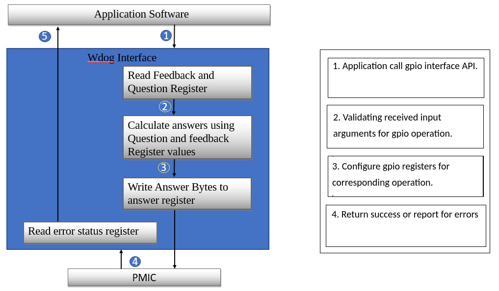

########################################################
PMIC LLD Software Design Document
########################################################

.. raw:: latex

    \newpage

**Revision History**

======= ============ =============== ======================== ========
Version Date         Author          Change History            Status
======= ============ =============== ======================== ========
1.0     23 Dec 2019   Amit Agarwal    Initial draft            Released
------- ------------ --------------- ------------------------ --------
2.0     07 Jan 2020  Amit Agarwal    Design and requirement   Released
                                     handling updated as    
                                     per initial review and 
                                     feature support        
                                     clarifications         
------- ------------ --------------- ------------------------ --------
2.1     11 Jan 2020  Amit Agarwal    -  Updated Watchdog QA   Released
                                        API description     
                                     -  Updated Integration 
                                        Details in Figure 2 
                                     -  Added DAR section   
                                        ‘Watchdog QA Window 
                                        Timing’             
                                     -  Updated API         
                                        description for     
                                        Regulator Voltage   
                                        configuration API   
------- ------------ --------------- ------------------------ --------
2.2     21-Jan-2020  Amit Agarwal    -  Updated as per        Released
                                        review comments for 
                                        document template,  
                                        Design IDs and      
                                        content correction  
------- ------------ --------------- ------------------------ --------
2.3     23-Jan-2020  Amit Agarwal    -  Updated DAR for       Released
                                        Critical Section    
                                     -  Corrected few API   
                                        descriptions        
                                     -  Updated Design ID   
                                        maps for API Data   
                                        Types               
------- ------------ --------------- ------------------------ --------
2.4     04-Feb-2020  Amit Agarwal    -  Updated Design        Released
                                        document based on   
                                        review feedback.    
                                     -  Updated API details 
------- ------------ --------------- ------------------------ --------
2.5     07-Feb-2020  Amit Agarwal    -  Fixed Review          Released
                                        comments            
                                     -  Updated             
                                        Non-supported       
                                        requirement         
                                        section.            
                                     -  Details added       
                                        related to multiple 
                                        instance of PMIC    
                                        driver.             
------- ------------ --------------- ------------------------ --------
2.6     18-Feb-2020  Amit Agarwal    -  Fixed Review          Released
                                        comments            
                                     -  Updated Low power   
                                        standby mode        
                                     -  Updated error       
                                        recovery words.     
------- ------------ --------------- ------------------------ --------
2.7     16-Mar-2020  Amit Agarwal    -  Added new design ID   Released
                                        to accommodate      
                                        newly added         
                                        requirements.       
                                     -  API table updated   
======= ============ =============== ======================== ========

.. raw:: latex

    \newpage
	
Introduction
============

Overview
--------

The purpose of this document is to define the software design for *PMIC*
LLD development for Leo and Hera (from Texas Instruments). The document
shall be a reference for software developers who use TI’s Leo or Hera
PMIC module on their Hardware to understand the various LLD aspects
like:

-  LLD architecture

-  LLD Feature Set

-  PMIC Communication interfaces and modes

-  Functional Safety Compliance and other related details

Assumptions and Constraints
---------------------------

From the Requirements collected and the understanding of development
team, following list is a brief of the Assumptions and Constraints found
during design phase:

1. The design and development of PMIC shall be done in strict compliance
   with Guidelines and Standards as per AP216

2. TI Coding Guidelines “TI84\_Plus\_CE\_ProgrammingGuide\_EN” shall be
   used while coding for APIs, Datatypes, etc.

3. LLD software shall be stateless and shall not have any event/error
   handling functionality, it shall just provide API to read and
   decipher events/errors

4. LLD shall be independent of any platform, i.e., no platform/OS
   specific routines/symbols shall be referenced in the LLD software

5. No platform specific I2C/SPI LLD code is present inside PMIC LLD; it
   is application’s responsibility to provide platform specific I2C/SPI
   API for the PMIC LLD before building the LLD

6. No platform specific Locking/Critical Section code required for
   I2C/SPI IO is present inside PMIC LLD; it is application’s
   responsibility to provide platform specific Locking/Critical Section
   API for the PMIC LLD before building the LLD

7. The design and development of PMIC shall be done to have no state
   management; LLD shall not expect any IO sequence or a
   prior-configuration for any PMIC functionality. Application shall
   take care of this.

Stakeholders
---------------------------

This document is meant for software developers who will use the design information as reference
for software implementation.
                                                                                                                                                                                                                                                                                                                                                                                    
Notational Conventions
---------------------------

See `Directory`_.

Glossary
---------------------------

See `Directory`_.

References
---------------------------

See `Directory`_.

Features Not Supported
----------------------

+--------------------------------------------------------------------------------------------------------------------------------------------------------------------------------------------------------------------------------------------------------------+
| 1. **Multiple Instance support:** LLD software doesn’t support multiple instances of the LLD running on different cores within an SOC.                                                                                                                       |
|                                                                                                                                                                                                                                                              |
| **Application Workaround:** If the feature is required, the user needs to instrument blocking mechanism (SW lock, semaphore, etc.) which to prevent multiple PMIC LLDs from configuring PMIC at the same time. All this shall be done in application code.   |
+==============================================================================================================================================================================================================================================================+
| 2. **PMIC Interrupt Handling:** LLD software shall not support Interrupt handlers for events/errors reported encountered by PMIC module                                                                                                                      |
|                                                                                                                                                                                                                                                              |
| **Application Workaround:** Application shall take care of setting up Interrupt Handlers to handle event/error interrupts and then call LLD provided API get exact info of event/error.                                                                      |
+--------------------------------------------------------------------------------------------------------------------------------------------------------------------------------------------------------------------------------------------------------------+

Design Requirements
-------------------

Design Requirements are extracted from the JIRA issues created for PMIC
requirements with unique identifiers. Design Requirements are drawn from
these JIRA issues to address handling of all implemented features
(granular to HW Register access) based on hardware level support.

To make an easy map of Design IDs and JIRA IDs and since the JIRA IDs
are in the format – ‘PRSDK\_7<xxx>’, the syntax of Design IDs is
DID\_7<xxx>\_D<01> through DID\_7<xxx>\_D<yy> depending on the number of
design requirements drawn from each Requirement created as JIRA IDs.

Supported Design Requirements
~~~~~~~~~~~~~~~~~~~~~~~~~~~~~

Some of the design IDs drawn from requirement IDs are redundant as
different requirements categorize/classify in different manner and same
configuration/event/interrupt/status item could be part of 2 or more
requirements, in which case the redundant design IDs are marked as
Redundant and moved to Unsupported Design Requirements Table

Following table lists all the Design Requirements IDs supported by PMIC
LLD.

+----------------------------------------------------------------------------------+--------------------+-----------------------------------------------------------------------------------------------------------------------------------------------------------------------------------------------------------+
| Design ID                                                                        | Requirement Type   | Description                                                                                                                                                                                               |
+==================================================================================+====================+===========================================================================================================================================================================================================+
| DID\_7330\_D01                                                                   | Non-Functional     | LLD build shall be standalone for non-TI platform integration and build environment.                                                                                                                      |
+----------------------------------------------------------------------------------+--------------------+-----------------------------------------------------------------------------------------------------------------------------------------------------------------------------------------------------------+
| DID\_7331\_D01                                                                   | Non-Functional     | LLD validation on TI EVM shall use TI Processor SDK. A Unit test application will be written as a part of Processor SDK to test the PMIC LLD.                                                             |
+----------------------------------------------------------------------------------+--------------------+-----------------------------------------------------------------------------------------------------------------------------------------------------------------------------------------------------------+
| DID\_7332\_D01                                                                   | Non-Functional     | LLD shall support for build with Processor SDK on both Windows (XDC-provided gmake) and Linux (make). Additionally, LLD build shall be standalone for non-TI platform integration and build environment   |
+----------------------------------------------------------------------------------+--------------------+-----------------------------------------------------------------------------------------------------------------------------------------------------------------------------------------------------------+
| DID\_7333\_D01                                                                   | Non-Functional     | LLD build and source infrastructure shall support multiple PMICs. Initial implementation shall support Leo, Hera will be added in future. Choosing Leo/Hera shall be a compile time option                |
+----------------------------------------------------------------------------------+--------------------+-----------------------------------------------------------------------------------------------------------------------------------------------------------------------------------------------------------+
| DID\_7334\_D01                                                                   | Testing            | LLD shall support TPS6594x (Leo). Testing will be on J721E EVM with Leo PMIC                                                                                                                              |
+----------------------------------------------------------------------------------+--------------------+-----------------------------------------------------------------------------------------------------------------------------------------------------------------------------------------------------------+
| DID\_7335\_D01                                                                   | Non-Functional     | LLD design & implementation shall be modular to support reduced feature set of LP8764 (Hera). Testing will be on J7VCL EVM with Hera PMIC                                                                 |
+----------------------------------------------------------------------------------+--------------------+-----------------------------------------------------------------------------------------------------------------------------------------------------------------------------------------------------------+
| DID\_7336\_D01                                                                   | Functional         | LLD API to take human readable value, convert and configure the target Buck Voltage                                                                                                                       |
+----------------------------------------------------------------------------------+--------------------+-----------------------------------------------------------------------------------------------------------------------------------------------------------------------------------------------------------+
| DID\_7336\_D02                                                                   | Functional         | LLD API to take human readable value, convert and configure the target LDO Voltage                                                                                                                        |
+----------------------------------------------------------------------------------+--------------------+-----------------------------------------------------------------------------------------------------------------------------------------------------------------------------------------------------------+
| DID\_7337\_D01                                                                   | Functional         | LLD API to read target Buck Voltage, convert it to human readable value and give it to application                                                                                                        |
+----------------------------------------------------------------------------------+--------------------+-----------------------------------------------------------------------------------------------------------------------------------------------------------------------------------------------------------+
| DID\_7337\_D02                                                                   | Functional         | LLD API to read target LDO Voltage, convert it to human readable value and give it to application                                                                                                         |
+----------------------------------------------------------------------------------+--------------------+-----------------------------------------------------------------------------------------------------------------------------------------------------------------------------------------------------------+
| DID\_7338\_D01                                                                   | Functional         | LLD API shall be stateless and re-entrant, i.e. API definitions shall not maintain state information and shall be re-entrant                                                                              |
+----------------------------------------------------------------------------------+--------------------+-----------------------------------------------------------------------------------------------------------------------------------------------------------------------------------------------------------+
| DID\_7339\_D01                                                                   | Functional         | LLD API shall support for protection against pre-emption, using Critical Sections and locking to ensure PMIC IO operations are atomic                                                                     |
+----------------------------------------------------------------------------------+--------------------+-----------------------------------------------------------------------------------------------------------------------------------------------------------------------------------------------------------+
| DID\_7340\_D01                                                                   | Functional         | Coding style shall follow TI Processor SDK style                                                                                                                                                          |
+----------------------------------------------------------------------------------+--------------------+-----------------------------------------------------------------------------------------------------------------------------------------------------------------------------------------------------------+
| DID\_7341\_D01                                                                   | Non-Functional     | Documentation template shall follow TI Processor SDK style                                                                                                                                                |
+----------------------------------------------------------------------------------+--------------------+-----------------------------------------------------------------------------------------------------------------------------------------------------------------------------------------------------------+
| DID\_7342\_D01                                                                   | Functional         | Driver shall support an application registered call table for the PMIC I2C interface using TI I2C LLD API                                                                                                 |
+----------------------------------------------------------------------------------+--------------------+-----------------------------------------------------------------------------------------------------------------------------------------------------------------------------------------------------------+
| DID\_7343\_D01                                                                   | Functional         | Driver shall support an application registered call table for the PMIC SPI interface using TI SPI LLD API                                                                                                 |
+----------------------------------------------------------------------------------+--------------------+-----------------------------------------------------------------------------------------------------------------------------------------------------------------------------------------------------------+
| DID\_7344\_D01                                                                   | Functional         | Driver shall have a runtime configuration option to enable the interface type supported, either I2C or SPI                                                                                                |
+----------------------------------------------------------------------------------+--------------------+-----------------------------------------------------------------------------------------------------------------------------------------------------------------------------------------------------------+
| DID\_7345\_D01                                                                   | Functional         | Driver shall support single I2C interface in which only I2C1 will be used to configure and monitor the PMIC                                                                                               |
+----------------------------------------------------------------------------------+--------------------+-----------------------------------------------------------------------------------------------------------------------------------------------------------------------------------------------------------+
| DID\_7346\_D01                                                                   | Functional         | Driver shall support dual I2C interface in which:                                                                                                                                                         |
|                                                                                  |                    |                                                                                                                                                                                                           |
|                                                                                  |                    | -  I2C1 will help to do PMIC configuration and monitor except WDG QA                                                                                                                                      |
|                                                                                  |                    |                                                                                                                                                                                                           |
|                                                                                  |                    | -  I2C2 will help to do WDG QA                                                                                                                                                                            |
+----------------------------------------------------------------------------------+--------------------+-----------------------------------------------------------------------------------------------------------------------------------------------------------------------------------------------------------+
| DID\_7347\_D01                                                                   | Functional         | Driver shall support SPI interface which will be used to configure and monitor the PMIC                                                                                                                   |
+----------------------------------------------------------------------------------+--------------------+-----------------------------------------------------------------------------------------------------------------------------------------------------------------------------------------------------------+
| DID\_7348\_D01                                                                   | Functional         | Driver shall configure PMIC GPIO pins as NSLEEP Triggers                                                                                                                                                  |
+----------------------------------------------------------------------------------+--------------------+-----------------------------------------------------------------------------------------------------------------------------------------------------------------------------------------------------------+
| DID\_7348\_D02                                                                   | Functional         | Driver shall configure PMIC GPIO pin as Reset pin for SOC                                                                                                                                                 |
+----------------------------------------------------------------------------------+--------------------+-----------------------------------------------------------------------------------------------------------------------------------------------------------------------------------------------------------+
| DID\_7348\_D03                                                                   | Functional         | Driver shall configure PMIC GPIO pins as WKUP sources                                                                                                                                                     |
+----------------------------------------------------------------------------------+--------------------+-----------------------------------------------------------------------------------------------------------------------------------------------------------------------------------------------------------+
| DID\_7348\_D04                                                                   | Functional         | Driver shall configure PMIC GPIO pins as General Input or Output pins                                                                                                                                     |
+----------------------------------------------------------------------------------+--------------------+-----------------------------------------------------------------------------------------------------------------------------------------------------------------------------------------------------------+
| DID\_7348\_D05                                                                   | Functional         | Driver shall configure PMIC GPIO pins for I2C2 SCLK and SDA lines                                                                                                                                         |
+----------------------------------------------------------------------------------+--------------------+-----------------------------------------------------------------------------------------------------------------------------------------------------------------------------------------------------------+
| DID\_7348\_D06                                                                   | Functional         | Driver shall configure PMIC GPIO pins as SPI CS or SDO lines                                                                                                                                              |
+----------------------------------------------------------------------------------+--------------------+-----------------------------------------------------------------------------------------------------------------------------------------------------------------------------------------------------------+
| DID\_7348\_D07                                                                   | Functional         | Driver shall configure PMIC GPIO pins as Watchdog Trigger line                                                                                                                                            |
+----------------------------------------------------------------------------------+--------------------+-----------------------------------------------------------------------------------------------------------------------------------------------------------------------------------------------------------+
| DID\_7348\_D08                                                                   | Functional         | Driver shall configure PMIC GPIO pins as ESM Error Pins for SOC or MCU                                                                                                                                    |
+----------------------------------------------------------------------------------+--------------------+-----------------------------------------------------------------------------------------------------------------------------------------------------------------------------------------------------------+
| DID\_7348\_D09                                                                   | Functional         | Driver shall configure PMIC GPIO pins as SPMI SCLK or SDATA                                                                                                                                               |
+----------------------------------------------------------------------------------+--------------------+-----------------------------------------------------------------------------------------------------------------------------------------------------------------------------------------------------------+
| DID\_7348\_D10                                                                   | Functional         | Driver shall configure respective PMIC GPIO pins as SYNCCLKOUT, SYNCLKIN, and CLK32KOUT.                                                                                                                  |
+----------------------------------------------------------------------------------+--------------------+-----------------------------------------------------------------------------------------------------------------------------------------------------------------------------------------------------------+
| DID\_7348\_D11                                                                   | Functional         | Driver shall configure PMIC GPIO pins as Watchdog Disable pin                                                                                                                                             |
+----------------------------------------------------------------------------------+--------------------+-----------------------------------------------------------------------------------------------------------------------------------------------------------------------------------------------------------+
| DID\_7348\_D12                                                                   | Functional         | Driver shall configure PMIC GPIO pin as Power Good Indication line                                                                                                                                        |
+----------------------------------------------------------------------------------+--------------------+-----------------------------------------------------------------------------------------------------------------------------------------------------------------------------------------------------------+
| DID\_7348\_D13                                                                   | Functional         | Driver shall read GPIO pin configuration and pin value.                                                                                                                                                   |
+----------------------------------------------------------------------------------+--------------------+-----------------------------------------------------------------------------------------------------------------------------------------------------------------------------------------------------------+
| DID\_7349\_D01                                                                   | Functional         | Driver API to read PMIC Error registers, decipher an error condition and return decipher error code to application                                                                                        |
+----------------------------------------------------------------------------------+--------------------+-----------------------------------------------------------------------------------------------------------------------------------------------------------------------------------------------------------+
| DID\_7349\_D02                                                                   | Functional         | Driver API to clear PMIC Interrupt registers depending on the error code generated previously by deciphering error status                                                                                 |
+----------------------------------------------------------------------------------+--------------------+-----------------------------------------------------------------------------------------------------------------------------------------------------------------------------------------------------------+
| DID\_7350\_D01                                                                   | Functional         | Driver API to read, decipher and return code for Buck Error - Over-voltage (OV)                                                                                                                           |
+----------------------------------------------------------------------------------+--------------------+-----------------------------------------------------------------------------------------------------------------------------------------------------------------------------------------------------------+
| DID\_7350\_D02                                                                   | Functional         | Driver API to read, decipher and return code for Buck Error - Under-voltage (UV)                                                                                                                          |
+----------------------------------------------------------------------------------+--------------------+-----------------------------------------------------------------------------------------------------------------------------------------------------------------------------------------------------------+
| DID\_7350\_D03                                                                   | Functional         | Driver API to read, decipher and return code for Buck Error - Short-Circuit (SC)                                                                                                                          |
+----------------------------------------------------------------------------------+--------------------+-----------------------------------------------------------------------------------------------------------------------------------------------------------------------------------------------------------+
| DID\_7350\_D04                                                                   | Functional         | Driver API to read, decipher and return code for Buck Error - Over-Current (ILIM)                                                                                                                         |
+----------------------------------------------------------------------------------+--------------------+-----------------------------------------------------------------------------------------------------------------------------------------------------------------------------------------------------------+
| DID\_7351\_D01                                                                   | Functional         | Driver API to read, decipher and return code for LDO Error - Over-voltage (OV)                                                                                                                            |
+----------------------------------------------------------------------------------+--------------------+-----------------------------------------------------------------------------------------------------------------------------------------------------------------------------------------------------------+
| DID\_7351\_D02                                                                   | Functional         | Driver API to read, decipher and return code for LDO Error - Under-voltage (UV)                                                                                                                           |
+----------------------------------------------------------------------------------+--------------------+-----------------------------------------------------------------------------------------------------------------------------------------------------------------------------------------------------------+
| DID\_7351\_D03                                                                   | Functional         | Driver API to read, decipher and return code for LDO Error - Short-Circuit (SC)                                                                                                                           |
+----------------------------------------------------------------------------------+--------------------+-----------------------------------------------------------------------------------------------------------------------------------------------------------------------------------------------------------+
| DID\_7351\_D04                                                                   | Functional         | Driver API to read, decipher and return code for LDO Error - Over-Current (ILIM)                                                                                                                          |
+----------------------------------------------------------------------------------+--------------------+-----------------------------------------------------------------------------------------------------------------------------------------------------------------------------------------------------------+
| DID\_7352\_D01                                                                   | Functional         | Driver API to read, decipher and return code for Severe Error - Thermal Immediate Shutdown (TISD)                                                                                                         |
+----------------------------------------------------------------------------------+--------------------+-----------------------------------------------------------------------------------------------------------------------------------------------------------------------------------------------------------+
| DID\_7352\_D02                                                                   | Functional         | Driver API to read, decipher and return code for Severe Error – Input Over Voltage and Immediate Shutdown (IOVISD)                                                                                        |
+----------------------------------------------------------------------------------+--------------------+-----------------------------------------------------------------------------------------------------------------------------------------------------------------------------------------------------------+
| DID\_7352\_D03                                                                   | Functional         | Driver API to read, decipher and return code for Severe Error – PFSM Sequencing Error                                                                                                                     |
+----------------------------------------------------------------------------------+--------------------+-----------------------------------------------------------------------------------------------------------------------------------------------------------------------------------------------------------+
| DID\_7353\_D01                                                                   | Functional         | Driver API to read, decipher and return code for Moderate Error – Recovery Count reached Limit                                                                                                            |
+----------------------------------------------------------------------------------+--------------------+-----------------------------------------------------------------------------------------------------------------------------------------------------------------------------------------------------------+
| DID\_7353\_D02                                                                   | Functional         | Driver API to read, decipher and return code for Moderate Error – nPWRON Long Press                                                                                                                       |
+----------------------------------------------------------------------------------+--------------------+-----------------------------------------------------------------------------------------------------------------------------------------------------------------------------------------------------------+
| DID\_7353\_D03                                                                   | Functional         | Driver API to read, decipher and return code for Moderate Error – SPMI Communication Error                                                                                                                |
+----------------------------------------------------------------------------------+--------------------+-----------------------------------------------------------------------------------------------------------------------------------------------------------------------------------------------------------+
| DID\_7353\_D04                                                                   | Functional         | Driver API to read, decipher and return code for Moderate Error – NRSTOUT readback error                                                                                                                  |
+----------------------------------------------------------------------------------+--------------------+-----------------------------------------------------------------------------------------------------------------------------------------------------------------------------------------------------------+
| DID\_7353\_D05                                                                   | Functional         | Driver API to read, decipher and return code for Moderate Error – Register CRC Error                                                                                                                      |
+----------------------------------------------------------------------------------+--------------------+-----------------------------------------------------------------------------------------------------------------------------------------------------------------------------------------------------------+
| DID\_7353\_D06                                                                   | Functional         | Driver API to read, decipher and return code for Moderate Error – BIST Failure                                                                                                                            |
+----------------------------------------------------------------------------------+--------------------+-----------------------------------------------------------------------------------------------------------------------------------------------------------------------------------------------------------+
| DID\_7353\_D07                                                                   | Functional         | Driver API to read, decipher and return code for Moderate Error – Thermal Orderly Shutdown                                                                                                                |
+----------------------------------------------------------------------------------+--------------------+-----------------------------------------------------------------------------------------------------------------------------------------------------------------------------------------------------------+
| DID\_7353\_D08                                                                   | Functional         | Driver API to read, decipher and return code for Moderate Error – NINT readback error                                                                                                                     |
+----------------------------------------------------------------------------------+--------------------+-----------------------------------------------------------------------------------------------------------------------------------------------------------------------------------------------------------+
| DID\_7355\_D01                                                                   | Functional         | Driver API to read, decipher and return code for Warning – Thermal Warning                                                                                                                                |
+----------------------------------------------------------------------------------+--------------------+-----------------------------------------------------------------------------------------------------------------------------------------------------------------------------------------------------------+
| DID\_7355\_D02                                                                   | Functional         | Driver API to read, decipher and return code for Warning – External Clock Sync Available                                                                                                                  |
+----------------------------------------------------------------------------------+--------------------+-----------------------------------------------------------------------------------------------------------------------------------------------------------------------------------------------------------+
| DID\_7355\_D03                                                                   | Functional         | Driver API to read, decipher and return code for Warning – BIST Passed                                                                                                                                    |
+----------------------------------------------------------------------------------+--------------------+-----------------------------------------------------------------------------------------------------------------------------------------------------------------------------------------------------------+
| DID\_7356\_D01                                                                   | Functional         | Driver API to read, decipher and return code for Start-up Source Event – RTC Alarm                                                                                                                        |
+----------------------------------------------------------------------------------+--------------------+-----------------------------------------------------------------------------------------------------------------------------------------------------------------------------------------------------------+
| DID\_7356\_D02                                                                   | Functional         | Driver API to read, decipher and return code for Start-up source Event – RTC Timer                                                                                                                        |
+----------------------------------------------------------------------------------+--------------------+-----------------------------------------------------------------------------------------------------------------------------------------------------------------------------------------------------------+
| DID\_7356\_D03                                                                   | Functional         | Driver API to read, decipher and return code for Start-up source Event – First                                                                                                                            |
|                                                                                  |                    |                                                                                                                                                                                                           |
|                                                                                  |                    | Supply Detection                                                                                                                                                                                          |
+----------------------------------------------------------------------------------+--------------------+-----------------------------------------------------------------------------------------------------------------------------------------------------------------------------------------------------------+
| DID\_7356\_D04                                                                   | Functional         | Driver API to read, decipher and return code for Start-up source Event –                                                                                                                                  |
|                                                                                  |                    |                                                                                                                                                                                                           |
|                                                                                  |                    | Enable Interrupt                                                                                                                                                                                          |
+----------------------------------------------------------------------------------+--------------------+-----------------------------------------------------------------------------------------------------------------------------------------------------------------------------------------------------------+
| DID\_7356\_D05                                                                   | Functional         | Driver API to read, decipher and return code for Start-up source Event –                                                                                                                                  |
|                                                                                  |                    |                                                                                                                                                                                                           |
|                                                                                  |                    | NPWRON Start Interrupt                                                                                                                                                                                    |
+----------------------------------------------------------------------------------+--------------------+-----------------------------------------------------------------------------------------------------------------------------------------------------------------------------------------------------------+
| DID\_7357\_D01                                                                   | Functional         | Driver API to read, decipher and return code for GPIO Interrupt event from GPIO1 through GPIO11 pins                                                                                                      |
+----------------------------------------------------------------------------------+--------------------+-----------------------------------------------------------------------------------------------------------------------------------------------------------------------------------------------------------+
| DID\_7358\_D01                                                                   | Functional         | Driver API to read, decipher and return code for FSM Error – WDG Failure                                                                                                                                  |
+----------------------------------------------------------------------------------+--------------------+-----------------------------------------------------------------------------------------------------------------------------------------------------------------------------------------------------------+
| DID\_7358\_D02                                                                   | Functional         | Driver API to read, decipher and return code for FSM Error – WDG Reset Event                                                                                                                              |
+----------------------------------------------------------------------------------+--------------------+-----------------------------------------------------------------------------------------------------------------------------------------------------------------------------------------------------------+
| DID\_7358\_D03                                                                   | Functional         | Driver API to read, decipher and return code for FSM Error – WDG Long Window Timeout Event                                                                                                                |
+----------------------------------------------------------------------------------+--------------------+-----------------------------------------------------------------------------------------------------------------------------------------------------------------------------------------------------------+
| DID\_7358\_D04                                                                   | Functional         | Driver API to read, decipher and return code for FSM Error – ESM MCU Reset                                                                                                                                |
+----------------------------------------------------------------------------------+--------------------+-----------------------------------------------------------------------------------------------------------------------------------------------------------------------------------------------------------+
| DID\_7358\_D05                                                                   | Functional         | Driver API to read, decipher and return code for FSM Error – ESM MCU Failure                                                                                                                              |
+----------------------------------------------------------------------------------+--------------------+-----------------------------------------------------------------------------------------------------------------------------------------------------------------------------------------------------------+
| DID\_7358\_D06                                                                   | Functional         | Driver API to read, decipher and return code for FSM Error – ESM MCU Fault                                                                                                                                |
+----------------------------------------------------------------------------------+--------------------+-----------------------------------------------------------------------------------------------------------------------------------------------------------------------------------------------------------+
| DID\_7358\_D07                                                                   | Functional         | Driver API to read, decipher and return code for FSM Error – ESM SOC Reset                                                                                                                                |
+----------------------------------------------------------------------------------+--------------------+-----------------------------------------------------------------------------------------------------------------------------------------------------------------------------------------------------------+
| DID\_7358\_D08                                                                   | Functional         | Driver API to read, decipher and return code for FSM Error – ESM SOC Failure                                                                                                                              |
+----------------------------------------------------------------------------------+--------------------+-----------------------------------------------------------------------------------------------------------------------------------------------------------------------------------------------------------+
| DID\_7358\_D09                                                                   | Functional         | Driver API to read, decipher and return code for FSM Error – ESM SOC Fault                                                                                                                                |
+----------------------------------------------------------------------------------+--------------------+-----------------------------------------------------------------------------------------------------------------------------------------------------------------------------------------------------------+
| DID\_7358\_D10                                                                   | Functional         | Driver API to read, decipher and return code for FSM Error – NRSTOUT\_SOC Readback Error                                                                                                                  |
+----------------------------------------------------------------------------------+--------------------+-----------------------------------------------------------------------------------------------------------------------------------------------------------------------------------------------------------+
| DID\_7358\_D11                                                                   | Functional         | Driver API to read, decipher and return code for FSM Error – EN\_DRV Readback Error                                                                                                                       |
+----------------------------------------------------------------------------------+--------------------+-----------------------------------------------------------------------------------------------------------------------------------------------------------------------------------------------------------+
| DID\_7358\_D12                                                                   | Functional         | Driver API to read, decipher and return code for FSM Error – I2C2 Register address Error                                                                                                                  |
+----------------------------------------------------------------------------------+--------------------+-----------------------------------------------------------------------------------------------------------------------------------------------------------------------------------------------------------+
| DID\_7358\_D13                                                                   | Functional         | Driver API to read, decipher and return code for FSM Error – I2C2 CRC Error                                                                                                                               |
+----------------------------------------------------------------------------------+--------------------+-----------------------------------------------------------------------------------------------------------------------------------------------------------------------------------------------------------+
| DID\_7358\_D14                                                                   | Functional         | Driver API to read, decipher and return code for FSM Error – I2C1/SPI Register address Error                                                                                                              |
+----------------------------------------------------------------------------------+--------------------+-----------------------------------------------------------------------------------------------------------------------------------------------------------------------------------------------------------+
| DID\_7358\_D15                                                                   | Functional         | Driver API to read, decipher and return code for FSM Error – I2C1/SPI CRC Error                                                                                                                           |
+----------------------------------------------------------------------------------+--------------------+-----------------------------------------------------------------------------------------------------------------------------------------------------------------------------------------------------------+
| DID\_7358\_D16                                                                   | Functional         | Driver API to read, decipher and return code for FSM Error – SPI Frame Error                                                                                                                              |
+----------------------------------------------------------------------------------+--------------------+-----------------------------------------------------------------------------------------------------------------------------------------------------------------------------------------------------------+
| DID\_7358\_D17                                                                   | Functional         | Driver API to read, decipher and return code for FSM Error – SOC Power Error                                                                                                                              |
+----------------------------------------------------------------------------------+--------------------+-----------------------------------------------------------------------------------------------------------------------------------------------------------------------------------------------------------+
| DID\_7358\_D18                                                                   | Functional         | Driver API to read, decipher and return code for FSM Error – MCU Power Error                                                                                                                              |
+----------------------------------------------------------------------------------+--------------------+-----------------------------------------------------------------------------------------------------------------------------------------------------------------------------------------------------------+
| DID\_7358\_D19                                                                   | Functional         | Driver API to read, decipher and return code for FSM Error – Orderly Shutdown Event                                                                                                                       |
+----------------------------------------------------------------------------------+--------------------+-----------------------------------------------------------------------------------------------------------------------------------------------------------------------------------------------------------+
| DID\_7358\_D20                                                                   | Functional         | Driver API to read, decipher and return code for FSM Error – Immediate Shutdown Event                                                                                                                     |
+----------------------------------------------------------------------------------+--------------------+-----------------------------------------------------------------------------------------------------------------------------------------------------------------------------------------------------------+
| DID\_7359\_D01                                                                   | Functional         | Driver API to read, decipher and return code for Boot BIST Error.                                                                                                                                         |
|                                                                                  |                    |                                                                                                                                                                                                           |
|                                                                                  |                    | Also covered under PRSDK-7353(DID\_7353\_D06 Redundant)                                                                                                                                                   |
+----------------------------------------------------------------------------------+--------------------+-----------------------------------------------------------------------------------------------------------------------------------------------------------------------------------------------------------+
| DID\_7360\_D01                                                                   | Functional         | Driver API to read, decipher and return code for Runtime BIST Error                                                                                                                                       |
|                                                                                  |                    |                                                                                                                                                                                                           |
|                                                                                  |                    | Also covered under PRSDK-7353(DID\_7353\_D06 Redundant)                                                                                                                                                   |
+----------------------------------------------------------------------------------+--------------------+-----------------------------------------------------------------------------------------------------------------------------------------------------------------------------------------------------------+
| DID\_7361\_D01                                                                   | Functional         | Driver API to read, decipher and return code for WDG Error – WDG Reset Event                                                                                                                              |
+----------------------------------------------------------------------------------+--------------------+-----------------------------------------------------------------------------------------------------------------------------------------------------------------------------------------------------------+
| DID\_7361\_D02                                                                   | Functional         | Driver API to read, decipher and return code for WDG Error – WDG Failure                                                                                                                                  |
+----------------------------------------------------------------------------------+--------------------+-----------------------------------------------------------------------------------------------------------------------------------------------------------------------------------------------------------+
| DID\_7361\_D03                                                                   | Functional         | Driver API to read, decipher and return code for WDG Error – WDG Long Window Timeout                                                                                                                      |
+----------------------------------------------------------------------------------+--------------------+-----------------------------------------------------------------------------------------------------------------------------------------------------------------------------------------------------------+
| DID\_7361\_D04                                                                   | Functional         | Driver API to read, decipher and return code for WDG Error – WDG Answer Error                                                                                                                             |
+----------------------------------------------------------------------------------+--------------------+-----------------------------------------------------------------------------------------------------------------------------------------------------------------------------------------------------------+
| DID\_7361\_D05                                                                   | Functional         | Driver API to read, decipher and return code for WDG Error – WDG Answer Sequence Error                                                                                                                    |
+----------------------------------------------------------------------------------+--------------------+-----------------------------------------------------------------------------------------------------------------------------------------------------------------------------------------------------------+
| DID\_7361\_D06                                                                   | Functional         | Driver API to read, decipher and return code for WDG Error – WDG Answer Early Error                                                                                                                       |
+----------------------------------------------------------------------------------+--------------------+-----------------------------------------------------------------------------------------------------------------------------------------------------------------------------------------------------------+
| DID\_7361\_D07                                                                   | Functional         | Driver API to read, decipher and return code for WDG Error – WDG Trigger Early Error                                                                                                                      |
+----------------------------------------------------------------------------------+--------------------+-----------------------------------------------------------------------------------------------------------------------------------------------------------------------------------------------------------+
| DID\_7361\_D08                                                                   | Functional         | Driver API to read, decipher and return code for WDG Error – WDG Timeout                                                                                                                                  |
+----------------------------------------------------------------------------------+--------------------+-----------------------------------------------------------------------------------------------------------------------------------------------------------------------------------------------------------+
| DID\_7362\_D01                                                                   | Functional         | Driver API to read, decipher and return code for ESM Error                                                                                                                                                |
+----------------------------------------------------------------------------------+--------------------+-----------------------------------------------------------------------------------------------------------------------------------------------------------------------------------------------------------+
| DID\_7363\_D01                                                                   | Functional         | Driver API to read, decipher and return code for FSM Errors.                                                                                                                                              |
|                                                                                  |                    |                                                                                                                                                                                                           |
|                                                                                  |                    | Also covered under PRSDK-7358 (Redundant)                                                                                                                                                                 |
+----------------------------------------------------------------------------------+--------------------+-----------------------------------------------------------------------------------------------------------------------------------------------------------------------------------------------------------+
| DID\_7363\_D02                                                                   | Functional         | Driver API to read, decipher and return code for WDG Error                                                                                                                                                |
|                                                                                  |                    |                                                                                                                                                                                                           |
|                                                                                  |                    | Also covered under PRSDK-7358 (Redundant)                                                                                                                                                                 |
+----------------------------------------------------------------------------------+--------------------+-----------------------------------------------------------------------------------------------------------------------------------------------------------------------------------------------------------+
| DID\_7364\_D01                                                                   | Functional         | Driver API to configure ESM MCU by resetting ESM\_MCU\_START to 0, update ESM MCU Configuration registers and setting ESM\_MCU\_START to 1                                                                |
+----------------------------------------------------------------------------------+--------------------+-----------------------------------------------------------------------------------------------------------------------------------------------------------------------------------------------------------+
| DID\_7364\_D02                                                                   | Functional         | Driver API to configure ESM SOC by resetting ESM\_SOC\_START to 0, update ESM SOC Configuration registers and setting ESM\_SOC\_START to 1                                                                |
+----------------------------------------------------------------------------------+--------------------+-----------------------------------------------------------------------------------------------------------------------------------------------------------------------------------------------------------+
| DID\_7364\_D03                                                                   | Functional         | Driver API to Stop ESM MCU Monitor by resetting ESM\_MCU\_START to 0                                                                                                                                      |
+----------------------------------------------------------------------------------+--------------------+-----------------------------------------------------------------------------------------------------------------------------------------------------------------------------------------------------------+
| DID\_7364\_D04                                                                   | Functional         | Driver API to Stop ESM SOC Monitor by resetting ESM\_SOC\_START to 0                                                                                                                                      |
+----------------------------------------------------------------------------------+--------------------+-----------------------------------------------------------------------------------------------------------------------------------------------------------------------------------------------------------+
| DID\_7364\_D05                                                                   | Functional         | Driver API to read ESM MCU Configuration                                                                                                                                                                  |
+----------------------------------------------------------------------------------+--------------------+-----------------------------------------------------------------------------------------------------------------------------------------------------------------------------------------------------------+
| DID\_7364\_D06                                                                   | Functional         | Driver API to read ESM SOC Configuration                                                                                                                                                                  |
+----------------------------------------------------------------------------------+--------------------+-----------------------------------------------------------------------------------------------------------------------------------------------------------------------------------------------------------+
| DID\_7365\_D01                                                                   | Functional         | Driver API to configure Watchdog in Trigger mode                                                                                                                                                          |
+----------------------------------------------------------------------------------+--------------------+-----------------------------------------------------------------------------------------------------------------------------------------------------------------------------------------------------------+
| DID\_7365\_D02                                                                   | Functional         | Driver API to read back Watchdog configuration                                                                                                                                                            |
+----------------------------------------------------------------------------------+--------------------+-----------------------------------------------------------------------------------------------------------------------------------------------------------------------------------------------------------+
| DID\_7366\_D01                                                                   | Functional         | Driver API to configure Watchdog in QA mode                                                                                                                                                               |
+----------------------------------------------------------------------------------+--------------------+-----------------------------------------------------------------------------------------------------------------------------------------------------------------------------------------------------------+
| DID\_7366\_D02                                                                   | Functional         | Driver API to perform Watchdog QA with PMIC                                                                                                                                                               |
+----------------------------------------------------------------------------------+--------------------+-----------------------------------------------------------------------------------------------------------------------------------------------------------------------------------------------------------+
| DID\_7366\_D03                                                                   | Functional         | Driver API to perform Watchdog Enable/Disable                                                                                                                                                             |
+----------------------------------------------------------------------------------+--------------------+-----------------------------------------------------------------------------------------------------------------------------------------------------------------------------------------------------------+
| DID\_7367\_D01                                                                   | Functional         | Driver shall provide an API to execute Runtime BIST                                                                                                                                                       |
+----------------------------------------------------------------------------------+--------------------+-----------------------------------------------------------------------------------------------------------------------------------------------------------------------------------------------------------+
| DID\_7368\_D01                                                                   | Functional         | Driver shall configure thermal monitoring/shutdown of the PMIC                                                                                                                                            |
+----------------------------------------------------------------------------------+--------------------+-----------------------------------------------------------------------------------------------------------------------------------------------------------------------------------------------------------+
| DID\_7368\_D02                                                                   | Functional         | Driver shall read back thermal monitoring/shutdown configuration of the PMIC                                                                                                                              |
+----------------------------------------------------------------------------------+--------------------+-----------------------------------------------------------------------------------------------------------------------------------------------------------------------------------------------------------+
| DID\_7369\_D01                                                                   | Functional         | Driver shall configure Voltage Monitor for Over- and Under-Voltage for Vcca                                                                                                                               |
+----------------------------------------------------------------------------------+--------------------+-----------------------------------------------------------------------------------------------------------------------------------------------------------------------------------------------------------+
| DID\_7369\_D02                                                                   | Functional         | Driver shall read back the Voltage Monitor Configuration for Vcca                                                                                                                                         |
+----------------------------------------------------------------------------------+--------------------+-----------------------------------------------------------------------------------------------------------------------------------------------------------------------------------------------------------+
| DID\_7370\_D01                                                                   | Functional         | Driver shall configure Power Good Monitor for both input and output rails                                                                                                                                 |
+----------------------------------------------------------------------------------+--------------------+-----------------------------------------------------------------------------------------------------------------------------------------------------------------------------------------------------------+
| DID\_7370\_D02                                                                   | Functional         | Driver shall read back Power Good Monitor Configuration of Buck/LDO                                                                                                                                       |
+----------------------------------------------------------------------------------+--------------------+-----------------------------------------------------------------------------------------------------------------------------------------------------------------------------------------------------------+
| DID\_7371-D01                                                                    | Functional         | Driver shall configure for current monitor and short circuit protection                                                                                                                                   |
+----------------------------------------------------------------------------------+--------------------+-----------------------------------------------------------------------------------------------------------------------------------------------------------------------------------------------------------+
| DID\_7371-D02                                                                    | Functional         | Driver shall read back the current monitor configuration                                                                                                                                                  |
+----------------------------------------------------------------------------------+--------------------+-----------------------------------------------------------------------------------------------------------------------------------------------------------------------------------------------------------+
| DID\_7372\_D01                                                                   | Functional         | Driver shall support configuring NSLEEP registers for Processor low power.                                                                                                                                |
+----------------------------------------------------------------------------------+--------------------+-----------------------------------------------------------------------------------------------------------------------------------------------------------------------------------------------------------+
| DID\_7372\_D02                                                                   | Functional         | Driver shall readback NSLEEP registers to get wake or sleep status.                                                                                                                                       |
+----------------------------------------------------------------------------------+--------------------+-----------------------------------------------------------------------------------------------------------------------------------------------------------------------------------------------------------+
| DID\_7373\_D01                                                                   | Functional         | Driver shall configure RTC Alarm Interrupts and enable RTC                                                                                                                                                |
+----------------------------------------------------------------------------------+--------------------+-----------------------------------------------------------------------------------------------------------------------------------------------------------------------------------------------------------+
| DID\_7373\_D02                                                                   | Functional         | Driver shall readback RTC Alarm configuration                                                                                                                                                             |
+----------------------------------------------------------------------------------+--------------------+-----------------------------------------------------------------------------------------------------------------------------------------------------------------------------------------------------------+
| DID\_7373\_D03                                                                   | Functional         | Driver shall configure RTC Timer Interrupts and enable RTC                                                                                                                                                |
+----------------------------------------------------------------------------------+--------------------+-----------------------------------------------------------------------------------------------------------------------------------------------------------------------------------------------------------+
| DID\_7373\_D04                                                                   | Functional         | Driver shall readback RTC Timer Configuration                                                                                                                                                             |
+----------------------------------------------------------------------------------+--------------------+-----------------------------------------------------------------------------------------------------------------------------------------------------------------------------------------------------------+
| DID\_7373\_D05                                                                   | Functional         | Driver shall disable RTC module                                                                                                                                                                           |
+----------------------------------------------------------------------------------+--------------------+-----------------------------------------------------------------------------------------------------------------------------------------------------------------------------------------------------------+
| DID\_7373\_D06                                                                   | Functional         | Driver shall enable RTC module                                                                                                                                                                            |
+----------------------------------------------------------------------------------+--------------------+-----------------------------------------------------------------------------------------------------------------------------------------------------------------------------------------------------------+
| DID\_7373\_D07                                                                   | Functional         | Driver shall configure RTC time calendar registers                                                                                                                                                        |
+----------------------------------------------------------------------------------+--------------------+-----------------------------------------------------------------------------------------------------------------------------------------------------------------------------------------------------------+
| DID\_7373\_D08                                                                   | Functional         | Driver shall readback RTC time calendar registers.                                                                                                                                                        |
+----------------------------------------------------------------------------------+--------------------+-----------------------------------------------------------------------------------------------------------------------------------------------------------------------------------------------------------+
| DID\_7373\_D09                                                                   | Functional         | Driver shall enable RTC Frequency compensation.                                                                                                                                                           |
+----------------------------------------------------------------------------------+--------------------+-----------------------------------------------------------------------------------------------------------------------------------------------------------------------------------------------------------+
| DID\_7373\_D10                                                                   | Functional         | Driver shall configure RTC Frequency compensation readback.                                                                                                                                               |
+----------------------------------------------------------------------------------+--------------------+-----------------------------------------------------------------------------------------------------------------------------------------------------------------------------------------------------------+
| DID\_7374\_D01                                                                   | Functional         | Driver shall support **Ultra Low Power** Standby with CAN WakeUp for PMIC                                                                                                                                 |
|                                                                                  |                    |                                                                                                                                                                                                           |
|                                                                                  |                    | Note: Ultra-Low Power Mode is synonymous to LP\_STANDBY state in the TRM.                                                                                                                                 |
+----------------------------------------------------------------------------------+--------------------+-----------------------------------------------------------------------------------------------------------------------------------------------------------------------------------------------------------+
| DID\_7375\_D01                                                                   | Functional         | Driver shall support **Ultra Low Power** Standby with RTC WakeUp for PMIC                                                                                                                                 |
|                                                                                  |                    |                                                                                                                                                                                                           |
|                                                                                  |                    | Note: Ultra-Low Power Mode is synonymous to LP\_STANDBY state in the TRM.                                                                                                                                 |
+----------------------------------------------------------------------------------+--------------------+-----------------------------------------------------------------------------------------------------------------------------------------------------------------------------------------------------------+
| DID\_7376\_D01                                                                   | Testing            | A unit test application will be created using the Unity test framework to test all requirements in Processor SDK environment.                                                                             |
|                                                                                  |                    |                                                                                                                                                                                                           |
|                                                                                  |                    | The test application shall –                                                                                                                                                                              |
|                                                                                  |                    |                                                                                                                                                                                                           |
|                                                                                  |                    | -  Use UART to provide:                                                                                                                                                                                   |
|                                                                                  |                    |                                                                                                                                                                                                           |
|                                                                                  |                    |    -  Serial Console for I/O                                                                                                                                                                              |
|                                                                                  |                    |                                                                                                                                                                                                           |
|                                                                                  |                    |    -  SBL booting support                                                                                                                                                                                 |
|                                                                                  |                    |                                                                                                                                                                                                           |
|                                                                                  |                    | -  Run on R5 core                                                                                                                                                                                         |
+----------------------------------------------------------------------------------+--------------------+-----------------------------------------------------------------------------------------------------------------------------------------------------------------------------------------------------------+
| DID\_7377\_D01                                                                   | Testing            | Stub functions used to meet functional safety code coverage during testing.                                                                                                                               |
+----------------------------------------------------------------------------------+--------------------+-----------------------------------------------------------------------------------------------------------------------------------------------------------------------------------------------------------+
| DID\_7378\_D01                                                                   | Testing            | Benchmark application shall be developed on PSDK framework.                                                                                                                                               |
+----------------------------------------------------------------------------------+--------------------+-----------------------------------------------------------------------------------------------------------------------------------------------------------------------------------------------------------+
| DID\_7379\_D01                                                                   | Non-Functional     | Driver design and development shall follow the Functional Safety process specified in AP216                                                                                                               |
+----------------------------------------------------------------------------------+--------------------+-----------------------------------------------------------------------------------------------------------------------------------------------------------------------------------------------------------+
| `DID\_8079 <https://jira.itg.ti.com/browse/PRSDK-8079?src=confmacro>`__\ \_D01   | Functional         | Driver must allow configuration of the PMIC low power LP STANDBY state by writing to I2C\_TRIGGER\_0.                                                                                                     |
+----------------------------------------------------------------------------------+--------------------+-----------------------------------------------------------------------------------------------------------------------------------------------------------------------------------------------------------+
| `DID\_8080 <https://jira.itg.ti.com/browse/PRSDK-8079?src=confmacro>`__\ \_D01   | Functional         | `Driver shall provide an API to query the error recovery count <https://jira.itg.ti.com/browse/PRSDK-8080?src=confmacro>`__.                                                                              |
+----------------------------------------------------------------------------------+--------------------+-----------------------------------------------------------------------------------------------------------------------------------------------------------------------------------------------------------+

Unsupported Design Requirements
~~~~~~~~~~~~~~~~~~~~~~~~~~~~~~~

+------------------+------------------------+-------------------------------------------------------------------------+----------------------------------------------------------------------------------+
| **Design ID**    | **Requirement Type**   | **Description**                                                         | **Justification**                                                                |
+==================+========================+=========================================================================+==================================================================================+
| DID\_7354\_D01   | Functional             | Driver API to read, decipher and return code for Catastrophic Errors:   | 1. Input Voltage Error: Redundant to DID\_7350 and DID\_7351                     |
|                  |                        |                                                                         |                                                                                  |
|                  |                        | 1. Input Voltage Error                                                  | 2. Internal LDO Error: Redundant to DID\_7351                                    |
|                  |                        |                                                                         |                                                                                  |
|                  |                        | 2. Internal LDO Error                                                   | 3. Voltage Reference/Clock Monitor Error: Redundant to DID\_7350 and DID\_7351   |
|                  |                        |                                                                         |                                                                                  |
|                  |                        | 3. Voltage Reference/Clock Monitor Error                                | 4. Thermal Shutdown threshold Error: Redundant to DID\_7352\_D01                 |
|                  |                        |                                                                         |                                                                                  |
|                  |                        | 4. Thermal Shutdown threshold Error                                     | 5. SPMI Communication Error: Redundant to DID\_7353\_D03                         |
|                  |                        |                                                                         |                                                                                  |
|                  |                        | 5. SPMI Communication Error                                             |                                                                                  |
+------------------+------------------------+-------------------------------------------------------------------------+----------------------------------------------------------------------------------+

Design Description
==================

Architecture 
-------------

Following figure shows the Software architecture of PMIC driver along
with application and hardware layers.

It is required that HW Interface Drivers (I2C, SPI and GPIO) and
Critical Section/Locking Mechanisms are not designed or implemented
inside the PMIC Driver. Instead the Platform-OS/SDK is holding the
Driver implementation. The PMIC Driver just takes a Platform API Hooks
for these features.

.. figure:: pmic_lld_design_diagram/PMIC_Driver_Software_Architecture.png
   :width: 80%
   :align: center

Figure PMIC Driver Software Architecture

Platform Integration
--------------------

During Integration on non-TI platform, integrator shall take care to
properly define API Hooks to fulfill proper integration aspects as given
below:

1. I2C LLD API Hooks

2. SPI LLD API Hooks

3. Critical Section/Locking API Hooks

Following illustrates the integration specific details for any
platform/SDK.

.. figure:: pmic_lld_design_diagram/Platform_Integration.png
   :width: 80%
   :align: center

Figure Platform Integration - TI / non-TI SDK platform

Sequence Diagrams
-----------------

Interrupt Service Routines
--------------------------

PMIC Driver Requirement specifies that PMIC Driver software shall not
provide any Interrupt Service Routines, demanding the Application layer
provide and maintain the ISRs without driver intervention.

Driver shall provide API to read error/status information from PMIC
registers and return a corresponding deciphered code. The API also gives
a feature to clear the Interrupts from within the same function call
using a control flag. This API can be invoked by application layer after
receiving an event/error Interrupt.

Error Handling
--------------

**Runtime Error handling shall not be handled by the PMIC Driver.**

Driver shall provide API just to read error information from PMIC
registers and return a corresponding deciphered error code. This API can
be invoked by application layer depending on info taken from error ISR.

PMIC driver API shall be able to decode various errors detected in PMIC
hardware and provide the relevant error code to Application.

Components
----------

This section gives an overview of all components in PMIC module which
are divided into two categories:

1. PMIC Communication Interface

2. PMIC Core Functionality

PMIC Communication Interface Components
~~~~~~~~~~~~~~~~~~~~~~~~~~~~~~~~~~~~~~~

PMIC contains I2C, SPI and GPIO as the only interfaces to configure,
monitor and control various components in PMIC module.

**LLD for Communication Interface Components**

PMIC Driver software doesn’t provide driver code for I2C and SPI IO
operations as it is designed to be platform independent. Application has
to provide all necessary LLD API for I2C and SPI as per API prototypes
as given in PSDK and Those API will be used by PMIC driver to drive I2C
or SPI interface. Run time configuration is supported to select either
only I2C or SPI as PMIC interface.

**Note:** For PMIC Driver, GPIO is not considered as a communication
interface for pin Control of PMIC module, but Pin Functionality
configuration is supported. It is up to platform and application to
control GPIO pins.

I2C Interface 
^^^^^^^^^^^^^^

PMIC provides two I2C interfaces for PMIC communication.

A runtime configuration feature in the driver is supported to decide
whether to use Single Mode or Dual Interface mode thus enabling or
disabling I2C2 interface. I2C1 is always enabled in case I2C interface
is selected for PMIC communication.

I2C Single Interface mode
'''''''''''''''''''''''''

This mode is used when only one I2C interface is enough to communicate
with PMIC module. I2C2 lines shall be configured to function as GPIO
only for this mode.

PMIC registers are fully accessible by I2C1. I2C1 is used by the PMIC to
accept IO requests to help MCU configure and monitor PMIC components and
states.

I2C Dual Interface mode
'''''''''''''''''''''''

This mode is used when both I2C interfaces are required to communicate
with PMIC module. Corresponding GPIO lines shall be configured to
function as I2C Clock and Data lines for this mode.

I2C2 interface will become the dedicated interface for the Q/A watchdog
communication, while I2C1 interface will no longer have access to the
watchdog registers. This will isolate the watchdog messages from the
control messages, to ensure real-time performance for watchdog.

PMIC register access is distributed between I2C1 and I2C2. In Dual
Interface mode:

-  I2C1: Used to accept IO requests to help MCU configure and monitor
   PMIC components and states as listed below:

   -  Power Sequencer control

   -  State/Output control of Power Rails (including DVFS)

   -  Device Operating State control

   -  RTC

-  I2C2: Used to accept IO requests to help MCU do watchdog Trigger and
   Q/A communication with PMIC

SPI Interface 
^^^^^^^^^^^^^^

TPS6594 PMIC gives one SPI interface for configuration and monitor from
SOC/MCU. The SPI has full access to all PMIC configuration and monitor
registers. When SPI is selected as the PMIC Interface, I2C2 lines are
configured to function as GPIO lines only and further communication is
done via SPI only.

PMIC Core Functionality Components
~~~~~~~~~~~~~~~~~~~~~~~~~~~~~~~~~~

GPIO
^^^^

GPIO pins from PMIC are not directly controlled when pin functionality
is set as normal GPIO pin.

PMIC GPIO can be configured and used for following purposes as explained
below.

There are other functionalities as well GPIO supports and the Driver API
shall support configuring all GPIO pins to any desired functionality of
the GPIO as the functionalities that are supported by each pin.

.. figure:: pmic_lld_design_diagram/gpio_control_operation_flow.png
   :width: 80%
   :align: center
   
Figure gpio control/operation flow

RTC
^^^

The Real Time Clock (RTC) is driven by the 32-kHz oscillator and it
provides the alarm and time-keeping functions. It provides time
information and calendar information. RTC can generate timer interrupts
(periodic interrupts) and alarm interrupts (precise interrupts). Also
used for Oscillator frequency calibration and time correction with
1/32768 resolution.

The driver shall provide an API to configure RTC registers
(ALARM\_SECONDS, ALARM\_MINUTES, ALARM\_HOURS, ALARM\_DAYS,
ALARM\_MONTHS, and ALARM\_YEARS) to set the alarm interrupt at a precise
time.

This interrupt can be enabled and disabled by setting the IT\_ALARM bit
of RTC\_INTERRUPTS register.

The driver shall provide an API to configure RTC to generate a periodic
interrupt.

The periodic time can be configured by setting the bits in ‘EVERY’ field
of RTC\_INTERRUPTS register.

**EVERY** bit indicates every second/ minute/ hour/ day the interrupt
should be set.

This interrupt is enabled and disabled by setting the IT\_TIMER bit of
RTC\_INTERRUPTS register.

RTC can be stopped by clearing the STOP\_RTC bit of RTC\_CTRL\_1
register.

Watchdog
^^^^^^^^

The watchdog monitors correct operation of the MCU. The watchdog is used
to detect and recover from incorrect operation of the MCU.

Watchdog Init and configuration:
''''''''''''''''''''''''''''''''

When the device releases the nRSTOUT pin, the watchdog starts with the
Long Window. As long as the watchdog is in the Long Window, the MCU can
either clear bit WD\_EN to disable to watchdog, or configure the
watchdog through the following register bits:

    • WD\_LONGWIN[7:0] to configure the duration of the Long-Window
      time-interval

    • WD\_MODE\_SELECT to select the Watchdog mode (Trigger mode or Q&A
      Mode)

    • WD\_PWRHOLD to activate the Watchdog Disable function (more detail
      in Section 5.3.10.4)

    • WD\_RETURN\_LONGWIN to return to Long-Window after completion of
      the current watchdog sequence (more detail in Section 5.3.10.4)

    • WD\_WIN1[6:0] to configure the duration of the Window-1
      time-interval

    • WD\_WIN2[6:0] to configure the duration of the Window-2
      time-interval

    • WD\_RST\_EN to enable/disable the watchdog-reset function

    • WD\_EN to enable/disable the watchdog

    • WD\_FAIL\_TH[2:0] to configure the Watchdog-Fail threshold

    • WD\_RST\_TH[2:0] to configure the Watchdog-Reset threshold

    • WD\_QA\_FDBK[1:0] to configure the settings for the reference
      answer-generation

    • WD\_QA\_LFSR[1:0] to configure the settings for the
      question-generation

    • WD\_QUESTION\_SEED[3:0] to configure the starting-point for the
      1st question-generation

    • WD\_QA\_CFG for watchdog in Q&A Mode

The device will keep the above register bit values configured by the MCU
as long as the device is powered.

The watchdog can be used in trigger mode by setting the WD\_MODSELECT
bit of WD\_MODE\_REG register.

The watchdog operates in two different modes which are defined as below:

Watchdog Trigger Mode
'''''''''''''''''''''

In trigger mode, the MCU applies a pulse signal with a minimum pulse
width of t WD\_pulse on the Trigger pin for Watchdog at regular
intervals to send the required watchdog trigger. To select this mode,
the MCU must clear bit WD\_MODE\_SELECT. Driver shall support
configuring trigger mode and selection of GPIO line (trigger pin) for
trigger mode.

**
NOTE:** No API is provided to send Watchdog signals in Trigger mode
since as GPIO Interface is not used by PMIC driver.

Watchdog QA Mode
''''''''''''''''

In Q&A mode, the MCU sends watchdog answers through the I2C bus or SPI
bus. To select this mode, the MCU must set bit WD\_MODE\_SELECT. The
watchdog will ***operate in Q&A by default*** after device powers-up
from the NO SUPPLY state.

**NOTE:** PMIC Q&A Watchdog communication registers are mapped to GPIO1
and GPIO2 (I2C2) pins. Driver shall provide API’s to allow application
do WDOG QA communication regularly and it is up to the application to
call WDOG QA API’s with relevant timing parameters for gap between
Window1 and Window2.

The Watchdog will provide the questions for the MCU in WD\_QUESTION[3:0]
register, in turn the MCU will perform a fixed series of arithmetic
operations on this question to calculate the required 32-bit answer and
writes the answers in WD\_ANSWER[7:0] through SPI or the dedicated I2C
interface. For each question, the watchdog requires four correct
answer-bytes from the MCU in correct timing and order (Answer-3,
Answer-2, and Answer-1 in Window 1 in the correct sequence, and Answer-0
in Window 2) to detect a good event.

Based on the answers and the sequence of answers provided by the MCU,
the device marks good or bad error.

   
Figure watchdog Q/A operation flow

Runtime BIST
^^^^^^^^^^^^

Driver can trigger the runtime BIST by setting the TRIGGER\_I2C\_1 bit
of FSM\_I2C\_TRIGGERS register.

No rails are modified and all external signals, include all I2C or SPI
interface communications, are ignored during BIST. The API shall
avoid/block all the register writes in order to avoid the CRC error
after the BIST request.

The API will also wait for the interrupt generated by BIST completion,
so as to resume I2C and SPI communication.

BIST completion is followed by interrupts BIST\_PASS\_INT and
BIST\_FAIL\_INT.

+----------+----------------------+-------------------+-------+-----------------------------------------------------------------------+
| OFFSET   | REGISTER             | FIELD             | BIT   | VALUE                                                                 |
+----------+----------------------+-------------------+-------+-----------------------------------------------------------------------+
| 0x85     | FSM\_I2C\_TRIGGERS   | TRIGGER\_I2C\_1   | 1     | 1: Trigger Pulse for BIST                                             |
+----------+----------------------+-------------------+-------+-----------------------------------------------------------------------+
| 0x66     | INT\_MISC            | BIST\_PASS\_INT   | 0     | 1: Status bit indicating that BIST has been successfully completed.   |
+----------+----------------------+-------------------+-------+-----------------------------------------------------------------------+
| 0x67     | INT\_MODERATE\_ERR   | BIST\_FAIL\_INT   | 1     | 1: Status bit indicating that the BIST has detected an error          |
+----------+----------------------+-------------------+-------+-----------------------------------------------------------------------+

Power Management
^^^^^^^^^^^^^^^^

Driver shall configure for voltage monitor for over/under voltage
protection: The device includes an over-voltage protection mechanism
through a 12V compliant input monitor at the VSYS\_SENSE pin.

Driver shall configure for power good monitor:

Windowed power good monitors can be set for both input voltage supply
and output rails.

**Note:** Driver shall configure for current monitor and short circuit
protection

Driver shall monitor following bit for VCCA status for over/under
voltage.

VCCA\_UV\_STAT: VCCA input voltage is below under-voltage level.

VCCA\_OV\_STAT: VCCA input voltage is above over-voltage level.

Power-good monitor can be configured for input voltage supply by
configuring the following registers:

The VCCA\_PG\_WINDOW register can be configured to configure the power
good monitor for input voltage supply.

+----------+--------------------+-----------------+-------+------------------------------------------------+
| OFFSET   | REGISTER           | FIELD           | BIT   | VALUE                                          |
+----------+--------------------+-----------------+-------+------------------------------------------------+
| 0x2C     | VCCA\_PG\_WINDOW   | VCCA\_PG\_SET   | 6     | Power good level for VCCA pin:                 |
|          |                    |                 |       |                                                |
|          |                    |                 |       | 0b = 3.3 V                                     |
|          |                    |                 |       |                                                |
|          |                    |                 |       | 1b = 5.0 V                                     |
+----------+--------------------+-----------------+-------+------------------------------------------------+
|          |                    | VCCA\_UV\_THR   | 5:3   | Powergood low threshold level for VCCA pin:    |
|          |                    |                 |       |                                                |
|          |                    |                 |       | 0b = -3%                                       |
|          |                    |                 |       |                                                |
|          |                    |                 |       | 1b = -3.5%                                     |
|          |                    |                 |       |                                                |
|          |                    |                 |       | 10b = -4%                                      |
|          |                    |                 |       |                                                |
|          |                    |                 |       | 11b = -5%                                      |
|          |                    |                 |       |                                                |
|          |                    |                 |       | 100b = -6%                                     |
|          |                    |                 |       |                                                |
|          |                    |                 |       | 101b = -7%                                     |
|          |                    |                 |       |                                                |
|          |                    |                 |       | 110b = -8%                                     |
|          |                    |                 |       |                                                |
|          |                    |                 |       | 111b = -10%                                    |
+----------+--------------------+-----------------+-------+------------------------------------------------+
|          |                    | VCCA\_OV\_THR   | 2:0   | Powergood high threshold level for VCCA pin:   |
|          |                    |                 |       |                                                |
|          |                    |                 |       | 0b = +3%                                       |
|          |                    |                 |       |                                                |
|          |                    |                 |       | 1b = +3.5%                                     |
|          |                    |                 |       |                                                |
|          |                    |                 |       | 10b = +4%                                      |
|          |                    |                 |       |                                                |
|          |                    |                 |       | 11b = +5%                                      |
|          |                    |                 |       |                                                |
|          |                    |                 |       | 100b = +6%                                     |
|          |                    |                 |       |                                                |
|          |                    |                 |       | 101b = +7%                                     |
|          |                    |                 |       |                                                |
|          |                    |                 |       | 110b = +8%                                     |
|          |                    |                 |       |                                                |
|          |                    |                 |       | 111b = +10%                                    |
+----------+--------------------+-----------------+-------+------------------------------------------------+

BUCKn\_VMON\_EN (power good monitors can be set for both input voltage
supply and output rails)

The driver can read the status of all the BUCKs and LDOs by reading the
following registers.

STAT\_LDO1\_2, STAT\_LDO3\_4, STAT\_BUCK1\_2, STAT\_BUCK3\_4,
STAT\_BUCK5

Interrupt registers (BUCKn\_ILIM\_STAT, LDOn\_ILIM\_STAT) will be set to
indicate short-circuit for respective BUCK and LDO’s.

NSLEEP registers can be written to put PMIC into sleep modes in absence
of GPIO pins configured to driver PMIC sleep for Processor sleep state
(ACTIVE, MCU\_ONLY).

The NSLEEP1B and NSLEEP2B register bits can be programed in place for
their functions. The input of nSLEEP1 pin and the state of the NSLEEP1B
register bit are combined to create the NSLEEP1 signal through an "OR"
function. Similarly, for the input of the nSLEEP2 pin and the NSLEEP2B
register bit as they are combined to create the NSLEEP2 signal.

+------------------+--------------+--------------+----------------+----------------+------------------+
| Current State    | NSLEEP1      | NSLEEP2      | NSLEEP1 Mask   | NSLEEP2 Mask   | Next State       |
+------------------+--------------+--------------+----------------+----------------+------------------+
| DEEP SLEEP/S2R   | 0 → 1        | Don't care   | 0              | 1              | ACTIVE           |
|                  |              |              |                |                |                  |
| or MCU ONLY      |              |              |                |                |                  |
+------------------+--------------+--------------+----------------+----------------+------------------+
| DEEP SLEEP/S2R   | Don't care   | 0 → 1        | 1              | 0              | ACTIVE           |
+------------------+--------------+--------------+----------------+----------------+------------------+
| MCU ONLY         | Don't care   | 1 → 0        | 1              | 0              | DEEP SLEEP/S2R   |
+------------------+--------------+--------------+----------------+----------------+------------------+
| ACTIVE           | Don't care   | 1 → 0        | 1              | 0              | DEEP SLEEP/S2R   |
+------------------+--------------+--------------+----------------+----------------+------------------+
| ACTIVE           | 1 → 0        | Don't care   | 0              | 1              | MCU ONLY         |
+------------------+--------------+--------------+----------------+----------------+------------------+

Thermal Monitoring
^^^^^^^^^^^^^^^^^^

The driver should be able to configure thermal thresholds of the PMIC
module.

+----------+--------------+----------------+-------+--------------------+
| OFFSET   | REGISTER     | FIELD          | BIT   | VALUE              |
+==========+==============+================+=======+====================+
| 0x7D     | CONFIG\_1    | TWARN\_LEVEL   | 0     | Thermal warning    |
|          |              |                |       |                    |
|          |              |                |       | threshold level.   |
|          |              |                |       |                    |
|          |              |                |       | 0b = 120C          |
|          |              |                |       |                    |
|          |              |                |       | 1b = 130C          |
+----------+--------------+----------------+-------+--------------------+

If temperature crosses the thermal threshold, the following shall happen
depending on the threshold value configured in PMIC.

+--------------------------------+------------------+--------------------------+------------------------+-----------------+---------------+------------------+---------------------+
| Event                          | Fsm              | Result                   | Recovery               | Int Bit         | Int Mask      | Stats bit        | Int Clear           |
+--------------------------------+------------------+--------------------------+------------------------+-----------------+---------------+------------------+---------------------+
| Thermal warning                | N/A              | Interrupt only           | Not Valid              | TWARN\_INT      | TWARN\_MASK   | TWARN\_STAT      | Write 1 to          |
|                                |                  |                          |                        |                 |               |                  |                     |
|                                |                  |                          |                        |                 |               |                  | TWARN\_INT bit      |
|                                |                  |                          |                        |                 |               |                  |                     |
|                                |                  |                          |                        |                 |               |                  | Interrupt is not    |
|                                |                  |                          |                        |                 |               |                  |                     |
|                                |                  |                          |                        |                 |               |                  | cleared if          |
|                                |                  |                          |                        |                 |               |                  |                     |
|                                |                  |                          |                        |                 |               |                  | temperature is      |
|                                |                  |                          |                        |                 |               |                  |                     |
|                                |                  |                          |                        |                 |               |                  | above thermal       |
|                                |                  |                          |                        |                 |               |                  |                     |
|                                |                  |                          |                        |                 |               |                  | warning level       |
+--------------------------------+------------------+--------------------------+------------------------+-----------------+---------------+------------------+---------------------+
| Thermal shutdown (orderly)     | ORDERLY\_SHUT    | All regulators           | Automatic startup to   | TSD\_ORD\_INT   | N/A           | TSD\_ORD\_STAT   | Write 1 to          |
|                                |                  |                          |                        |                 |               |                  |                     |
|                                | DOWN             | disabled and             | STARTUP\_DEST[1:       |                 |               |                  | TSD\_ORD\_INT bit   |
|                                |                  |                          |                        |                 |               |                  |                     |
|                                |                  | Output GPIOx set         | 0] state after         |                 |               |                  | Interrupt is not    |
|                                |                  |                          |                        |                 |               |                  |                     |
|                                |                  | to low in a              | temperature is         |                 |               |                  | cleared if          |
|                                |                  |                          |                        |                 |               |                  |                     |
|                                |                  | sequence and             | below TWARN level      |                 |               |                  | temperature is      |
|                                |                  |                          |                        |                 |               |                  |                     |
|                                |                  | interrupt                |                        |                 |               |                  | above thermal       |
|                                |                  |                          |                        |                 |               |                  |                     |
|                                |                  |                          |                        |                 |               |                  | shutdown level      |
+--------------------------------+------------------+--------------------------+------------------------+-----------------+---------------+------------------+---------------------+
| Thermal shutdown (immediate)   | IMMEDIATE\_SHU   | All regulators           | Automatic startup to   | TSD\_IMM\_INT   | N/A           | TSD\_IMM\_STAT   | Write 1 to          |
|                                |                  |                          |                        |                 |               |                  |                     |
|                                | TDOWN            | disabled with pulldown   | STARTUP\_DEST[1:       |                 |               |                  | TSD\_IMM\_INT bit   |
|                                |                  |                          |                        |                 |               |                  |                     |
|                                |                  | resistors and            | 0] state after         |                 |               |                  | Interrupt is not    |
|                                |                  |                          |                        |                 |               |                  |                     |
|                                |                  | Output GPIOx set         | temperature is         |                 |               |                  | cleared if          |
|                                |                  |                          |                        |                 |               |                  |                     |
|                                |                  | to low immediately       | below TWARN level      |                 |               |                  | temperature is      |
|                                |                  |                          |                        |                 |               |                  |                     |
|                                |                  | and interrupt            |                        |                 |               |                  | above thermal       |
|                                |                  |                          |                        |                 |               |                  |                     |
|                                |                  |                          |                        |                 |               |                  | shutdown level      |
+--------------------------------+------------------+--------------------------+------------------------+-----------------+---------------+------------------+---------------------+

Interrupts
^^^^^^^^^^

PMIC Driver Requirement specifies that PMIC Driver software shall not
provide any Interrupt Service Routines, demanding the Application layer
provide and maintain the ISRs without driver intervention. Driver shall
provide API just to read error/status information from PMIC registers
and return a corresponding deciphered code. This API can be invoked by
application layer depending on info taken from event/error ISR.

.. figure:: pmic_lld_design_diagram/Interrupt_Handling.png
   :width: 80%
   :align: center

Figure Interrupt Handling

The driver shall provide an API to decipher the exact buck error.

The interrupt source can be of the following:

-  BUCK interrupt

-  LDO interrupt

-  GPIO interrupt

-  STARTUP interrupt

-  MISC interrupt

-  MODERATE interrupt

-  SEVERE interrupt

-  FSM interrupt

-  COMM Error interrupt

-  Watchdog Interrupt

-  READBACK Error Interrupt

Error Signal Monitor (ESM)
^^^^^^^^^^^^^^^^^^^^^^^^^^

Runtime Error handling shall not be handled by the PMIC Driver. Driver
shall provide API just to read error information from PMIC registers and
return a corresponding deciphered error code. This API can be invoked by
application layer depending on info taken from error ISR. Shut down
sequence shall be triggered when error (like CRC-8 ERROR) is detected.

ESM can be configured in 2 modes:

1. Level Mode: Pin Level Toggle will trigger ESM Error condition for MCU
   or SOC

2. PWM Mode: PWM is used and ESM error is triggered when the Pulse
   width/frequency deviates from the expected value.

ESM for MCU or SOC cannot be configured while ESM is up and running.

By default, each ESM is enabled at start-up of the device. To start each
ESM, the MCU sets the start bits

ESM\_MCU\_START or ESM\_SOC\_START for the prospective ESM through
software after the system is

powered up and the initial software configuration is completed. If the
MCU clears a start bit, the

prospective ESM stops monitoring its input pin. The MCU can set the
ENABLE\_DRV bit only when the

MCU has either started or disabled the ESM, and when no other interrupt
bits which affect the

ENABLE\_DRV bit are set. When the prospective ESM is started, the
following configuration registers are

write protected and can only be read:

Configuration registers write-protected by the ESM\_MCU\_START register
bit:

1. ESM\_MCU\_DELAY1\_REG

2. ESM\_MCU\_DELAY2\_REG

3. ESM\_MCU\_MODE\_CFG

4. ESM\_MCU\_HMAX\_REG

5. ESM\_MCU\_HMIN\_REG

6. ESM\_MCU\_LMAX\_REG

7. ESM\_MCU\_LMIN\_REG

Configuration registers write-protected by the ESM\_SOC\_START register
bit:

1. ESM\_SOC\_DELAY1\_REG

2. ESM\_SOC\_DELAY2\_REG

3. ESM\_SOC\_MODE\_CFG

4. ESM\_SOC\_HMAX\_REG

5. ESM\_SOC\_HMIN\_REG

6. ESM\_SOC\_LMAX\_REG

7. ESM\_SOC\_LMIN\_REG

PMIC Driver Setup and Instance Management
-----------------------------------------

This section explains design w.r.t the multiple Driver instance support
to handle a system with two or more PMIC devices of different kinds
(e.g. Leo and Hera) which could be configured and monitored using the
same driver software, although device specific feature sets control the
internal functionality of the driver software.

TI’s Processor SDK has LLD designs which enable Driver instances for
different devices of the same type. PMIC driver is also designed with
this approach of driver instance.

Following diagram shows the sequence of operations involving PMIC driver
instantiation with one or more devices. This example gives only WDG
configuration after successful driver instance creation. All PMIC module
Configuration API functions are properly described along with prototypes
and relevant parameter information in later sections of document.

PMIC Data IO CRC Validation Feature
-----------------------------------

PMIC module supports an 8 bit CRC method to validate the data bytes
transferred on the PMIC Communication Interface – I2C1, I2C2 and SPI to
reinforce Functional Safety Applications. This feature is controlled by
NVM register bits EN\_I2C\_CRC or I2C1\_SPI\_CRC\_EN. The CRC is factory
defaulted to ENABLED or DISABLED as per customer requirement.

PMIC Driver software shall not support controlling this CRC feature, nor
does it have a way to know if CRC feature in enabled or disabled in PMIC
HW module

But the driver supports CRC calculation and data validation if customer
chooses CRC ENABLED in PMIC HW Module. The software provides an option
for user to enable or disable this CRC feature at runtime for a specific
PMIC target if and only if the target PMIC module is enabled with CRC.

.. figure:: pmic_lld_design_diagram/PMIC_Driver_Instance_Management.png
   :width: 80%
   :align: center

Figure PMIC Driver Instance Management

Decision Analysis & Resolution (DAR)
====================================

I2C/SPI LLD and Critical-Section-locks Transport Layer
------------------------------------------------------

DAR Criteria
~~~~~~~~~~~~

PMIC driver design w.r.t LLD and Locking Transport Layer should be such
that minimal effort is required for TI and non-TI SDKs/platform
integration.

Available Alternatives
~~~~~~~~~~~~~~~~~~~~~~

Using TI’s Processor SDK Prototypes
^^^^^^^^^^^^^^^^^^^^^^^^^^^^^^^^^^^

Use existing I2C/SPI LLD API, Critical-Section-locking and relevant data
types from TI’s Processor-SDK, use the prototypes for LLD API to be
called from within PMIC driver.

This requires non-TI platform developer to use Processor-SDK defined
prototypes and data types for LLD, adding more effort in integration as
platform APIs are to be called in another set of wrapper functions and
new TI-Processor SDK specified data structures are to be used for the
LLDs.

Defining generic LLD API Prototypes
^^^^^^^^^^^^^^^^^^^^^^^^^^^^^^^^^^^

Prototypes for the APIs for I2C and SPI communication and
Critical-Section-locking are declared by the driver and allow TI or
non-TI integrators to define custom functions using these prototypes
with platform code and structures for platform LLD API.

This makes it easier for non-TI platform developer to easily add
platform API code and data types and it makes driver truly platform
independent.

Final Decision
~~~~~~~~~~~~~~

‘Defining LLD Read/Write Interface’ is opted for driver design as it
removes dependency on platform completely.

Timing requirements for Watchdog-QA
-----------------------------------

DAR Criteria
~~~~~~~~~~~~

PMIC driver/application software shall ensure Timing of operations, as
in Watchdog-QA session so it is properly executed as specified in TRM.

**Watchdog-QA:** Timing for QA Windows 1 and 2 shall be followed
properly while sending out ANSWER bytes in respective Windows for
Successful Watchdog QA.

Available Alternatives
~~~~~~~~~~~~~~~~~~~~~~

Using TI’s Processor SDK Prototypes
^^^^^^^^^^^^^^^^^^^^^^^^^^^^^^^^^^^

Use existing API and relevant data types from TI’s Processor-SDK and
invoke Timer operations from within driver API functions.

This requires non-TI platform developer to use Processor-SDK defined
prototypes and data types for LLD, adding more effort in integration as
platform APIs are to be called in another set of wrapper functions and
new TI-Processor SDK specified data structures are to be used for the
LLDs. Moreover, with this approach the timing is not under application
control.

Timing in Application
^^^^^^^^^^^^^^^^^^^^^

In this case, application takes care of using delay logic and the values
will be known to application:

**Watchdog QA**: Since application decides the Watchdog QA Window 1 and
2 registers, it already knows the timing values for QA.

Once the application knows the delay values, platform Timer API can be
used to start a delay as required.

This makes it easier for PMIC driver as no timing operation is required
to be done. And application has more control and it has relevant timing
details already to do this.

Final Decision
~~~~~~~~~~~~~~

‘Timing in Application’ is better since driver shall not include Timer
API calls and application can easily do the delay (as it already has
enough data and control and integrated with Platform API).

Watchdog QA Window Timing
-------------------------

This is related to section above - ‘Timing requirements for Watchdog-QA
and Regulator Voltage Setting’.

DAR Criteria
~~~~~~~~~~~~

PMIC driver design w.r.t Watchdog QA should be such that timing for QA
Windows 1 and 2 are followed properly while sending out ANSWER bytes in
respective Windows for Successful QA.

Available Alternatives
~~~~~~~~~~~~~~~~~~~~~~

Using Platform Timers
^^^^^^^^^^^^^^^^^^^^^

WDOG-QA driver API will need WINDOW1 and WINDOW2 values as function
parameters, and platform specific timers can be used inside Driver
function to measure the time as per given WINDOW parameter values to
make sure relevant ANSWER bytes are transferred in WINDOWS 1 and 2.

This requires Platform API Hooks (as done for I2C/SPI LLD) so that
Driver can do timing operations correctly. This adds some effort in
Driver implementation as Timer API is included. Driver will need to
store the PMIC WDG configuration parameters internally. Application need
not do Window timing in this case.

Split API
^^^^^^^^^

Watchdog-QA API is broken into two functions. Application calls
QA-WINDOW-1 function and then QA-WINDOW-2 function making sure the calls
are corresponding with QA-WINDOWS 1 and 2. QA-WINDOW-1 function
calculates ANSWER[0-2], transfers ANSWER[0-2] immediately and gives
ANSWER[3] to application to be used in the next function call for
QA-WINDOW-2.

Here, driver implementation is independent of Platform Timers as
Application shall ensure the Window timings while using Watchdog-QA API.
Driver doesn’t store the PMIC configuration parameters internally, since
application has already known the WDG configuration. Application
development has additional effort as it needs to use timing properly.

Final Decision
~~~~~~~~~~~~~~

**Split API** is better for PMIC driver design/implementation as it
makes driver independent on platform API. Since application knows the
Window 1 and 2 timing values, it would be easier for application
developer to add code for timing while using Watchdog-QA API.

PMIC Critical Sections
----------------------

DAR Criteria
~~~~~~~~~~~~

Critical Sections for PMIC Driver

Available Alternatives
~~~~~~~~~~~~~~~~~~~~~~

Application Level Critical Sections
^^^^^^^^^^^^^^^^^^^^^^^^^^^^^^^^^^^

Here, the driver design and implementation doesn’t consider Critical
section making it easier, no code for the same is required for this.
Application software shall ensure each driver call will be done from
within a Critical Section.

Platform developer needs to implement all necessary code for this in
application software.

Driver Level Critical Sections
^^^^^^^^^^^^^^^^^^^^^^^^^^^^^^

Here, driver design for each API function will do PMIC IO operations in
Critical Section. So, the driver needs to take care of calling Critical
Section functions. Driver just defines and calls dummy functions only
for Critical Sections.

The application defined functions to Start/End Critical Section can be
updated with platform specific code by the platform developer to have
platform specific code, and the code may contain code for IRQ-control or
Locks or both as per the platform support and requirement.

Final Decision
~~~~~~~~~~~~~~

Driver Level Critical Sections approach is chosen due to the following
merits:

-  Covers Application Level Critical Section approach - No platform code
   needs to be added in Critical Section Dummy functions given by driver
   and then platform developer can call driver API within platform
   specific Critical Sections and this requires Critical Section coding
   at application level.

-  Easier application software design/development - Platform developer
   shall add platform code inside the Critical Section Dummy functions
   given by driver and application will not have burden of Critical
   Sections.

-  Flexible Critical Section Code – IRQ-Control and Mutex-Locks may be
   required but the use case may or may not demand or support having
   both inside Critical Section. IRQ-Control may be taken care by
   I2C/SPI platform LLD. Locking alone can be kept in driver or
   application code. This way IRQ-Control will not be done too much from
   the driver. This is up to the platform developer.

-  Choice - it helps platform developers during integration to choose
   Critical Section code handling in driver or application software.

Risks
=====

-  All the register and bit fields referred from TRM are assumed to be
   correct. If any register mapping found not correct may lead to
   implementation change.

Requirements Traceability
=========================

-  All requirements are traceable starting from the Requirements
   Document to the test specification.

-  All the Design ID and Test ID are derived from the given requirement
   ID’s which are updated in JIRA

-  Each functional requirement ID shall have at least one Design ID and
   one Test ID mapped to it.

-  Test case IDs are also driven from High-Level Requirement ID, the
   Test ID syntax is DID\_7<xxx>\_T<01> through DID\_7<xxx>\_T<yy> and
   are in line with design IDs to provide traceability.

PMIC LLD Directory Structure
============================

    PMIC\_LLD

-  build (make infrastructure source)

-  docs

-  src (Generic driver source)

-  lib

-  package

-  include (Internal driver header)

-  test

API Definitions
===============

This section describes the API exposed by PMIC driver, necessary API
specific data types and LLD requirements.

The driver API design and development are controlled/limited by
following factors:

-  **Platform LLD for SPI, I2C:** Driver API shall be platform
   independent and hence driver shall use existing platform specific LLD
   API for communicating with PMIC via SPI/I2C and manipulate GPIO for
   Wake-UP and SLEEP functionalities. Driver shall simply use define the
   prototypes required for these functions.

-  **Critical Sections:** Since Driver API is platform independent, any
   critical section implementation using Locks, semaphores, etc. shall
   be taken care by application developer on which the driver is ported
   and built. Driver shall simply use define the prototypes required for
   these functions.

LLD Requirements
----------------

Few issues w.r.t LLD API used in Driver API design and implementation
shall be detailed here. It is **IMPORTANT** for API users to ensure the
following are taken care before invoking Driver API.

Interface handle
~~~~~~~~~~~~~~~~

| This is required to identify IO interface used (SPI/I2C). This is
  generally a pointer to a platform structure which is used further by
  the LLD driver APIs for SPI/I2C interfaces.
| Application provides handles to relevant interfaces - SPI, I2C1, I2C2
  (optional) as per hardware configuration. This requires all API
  functions need Interface handle as primary parameter to perform IO on
  application chosen interface. In this case, Driver API shall not need
  to maintain an internal structure and it is up to application to
  carefully call the API functions with correct interface. E.g. If SPI
  is chosen for PMIC IO, caller MUST give platform interface handle only
  for SPI, not I2C, otherwise API will fail.

Slave address is also necessary for the driver API.

1. I2C based IO: Slave Address is used to direct the I2C INTERFACE with
   proper I2C Slave address

2. SPI based IO: Slave Address is not required and hence may be omitted
   when SPI LLD API is used

TI’s PMIC devices support different Slave Addresses with default Slave
address as 0x48 but supporting 0x58. This is because of the possibility
that other Slave devices could have same address as PMIC and it is all
dependent on Hardware configuration. Since the Driver API doesn’t
initially know what address is targeted, it is up to the platform and
application caller to give the slave address details each time PMIC
Driver services are required.

A structure is defined for Interface handle to contain all Interface
information that could be used internally and invoke relevant LLD API
with required parameters extracted from Interface Handle structure.

The interface should be properly set before using any other PMIC API
functions since all other functions are dependent on interface context,
so this interface setup is expected during INIT before calling other
driver API functions.

Critical Sections
-----------------

Some of the scenarios in which Critical Sections shall be handling
properly are:

1. **Multiple Asynchronous calls**: There may be different tasks in the
   application software which can call specific driver API as the same
   time.

    E.g. System Monitor task calls Watchdog-Session and PMIC
    Configuration task may choose to change PMIC communication interface
    at the same instant (this has indirect effect on Watchdog-sessions).
    This may result in undefined behavior of software and PMIC hardware.

1. **Multiple Register accesses in API:** Multiple I2C/SPI transfers may
   be involved for each API to complete the desired
   configuration/monitor operation. If two API functions is invoked that
   require access to same set of registers, there may be stale/bad data.
   So, the critical section cannot be inside Transport Layer (I2C/SPI
   LLD).

2. **Task Prioritization calls:** When a high priority task like System
   monitor (that uses WDOG-triggers) pre-empts a lower priority task
   (like the one that deals with RTC configuration), Critical sections
   should be able to handle it. Disabling preemption (scheduling) may
   help, but higher priority task gets delayed.

More details in DAR section for Critical Sections.

Driver API Data Types
---------------------

This section gives the definitions of various datatypes used by driver
API as inputs or outputs based on required functionality.

API Function Return Status
~~~~~~~~~~~~~~~~~~~~~~~~~~

typedef enum {

PMIC\_ST\_SUCCESS = 0U,

PMIC\_ST\_ERR\_INV\_PARAM,

PMIC\_ST\_ERR\_INV\_HANDLE,

PMIC\_ST\_ERR\_INV\_VOLTAGE,

PMIC\_ST\_ERR\_INV\_REGULATOR,

PMIC\_ST\_ERR\_I2C\_COMM\_FAIL,

PMIC\_ST\_ERR\_SPI\_COMM\_FAIL,

PMIC\_ST\_ERR\_INV\_GPIO,

PMIC\_ST\_ERR\_INV\_GPIO\_LINE\_PARAMS,

PMIC\_ST\_ERR\_INV\_GPIO\_FUNC,

PMIC\_ST\_ERR\_PIN\_NOT\_GPIO,

PMIC\_ST\_ERR\_NULL\_PARAM,

PMIC\_ST\_ERR\_ESM\_RUNNING,

PMIC\_ST\_ERR\_INV\_ESM\_TARGET,

PMIC\_ST\_ERR\_INV\_ESM\_MODE,

PMIC\_ST\_ERR\_INTF\_SETUP\_FAILED,

PMIC\_ST\_ERR\_INV\_WDG\_MODE,

PMIC\_ST\_ERR\_INV\_WDG\_WINDOW,

PMIC\_ST\_ERR\_INV\_TEMP\_THRESHOLD,

PMIC\_ST\_ERR\_INV\_PGOOD\_LEVEL,

   /\*Error for invalid time\*/

   PMIC\_ST\_ERR\_INV\_TIME,

   /\*Error for invalid date\*/

   PMIC\_ST\_ERR\_INV\_DATE,

PMIC\_ST\_ERR\_INV\_DATE,

PMIC\_ST\_ERR\_UNINIT,

PMIC\_ST\_ERR\_DATA\_IO\_CRC,

} Pmic\_Status\_t;

PMIC Device Type
~~~~~~~~~~~~~~~~

typedef enum Pmic\_DeviceType\_enum {

PMIC\_DEV\_LEO\_TPS6594 = 0x0000U,

PMIC\_DEV\_HERA\_LP8764 = 0x0001U,

} Pmic\_DeviceType\_t;

Driver Configuration
~~~~~~~~~~~~~~~~~~~~

All the application defined functions for Transport Layer and Critical
Section API are expected to be shared by application to PMIC driver
during driver Initialization.

I2C and SPI LLD API Function Prototypes
^^^^^^^^^^^^^^^^^^^^^^^^^^^^^^^^^^^^^^^

Following function pointer declarations can be used by application to
define the Transport Layer API and include platform specific code to
have a complete I2C/SPI LLD API.

typedef Pmic\_Status\_t (\*Pmic\_LLD\_Intf\_Setup\_fn) (void \*handle,
uint8\_t SlaveAddr, void \*lld\_param);

typedef Pmic\_Status\_t (\*Pmic\_LLD\_Intf\_Release\_fn) (void \*handle,
uint8\_t SlaveAddr, void \*lld\_param);

typedef Pmic\_Status\_t (\*Pmic\_LLD\_Intf\_Read\_fn) (void \*handle,
uint8\_t SlaveAddr, uint8\_t RegAddr, uint8\_t value, uint8\_t
CtrlFlag);

typedef Pmic\_Status\_t (\*Pmic\_LLD\_Intf\_Write\_fn) (void \*handle,
uint8\_t SlaveAddr, uint8\_t RegAddr, uint8\_t \*value, uint8\_t
CtrlFlag);

/\*Structure used to specify the list of LLD APIs during startup \*/

typedef struct Pmic\_LLD\_Intf\_Fn\_Table\_s {

Pmic\_LLD\_Intf\_Setup\_fn IntfSetupFn;

Pmic\_LLD\_Intf\_Release\_fn IntfReleaseFn;

Pmic\_LLD\_Intf\_Read\_fn IntfReadFn;

Pmic\_LLD\_Intf\_Write\_fn IntfWriteFn;

} Pmic\_LLD\_Intf\_Fn\_Table\_t;

Critical Section API Function Prototypes
^^^^^^^^^^^^^^^^^^^^^^^^^^^^^^^^^^^^^^^^

Following function pointer declarations can be used by application to
define the Critical Section API and include platform specific code.

typedef Pmic\_Status\_t (\*Pmic\_CritSec\_Start\_fn) (void);

typedef Pmic\_Status\_t (\*Pmic\_CritSec\_Stop\_fn) (void);

PMIC Driver Handle
^^^^^^^^^^^^^^^^^^

Following is the main structure that encapsulates all PMIC driver setup
time configuration for target PMIC device selection, LLD API and
Critical Section API list and relevant LLD handles.

/\* PMIC Interface Handle defined and updated by application

\* to specify the PMIC device type, PMIC interface mode and

\* various application defined API function pointers for

\* LLD and Critical sections. Interface Handles are passed

\* as double pointer as I2C/SPI LLD Setup Function will

\* have to update these handles on Success \*/

typedef struct Pmic\_DrvHandle\_s {

/\*\* PMIC device type \*/

Pmic\_DeviceType\_t PmicDeviceType;

/\*\* Interface mode - Single I2C, Dual I2C or SPI \*/

Pmic\_IntfMode\_t IntfMode;

/\*\* Slave Address \*/

uint8\_t SlaveAddr;

/\*\* Pointer to Handle for I2C1 or SPI Platform LLD \*/

void \*\*MainIntfHandle;

/\*\* Handle for I2C2 QA LLD (optional) \*/

void \*\*QAIntfHandle;

/\*\* Function list for Pmic's Primary (I2C1/SPI) interface \*/

Pmic\_LLD\_Intf\_Fn\_Table\_t MainIntfAPI;

/\*\* Function list for Pmic's Secondary (I2C2 QA) interface (optional)
\*/

Pmic\_LLD\_Intf\_Fn\_Table\_t QAIntfAPI;

/\*\* Function for Pmic's Critical-Section-Start API \*/

Pmic\_CritSec\_Start\_fn CritSecStartFn;

/\*\* Function for Pmic's Critical-Section-Stop API \*/

Pmic\_CritSec\_Stop\_fn CritSecStopFn;

/\*\* Indicator of successful instantiation of driver

\* on Success: (DRV\_INIT\_SUCCESS \| PmicDeviceType) \*/

#define DRV\_INIT\_SUCCESS 0xABCD0000

uint32\_t drvInitStatus;

} Pmic\_DrvHandle\_t;

GPIO Configuration
~~~~~~~~~~~~~~~~~~

typedef enum {

PMIC\_GPIO\_PIN1 = 0x31U,

PMIC\_GPIO\_PIN2 = 0x32U,

PMIC\_GPIO\_PIN3 = 0x33U,

PMIC\_GPIO\_PIN4 = 0x34U,

PMIC\_GPIO\_PIN5 = 0x35U,

PMIC\_GPIO\_PIN6 = 0x36U,

PMIC\_GPIO\_PIN7 = 0x37U,

PMIC\_GPIO\_PIN8 = 0x38U,

PMIC\_GPIO\_PIN9 = 0x39U,

PMIC\_GPIO\_PIN10 = 0x3AU,

PMIC\_GPIO\_PIN11 = 0x3BU,

} Pmic\_GpioPin\_t;

typedef enum {

PMIC\_GPIO\_PULL\_DISABLED = 0x0U,

PMIC\_GPIO\_PULL\_DOWN = 0x1U,

PMIC\_GPIO\_PULL\_UP = 0x2U,

} Pmic\_GpioPinPullCtrl\_t;

#define PMIC\_GPIO\_DIR\_IN (0U)

#define PMIC\_GPIO\_DIR\_OUT (1U)

#define PMIC\_GPIO\_DIR\_MASK (0x1U)

#define PMIC\_GPIO\_OUTPUT\_PUSH\_PULL (0U)

#define PMIC\_GPIO\_OUTPUT\_OPEN\_DRAIN (1U)

#define PMIC\_GPIO\_OUTPUT\_OD\_MASK (0x1U)

#define PMIC\_GPIO\_DEGLITCH\_ENABLED (0U)

#define PMIC\_GPIO\_DEGLITCH\_DISABLED (1U)

#define PMIC\_GPIO\_DEGLITCH\_MASK (0x1U)

typedef struct Pmic\_GpioCfg\_s {

    #define PMIC\_GPIO\_CFLAG\_DIR 0x01U

    #define PMIC\_GPIO\_CFLAG\_OD 0x02U

    #define PMIC\_GPIO\_CFLAG\_PULL 0x04U

    #define PMIC\_GPIO\_CFLAG\_DEGLITCH 0x08U

    #define PMIC\_GPIO\_CFLAG\_FUNC 0x10U

    uint8\_t cfgType;

    uint8\_t PinDir;

    uint8\_t OpenDrainEnabledOnOutput;

    Pmic\_GpioPinPullCtrl\_t PullCtrl;

    uint8\_t DeglitchEnabled;

    Pmic\_GpioPinFunc\_t PinFunc;

} Pmic\_GpioCfg\_t;

typedef enum {

    PMIC\_GPIO\_PINFUNC\_GPIO = 0U,

    PMIC\_GPIO\_PINFUNC\_SCL\_I2C2\_CS\_SPI = 1U,

    PMIC\_GPIO\_PINFUNC\_NRSTOUT\_SOC\_1 = 2U,

    PMIC\_GPIO\_PINFUNC\_NRSTOUT\_SOC\_2 = 3U,

    PMIC\_GPIO\_PINFUNC\_TRIG\_WDOG = 1U,

    PMIC\_GPIO\_PINFUNC\_SDA\_I2C2\_SDO\_SPI\_1 = 2U,

    PMIC\_GPIO\_PINFUNC\_SDA\_I2C2\_SDO\_SPI\_2 = 3U,

    PMIC\_GPIO\_PINFUNC\_CLK32KOUT\_1 = 1U,

    PMIC\_GPIO\_PINFUNC\_NERR\_SOC\_1 = 2U,

    PMIC\_GPIO\_PINFUNC\_NERR\_SOC\_2 = 3U,

    PMIC\_GPIO\_PINFUNC\_CLK32KOUT\_2 = 2U,

    PMIC\_GPIO\_PINFUNC\_CLK32KOUT\_3 = 3U,

    PMIC\_GPIO\_PINFUNC\_SCLK\_SPMI\_1 = 1U,

    PMIC\_GPIO\_PINFUNC\_SCLK\_SPMI\_2 = 2U,

    PMIC\_GPIO\_PINFUNC\_SCLK\_SPMI\_3 = 3U,

    PMIC\_GPIO\_PINFUNC\_SDATA\_SPMI\_1 = 1U,

    PMIC\_GPIO\_PINFUNC\_SDATA\_SPMI\_2 = 2U,

    PMIC\_GPIO\_PINFUNC\_SDATA\_SPMI\_3 = 3U,

    PMIC\_GPIO\_PINFUNC\_NERR\_MCU\_1 = 1U,

    PMIC\_GPIO\_PINFUNC\_NERR\_MCU\_2 = 2U,

    PMIC\_GPIO\_PINFUNC\_NERR\_MCU\_3 = 3U,

    PMIC\_GPIO\_PINFUNC\_SYNCCLKOUT\_1 = 2U,

    PMIC\_GPIO\_PINFUNC\_DISABLE\_WDOG\_1 = 3U,

    PMIC\_GPIO\_PINFUNC\_PGOOD = 1U,

    PMIC\_GPIO\_PINFUNC\_DISABLE\_WDOG\_2 = 2U,

    PMIC\_GPIO\_PINFUNC\_SYNCCLKOUT\_2 = 3U,

    PMIC\_GPIO\_PINFUNC\_SYNCCLKIN = 1U,

    PMIC\_GPIO\_PINFUNC\_SYNCCLKOUT\_3 = 2U,

    PMIC\_GPIO\_PINFUNC\_NSLEEP1 = 4U,

    PMIC\_GPIO\_PINFUNC\_NSLEEP2 = 5U,

    PMIC\_GPIO\_PINFUNC\_WKUP1 = 6U,

    PMIC\_GPIO\_PINFUNC\_WKUP2 = 7U,

    PMIC\_GPIO\_PINFUNC\_LP\_WKUP1 = 6U,

    PMIC\_GPIO\_PINFUNC\_LP\_WKUP2 = 7U,

    PMIC\_GPIO\_PINFUNC\_MAX = 8U,

} Pmic\_GpioPinFunc\_t;

PMIC Interface Configuration
~~~~~~~~~~~~~~~~~~~~~~~~~~~~

    typedef enum {

    PMIC\_INTF\_SINGLE\_I2C = 0U,

    PMIC\_INTF\_DUAL\_I2C,

    PMIC\_INTF\_SPI,

} Pmic\_IntfMode\_t;

Watchdog Configuration
~~~~~~~~~~~~~~~~~~~~~~

typedef struct Pmic\_WdogWdtCfg\_s

{

#define PMIC\_WDT\_CFLAG\_LONGWINDUR 0x001U

#define PMIC\_WDT\_CFLAG\_WIN1DUR 0x002U

#define PMIC\_WDT\_CFLAG\_WIN2DUR 0x004U

#define PMIC\_WDT\_CFLAG\_FAILTHR 0x008U

#define PMIC\_WDT\_CFLAG\_RSTTHR 0x010U

#define PMIC\_WDT\_CFLAG\_RSTONFAIL 0x020U

#define PMIC\_WDT\_CFLAG\_PWRHOLD 0x040U

#define PMIC\_WDT\_CFLAG\_LONGWIN\_RET 0x080U

#define PMIC\_WDT\_CFLAG\_QA\_FDBK 0x100U

#define PMIC\_WDT\_CFLAG\_QA\_LFSR 0x200U

#define PMIC\_WDT\_CFLAG\_QA\_QUES\_SEED 0x400U

uint16\_t cfgType;

/\* Selection of structure parameters to be set \*/

/\* Specific bit of cfgtype must be set as per macros above

\* and the corresponding member value must be updated \*/

uint8\_t longWinDuration;

/\*\* Value to represent Long Window duration \*/

uint8\_t win1Duration;

/\*\* Value to represent Window-1 duration \*/

uint8\_t win2Duration;

/\*\* Value to represent Window-2 duration \*/

uint8\_t failThreshold;

/\*\* Value to represent fail threshold \*/

uint8\_t rstThreshold;

/\*\* Value to represent reset threshold \*/

uint8\_t rstEnable;

/\*\* Value to represent to enable TPS65941 reset on fail \*/

uint8\_t pwrHold;

/\*\* Value to decide watchdog stay/get\_out of Long window \*/

uint8\_t retLongWin;

/\*\* Value to force watchdog enter Long Window from normal operation
\*/

uint8\_t qaFdbk;

/\*\* Value to represent Feedback configuration bits\*/

uint8\_t qaLfsr;

/\*\* Value to represent LFSR equation config bits \*/

uint16\_t qaQuesSeed;

/\*\* Value to represent watchdog question seed value \*/

}Pmic\_WdogWdtCfg;

/\*\* Watchdog config mode \*/

#define PMIC\_WDT\_TRIGGER\_MODE (0x0U)

#define PMIC\_WDT\_QA\_MODE (0x1U)

/\*\* Watchdog reset Enable/Disable \*/

#define PMIC\_WDT\_RST\_DISABLE (0x0U)

#define PMIC\_WDT\_RST\_ENABLE (0x1U)

RTC Configuration
~~~~~~~~~~~~~~~~~

typedef struct Pmic\_RtcAlarmTime\_s

{

uint8\_t seconds; /\*\* Time value in minutes. \*/

uint8\_t minutes; /\*\* Time value in seconds \*/

uint8\_t hour; /\*\* Time value in hour \*/

uint8\_t timeMode; /\*\* Hour Mode to represent either 12 Hour mode or
24 Hour mode. \*/

uint8\_t meridienMode; /\*\* Meridien type to indicate either AM mode or
PM mode \*/

}Pmic\_RtcAlarmTime;

typedef struct Pmic\_RtcAlarmDate\_s

{

uint8\_t date; /\*\* Value to represent the Date. \*/

uint8\_t month; /\*\* Value to represent the Month. \*/

uint8\_t year; /\*\* Value to represent the Year. \*/

uint8\_t week; /\*\* Value to represent the week of the year \*/

}Pmic\_RtcAlarmDate;

/\*\* RTC State \*/

#define PMIC\_RTC\_FROZEN (0)

#define PMIC\_RTC\_START (1)

#define PMIC\_SECOND\_INTR\_PERIOD (0x0U)

#define PMIC\_MINUTE\_INTR\_PERIOD (0x1U)

#define PMIC\_HOUR\_INTR\_PERIOD (0x2U)

#define PMIC\_DAY\_INTR\_PERIOD (0x3U)

Power Resource Voltage Configuration and Monitor
~~~~~~~~~~~~~~~~~~~~~~~~~~~~~~~~~~~~~~~~~~~~~~~~

#define Pmic\_PGOOD\_3V3\_LEVEL (0)

#define Pmic\_PGOOD\_5V\_LEVEL (1)

typedef enum {

    PMIC\_REGULATOR\_BUCK1 = 0U,

    PMIC\_REGULATOR\_BUCK2,

    PMIC\_REGULATOR\_BUCK3,

    PMIC\_REGULATOR\_BUCK4,

    PMIC\_REGULATOR\_BUCK5,

    PMIC\_REGULATOR\_LDO1,

    PMIC\_REGULATOR\_LDO2,

    PMIC\_REGULATOR\_LDO3,

    PMIC\_REGULATOR\_LDO4,

} Pmic\_Regulator\_t;

typedef struct Pmic\_VoltMonitorCfg\_s

{

#define PMIC\_VOLTMON\_CFLAG\_REGEN 0x01U

#define PMIC\_VOLTMON\_CFLAG\_ILIM 0x02U

#define PMIC\_VOLTMON\_CFLAG\_VO 0x04U

#define PMIC\_VOLTMON\_CFLAG\_VU 0x08U

#define PMIC\_VOLTMON\_CFLAG\_PGOODEN 0x10U

#define PMIC\_VOLTMON\_CFLAG\_VMON 0x20U

uint8\_t cfgType;

/\*\* Value to represent type of monitor (voltage/current) \*/

uint8\_t regularEnable;

/\*\* Value to represent regulator enable/disable \*/

uint8\_t currentLimit;

/\*\* Value to represent current limit \*/

uint8\_t voltOverLimit;

/\*\* Value to represent voltage over limit \*/

uint8\_t voltUnderLimit;

/\*\* Value to represent voltage under limit \*/

uint8\_t pgoodEnable;

/\*\* Value to represent PGood enable/disable \*/

uint8\_t overVoltEnable;

/\*\* Value to represent overvoltage monitor enable \*/

}Pmic\_VoltMonitorCfg;

Thermal Monitoring Configuration
~~~~~~~~~~~~~~~~~~~~~~~~~~~~~~~~

#define PMIC\_THERMAL\_TEMP\_120C (0x0U)

#define PMIC\_THERMAL\_TEMP\_130C (0x1U)

CRC-8 Feature Control
~~~~~~~~~~~~~~~~~~~~~

/\* This macro is 0 during initial stages of development

\* This can be defined as 1/0 to as per following:

\* 1. If CRC8 is enabled in HW -

\* For TX: PMIC driver can do the CRC8 operations

\* for each IO data and then calls Transport Layer API

\* with IO-Data plus CRC in a transmit buffer and

\* data length is incremented by 1 since CRC8 byte

\* is added to transmit data

\* For RX: PMIC driver can setup a receive data buffer

\* for actual data plus another byte for CRC8 value

\* and does CRC8 validation internally.

\* 2. If platform/application developer opts to have CRC8

\* in Transport Layer API itself, relieving driver

\* from CRC operations, i.e. no CRC operations in driver -

\* For TX: PMIC driver will provide data buffer and

\* length only for actual data and Transport layer does

\* CRC8 calculations and appends it to data before it

\* transmits data

\* For Rx: PMIC driver will provide data buffer and length

\* as per expected data and Transport Layer does

\* CRC8 calculations and validations and returns actual

\* status to driver if CRC8 matches (valid Rx data) or

\* if CRC8 doesn't match.

\*

\* This macro can be actually defined in Compile Time FLags

\* when the driver is integrated with any Platform/SDK.

\* If the macro is not defined, it will be defined as 0 default.

\* \*/

#ifndef PMIC\_USING\_CRC8\_ON\_IO\_DATA

#define PMIC\_USING\_CRC8\_ON\_IO\_DATA 0U

#endif

API Function Descriptions 
--------------------------

PMIC Driver Instance Creation
~~~~~~~~~~~~~~~~~~~~~~~~~~~~~

+--------------------------+-------------------------------------------------------------------------------------------------------------------------------------------------------------------------------------------------------------------------------------------------------------------------------------------------------------------------------------------------------------------------------------------------------------------------------+
| Prototype                | Pmic\_Status\_t Pmic\_Init(Pmic\_DrvHandle\_t \*handle);                                                                                                                                                                                                                                                                                                                                                                      |
+--------------------------+-------------------------------------------------------------------------------------------------------------------------------------------------------------------------------------------------------------------------------------------------------------------------------------------------------------------------------------------------------------------------------------------------------------------------------+
| Design IDs               | DID\_7344\_D01, DID\_7345\_D01, DID\_7346\_D01, DID\_7347\_D01                                                                                                                                                                                                                                                                                                                                                                |
+--------------------------+-------------------------------------------------------------------------------------------------------------------------------------------------------------------------------------------------------------------------------------------------------------------------------------------------------------------------------------------------------------------------------------------------------------------------------+
| Test IDs                 |                                                                                                                                                                                                                                                                                                                                                                                                                               |
+--------------------------+-------------------------------------------------------------------------------------------------------------------------------------------------------------------------------------------------------------------------------------------------------------------------------------------------------------------------------------------------------------------------------------------------------------------------------+
| Parameter                | 1. Pmic\_DrvHandle\_t \*handle – Interface Handle structure pointer with interface-mode set as required and Slave Address for communicating with PMIC.                                                                                                                                                                                                                                                                        |
+--------------------------+-------------------------------------------------------------------------------------------------------------------------------------------------------------------------------------------------------------------------------------------------------------------------------------------------------------------------------------------------------------------------------------------------------------------------------+
| Return Code              | On Success:                                                                                                                                                                                                                                                                                                                                                                                                                   |
|                          |                                                                                                                                                                                                                                                                                                                                                                                                                               |
|                          | 1. PMIC\_ST\_SUCCESS                                                                                                                                                                                                                                                                                                                                                                                                          |
|                          |                                                                                                                                                                                                                                                                                                                                                                                                                               |
|                          | On Failure:                                                                                                                                                                                                                                                                                                                                                                                                                   |
|                          |                                                                                                                                                                                                                                                                                                                                                                                                                               |
|                          | 1. PMIC\_ST\_ERR\_NULL\_PARAM if handle pointer is NULL                                                                                                                                                                                                                                                                                                                                                                       |
|                          |                                                                                                                                                                                                                                                                                                                                                                                                                               |
|                          | 2. PMIC\_ST\_ERR\_INV\_PARAM if interface mode is invalid                                                                                                                                                                                                                                                                                                                                                                     |
|                          |                                                                                                                                                                                                                                                                                                                                                                                                                               |
|                          | 3. PMIC\_ST\_ERR\_INTF\_SETUP\_FAILED if the interface selected is not working properly                                                                                                                                                                                                                                                                                                                                       |
+--------------------------+-------------------------------------------------------------------------------------------------------------------------------------------------------------------------------------------------------------------------------------------------------------------------------------------------------------------------------------------------------------------------------------------------------------------------------+
| Functional Description   | This function is used to instantiate a new PMIC driver. This function is expected to be called before using other PMIC API, else the other functions from PMIC driver shall fail returning error indicating Module uninitialized state. Verifies the configured Main interface by reading Device ID for I2C1/SPI. In case I2C2 is selected for WDG QA, the GPIO configuration API must be used before using I2C2 interface.   |
+--------------------------+-------------------------------------------------------------------------------------------------------------------------------------------------------------------------------------------------------------------------------------------------------------------------------------------------------------------------------------------------------------------------------------------------------------------------------+
| Limitations              |                                                                                                                                                                                                                                                                                                                                                                                                                               |
+--------------------------+-------------------------------------------------------------------------------------------------------------------------------------------------------------------------------------------------------------------------------------------------------------------------------------------------------------------------------------------------------------------------------------------------------------------------------+
| Caller context           | non-ISR                                                                                                                                                                                                                                                                                                                                                                                                                       |
+--------------------------+-------------------------------------------------------------------------------------------------------------------------------------------------------------------------------------------------------------------------------------------------------------------------------------------------------------------------------------------------------------------------------------------------------------------------------+

Start ESM Monitor
~~~~~~~~~~~~~~~~~

+--------------------------+----------------------------------------------------------------------------------------------------------+
| Prototype                | Pmic\_Status\_t Pmic\_StartEsm(Pmic\_DrvHandle\_t \*handle, uint8\_t esmTarget, uint8\_t esmMode);       |
+--------------------------+----------------------------------------------------------------------------------------------------------+
| Design IDs               | DID\_7364\_D01, DID\_7364\_D02                                                                           |
+--------------------------+----------------------------------------------------------------------------------------------------------+
| Test IDs                 |                                                                                                          |
+--------------------------+----------------------------------------------------------------------------------------------------------+
| Parameter                | 1. Pmic\_DrvHandle\_t \*handle – Interface Handle structure pointer                                      |
|                          |                                                                                                          |
|                          | 2. uint8\_t esmTarget – target for which ESM configuration is done (MCU or SOC)                          |
|                          |                                                                                                          |
|                          | 3. uint8\_t esmMode – ESM operation mode (PWM or Level mode)                                             |
+--------------------------+----------------------------------------------------------------------------------------------------------+
| Return Code              | On Success:                                                                                              |
|                          |                                                                                                          |
|                          | 1. PMIC\_ST\_SUCCESS                                                                                     |
|                          |                                                                                                          |
|                          | On Failure:                                                                                              |
|                          |                                                                                                          |
|                          | 1. PMIC\_ST\_ERR\_INV\_HANDLE if input handle is invalid                                                 |
|                          |                                                                                                          |
|                          | 2. PMIC\_ST\_ERR\_ESM\_RUNNING if ESM is running                                                         |
|                          |                                                                                                          |
|                          | 3. PMIC\_ST\_ERR\_INV\_ESM\_TARGET if input target ID is invalid                                         |
|                          |                                                                                                          |
|                          | 4. PMIC\_ST\_ERR\_INV\_ESM\_MODE if input ESM operation mode is invalid                                  |
|                          |                                                                                                          |
|                          | 5. PMIC\_ST\_ERR\_I2C\_COMM\_FAIL if I2C is used and communication failed                                |
|                          |                                                                                                          |
|                          | 6. PMIC\_ST\_ERR\_SPI\_COMM\_FAIL if SPI is used and communication failed                                |
|                          |                                                                                                          |
|                          | 7. PMIC\_ST\_ERR\_UNINIT if function called before PMIC driver is initialized                            |
+--------------------------+----------------------------------------------------------------------------------------------------------+
| Functional Description   | This function does the following:                                                                        |
|                          |                                                                                                          |
|                          | 1. Check if ESM is running. If ESM is running return error.                                              |
|                          |                                                                                                          |
|                          | 2. Configure the ESM registers for given target (SOC or MCU)                                             |
|                          |                                                                                                          |
|                          | 3. Start ESM for given target                                                                            |
+--------------------------+----------------------------------------------------------------------------------------------------------+
| Limitations              | Returns error if called while ESM is running. Ensure ESM is not running using Pmic\_StopEsm() function   |
+--------------------------+----------------------------------------------------------------------------------------------------------+
| Caller context           | non-ISR                                                                                                  |
+--------------------------+----------------------------------------------------------------------------------------------------------+

ESM Monitor Configuration Readback
~~~~~~~~~~~~~~~~~~~~~~~~~~~~~~~~~~

+--------------------------+----------------------------------------------------------------------------------------------------------+
| Prototype                | Pmic\_Status\_t Pmic\_ReadEsmCfg(Pmic\_DrvHandle\_t \*handle, uint8\_t esmTarget, uint8\_t \*esmMode);   |
+--------------------------+----------------------------------------------------------------------------------------------------------+
| Design IDs               | DID\_7364\_D05, DID\_7364\_D06                                                                           |
+--------------------------+----------------------------------------------------------------------------------------------------------+
| Test IDs                 |                                                                                                          |
+--------------------------+----------------------------------------------------------------------------------------------------------+
| Parameter                | 1. Pmic\_DrvHandle\_t \*handle – Interface Handle structure pointer                                      |
|                          |                                                                                                          |
|                          | 2. uint8\_t esmTarget – target for which ESM configuration is done (MCU or SOC)                          |
|                          |                                                                                                          |
|                          | 3. uint8\_t \*esmMode – ESM operation mode Pointer to store current ESM configuration for given target   |
+--------------------------+----------------------------------------------------------------------------------------------------------+
| Return Code              | On Success:                                                                                              |
|                          |                                                                                                          |
|                          | 1. PMIC\_ST\_SUCCESS                                                                                     |
|                          |                                                                                                          |
|                          | On Failure:                                                                                              |
|                          |                                                                                                          |
|                          | 1. PMIC\_ST\_ERR\_INV\_HANDLE if input handle is invalid                                                 |
|                          |                                                                                                          |
|                          | 2. PMIC\_ST\_ERR\_ESM\_RUNNING if ESM is running                                                         |
|                          |                                                                                                          |
|                          | 3. PMIC\_ST\_ERR\_INV\_ESM\_TARGET if input target ID is invalid                                         |
|                          |                                                                                                          |
|                          | 4. PMIC\_ST\_ERR\_INV\_ESM\_MODE if input ESM operation mode is invalid                                  |
|                          |                                                                                                          |
|                          | 5. PMIC\_ST\_ERR\_I2C\_COMM\_FAIL if I2C is used and communication failed                                |
|                          |                                                                                                          |
|                          | 6. PMIC\_ST\_ERR\_SPI\_COMM\_FAIL if SPI is used and communication failed                                |
|                          |                                                                                                          |
|                          | 7. PMIC\_ST\_ERR\_UNINIT if function called before PMIC driver is initialized                            |
+--------------------------+----------------------------------------------------------------------------------------------------------+
| Functional Description   | This function reads the current ESM Configuration for MCU or SOC                                         |
+--------------------------+----------------------------------------------------------------------------------------------------------+
| Limitations              |                                                                                                          |
+--------------------------+----------------------------------------------------------------------------------------------------------+
| Caller context           | non-ISR                                                                                                  |
+--------------------------+----------------------------------------------------------------------------------------------------------+

Stop ESM Monitor
~~~~~~~~~~~~~~~~

+--------------------------+-----------------------------------------------------------------------------------+
| Prototype                | Pmic\_Status\_t Pmic\_StopEsm(Pmic\_DrvHandle\_t \*handle, uint8\_t esmTarget);   |
+--------------------------+-----------------------------------------------------------------------------------+
| Design IDs               | DID\_7364\_D03, DID\_7364\_D04                                                    |
+--------------------------+-----------------------------------------------------------------------------------+
| Test IDs                 |                                                                                   |
+--------------------------+-----------------------------------------------------------------------------------+
| Parameter                | 1. Pmic\_DrvHandle\_t \*handle – Interface Handle structure pointer               |
|                          |                                                                                   |
|                          | 2. uint8\_t esmTarget – target for which ESM configuration is done (MCU or SOC)   |
+--------------------------+-----------------------------------------------------------------------------------+
| Return Code              | On Success:                                                                       |
|                          |                                                                                   |
|                          | 1. PMIC\_ST\_SUCCESS                                                              |
|                          |                                                                                   |
|                          | On Failure:                                                                       |
|                          |                                                                                   |
|                          | 1. PMIC\_ST\_ERR\_INV\_HANDLE if input handle is invalid                          |
|                          |                                                                                   |
|                          | 2. PMIC\_ST\_ERR\_INV\_ESM\_TARGET if input target ID is invalid                  |
|                          |                                                                                   |
|                          | 3. PMIC\_ST\_ERR\_I2C\_COMM\_FAIL if I2C is used and communication failed         |
|                          |                                                                                   |
|                          | 4. PMIC\_ST\_ERR\_SPI\_COMM\_FAIL if SPI is used and communication failed         |
|                          |                                                                                   |
|                          | 5. PMIC\_ST\_ERR\_UNINIT if function called before PMIC driver is initialized     |
+--------------------------+-----------------------------------------------------------------------------------+
| Functional Description   | This function stops ESM for given target                                          |
+--------------------------+-----------------------------------------------------------------------------------+
| Limitations              |                                                                                   |
+--------------------------+-----------------------------------------------------------------------------------+
| Caller context           | non-ISR                                                                           |
+--------------------------+-----------------------------------------------------------------------------------+

Get PMIC Error Status
~~~~~~~~~~~~~~~~~~~~~

+--------------------------+--------------------------------------------------------------------------------------+
| Prototype                | Pmic\_Status\_t Pmic\_GetErrorStatus (Pmic\_DrvHandle\_t \*handle, uint32\_t         |
|                          |                                                                                      |
|                          | \*ErrStat, uint8\_t clearIRQ);                                                       |
+--------------------------+--------------------------------------------------------------------------------------+
| Design IDs               | DID\_7349\_D01, DID\_7350\_D01, DID\_7350\_D02, DID\_7350\_D03, DID\_7350\_D04,      |
|                          |                                                                                      |
|                          | DID\_7351\_D01, DID\_7351\_D02, DID\_7351\_D03, DID\_7351\_D04, DID\_7352\_D01,      |
|                          |                                                                                      |
|                          | DID\_7352\_D02, DID\_7353\_D01, DID\_7353\_D02, DID\_7353\_D03, DID\_7353\_D04,      |
|                          |                                                                                      |
|                          | DID\_7353\_D05, DID\_7353\_D06, DID\_7353\_D07, DID\_7354\_D01, DID\_7354\_D02,      |
|                          |                                                                                      |
|                          | DID\_7354\_D03, DID\_7354\_D04, DID\_7354\_D05, DID\_7355\_D01, DID\_7355\_D02,      |
|                          |                                                                                      |
|                          | DID\_7355\_D03, DID\_7356\_D01, DID\_7356\_D02, DID\_7356\_D03, DID\_7356\_D04,      |
|                          |                                                                                      |
|                          | DID\_7356\_D05, DID\_7357\_D01, DID\_7358\_D01, DID\_7358\_D02, DID\_7358\_D03,      |
|                          |                                                                                      |
|                          | DID\_7358\_D04, DID\_7358\_D05, DID\_7358\_D06, DID\_7358\_D07, DID\_7358\_D08,      |
|                          |                                                                                      |
|                          | DID\_7358\_D09, DID\_7358\_D10, DID\_7358\_D11, DID\_7358\_D12, DID\_7358\_D13,      |
|                          |                                                                                      |
|                          | DID\_7358\_D14, DID\_7358\_D15, DID\_7358\_D16, DID\_7358\_D17, DID\_7358\_D18,      |
|                          |                                                                                      |
|                          | DID\_7358\_D19, DID\_7358\_D20, DID\_7358\_D21, DID\_7358\_D22, DID\_7360\_D01,      |
|                          |                                                                                      |
|                          | DID\_7361\_D01, DID\_7361\_D02, DID\_7361\_D03, DID\_7362\_D01, DID\_7362\_D02,      |
|                          |                                                                                      |
|                          | DID\_7362\_D03, DID\_7362\_D04, DID\_7362\_D05, DID\_7362\_D06                       |
+--------------------------+--------------------------------------------------------------------------------------+
| Test IDs                 |                                                                                      |
+--------------------------+--------------------------------------------------------------------------------------+
| Parameter                | 1. Pmic\_DrvHandle\_t \*handle – Interface Handle structure pointer                  |
|                          |                                                                                      |
|                          | 2. uint32\_t \*ErrStat – Pointer to memory to store Error status deciphered by       |
|                          |                                                                                      |
|                          | API on Success                                                                       |
|                          |                                                                                      |
|                          | 3. uint8\_t clearIRQ – flag to indicate if the interrupt is required to cleared in   |
|                          |                                                                                      |
|                          | the same function (1 to clear interrupt and 0 to leave interrupt as is)              |
+--------------------------+--------------------------------------------------------------------------------------+
| Return Code              | Return Code On Success:                                                              |
|                          |                                                                                      |
|                          | 1. PMIC\_ST\_SUCCESS                                                                 |
|                          |                                                                                      |
|                          | On Failure:                                                                          |
|                          |                                                                                      |
|                          | 1. PMIC\_ST\_ERR\_INV\_HANDLE if input handle is invalid                             |
|                          |                                                                                      |
|                          | 2. PMIC\_ST\_ERR\_NULL\_PARAM if ErrStat pointer parameter is NULL                   |
|                          |                                                                                      |
|                          | 3. PMIC\_ST\_ERR\_I2C\_COMM\_FAIL if I2C is used and communication failed            |
|                          |                                                                                      |
|                          | 4. PMIC\_ST\_ERR\_SPI\_COMM\_FAIL if SPI is used and communication failed            |
|                          |                                                                                      |
|                          | 5. PMIC\_ST\_ERR\_UNINIT if function called before PMIC driver is initialized        |
+--------------------------+--------------------------------------------------------------------------------------+
| Functional Description   | This function is used to read error status from PMIC following the hierarchical      |
|                          |                                                                                      |
|                          | fashion explained in TRM and form an error code and return the same to caller.       |
|                          |                                                                                      |
|                          | The parameter clearIRQ can control if needed to clear pending interrupt              |
|                          |                                                                                      |
|                          | corresponding to the error code.                                                     |
+--------------------------+--------------------------------------------------------------------------------------+
| Limitations              |                                                                                      |
+--------------------------+--------------------------------------------------------------------------------------+
| Caller context           | Non-ISR                                                                              |
+--------------------------+--------------------------------------------------------------------------------------+

Clear PMIC Interrupt Status
~~~~~~~~~~~~~~~~~~~~~~~~~~~

+--------------------------+----------------------------------------------------------------------------------------------------------------------------------------------------------------------------+
| Prototype                | Pmic\_Status\_t Pmic\_ClearErrStatus (Pmic\_DrvHandle\_t \*handle, uint32\_t ErrStat);                                                                                     |
+--------------------------+----------------------------------------------------------------------------------------------------------------------------------------------------------------------------+
| Design IDs               | DID\_7349\_D02                                                                                                                                                             |
+--------------------------+----------------------------------------------------------------------------------------------------------------------------------------------------------------------------+
| Test IDs                 |                                                                                                                                                                            |
+--------------------------+----------------------------------------------------------------------------------------------------------------------------------------------------------------------------+
| Parameter                | 1. Pmic\_DrvHandle\_t \*handle – Interface Handle structure pointer                                                                                                        |
|                          |                                                                                                                                                                            |
|                          | 2. uint32\_t ErrStat – Error code previously generated by Pmic\_GetErrorStatus()                                                                                           |
+--------------------------+----------------------------------------------------------------------------------------------------------------------------------------------------------------------------+
| Return Code              | On Success:                                                                                                                                                                |
|                          |                                                                                                                                                                            |
|                          | 1. PMIC\_ST\_SUCCESS                                                                                                                                                       |
|                          |                                                                                                                                                                            |
|                          | On Failure:                                                                                                                                                                |
|                          |                                                                                                                                                                            |
|                          | 1. PMIC\_ST\_ERR\_INV\_HANDLE if input handle is invalid                                                                                                                   |
|                          |                                                                                                                                                                            |
|                          | 2. PMIC\_ST\_ERR\_I2C\_COMM\_FAIL if I2C is used and communication failed                                                                                                  |
|                          |                                                                                                                                                                            |
|                          | 3. PMIC\_ST\_ERR\_SPI\_COMM\_FAIL if SPI is used and communication failed                                                                                                  |
|                          |                                                                                                                                                                            |
|                          | 4. PMIC\_ST\_ERR\_UNINIT if function called before PMIC driver is initialized                                                                                              |
+--------------------------+----------------------------------------------------------------------------------------------------------------------------------------------------------------------------+
| Functional Description   | This function is used to clear error status in PMIC. The error code parameter used to clear pending interrupt is previously reported by Pmic\_GetErrorStatus() function.   |
|                          |                                                                                                                                                                            |
|                          | This function does the following:                                                                                                                                          |
|                          |                                                                                                                                                                            |
|                          | 1. This function clears the IRQ bits in PMIC register for a given error code.                                                                                              |
|                          |                                                                                                                                                                            |
|                          | 2. Validates error codegiven by application and find the IRQ register that is to be updated.                                                                               |
|                          |                                                                                                                                                                            |
|                          | 3. Expected to be called after an error code is generated by Pmic\_GetErrStatus().                                                                                         |
|                          |                                                                                                                                                                            |
|                          | 4. Works with the valid PMIC instance else does not do any operation.                                                                                                      |
+--------------------------+----------------------------------------------------------------------------------------------------------------------------------------------------------------------------+
| Limitations              |                                                                                                                                                                            |
+--------------------------+----------------------------------------------------------------------------------------------------------------------------------------------------------------------------+
| Caller context           | Non-ISR                                                                                                                                                                    |
+--------------------------+----------------------------------------------------------------------------------------------------------------------------------------------------------------------------+

LDO/Buck Voltage Configuration
~~~~~~~~~~~~~~~~~~~~~~~~~~~~~~

+--------------------------+-------------------------------------------------------------------------------------------------------------------------------------------------------------------------------------------------------------------------------------------------------------------------------------------------+
| Prototype                | Pmic\_Status\_t Pmic\_SetVoltage(Pmic\_DrvHandle\_t \*handle, Pmic\_Regulator\_t regulator, uint16\_t millivolt, uint32\_t \*microSeconds);                                                                                                                                                     |
+--------------------------+-------------------------------------------------------------------------------------------------------------------------------------------------------------------------------------------------------------------------------------------------------------------------------------------------+
| Design IDs               | DID\_7336\_D01, DID\_7336\_D02                                                                                                                                                                                                                                                                  |
+--------------------------+-------------------------------------------------------------------------------------------------------------------------------------------------------------------------------------------------------------------------------------------------------------------------------------------------+
| Test IDs                 |                                                                                                                                                                                                                                                                                                 |
+--------------------------+-------------------------------------------------------------------------------------------------------------------------------------------------------------------------------------------------------------------------------------------------------------------------------------------------+
| Parameter                | 1. Pmic\_DrvHandle\_t \*handle – Interface Handle structure pointer                                                                                                                                                                                                                             |
|                          |                                                                                                                                                                                                                                                                                                 |
|                          | 2. Pmic\_Regulator\_t regulator – Buck 1-5 or LDO 1-4 regulator identifier                                                                                                                                                                                                                      |
|                          |                                                                                                                                                                                                                                                                                                 |
|                          | 3. uint16\_t milliVolt – input voltage value in Millivolts in human readable format to configure Buck/LDO regulator output Voltage value                                                                                                                                                        |
|                          |                                                                                                                                                                                                                                                                                                 |
|                          | 4. uint32\_t microSeconds – Pointer to variable that is updated for application to use in delay logic on successful configuration (Invalid on operation failure)                                                                                                                                |
+--------------------------+-------------------------------------------------------------------------------------------------------------------------------------------------------------------------------------------------------------------------------------------------------------------------------------------------+
| Return Code              | On Success:                                                                                                                                                                                                                                                                                     |
|                          |                                                                                                                                                                                                                                                                                                 |
|                          | 1. PMIC\_ST\_SUCCESS                                                                                                                                                                                                                                                                            |
|                          |                                                                                                                                                                                                                                                                                                 |
|                          | On Failure:                                                                                                                                                                                                                                                                                     |
|                          |                                                                                                                                                                                                                                                                                                 |
|                          | 1. PMIC\_ST\_ERR\_INV\_HANDLE if input handle is invalid                                                                                                                                                                                                                                        |
|                          |                                                                                                                                                                                                                                                                                                 |
|                          | 2. PMIC\_ST\_ERR\_INV\_REGULATOR if Power resource value is invalid                                                                                                                                                                                                                             |
|                          |                                                                                                                                                                                                                                                                                                 |
|                          | 3. PMIC\_ST\_ERR\_INV\_VOLTAGE if voltage value is invalid                                                                                                                                                                                                                                      |
|                          |                                                                                                                                                                                                                                                                                                 |
|                          | 4. PMIC\_ST\_ERR\_I2C\_COMM\_FAIL if I2C is used and communication failed                                                                                                                                                                                                                       |
|                          |                                                                                                                                                                                                                                                                                                 |
|                          | 5. PMIC\_ST\_ERR\_SPI\_COMM\_FAIL if SPI is used and communication failed                                                                                                                                                                                                                       |
|                          |                                                                                                                                                                                                                                                                                                 |
|                          | 6. PMIC\_ST\_ERR\_UNINIT if function called before PMIC driver is initialized                                                                                                                                                                                                                   |
+--------------------------+-------------------------------------------------------------------------------------------------------------------------------------------------------------------------------------------------------------------------------------------------------------------------------------------------+
| Functional Description   | This function is used to set the Buck/LDO voltage. Takes input human readable value, converts the value to PMIC voltage code and programs the code to PMIC register. On success, the delay required for Line voltage to reach new value is calculated and stored in \*microSeconds parameter.   |
+--------------------------+-------------------------------------------------------------------------------------------------------------------------------------------------------------------------------------------------------------------------------------------------------------------------------------------------+
| Limitations              | The actual VOUT on regulator Output lines may not be immediately updated since some delay is required to reach the new value. Application can call a delay routine with the value given by driver via \*microSeconds.                                                                           |
+--------------------------+-------------------------------------------------------------------------------------------------------------------------------------------------------------------------------------------------------------------------------------------------------------------------------------------------+
| Caller context           | non-ISR                                                                                                                                                                                                                                                                                         |
+--------------------------+-------------------------------------------------------------------------------------------------------------------------------------------------------------------------------------------------------------------------------------------------------------------------------------------------+

LDO/Buck Voltage Readback
~~~~~~~~~~~~~~~~~~~~~~~~~

+--------------------------+----------------------------------------------------------------------------------------------------------------------------------------------------------------------------------------------------------------------------------------+
| Prototype                | Pmic\_Status\_t Pmic\_GetVoltage(Pmic\_DrvHandle\_t \*handle, Pmic\_ Regulator\_t regulator, uint16\_t \*milliVolt);                                                                                                                   |
+--------------------------+----------------------------------------------------------------------------------------------------------------------------------------------------------------------------------------------------------------------------------------+
| Design IDs               | DID\_7337\_D01, DID\_7337\_D02                                                                                                                                                                                                         |
+--------------------------+----------------------------------------------------------------------------------------------------------------------------------------------------------------------------------------------------------------------------------------+
| Test IDs                 |                                                                                                                                                                                                                                        |
+--------------------------+----------------------------------------------------------------------------------------------------------------------------------------------------------------------------------------------------------------------------------------+
| Parameter                | 1. Pmic\_DrvHandle\_t \*handle – Interface Handle structure pointer                                                                                                                                                                    |
|                          |                                                                                                                                                                                                                                        |
|                          | 2. Pmic\_ Regulator\_t regulator – Buck 1-5 or LDO 1-4 regulator identifier                                                                                                                                                            |
|                          |                                                                                                                                                                                                                                        |
|                          | 3. uint16\_t \*milliVolt – output voltage value in Millivolts in human readable format read from target power resource                                                                                                                 |
+--------------------------+----------------------------------------------------------------------------------------------------------------------------------------------------------------------------------------------------------------------------------------+
| Return Code              | On Success:                                                                                                                                                                                                                            |
|                          |                                                                                                                                                                                                                                        |
|                          | 1. PMIC\_ST\_SUCCESS                                                                                                                                                                                                                   |
|                          |                                                                                                                                                                                                                                        |
|                          | On Failure:                                                                                                                                                                                                                            |
|                          |                                                                                                                                                                                                                                        |
|                          | 1. PMIC\_ST\_ERR\_INV\_HANDLE if input handle is invalid                                                                                                                                                                               |
|                          |                                                                                                                                                                                                                                        |
|                          | 2. PMIC\_ST\_ERR\_INV\_REGULATOR if Power resource value is invalid                                                                                                                                                                    |
|                          |                                                                                                                                                                                                                                        |
|                          | 3. PMIC\_ST\_ERR\_NULL\_PARAM if milliVolt pointer parameter is NULL                                                                                                                                                                   |
|                          |                                                                                                                                                                                                                                        |
|                          | 4. PMIC\_ST\_ERR\_I2C\_COMM\_FAIL if I2C is used and communication failed                                                                                                                                                              |
|                          |                                                                                                                                                                                                                                        |
|                          | 5. PMIC\_ST\_ERR\_SPI\_COMM\_FAIL if SPI is used and communication failed                                                                                                                                                              |
|                          |                                                                                                                                                                                                                                        |
|                          | 6. PMIC\_ST\_ERR\_UNINIT if function called before PMIC driver is initialized                                                                                                                                                          |
+--------------------------+----------------------------------------------------------------------------------------------------------------------------------------------------------------------------------------------------------------------------------------+
| Functional Description   | This function is used to set the Buck/LDO voltage. Reads PMIC register to get target regulator output voltage value in code, converts the code to human readable value, and stores converted value into memory pointed by milliVolt.   |
+--------------------------+----------------------------------------------------------------------------------------------------------------------------------------------------------------------------------------------------------------------------------------+
| Limitations              |                                                                                                                                                                                                                                        |
+--------------------------+----------------------------------------------------------------------------------------------------------------------------------------------------------------------------------------------------------------------------------------+
| Caller context           | non-ISR                                                                                                                                                                                                                                |
+--------------------------+----------------------------------------------------------------------------------------------------------------------------------------------------------------------------------------------------------------------------------------+

GPIO set configuration
~~~~~~~~~~~~~~~~~~~~~~

+--------------------------+----------------------------------------------------------------------------------------------------------------------------------------------------------------------------------+
| Prototype                | Pmic\_Status\_t Pmic\_SetGpioConfiguration (Pmic\_DrvHandle\_t \*handle, Pmic\_GpioPin\_t pin, Pmic\_GpioCfg\_t \*GpioCfg);                                                      |
+--------------------------+----------------------------------------------------------------------------------------------------------------------------------------------------------------------------------+
| Design IDs               | DID\_7348\_D01, DID\_7348\_D02, DID\_7348\_D03, DID\_7348\_D04, DID\_7348\_D05, DID\_7348\_D06, DID\_7348\_D07, DID\_7348\_D08, DID\_7348\_D09, DID\_7348\_D10, DID\_7348\_D11   |
+--------------------------+----------------------------------------------------------------------------------------------------------------------------------------------------------------------------------+
| Test IDs                 |                                                                                                                                                                                  |
+--------------------------+----------------------------------------------------------------------------------------------------------------------------------------------------------------------------------+
| Parameter                | 1. Pmic\_DrvHandle\_t \*handle – Interface Handle structure pointer                                                                                                              |
|                          |                                                                                                                                                                                  |
|                          | 2. Pmic\_GpioPin\_t pin – GPIO Pin number                                                                                                                                        |
|                          |                                                                                                                                                                                  |
|                          | 3. Pmic\_GpioCfg\_t \*GpioCfg – Pointer to target GPIO configuration structure                                                                                                   |
+--------------------------+----------------------------------------------------------------------------------------------------------------------------------------------------------------------------------+
| Return Code              | On Success:                                                                                                                                                                      |
|                          |                                                                                                                                                                                  |
|                          | 1. PMIC\_ST\_SUCCESS                                                                                                                                                             |
|                          |                                                                                                                                                                                  |
|                          | On Failure:                                                                                                                                                                      |
|                          |                                                                                                                                                                                  |
|                          | 1. PMIC\_ST\_ERR\_INV\_HANDLE if input handle is invalid                                                                                                                         |
|                          |                                                                                                                                                                                  |
|                          | 2. PMIC\_ST\_ERR\_INV\_GPIO if input GPIO pin number is invalid                                                                                                                  |
|                          |                                                                                                                                                                                  |
|                          | 3. PMIC\_ST\_ERR\_NULL\_PARAM if GPIO Cfg pointer is NULL                                                                                                                        |
|                          |                                                                                                                                                                                  |
|                          | 4. PMIC\_ST\_ERR\_INV\_GPIO\_FUNC if required mode is invalid                                                                                                                    |
|                          |                                                                                                                                                                                  |
|                          | 5. PMIC\_ST\_ERR\_I2C\_COMM\_FAIL if I2C is used and communication failed                                                                                                        |
|                          |                                                                                                                                                                                  |
|                          | 6. PMIC\_ST\_ERR\_SPI\_COMM\_FAIL if SPI is used and communication failed                                                                                                        |
|                          |                                                                                                                                                                                  |
|                          | 7. PMIC\_ST\_ERR\_UNINIT if function called before PMIC driver is initialized                                                                                                    |
+--------------------------+----------------------------------------------------------------------------------------------------------------------------------------------------------------------------------+
| Functional Description   | This function is used to configure a selected GPIO pin with Pin function, Pin-Pull configuration, direction, etc. relevant to the functionality required.                        |
+--------------------------+----------------------------------------------------------------------------------------------------------------------------------------------------------------------------------+
| Limitations              |                                                                                                                                                                                  |
+--------------------------+----------------------------------------------------------------------------------------------------------------------------------------------------------------------------------+
| Caller context           | non-ISR                                                                                                                                                                          |
+--------------------------+----------------------------------------------------------------------------------------------------------------------------------------------------------------------------------+

Set GPIO configuration
~~~~~~~~~~~~~~~~~~~~~~

+--------------------------+----------------------------------------------------------------------------------------------------------------------------------------------------------------------------------+
| Prototype                | Pmic\_Status\_t Pmic\_SetGpioConfiguration (Pmic\_DrvHandle\_t \*handle, Pmic\_GpioPin\_t pin, Pmic\_GpioCfg\_t \*GpioCfg);                                                      |
+--------------------------+----------------------------------------------------------------------------------------------------------------------------------------------------------------------------------+
| Design IDs               | DID\_7348\_D01, DID\_7348\_D02, DID\_7348\_D03, DID\_7348\_D04, DID\_7348\_D05, DID\_7348\_D06, DID\_7348\_D07, DID\_7348\_D08, DID\_7348\_D09, DID\_7348\_D10, DID\_7348\_D11   |
+--------------------------+----------------------------------------------------------------------------------------------------------------------------------------------------------------------------------+
| Test IDs                 |                                                                                                                                                                                  |
+--------------------------+----------------------------------------------------------------------------------------------------------------------------------------------------------------------------------+
| Parameter                | 1. Pmic\_DrvHandle\_t \*handle – Interface Handle structure pointer                                                                                                              |
|                          |                                                                                                                                                                                  |
|                          | 2. Pmic\_GpioPin\_t pin – GPIO Pin number                                                                                                                                        |
|                          |                                                                                                                                                                                  |
|                          | 3. Pmic\_GpioCfg\_t \*GpioCfg – Pointer to target GPIO configuration structure                                                                                                   |
+--------------------------+----------------------------------------------------------------------------------------------------------------------------------------------------------------------------------+
| Return Code              | On Success:                                                                                                                                                                      |
|                          |                                                                                                                                                                                  |
|                          | 1. PMIC\_ST\_SUCCESS                                                                                                                                                             |
|                          |                                                                                                                                                                                  |
|                          | On Failure:                                                                                                                                                                      |
|                          |                                                                                                                                                                                  |
|                          | 1. PMIC\_ST\_ERR\_INV\_HANDLE if input handle is invalid                                                                                                                         |
|                          |                                                                                                                                                                                  |
|                          | 2. PMIC\_ST\_ERR\_INV\_GPIO if input GPIO pin number is invalid                                                                                                                  |
|                          |                                                                                                                                                                                  |
|                          | 3. PMIC\_ST\_ERR\_NULL\_PARAM if GPIO Cfg pointer is NULL                                                                                                                        |
|                          |                                                                                                                                                                                  |
|                          | 4. PMIC\_ST\_ERR\_INV\_GPIO\_LINE\_PARAMS if input handle is invalid                                                                                                             |
|                          |                                                                                                                                                                                  |
|                          | 5. PMIC\_ST\_ERR\_INV\_GPIO\_FUNC if required mode is invalid                                                                                                                    |
|                          |                                                                                                                                                                                  |
|                          | 6. PMIC\_ST\_ERR\_I2C\_COMM\_FAIL if I2C is used and communication failed                                                                                                        |
|                          |                                                                                                                                                                                  |
|                          | 7. PMIC\_ST\_ERR\_SPI\_COMM\_FAIL if SPI is used and communication failed                                                                                                        |
|                          |                                                                                                                                                                                  |
|                          | 8. PMIC\_ST\_ERR\_UNINIT if function called before PMIC driver is initialized                                                                                                    |
+--------------------------+----------------------------------------------------------------------------------------------------------------------------------------------------------------------------------+
| Functional Description   | This function is used to configure a selected GPIO pin with Pin function, Pin-Pull configuration, direction, etc. relevant to the functionality required.                        |
+--------------------------+----------------------------------------------------------------------------------------------------------------------------------------------------------------------------------+
| Limitations              |                                                                                                                                                                                  |
+--------------------------+----------------------------------------------------------------------------------------------------------------------------------------------------------------------------------+
| Caller context           | non-ISR                                                                                                                                                                          |
+--------------------------+----------------------------------------------------------------------------------------------------------------------------------------------------------------------------------+

Read GPIO configuration
~~~~~~~~~~~~~~~~~~~~~~~

+--------------------------+-------------------------------------------------------------------------------------------------------------------------------+
| Prototype                | Pmic\_Status\_t Pmic\_GetGpioConfiguration (Pmic\_DrvHandle\_t \*handle, Pmic\_GpioPin\_t pin, Pmic\_GpioCfg\_t \*GpioCfg);   |
+--------------------------+-------------------------------------------------------------------------------------------------------------------------------+
| Design IDs               | DID\_7348\_D12                                                                                                                |
+--------------------------+-------------------------------------------------------------------------------------------------------------------------------+
| Test IDs                 |                                                                                                                               |
+--------------------------+-------------------------------------------------------------------------------------------------------------------------------+
| Parameter                | 1. Pmic\_DrvHandle\_t \*handle – Interface Handle structure pointer                                                           |
|                          |                                                                                                                               |
|                          | 2. Pmic\_GpioPin\_t pin – GPIO Pin number                                                                                     |
|                          |                                                                                                                               |
|                          | 1. Pmic\_GpioCfg\_t \*GpioCfg – Output Pointer to target GPIO configuration structure filled on success                       |
+--------------------------+-------------------------------------------------------------------------------------------------------------------------------+
| Return Code              | On Success:                                                                                                                   |
|                          |                                                                                                                               |
|                          | 1. PMIC\_ST\_SUCCESS                                                                                                          |
|                          |                                                                                                                               |
|                          | On Failure:                                                                                                                   |
|                          |                                                                                                                               |
|                          | 1. PMIC\_ST\_ERR\_INV\_HANDLE if input handle is invalid                                                                      |
|                          |                                                                                                                               |
|                          | 2. PMIC\_ST\_ERR\_INV\_GPIO if input GPIO pin number is invalid                                                               |
|                          |                                                                                                                               |
|                          | 3. PMIC\_ST\_ERR\_NULL\_PARAM if GPIO Cfg pointer is NULL                                                                     |
|                          |                                                                                                                               |
|                          | 4. PMIC\_ST\_ERR\_I2C\_COMM\_FAIL if I2C is used and communication failed                                                     |
|                          |                                                                                                                               |
|                          | 5. PMIC\_ST\_ERR\_SPI\_COMM\_FAIL if SPI is used and communication failed                                                     |
|                          |                                                                                                                               |
|                          | 6. PMIC\_ST\_ERR\_UNINIT if function called before PMIC driver is initialized                                                 |
+--------------------------+-------------------------------------------------------------------------------------------------------------------------------+
| Functional Description   | This function is used to read target GPIO pin configuration.                                                                  |
+--------------------------+-------------------------------------------------------------------------------------------------------------------------------+
| Limitations              |                                                                                                                               |
+--------------------------+-------------------------------------------------------------------------------------------------------------------------------+
| Caller context           | non-ISR                                                                                                                       |
+--------------------------+-------------------------------------------------------------------------------------------------------------------------------+

Set GPIO pin value
~~~~~~~~~~~~~~~~~~

+--------------------------+---------------------------------------------------------------------------------------+
| Prototype                | Pmic\_Status\_t Pmic\_GpioSetValue(Pmic\_DrvHandle\_t \*handle, uint8\_t slaveAddr,   |
|                          |                                                                                       |
|                          | uint8\_t pinNum, uint8\_t pinValue)                                                   |
+--------------------------+---------------------------------------------------------------------------------------+
| Design IDs               | DID\_7348\_D12                                                                        |
+--------------------------+---------------------------------------------------------------------------------------+
| Test IDs                 |                                                                                       |
+--------------------------+---------------------------------------------------------------------------------------+
| Parameter                | 1. Pmic\_DrvHandle\_t \* handle Low level driver handle                               |
|                          |                                                                                       |
|                          | 2. uint8\_t slaveAddr PMIC slave address                                              |
|                          |                                                                                       |
|                          | 3. uint8\_t pinNum PMIC GPIO number                                                   |
|                          |                                                                                       |
|                          | 4. uint8\_t pinValue PMIC GPIO signal level High/Low                                  |
|                          |                                                                                       |
|                          | Valid values: PMIC\_GPIO\_HIGH                                                        |
|                          |                                                                                       |
|                          | PMIC\_GPIO\_LOW                                                                       |
+--------------------------+---------------------------------------------------------------------------------------+
| Return Code              | On Success:                                                                           |
|                          |                                                                                       |
|                          | 1. PMIC\_ST\_SUCCESS                                                                  |
|                          |                                                                                       |
|                          | On Failure:                                                                           |
|                          |                                                                                       |
|                          | 1. PMIC\_ST\_ERR\_INV\_HANDLE if input handle is invalid                              |
|                          |                                                                                       |
|                          | 2. PMIC\_ST\_ERR\_INV\_GPIO if input GPIO pin number is invalid                       |
|                          |                                                                                       |
|                          | 3. PMIC\_ST\_ERR\_NULL\_PARAM if GPIO Cfg pointer is NULL                             |
|                          |                                                                                       |
|                          | 4. PMIC\_ST\_ERR\_I2C\_COMM\_FAIL if I2C is used and communication failed             |
|                          |                                                                                       |
|                          | 5. PMIC\_ST\_ERR\_SPI\_COMM\_FAIL if SPI is used and communication failed             |
|                          |                                                                                       |
|                          | 6. PMIC\_ST\_ERR\_UNINIT if function called before PMIC driver is initialized         |
+--------------------------+---------------------------------------------------------------------------------------+
| Functional Description   | This function is used to read target GPIO pin configuration.                          |
+--------------------------+---------------------------------------------------------------------------------------+
| Limitations              |                                                                                       |
+--------------------------+---------------------------------------------------------------------------------------+
| Caller context           | non-ISR                                                                               |
+--------------------------+---------------------------------------------------------------------------------------+

Read GPIO pin value
~~~~~~~~~~~~~~~~~~~

+--------------------------+---------------------------------------------------------------------------------+
| Prototype                | Pmic\_Status\_t Pmic\_GpioGetValue(Pmic\_DrvHandle\_t \* handle,                |
|                          |                                                                                 |
|                          | uint8\_t slaveAddr, uint8\_t pinNum, uint8\_t \*pinValue)                       |
+--------------------------+---------------------------------------------------------------------------------+
| Design IDs               | DID\_7348\_D12                                                                  |
+--------------------------+---------------------------------------------------------------------------------+
| Test IDs                 |                                                                                 |
+--------------------------+---------------------------------------------------------------------------------+
| Parameter                | 1. Pmic\_DrvHandle\_t \* handle Low level driver handle                         |
|                          |                                                                                 |
|                          | 2. uint8\_t slaveAddr PMIC slave address                                        |
|                          |                                                                                 |
|                          | 3. uint8\_t pinNum PMIC GPIO number                                             |
|                          |                                                                                 |
|                          | 4. uint8\_t\* pinValue PMIC GPIO signal level High/Low                          |
+--------------------------+---------------------------------------------------------------------------------+
| Return Code              | On Success:                                                                     |
|                          |                                                                                 |
|                          | 1. PMIC\_ST\_SUCCESS                                                            |
|                          |                                                                                 |
|                          | On Failure:                                                                     |
|                          |                                                                                 |
|                          | 1. PMIC\_ST\_ERR\_INV\_HANDLE if input handle is invalid                        |
|                          |                                                                                 |
|                          | 2. PMIC\_ST\_ERR\_INV\_GPIO if input GPIO pin number is invalid                 |
|                          |                                                                                 |
|                          | 3. PMIC\_ST\_ERR\_NULL\_PARAM if GPIO Cfg pointer is NULL                       |
|                          |                                                                                 |
|                          | 4. PMIC\_ST\_ERR\_I2C\_COMM\_FAIL if I2C is used and communication failed       |
|                          |                                                                                 |
|                          | 5. PMIC\_ST\_ERR\_SPI\_COMM\_FAIL if SPI is used and communication failed       |
|                          |                                                                                 |
|                          | 6. PMIC\_ST\_ERR\_UNINIT if function called before PMIC driver is initialized   |
+--------------------------+---------------------------------------------------------------------------------+
| Functional Description   | This function is used to read target GPIO pin configuration.                    |
+--------------------------+---------------------------------------------------------------------------------+
| Limitations              |                                                                                 |
+--------------------------+---------------------------------------------------------------------------------+
| Caller context           | non-ISR                                                                         |
+--------------------------+---------------------------------------------------------------------------------+

Watchdog Enable/Disable
~~~~~~~~~~~~~~~~~~~~~~~

+--------------------------+-------------------------------------------------------------------------------------------------------------------------------------------------------------------------------------------------------------+
| Prototype                | Pmic\_Status\_t Pmic\_WdogDisable(Pmic\_DrvHandle\_t \*handle,                                                                                                                                              |
|                          |                                                                                                                                                                                                             |
|                          | uint8\_t wdogDisable);                                                                                                                                                                                      |
+--------------------------+-------------------------------------------------------------------------------------------------------------------------------------------------------------------------------------------------------------+
| Design IDs               | DID\_7365\_D01, DID\_7366\_D01 etc..                                                                                                                                                                        |
+--------------------------+-------------------------------------------------------------------------------------------------------------------------------------------------------------------------------------------------------------+
| Test IDs                 |                                                                                                                                                                                                             |
+--------------------------+-------------------------------------------------------------------------------------------------------------------------------------------------------------------------------------------------------------+
| Parameter                | 1. void \*handle – Low level driver handle                                                                                                                                                                  |
|                          |                                                                                                                                                                                                             |
|                          | 2. uint8\_t wdogDisable– Enable/Disable the watchdog                                                                                                                                                        |
+--------------------------+-------------------------------------------------------------------------------------------------------------------------------------------------------------------------------------------------------------+
| Return Code              | On Success:                                                                                                                                                                                                 |
|                          |                                                                                                                                                                                                             |
|                          | 1. PMIC\_ST\_SUCCESS                                                                                                                                                                                        |
|                          |                                                                                                                                                                                                             |
|                          | On Failure:                                                                                                                                                                                                 |
|                          |                                                                                                                                                                                                             |
|                          | 1. PMIC\_ST\_ERR\_INV\_HANDLE if input handle is invalid                                                                                                                                                    |
|                          |                                                                                                                                                                                                             |
|                          | 2. PMIC\_ST\_ERR\_NULL\_PARAM if wdtCfg pointer is NULL                                                                                                                                                     |
|                          |                                                                                                                                                                                                             |
|                          | 3. PMIC\_ST\_ERR\_INV\_WDG\_MODE is input wdogCfgMode is invalid                                                                                                                                            |
|                          |                                                                                                                                                                                                             |
|                          | 4. PMIC\_ST\_ERR\_INV\_WDG\_WINDOW if Window 1 or 2 duration is invalid                                                                                                                                     |
|                          |                                                                                                                                                                                                             |
|                          | 5. PMIC\_ST\_ERR\_I2C\_COMM\_FAIL if I2C is used and communication failed                                                                                                                                   |
|                          |                                                                                                                                                                                                             |
|                          | 6. PMIC\_ST\_ERR\_SPI\_COMM\_FAIL if SPI is used and communication failed                                                                                                                                   |
|                          |                                                                                                                                                                                                             |
|                          | 7. PMIC\_ST\_ERR\_UNINIT if function called before PMIC driver is initialized                                                                                                                               |
+--------------------------+-------------------------------------------------------------------------------------------------------------------------------------------------------------------------------------------------------------+
| Functional Description   | This function is used to configure watchdog timer and mode                                                                                                                                                  |
+--------------------------+-------------------------------------------------------------------------------------------------------------------------------------------------------------------------------------------------------------+
| Limitations              | This function doesn’t check if any GPIO/I2C2 is configured to support Trigger/QA mode respectively. Application has to ensure relevant GPIO(s) got configured for Watchdog Trigger or I2C2 functionality.   |
+--------------------------+-------------------------------------------------------------------------------------------------------------------------------------------------------------------------------------------------------------+
| Caller context           | non-ISR                                                                                                                                                                                                     |
+--------------------------+-------------------------------------------------------------------------------------------------------------------------------------------------------------------------------------------------------------+

Watchdog Configuration
~~~~~~~~~~~~~~~~~~~~~~

+--------------------------+-------------------------------------------------------------------------------------------------------------------------------------------------------------------------------------------------------------+
| Prototype                | Pmic\_Status\_t Pmic\_SetWdogCfg (Pmic\_DrvHandle\_t \*handle, uint8\_t wdogCfgMode, Pmic\_WdogWdtCfg \*wdtCfg);                                                                                            |
+--------------------------+-------------------------------------------------------------------------------------------------------------------------------------------------------------------------------------------------------------+
| Design IDs               | DID\_7365\_D01, DID\_7366\_D01                                                                                                                                                                              |
+--------------------------+-------------------------------------------------------------------------------------------------------------------------------------------------------------------------------------------------------------+
| Test IDs                 |                                                                                                                                                                                                             |
+--------------------------+-------------------------------------------------------------------------------------------------------------------------------------------------------------------------------------------------------------+
| Parameter                | 1. Pmic\_DrvHandle\_t \*handle – Interface Handle structure pointer                                                                                                                                         |
|                          |                                                                                                                                                                                                             |
|                          | 2. uint8\_t wdtCfgMode – Watchdog configuration mode (Trigger or QA mode)                                                                                                                                   |
|                          |                                                                                                                                                                                                             |
|                          | 3. Pmic\_WdogWdtCfg \*wdtCfg – Watchdog timer window configuration                                                                                                                                          |
+--------------------------+-------------------------------------------------------------------------------------------------------------------------------------------------------------------------------------------------------------+
| Return Code              | On Success:                                                                                                                                                                                                 |
|                          |                                                                                                                                                                                                             |
|                          | 1. PMIC\_ST\_SUCCESS                                                                                                                                                                                        |
|                          |                                                                                                                                                                                                             |
|                          | On Failure:                                                                                                                                                                                                 |
|                          |                                                                                                                                                                                                             |
|                          | 1. PMIC\_ST\_ERR\_INV\_HANDLE if input handle is invalid                                                                                                                                                    |
|                          |                                                                                                                                                                                                             |
|                          | 2. PMIC\_ST\_ERR\_NULL\_PARAM if wdtCfg pointer is NULL                                                                                                                                                     |
|                          |                                                                                                                                                                                                             |
|                          | 3. PMIC\_ST\_ERR\_INV\_WDG\_MODE is input wdogCfgMode is invalid                                                                                                                                            |
|                          |                                                                                                                                                                                                             |
|                          | 4. PMIC\_ST\_ERR\_I2C\_COMM\_FAIL if I2C is used and communication failed                                                                                                                                   |
|                          |                                                                                                                                                                                                             |
|                          | 5. PMIC\_ST\_ERR\_SPI\_COMM\_FAIL if SPI is used and communication failed                                                                                                                                   |
|                          |                                                                                                                                                                                                             |
|                          | 6. PMIC\_ST\_ERR\_UNINIT if function called before PMIC driver is initialized                                                                                                                               |
+--------------------------+-------------------------------------------------------------------------------------------------------------------------------------------------------------------------------------------------------------+
| Functional Description   | This function is used to configure Watchdog timer and Mode.                                                                                                                                                 |
+--------------------------+-------------------------------------------------------------------------------------------------------------------------------------------------------------------------------------------------------------+
| Limitations              | This function doesn’t check if any GPIO/I2C2 is configured to support Trigger/QA mode respectively. Application has to ensure relevant GPIO(s) got configured for Watchdog Trigger or I2C2 functionality.   |
+--------------------------+-------------------------------------------------------------------------------------------------------------------------------------------------------------------------------------------------------------+
| Caller context           | non-ISR                                                                                                                                                                                                     |
+--------------------------+-------------------------------------------------------------------------------------------------------------------------------------------------------------------------------------------------------------+

Watchdog Configuration Readback
~~~~~~~~~~~~~~~~~~~~~~~~~~~~~~~

+--------------------------+----------------------------------------------------------------------------------------------------------------------+
| Prototype                | Pmic\_Status\_t Pmic\_GetWdogCfg (Pmic\_DrvHandle\_t \*handle, uint8\_t \*wdogCfgMode, Pmic\_WdogWdtCfg \*wdtCfg);   |
+--------------------------+----------------------------------------------------------------------------------------------------------------------+
| Design IDs               | DID\_7365\_D02                                                                                                       |
+--------------------------+----------------------------------------------------------------------------------------------------------------------+
| Test IDs                 |                                                                                                                      |
+--------------------------+----------------------------------------------------------------------------------------------------------------------+
| Parameter                | 1. Pmic\_DrvHandle\_t \*handle – Interface Handle structure pointer                                                  |
|                          |                                                                                                                      |
|                          | 2. uint8\_t \*wdtCfgMode – Watchdog configuration mode (Trigger or QA mode)                                          |
|                          |                                                                                                                      |
|                          | 3. Pmic\_WdogWdtCfg \*wdtCfg – Watchdog timer window configuration                                                   |
+--------------------------+----------------------------------------------------------------------------------------------------------------------+
| Return Code              | On Success:                                                                                                          |
|                          |                                                                                                                      |
|                          | 1. PMIC\_ST\_SUCCESS                                                                                                 |
|                          |                                                                                                                      |
|                          | On Failure:                                                                                                          |
|                          |                                                                                                                      |
|                          | 1. PMIC\_ST\_ERR\_INV\_HANDLE if input handle is invalid                                                             |
|                          |                                                                                                                      |
|                          | 2. PMIC\_ST\_ERR\_NULL\_PARAM if wdtCfg/wdogCfgMode pointer is NULL                                                  |
|                          |                                                                                                                      |
|                          | 3. PMIC\_ST\_ERR\_I2C\_COMM\_FAIL if I2C is used and communication failed                                            |
|                          |                                                                                                                      |
|                          | 4. PMIC\_ST\_ERR\_SPI\_COMM\_FAIL if SPI is used and communication failed                                            |
|                          |                                                                                                                      |
|                          | 5. PMIC\_ST\_ERR\_UNINIT if function called before PMIC driver is initialized                                        |
+--------------------------+----------------------------------------------------------------------------------------------------------------------+
| Functional Description   | This function is used to get the Watchdog configuration - Watchdog timer/Windows and Mode.                           |
+--------------------------+----------------------------------------------------------------------------------------------------------------------+
| Limitations              |                                                                                                                      |
+--------------------------+----------------------------------------------------------------------------------------------------------------------+
| Caller context           | non-ISR                                                                                                              |
+--------------------------+----------------------------------------------------------------------------------------------------------------------+

Start Watchdog QA
~~~~~~~~~~~~~~~~~

+--------------------------+------------------------------------------------------------------------------------------------------------------------------------------------+
| Prototype                | Pmic\_Status\_t Pmic\_WdogStartQA (Pmic\_DrvHandle\_t \*handle, uint8\_t \*wdogAnswerByte4);                                                   |
+--------------------------+------------------------------------------------------------------------------------------------------------------------------------------------+
| Design IDs               | DID\_7366\_D02                                                                                                                                 |
+--------------------------+------------------------------------------------------------------------------------------------------------------------------------------------+
| Test IDs                 |                                                                                                                                                |
+--------------------------+------------------------------------------------------------------------------------------------------------------------------------------------+
| Parameter                | 1. Pmic\_DrvHandle\_t \*handle – Interface Handle structure pointer                                                                            |
|                          |                                                                                                                                                |
|                          | 2. uint8\_t \*wdogAnswerByte4 – Pointer to store Answer Byte 4 to be used for finishing QA in Pmic\_WdogFinishQA () call                       |
+--------------------------+------------------------------------------------------------------------------------------------------------------------------------------------+
| Return Code              | On Success:                                                                                                                                    |
|                          |                                                                                                                                                |
|                          | 1. PMIC\_ST\_SUCCESS                                                                                                                           |
|                          |                                                                                                                                                |
|                          | On Failure:                                                                                                                                    |
|                          |                                                                                                                                                |
|                          | 1. PMIC\_ST\_ERR\_INV\_HANDLE if input handle is invalid                                                                                       |
|                          |                                                                                                                                                |
|                          | 2. PMIC\_ST\_ERR\_NULL\_PARAM if input wdogAnswerByte4 pointer is NULL                                                                         |
|                          |                                                                                                                                                |
|                          | 3. PMIC\_ST\_ERR\_I2C\_COMM\_FAIL if I2C is used and communication failed                                                                      |
|                          |                                                                                                                                                |
|                          | 4. PMIC\_ST\_ERR\_SPI\_COMM\_FAIL if SPI is used and communication failed                                                                      |
|                          |                                                                                                                                                |
|                          | 5. PMIC\_ST\_ERR\_UNINIT if function called before PMIC driver is initialized                                                                  |
+--------------------------+------------------------------------------------------------------------------------------------------------------------------------------------+
| Functional Description   | This is the first function called in the QA sequence. This sends first 3 Answer bytes to Watchdog and stores Answer byte 4 in given pointer.   |
+--------------------------+------------------------------------------------------------------------------------------------------------------------------------------------+
| Limitations              |                                                                                                                                                |
+--------------------------+------------------------------------------------------------------------------------------------------------------------------------------------+
| Caller context           | non-ISR                                                                                                                                        |
+--------------------------+------------------------------------------------------------------------------------------------------------------------------------------------+

Enable/Disable the PMIC Watchdog 
~~~~~~~~~~~~~~~~~~~~~~~~~~~~~~~~~

+--------------------------+---------------------------------------------------------------------------------+
| Prototype                | Pmic\_Status\_t Pmic\_SetWdogState(Pmic\_DrvHandle\_t \*handle,                 |
|                          |                                                                                 |
|                          | uint8\_t wdogState);                                                            |
+--------------------------+---------------------------------------------------------------------------------+
| Design IDs               | DID\_7366\_D03                                                                  |
+--------------------------+---------------------------------------------------------------------------------+
| Test IDs                 |                                                                                 |
+--------------------------+---------------------------------------------------------------------------------+
| Parameter                | 1. Pmic\_DrvHandle\_t \*handle – Interface Handle structure pointer             |
|                          |                                                                                 |
|                          | 2. uint8\_t wdogState – Enable/Disable the watchdog states                      |
+--------------------------+---------------------------------------------------------------------------------+
| Return Code              | On Success:                                                                     |
|                          |                                                                                 |
|                          | 1. PMIC\_ST\_SUCCESS                                                            |
|                          |                                                                                 |
|                          | On Failure:                                                                     |
|                          |                                                                                 |
|                          | 1. PMIC\_ST\_ERR\_INV\_HANDLE if input handle is invalid                        |
|                          |                                                                                 |
|                          | 2. PMIC\_ST\_ERR\_I2C\_COMM\_FAIL if I2C is used and communication failed       |
|                          |                                                                                 |
|                          | 3. PMIC\_ST\_ERR\_SPI\_COMM\_FAIL if SPI is used and communication failed       |
|                          |                                                                                 |
|                          | 4. PMIC\_ST\_ERR\_UNINIT if function called before PMIC driver is initialized   |
+--------------------------+---------------------------------------------------------------------------------+
| Functional Description   | This function is used to control the watchdog state.                            |
+--------------------------+---------------------------------------------------------------------------------+
| Limitations              |                                                                                 |
+--------------------------+---------------------------------------------------------------------------------+
| Caller context           | non-ISR.                                                                        |
+--------------------------+---------------------------------------------------------------------------------+

Finish Watchdog QA
~~~~~~~~~~~~~~~~~~

+--------------------------+------------------------------------------------------------------------------------------------------------------------------------------------------------------------------------------+
| Prototype                | Pmic\_Status\_t Pmic\_WdogFinishQA (Pmic\_DrvHandle\_t \*handle, uint8\_t wdogAnswerByte4);                                                                                              |
+--------------------------+------------------------------------------------------------------------------------------------------------------------------------------------------------------------------------------+
| Design IDs               | DID\_7366\_D02                                                                                                                                                                           |
+--------------------------+------------------------------------------------------------------------------------------------------------------------------------------------------------------------------------------+
| Test IDs                 |                                                                                                                                                                                          |
+--------------------------+------------------------------------------------------------------------------------------------------------------------------------------------------------------------------------------+
| Parameter                | 1. Pmic\_DrvHandle\_t \*handle – Interface Handle structure pointer                                                                                                                      |
|                          |                                                                                                                                                                                          |
|                          | 2. uint8\_t wdogAnswerByte4 –Answer Byte 4 to be used for finishing QA                                                                                                                   |
+--------------------------+------------------------------------------------------------------------------------------------------------------------------------------------------------------------------------------+
| Return Code              | On Success:                                                                                                                                                                              |
|                          |                                                                                                                                                                                          |
|                          | 1. PMIC\_ST\_SUCCESS                                                                                                                                                                     |
|                          |                                                                                                                                                                                          |
|                          | On Failure:                                                                                                                                                                              |
|                          |                                                                                                                                                                                          |
|                          | 1. PMIC\_ST\_ERR\_INV\_HANDLE if input handle is invalid                                                                                                                                 |
|                          |                                                                                                                                                                                          |
|                          | 2. PMIC\_ST\_ERR\_I2C\_COMM\_FAIL if I2C is used and communication failed                                                                                                                |
|                          |                                                                                                                                                                                          |
|                          | 3. PMIC\_ST\_ERR\_SPI\_COMM\_FAIL if SPI is used and communication failed                                                                                                                |
|                          |                                                                                                                                                                                          |
|                          | 4. PMIC\_ST\_ERR\_UNINIT if function called before PMIC driver is initialized                                                                                                            |
+--------------------------+------------------------------------------------------------------------------------------------------------------------------------------------------------------------------------------+
| Functional Description   | This is second function called in QA sequence. This sends the 4th Answer byte to Watchdog to complete Watchdog QA.                                                                       |
+--------------------------+------------------------------------------------------------------------------------------------------------------------------------------------------------------------------------------+
| Limitations              | Since the driver is stateless, this function cannot know if Pmic\_WdogStartQA () is already executed successfully. Application has to take care of the sequence and timing of Window2.   |
+--------------------------+------------------------------------------------------------------------------------------------------------------------------------------------------------------------------------------+
| Caller context           | non-ISR. Called after successful Pmic\_WdogStartQA ()                                                                                                                                    |
+--------------------------+------------------------------------------------------------------------------------------------------------------------------------------------------------------------------------------+

Runtime BIST Invocation
~~~~~~~~~~~~~~~~~~~~~~~

+--------------------------+---------------------------------------------------------------------------------------------------------------------------------------------------------------------+
| Prototype                | Pmic\_Status\_t Pmic\_StartRuntimeBIST (Pmic\_DrvHandle\_t \*handle);                                                                                               |
+--------------------------+---------------------------------------------------------------------------------------------------------------------------------------------------------------------+
| Design IDs               | DID\_7367\_D01                                                                                                                                                      |
+--------------------------+---------------------------------------------------------------------------------------------------------------------------------------------------------------------+
| Test IDs                 |                                                                                                                                                                     |
+--------------------------+---------------------------------------------------------------------------------------------------------------------------------------------------------------------+
| Parameter                | 1. Pmic\_DrvHandle\_t \*handle – Interface Handle structure pointer                                                                                                 |
+--------------------------+---------------------------------------------------------------------------------------------------------------------------------------------------------------------+
| Return Code              | On Success:                                                                                                                                                         |
|                          |                                                                                                                                                                     |
|                          | 1. PMIC\_ST\_SUCCESS                                                                                                                                                |
|                          |                                                                                                                                                                     |
|                          | On Failure:                                                                                                                                                         |
|                          |                                                                                                                                                                     |
|                          | 1. PMIC\_ST\_ERR\_INV\_HANDLE if input handle is invalid                                                                                                            |
|                          |                                                                                                                                                                     |
|                          | 2. PMIC\_ST\_ERR\_I2C\_COMM\_FAIL if I2C is used and communication failed                                                                                           |
|                          |                                                                                                                                                                     |
|                          | 3. PMIC\_ST\_ERR\_SPI\_COMM\_FAIL if SPI is used and communication failed                                                                                           |
|                          |                                                                                                                                                                     |
|                          | 4. PMIC\_ST\_ERR\_UNINIT if function called before PMIC driver is initialized                                                                                       |
+--------------------------+---------------------------------------------------------------------------------------------------------------------------------------------------------------------+
| Functional Description   | This function is trigger Runtime BIST operation in PMIC.                                                                                                            |
+--------------------------+---------------------------------------------------------------------------------------------------------------------------------------------------------------------+
| Limitations              | This will cause the PMIC HW to disregard any further I2C/SPI IO operations until BIST is completed. So, any IO requests before Runtime BIST Interrupt would fail.   |
+--------------------------+---------------------------------------------------------------------------------------------------------------------------------------------------------------------+
| Caller context           | non-ISR                                                                                                                                                             |
+--------------------------+---------------------------------------------------------------------------------------------------------------------------------------------------------------------+

Thermal Monitoring/Shutdown Configuration
~~~~~~~~~~~~~~~~~~~~~~~~~~~~~~~~~~~~~~~~~

+--------------------------+------------------------------------------------------------------------------------------------------------+
| Prototype                | Pmic\_Status\_t Pmic\_SetThermalThreshold (Pmic\_DrvHandle\_t \*handle, uint32\_t thermalThresholdVal);    |
+--------------------------+------------------------------------------------------------------------------------------------------------+
| Design IDs               | DID\_7368\_D01                                                                                             |
+--------------------------+------------------------------------------------------------------------------------------------------------+
| Test IDs                 |                                                                                                            |
+--------------------------+------------------------------------------------------------------------------------------------------------+
| Parameter                | 1. Pmic\_DrvHandle\_t \*handle – Interface Handle structure pointer                                        |
|                          |                                                                                                            |
|                          | 2. uint32\_t thermalThresholdVal – Temperature Threshold value to be configured for monitor and shutdown   |
+--------------------------+------------------------------------------------------------------------------------------------------------+
| Return Code              | On Success:                                                                                                |
|                          |                                                                                                            |
|                          | 1. PMIC\_ST\_SUCCESS                                                                                       |
|                          |                                                                                                            |
|                          | On Failure:                                                                                                |
|                          |                                                                                                            |
|                          | 1. PMIC\_ST\_ERR\_INV\_HANDLE if input handle is invalid                                                   |
|                          |                                                                                                            |
|                          | 2. PMIC\_ST\_ERR\_INV\_TEMP\_THRESHOLD if threshold value is invalid                                       |
|                          |                                                                                                            |
|                          | 3. PMIC\_ST\_ERR\_I2C\_COMM\_FAIL if I2C is used and communication failed                                  |
|                          |                                                                                                            |
|                          | 4. PMIC\_ST\_ERR\_SPI\_COMM\_FAIL if SPI is used and communication failed                                  |
|                          |                                                                                                            |
|                          | 5. PMIC\_ST\_ERR\_UNINIT if function called before PMIC driver is initialized                              |
+--------------------------+------------------------------------------------------------------------------------------------------------+
| Functional Description   | This function configures the threshold value for PMIC thermal monitoring.                                  |
+--------------------------+------------------------------------------------------------------------------------------------------------+
| Limitations              |                                                                                                            |
+--------------------------+------------------------------------------------------------------------------------------------------------+
| Caller context           | non-ISR                                                                                                    |
+--------------------------+------------------------------------------------------------------------------------------------------------+

Thermal Monitoring/Shutdown Configuration Readback
~~~~~~~~~~~~~~~~~~~~~~~~~~~~~~~~~~~~~~~~~~~~~~~~~~

+--------------------------+-----------------------------------------------------------------------------------------------------------------------------------+
| Prototype                | Pmic\_Status\_t Pmic\_GetThermalThreshold (Pmic\_DrvHandle\_t \*handle, uint32\_t \*thermalThresholdVal);                         |
+--------------------------+-----------------------------------------------------------------------------------------------------------------------------------+
| Design IDs               | DID\_7368\_D02                                                                                                                    |
+--------------------------+-----------------------------------------------------------------------------------------------------------------------------------+
| Test IDs                 |                                                                                                                                   |
+--------------------------+-----------------------------------------------------------------------------------------------------------------------------------+
| Parameter                | 1. Pmic\_DrvHandle\_t \*handle – Interface Handle structure pointer                                                               |
|                          |                                                                                                                                   |
|                          | 2. uint32\_t \*thermalThresholdVal – Pointer to memory to store Temperature Threshold value configured for monitor and shutdown   |
+--------------------------+-----------------------------------------------------------------------------------------------------------------------------------+
| Return Code              | On Success:                                                                                                                       |
|                          |                                                                                                                                   |
|                          | 1. PMIC\_ST\_SUCCESS                                                                                                              |
|                          |                                                                                                                                   |
|                          | On Failure:                                                                                                                       |
|                          |                                                                                                                                   |
|                          | 1. PMIC\_ST\_ERR\_INV\_HANDLE if input handle is invalid                                                                          |
|                          |                                                                                                                                   |
|                          | 2. PMIC\_ST\_ERR\_NULL\_PARAM if thermalThresholdVal pointer is NULL                                                              |
|                          |                                                                                                                                   |
|                          | 3. PMIC\_ST\_ERR\_I2C\_COMM\_FAIL if I2C is used and communication failed                                                         |
|                          |                                                                                                                                   |
|                          | 4. PMIC\_ST\_ERR\_SPI\_COMM\_FAIL if SPI is used and communication failed                                                         |
|                          |                                                                                                                                   |
|                          | 5. PMIC\_ST\_ERR\_UNINIT if function called before PMIC driver is initialized                                                     |
+--------------------------+-----------------------------------------------------------------------------------------------------------------------------------+
| Functional Description   | This function reads the threshold value for PMIC thermal monitoring.                                                              |
+--------------------------+-----------------------------------------------------------------------------------------------------------------------------------+
| Limitations              |                                                                                                                                   |
+--------------------------+-----------------------------------------------------------------------------------------------------------------------------------+
| Caller context           | non-ISR                                                                                                                           |
+--------------------------+-----------------------------------------------------------------------------------------------------------------------------------+

Voltage Monitor Configuration
~~~~~~~~~~~~~~~~~~~~~~~~~~~~~

+--------------------------+------------------------------------------------------------------------------------------------------------------------------------+
| Prototype                | Pmic\_Status\_t Pmic\_SetVccaMonitor (Pmic\_DrvHandle\_t \*handle, uint8\_t vccaPgLevel, Pmic\_VoltMonitorCfg \*voltMonitorCfg);   |
+--------------------------+------------------------------------------------------------------------------------------------------------------------------------+
| Design IDs               | DID\_7369\_D01                                                                                                                     |
+--------------------------+------------------------------------------------------------------------------------------------------------------------------------+
| Test IDs                 |                                                                                                                                    |
+--------------------------+------------------------------------------------------------------------------------------------------------------------------------+
| Parameter                | 1. Pmic\_DrvHandle\_t \*handle – Interface Handle structure pointer                                                                |
|                          |                                                                                                                                    |
|                          | 2. uint32\_t vccaPgLevel – Power Good Threshold value to be configured                                                             |
|                          |                                                                                                                                    |
|                          | 3. Pmic\_VoltMonitorCfg \*voltMonitorCfg – input pointer to Voltage Monitor Configuration                                          |
+--------------------------+------------------------------------------------------------------------------------------------------------------------------------+
| Return Code              | On Success:                                                                                                                        |
|                          |                                                                                                                                    |
|                          | 1. PMIC\_ST\_SUCCESS                                                                                                               |
|                          |                                                                                                                                    |
|                          | On Failure:                                                                                                                        |
|                          |                                                                                                                                    |
|                          | 1. PMIC\_ST\_ERR\_INV\_HANDLE if input handle is invalid                                                                           |
|                          |                                                                                                                                    |
|                          | 2. PMIC\_ST\_ERR\_INV\_PGOOD\_LEVEL if threshold value is invalid                                                                  |
|                          |                                                                                                                                    |
|                          | 3. PMIC\_ST\_ERR\_NULL\_PARAM if voltMonitorCfg pointer is NULL                                                                    |
|                          |                                                                                                                                    |
|                          | 4. PMIC\_ST\_ERR\_I2C\_COMM\_FAIL if I2C is used and communication failed                                                          |
|                          |                                                                                                                                    |
|                          | 5. PMIC\_ST\_ERR\_SPI\_COMM\_FAIL if SPI is used and communication failed                                                          |
|                          |                                                                                                                                    |
|                          | 6. PMIC\_ST\_ERR\_UNINIT if function called before PMIC driver is initialized                                                      |
+--------------------------+------------------------------------------------------------------------------------------------------------------------------------+
| Functional Description   | This function configures the threshold value for PMIC Voltage monitoring.                                                          |
+--------------------------+------------------------------------------------------------------------------------------------------------------------------------+
| Limitations              |                                                                                                                                    |
+--------------------------+------------------------------------------------------------------------------------------------------------------------------------+
| Caller context           | non-ISR                                                                                                                            |
+--------------------------+------------------------------------------------------------------------------------------------------------------------------------+

Voltage Monitor Configuration Readback
~~~~~~~~~~~~~~~~~~~~~~~~~~~~~~~~~~~~~~

+--------------------------+-----------------------------------------------------------------------------------------------------------------------------------------+
| Prototype                | Pmic\_Status\_t Pmic\_GetVccaMonitorCfg (Pmic\_DrvHandle\_t \*handle, uint8\_t \*vccaPgLevel, Pmic\_VoltMonitorCfg \*voltMonitorCfg);   |
+--------------------------+-----------------------------------------------------------------------------------------------------------------------------------------+
| Design IDs               | DID\_7369\_D02                                                                                                                          |
+--------------------------+-----------------------------------------------------------------------------------------------------------------------------------------+
| Test IDs                 |                                                                                                                                         |
+--------------------------+-----------------------------------------------------------------------------------------------------------------------------------------+
| Parameter                | 1. Pmic\_DrvHandle\_t \*handle – Interface Handle structure pointer                                                                     |
|                          |                                                                                                                                         |
|                          | 2. uint32\_t \*vccaPgLevel – Pointer to memory to store Power Good Threshold value configured                                           |
|                          |                                                                                                                                         |
|                          | 3. Pmic\_VoltMonitorCfg \*voltMonitorCfg – output pointer to memory to store Voltage Monitor Configuration                              |
+--------------------------+-----------------------------------------------------------------------------------------------------------------------------------------+
| Return Code              | On Success:                                                                                                                             |
|                          |                                                                                                                                         |
|                          | 1. PMIC\_ST\_SUCCESS                                                                                                                    |
|                          |                                                                                                                                         |
|                          | On Failure:                                                                                                                             |
|                          |                                                                                                                                         |
|                          | 1. PMIC\_ST\_ERR\_INV\_HANDLE if input handle is invalid                                                                                |
|                          |                                                                                                                                         |
|                          | 2. PMIC\_ST\_ERR\_NULL\_PARAM if vccaPgLevel pointer is NULL                                                                            |
|                          |                                                                                                                                         |
|                          | 3. PMIC\_ST\_ERR\_NULL\_PARAM if voltMonitorCfg pointer is NULL                                                                         |
|                          |                                                                                                                                         |
|                          | 4. PMIC\_ST\_ERR\_I2C\_COMM\_FAIL if I2C is used and communication failed                                                               |
|                          |                                                                                                                                         |
|                          | 5. PMIC\_ST\_ERR\_SPI\_COMM\_FAIL if SPI is used and communication failed                                                               |
|                          |                                                                                                                                         |
|                          | 6. PMIC\_ST\_ERR\_UNINIT if function called before PMIC driver is initialized                                                           |
+--------------------------+-----------------------------------------------------------------------------------------------------------------------------------------+
| Functional Description   | This function reads the PMIC Voltage Monitor configuration.                                                                             |
+--------------------------+-----------------------------------------------------------------------------------------------------------------------------------------+
| Limitations              |                                                                                                                                         |
+--------------------------+-----------------------------------------------------------------------------------------------------------------------------------------+
| Caller context           | non-ISR                                                                                                                                 |
+--------------------------+-----------------------------------------------------------------------------------------------------------------------------------------+

Power Good Voltage and Current Monitor Configuration
~~~~~~~~~~~~~~~~~~~~~~~~~~~~~~~~~~~~~~~~~~~~~~~~~~~~

+--------------------------+--------------------------------------------------------------------------------------------------------------------------------+
| Prototype                | Pmic\_Status\_t Pmic\_SetPowerRsrcMonitor(Pmic\_DrvHandle\_t \*handle, uint8\_t                                                |
|                          |                                                                                                                                |
|                          | slaveAddr, Pmic\_ Regulator\_t regulator, Pmic\_VoltMonitorCfg \*voltMonitorCfg);                                              |
+--------------------------+--------------------------------------------------------------------------------------------------------------------------------+
| Design IDs               | DID\_7370\_D01, DID\_7371\_D01                                                                                                 |
+--------------------------+--------------------------------------------------------------------------------------------------------------------------------+
| Test IDs                 |                                                                                                                                |
+--------------------------+--------------------------------------------------------------------------------------------------------------------------------+
| Parameter                | 1. Pmic\_DrvHandle\_t \*handle – Interface Handle structure pointer                                                            |
|                          |                                                                                                                                |
|                          | 2. Pmic\_VoltMonitorCfg \*voltMonitorCfg – voltage monitor details                                                             |
+--------------------------+--------------------------------------------------------------------------------------------------------------------------------+
| Return Code              | On Success:                                                                                                                    |
|                          |                                                                                                                                |
|                          | 1. PMIC\_ST\_SUCCESS                                                                                                           |
|                          |                                                                                                                                |
|                          | On Failure:                                                                                                                    |
|                          |                                                                                                                                |
|                          | 1. PMIC\_ST\_ERR\_INV\_HANDLE if input handle is invalid                                                                       |
|                          |                                                                                                                                |
|                          | 2. PMIC\_ST\_ERR\_INV\_REGULATOR if input regulator ID is invalid                                                              |
|                          |                                                                                                                                |
|                          | 3. PMIC\_ST\_ERR\_NULL\_PARAM if voltMonitorCfg pointer is NULL                                                                |
|                          |                                                                                                                                |
|                          | 4. PMIC\_ST\_ERR\_I2C\_COMM\_FAIL if I2C is used and communication failed                                                      |
|                          |                                                                                                                                |
|                          | 5. PMIC\_ST\_ERR\_SPI\_COMM\_FAIL if SPI is used and communication failed                                                      |
|                          |                                                                                                                                |
|                          | 6. PMIC\_ST\_ERR\_UNINIT if function called before PMIC driver is initialized                                                  |
+--------------------------+--------------------------------------------------------------------------------------------------------------------------------+
| Functional Description   | This function is used to configure Power-Good Monitor of Bucks and LDOs setting Voltage and Current Monitor threshold values   |
+--------------------------+--------------------------------------------------------------------------------------------------------------------------------+
| Limitations              |                                                                                                                                |
+--------------------------+--------------------------------------------------------------------------------------------------------------------------------+
| Caller context           | non-ISR                                                                                                                        |
+--------------------------+--------------------------------------------------------------------------------------------------------------------------------+

Power Good Voltage and Current Monitor Configuration Readback
~~~~~~~~~~~~~~~~~~~~~~~~~~~~~~~~~~~~~~~~~~~~~~~~~~~~~~~~~~~~~

+--------------------------+-----------------------------------------------------------------------------------------------------------------------+
| Prototype                | Pmic\_Status\_t Pmic\_GetPowerRsrcMonitorCfg(Pmic\_DrvHandle\_t \*handle, uint8\_t                                    |
|                          |                                                                                                                       |
|                          | slaveAddr, Pmic\_ Regulator\_t regulator, Pmic\_VoltMonitorCfg \*voltMonitorCfg);                                     |
+--------------------------+-----------------------------------------------------------------------------------------------------------------------+
| Design IDs               | DID\_7370\_D02, DID\_7371\_D02                                                                                        |
+--------------------------+-----------------------------------------------------------------------------------------------------------------------+
| Test IDs                 |                                                                                                                       |
+--------------------------+-----------------------------------------------------------------------------------------------------------------------+
| Parameter                | 1. Pmic\_DrvHandle\_t \*handle – Interface Handle structure pointer                                                   |
|                          |                                                                                                                       |
|                          | 2. Pmic\_VoltMonitorCfg \*voltMonitorCfg – voltage monitor configuration pointer to memory to store readback values   |
+--------------------------+-----------------------------------------------------------------------------------------------------------------------+
| Return Code              | On Success:                                                                                                           |
|                          |                                                                                                                       |
|                          | 1. PMIC\_ST\_SUCCESS                                                                                                  |
|                          |                                                                                                                       |
|                          | On Failure:                                                                                                           |
|                          |                                                                                                                       |
|                          | 1. PMIC\_ST\_ERR\_INV\_HANDLE if input handle is invalid                                                              |
|                          |                                                                                                                       |
|                          | 2. PMIC\_ST\_ERR\_INV\_REGULATOR if input regulator ID is invalid                                                     |
|                          |                                                                                                                       |
|                          | 3. PMIC\_ST\_ERR\_NULL\_PARAM if voltMonitorCfg pointer is NULL                                                       |
|                          |                                                                                                                       |
|                          | 4. PMIC\_ST\_ERR\_I2C\_COMM\_FAIL if I2C is used and communication failed                                             |
|                          |                                                                                                                       |
|                          | 5. PMIC\_ST\_ERR\_SPI\_COMM\_FAIL if SPI is used and communication failed                                             |
|                          |                                                                                                                       |
|                          | 6. PMIC\_ST\_ERR\_UNINIT if function called before PMIC driver is initialized                                         |
+--------------------------+-----------------------------------------------------------------------------------------------------------------------+
| Functional Description   | This function reads the configuration - Power-Good Monitor with Voltage and Current Monitor threshold values          |
+--------------------------+-----------------------------------------------------------------------------------------------------------------------+
| Limitations              |                                                                                                                       |
+--------------------------+-----------------------------------------------------------------------------------------------------------------------+
| Caller context           | non-ISR                                                                                                               |
+--------------------------+-----------------------------------------------------------------------------------------------------------------------+

NSLEEPB Sleep/Wake requests 
~~~~~~~~~~~~~~~~~~~~~~~~~~~~

+--------------------------+----------------------------------------------------------------------------------------------------------------------------------------------------------------------+
| Prototype                | Pmic\_Status\_t Pmic\_SetSleepWakeTrigger(Pmic\_DrvHandle\_t \*handle, uint8\_t                                                                                      |
|                          |                                                                                                                                                                      |
|                          | slaveAddr, uint8\_t sleepState);                                                                                                                                     |
+--------------------------+----------------------------------------------------------------------------------------------------------------------------------------------------------------------+
| Design IDs               | DID\_7372\_D01                                                                                                                                                       |
+--------------------------+----------------------------------------------------------------------------------------------------------------------------------------------------------------------+
| Test IDs                 |                                                                                                                                                                      |
+--------------------------+----------------------------------------------------------------------------------------------------------------------------------------------------------------------+
| Parameter                | 1. Pmic\_DrvHandle\_t \*handle – Interface Handle structure pointer                                                                                                  |
|                          |                                                                                                                                                                      |
|                          | 2. uint8\_t sleepState – sleep state (1 for Sleep, 0 for Wake)                                                                                                       |
+--------------------------+----------------------------------------------------------------------------------------------------------------------------------------------------------------------+
| Return Code              | On Success:                                                                                                                                                          |
|                          |                                                                                                                                                                      |
|                          | 1. PMIC\_ST\_SUCCESS                                                                                                                                                 |
|                          |                                                                                                                                                                      |
|                          | On Failure:                                                                                                                                                          |
|                          |                                                                                                                                                                      |
|                          | 1. PMIC\_ST\_ERR\_INV\_HANDLE if input handle is invalid                                                                                                             |
|                          |                                                                                                                                                                      |
|                          | 2. PMIC\_ST\_ERR\_INV\_PARAM if sleepState value is invalid                                                                                                          |
|                          |                                                                                                                                                                      |
|                          | 3. PMIC\_ST\_ERR\_I2C\_COMM\_FAIL if I2C is used and communication failed                                                                                            |
|                          |                                                                                                                                                                      |
|                          | 4. PMIC\_ST\_ERR\_SPI\_COMM\_FAIL if SPI is used and communication failed                                                                                            |
|                          |                                                                                                                                                                      |
|                          | 5. PMIC\_ST\_ERR\_UNINIT if function called before PMIC driver is initialized                                                                                        |
+--------------------------+----------------------------------------------------------------------------------------------------------------------------------------------------------------------+
| Functional Description   | This function triggers sleep or wake requests by writing to nSLEEPB registers. Used as an alternative if GPIO based Sleep/Wake triggers are not supported/required   |
+--------------------------+----------------------------------------------------------------------------------------------------------------------------------------------------------------------+
| Limitations              |                                                                                                                                                                      |
+--------------------------+----------------------------------------------------------------------------------------------------------------------------------------------------------------------+
| Caller context           | non-ISR                                                                                                                                                              |
+--------------------------+----------------------------------------------------------------------------------------------------------------------------------------------------------------------+

NSLEEPB Sleep/Wake Configuration Readback 
~~~~~~~~~~~~~~~~~~~~~~~~~~~~~~~~~~~~~~~~~~

+--------------------------+---------------------------------------------------------------------------------+
| Prototype                | Pmic\_Status\_t Pmic\_GetSleepWakeState(Pmic\_DrvHandle\_t \*handle, uint8\_t   |
|                          |                                                                                 |
|                          | slaveAddr, uint8\_t sleepState);                                                |
+--------------------------+---------------------------------------------------------------------------------+
| Design IDs               | DID\_7372\_D02                                                                  |
+--------------------------+---------------------------------------------------------------------------------+
| Test IDs                 |                                                                                 |
+--------------------------+---------------------------------------------------------------------------------+
| Parameter                | 1. Pmic\_DrvHandle\_t \*handle – Interface Handle structure pointer             |
|                          |                                                                                 |
|                          | 2. uint8\_t \*sleepState – sleepState pointer to be updated on success          |
+--------------------------+---------------------------------------------------------------------------------+
| Return Code              | On Success:                                                                     |
|                          |                                                                                 |
|                          | 1. PMIC\_ST\_SUCCESS                                                            |
|                          |                                                                                 |
|                          | On Failure:                                                                     |
|                          |                                                                                 |
|                          | 1. PMIC\_ST\_ERR\_INV\_HANDLE if input handle is invalid                        |
|                          |                                                                                 |
|                          | 2. PMIC\_ST\_ERR\_NULL\_PARAM if sleepState pointer is NULL                     |
|                          |                                                                                 |
|                          | 3. PMIC\_ST\_ERR\_I2C\_COMM\_FAIL if I2C is used and communication failed       |
|                          |                                                                                 |
|                          | 4. PMIC\_ST\_ERR\_SPI\_COMM\_FAIL if SPI is used and communication failed       |
|                          |                                                                                 |
|                          | 5. PMIC\_ST\_ERR\_UNINIT if function called before PMIC driver is initialized   |
+--------------------------+---------------------------------------------------------------------------------+
| Functional Description   | This function reads back nSLEEP registers to get sleep or wake trigger states   |
+--------------------------+---------------------------------------------------------------------------------+
| Limitations              |                                                                                 |
+--------------------------+---------------------------------------------------------------------------------+
| Caller context           | non-ISR                                                                         |
+--------------------------+---------------------------------------------------------------------------------+

RTC Alarm Configuration
~~~~~~~~~~~~~~~~~~~~~~~

+--------------------------+-----------------------------------------------------------------------------------------------------------------------------------+
| Prototype                | Pmic\_Status\_t Pmic\_SetRtcAlarmIntr(Pmic\_DrvHandle\_t \*handle, Pmic\_RtcAlarmTime \*timeCfg, Pmic\_RtcAlarmDate \*dateCfg);   |
+--------------------------+-----------------------------------------------------------------------------------------------------------------------------------+
| Design IDs               | DID\_7373\_D01                                                                                                                    |
+--------------------------+-----------------------------------------------------------------------------------------------------------------------------------+
| Test IDs                 |                                                                                                                                   |
+--------------------------+-----------------------------------------------------------------------------------------------------------------------------------+
| Parameter                | 1. Pmic\_DrvHandle\_t \*handle – Interface Handle structure pointer                                                               |
|                          |                                                                                                                                   |
|                          | 2. Pmic\_RtcAlarmTime \*timeCfg – Hours/Minutes/Seconds Configuration pointer                                                     |
|                          |                                                                                                                                   |
|                          | 3. Pmic\_RtcAlarmDate \*dateCfg – Day/Month/Year Configuration pointer                                                            |
+--------------------------+-----------------------------------------------------------------------------------------------------------------------------------+
| Return Code              | On Success:                                                                                                                       |
|                          |                                                                                                                                   |
|                          |     1. PMIC\_ST\_SUCCESS                                                                                                          |
|                          |                                                                                                                                   |
|                          | On Failure:                                                                                                                       |
|                          |                                                                                                                                   |
|                          | 1. PMIC\_ST\_ERR\_INV\_HANDLE if input handle is invalid                                                                          |
|                          |                                                                                                                                   |
|                          | 2. PMIC\_ST\_ERR\_NULL\_PARAM if timeCfg or dateCfg pointer is NULL                                                               |
|                          |                                                                                                                                   |
|                          | 3. PMIC\_ST\_ERR\_INV\_TIME if timeCfg’ members (seconds, minutes, hour and time mode)  are invalid.                              |
|                          |                                                                                                                                   |
|                          | 4. PMIC\_ST\_ERR\_INV\_DATE if dateCfg’ members (month, year and day) are invalid.                                                |
|                          |                                                                                                                                   |
|                          | 5. PMIC\_ST\_ERR\_I2C\_COMM\_FAIL if I2C is used and communication failed                                                         |
|                          |                                                                                                                                   |
|                          | 6. PMIC\_ST\_ERR\_SPI\_COMM\_FAIL if SPI is used and communication failed                                                         |
|                          |                                                                                                                                   |
|                          | 7. PMIC\_ST\_ERR\_UNINIT if function called before PMIC driver is initialized                                                     |
+--------------------------+-----------------------------------------------------------------------------------------------------------------------------------+
| Functional Description   | This function configures RTC Alarm and enables RTC and Alarm Interrupts                                                           |
+--------------------------+-----------------------------------------------------------------------------------------------------------------------------------+
| Limitations              |                                                                                                                                   |
+--------------------------+-----------------------------------------------------------------------------------------------------------------------------------+
| Caller context           | non-ISR                                                                                                                           |
+--------------------------+-----------------------------------------------------------------------------------------------------------------------------------+

RTC Alarm Configuration Readback
~~~~~~~~~~~~~~~~~~~~~~~~~~~~~~~~

+--------------------------+------------------------------------------------------------------------------------------------------------------------------------+
| Prototype                | Pmic\_Status\_t Pmic\_GetRtcAlarmIntr (Pmic\_DrvHandle\_t \*handle, Pmic\_RtcAlarmTime \*timeCfg, Pmic\_RtcAlarmDate \*dateCfg);   |
+--------------------------+------------------------------------------------------------------------------------------------------------------------------------+
| Design IDs               | DID\_7373\_D02                                                                                                                     |
+--------------------------+------------------------------------------------------------------------------------------------------------------------------------+
| Test IDs                 |                                                                                                                                    |
+--------------------------+------------------------------------------------------------------------------------------------------------------------------------+
| Parameter                | 1. Pmic\_DrvHandle\_t \*handle – Interface Handle structure pointer                                                                |
|                          |                                                                                                                                    |
|                          | 2. Pmic\_RtcAlarmTime \*timeCfg – Hours/Minutes/Seconds Configuration pointer to store values read from PMIC RTC                   |
|                          |                                                                                                                                    |
|                          | 3. Pmic\_RtcAlarmDate \*dateCfg – Day/Month/Year Configuration pointer to store values read from PMIC RTC                          |
+--------------------------+------------------------------------------------------------------------------------------------------------------------------------+
| Return Code              | On Success:                                                                                                                        |
|                          |                                                                                                                                    |
|                          | 1. PMIC\_ST\_SUCCESS                                                                                                               |
|                          |                                                                                                                                    |
|                          | On Failure:                                                                                                                        |
|                          |                                                                                                                                    |
|                          | 1. PMIC\_ST\_ERR\_INV\_HANDLE if input handle is invalid                                                                           |
|                          |                                                                                                                                    |
|                          | 2. PMIC\_ST\_ERR\_NULL\_PARAM if timeCfg or dateCfg pointer is NULL                                                                |
|                          |                                                                                                                                    |
|                          | 3. PMIC\_ST\_ERR\_I2C\_COMM\_FAIL if I2C is used and communication failed                                                          |
|                          |                                                                                                                                    |
|                          | 4. PMIC\_ST\_ERR\_SPI\_COMM\_FAIL if SPI is used and communication failed                                                          |
|                          |                                                                                                                                    |
|                          | 5. PMIC\_ST\_ERR\_UNINIT if function called before PMIC driver is initialized                                                      |
+--------------------------+------------------------------------------------------------------------------------------------------------------------------------+
| Functional Description   | This function reads the current RTC Alarm configuration from PMIC registers                                                        |
+--------------------------+------------------------------------------------------------------------------------------------------------------------------------+
| Limitations              |                                                                                                                                    |
+--------------------------+------------------------------------------------------------------------------------------------------------------------------------+
| Caller context           | non-ISR                                                                                                                            |
+--------------------------+------------------------------------------------------------------------------------------------------------------------------------+

RTC Timer Configuration
~~~~~~~~~~~~~~~~~~~~~~~

+--------------------------+----------------------------------------------------------------------------------------------+
| Prototype                | Pmic\_Status\_t Pmic\_SetRtcTimerIntr (Pmic\_DrvHandle\_t \*handle, uint8\_t timerPeriod);   |
+--------------------------+----------------------------------------------------------------------------------------------+
| Design IDs               | DID\_7373\_D03                                                                               |
+--------------------------+----------------------------------------------------------------------------------------------+
| Test IDs                 |                                                                                              |
+--------------------------+----------------------------------------------------------------------------------------------+
| Parameter                | 1. Pmic\_DrvHandle\_t \*handle – Interface Handle structure pointer                          |
|                          |                                                                                              |
|                          | 2. uint8\_t timerPeriod – timer period                                                       |
+--------------------------+----------------------------------------------------------------------------------------------+
| Return Code              | On Success:                                                                                  |
|                          |                                                                                              |
|                          | 1. PMIC\_ST\_SUCCESS                                                                         |
|                          |                                                                                              |
|                          | On Failure:                                                                                  |
|                          |                                                                                              |
|                          | 1. PMIC\_ST\_ERR\_INV\_HANDLE if input handle is invalid                                     |
|                          |                                                                                              |
|                          | 2. PMIC\_ST\_ERR\_INV\_PARAM if input timerPeriod value is invalid                           |
|                          |                                                                                              |
|                          | 3. PMIC\_ST\_ERR\_I2C\_COMM\_FAIL if I2C is used and communication failed                    |
|                          |                                                                                              |
|                          | 4. PMIC\_ST\_ERR\_SPI\_COMM\_FAIL if SPI is used and communication failed                    |
|                          |                                                                                              |
|                          | 5. PMIC\_ST\_ERR\_UNINIT if function called before PMIC driver is initialized                |
+--------------------------+----------------------------------------------------------------------------------------------+
| Functional Description   | This function configures the RTC timer and enables RTC and Timer interrupts                  |
+--------------------------+----------------------------------------------------------------------------------------------+
| Limitations              |                                                                                              |
+--------------------------+----------------------------------------------------------------------------------------------+
| Caller context           | non-ISR                                                                                      |
+--------------------------+----------------------------------------------------------------------------------------------+

RTC Timer Configuration Readback
~~~~~~~~~~~~~~~~~~~~~~~~~~~~~~~~

+--------------------------+------------------------------------------------------------------------------------------------+
| Prototype                | Pmic\_Status\_t Pmic\_GetRtcTimerIntr (Pmic\_DrvHandle\_t \*handle, uint8\_t \*timerPeriod);   |
+--------------------------+------------------------------------------------------------------------------------------------+
| Design IDs               | DID\_7373\_D04                                                                                 |
+--------------------------+------------------------------------------------------------------------------------------------+
| Test IDs                 |                                                                                                |
+--------------------------+------------------------------------------------------------------------------------------------+
| Parameter                | 1. Pmic\_DrvHandle\_t \*handle – Interface Handle structure pointer                            |
|                          |                                                                                                |
|                          | 2. uint8\_t \*timerPeriod – Pointer to memory to store timer period value read from PMIC       |
+--------------------------+------------------------------------------------------------------------------------------------+
| Return Code              | On Success:                                                                                    |
|                          |                                                                                                |
|                          | 1. PMIC\_ST\_SUCCESS                                                                           |
|                          |                                                                                                |
|                          | On Failure:                                                                                    |
|                          |                                                                                                |
|                          | 1. PMIC\_ST\_ERR\_INV\_HANDLE if input handle is invalid                                       |
|                          |                                                                                                |
|                          | 2. PMIC\_ST\_ERR\_NULL\_PARAM if input timer Period pointer is NULL                            |
|                          |                                                                                                |
|                          | 3. PMIC\_ST\_ERR\_I2C\_COMM\_FAIL if I2C is used and communication failed                      |
|                          |                                                                                                |
|                          | 4. PMIC\_ST\_ERR\_SPI\_COMM\_FAIL if SPI is used and communication failed                      |
|                          |                                                                                                |
|                          | 5. PMIC\_ST\_ERR\_UNINIT if function called before PMIC driver is initialized                  |
+--------------------------+------------------------------------------------------------------------------------------------+
| Functional Description   | This function reads the RTC timer value                                                        |
+--------------------------+------------------------------------------------------------------------------------------------+
| Limitations              |                                                                                                |
+--------------------------+------------------------------------------------------------------------------------------------+
| Caller context           | non-ISR                                                                                        |
+--------------------------+------------------------------------------------------------------------------------------------+

Disable RTC
~~~~~~~~~~~

+--------------------------+---------------------------------------------------------------------------------+
| Prototype                | Pmic\_Status\_t Pmic\_DisableRtc (Pmic\_DrvHandle\_t \*handle);                 |
+--------------------------+---------------------------------------------------------------------------------+
| Design IDs               | DID\_7373\_D05                                                                  |
+--------------------------+---------------------------------------------------------------------------------+
| Test IDs                 |                                                                                 |
+--------------------------+---------------------------------------------------------------------------------+
| Parameter                | 1. Pmic\_DrvHandle\_t \*handle – Interface Handle structure pointer             |
+--------------------------+---------------------------------------------------------------------------------+
| Return Code              | On Success:                                                                     |
|                          |                                                                                 |
|                          | 1. PMIC\_ST\_SUCCESS                                                            |
|                          |                                                                                 |
|                          | On Failure:                                                                     |
|                          |                                                                                 |
|                          | 1. PMIC\_ST\_ERR\_INV\_HANDLE if input handle is invalid                        |
|                          |                                                                                 |
|                          | 2. PMIC\_ST\_ERR\_I2C\_COMM\_FAIL if I2C is used and communication failed       |
|                          |                                                                                 |
|                          | 3. PMIC\_ST\_ERR\_SPI\_COMM\_FAIL if SPI is used and communication failed       |
|                          |                                                                                 |
|                          | 4. PMIC\_ST\_ERR\_UNINIT if function called before PMIC driver is initialized   |
+--------------------------+---------------------------------------------------------------------------------+
| Functional Description   | This function disables PMIC’s RTC module                                        |
+--------------------------+---------------------------------------------------------------------------------+
| Limitations              |                                                                                 |
+--------------------------+---------------------------------------------------------------------------------+
| Caller context           | non-ISR                                                                         |
+--------------------------+---------------------------------------------------------------------------------+

Enable RTC
~~~~~~~~~~

+--------------------------+---------------------------------------------------------------------------------+
| Prototype                | Pmic\_Status\_t Pmic\_EnableRtc (Pmic\_DrvHandle\_t \*handle);                  |
+--------------------------+---------------------------------------------------------------------------------+
| Design IDs               | DID\_7373\_D06                                                                  |
+--------------------------+---------------------------------------------------------------------------------+
| Test IDs                 |                                                                                 |
+--------------------------+---------------------------------------------------------------------------------+
| Parameter                | 1. Pmic\_DrvHandle\_t \*handle – Interface Handle structure pointer             |
+--------------------------+---------------------------------------------------------------------------------+
| Return Code              | On Success:                                                                     |
|                          |                                                                                 |
|                          | 1. PMIC\_ST\_SUCCESS                                                            |
|                          |                                                                                 |
|                          | On Failure:                                                                     |
|                          |                                                                                 |
|                          | 1. PMIC\_ST\_ERR\_INV\_HANDLE if input handle is invalid                        |
|                          |                                                                                 |
|                          | 2. PMIC\_ST\_ERR\_I2C\_COMM\_FAIL if I2C is used and communication failed       |
|                          |                                                                                 |
|                          | 3. PMIC\_ST\_ERR\_SPI\_COMM\_FAIL if SPI is used and communication failed       |
|                          |                                                                                 |
|                          | 4. PMIC\_ST\_ERR\_UNINIT if function called before PMIC driver is initialized   |
+--------------------------+---------------------------------------------------------------------------------+
| Functional Description   | This function enables PMIC’s RTC module                                         |
+--------------------------+---------------------------------------------------------------------------------+
| Limitations              |                                                                                 |
+--------------------------+---------------------------------------------------------------------------------+
| Caller context           | non-ISR                                                                         |
+--------------------------+---------------------------------------------------------------------------------+

Set RTC time calendar 
~~~~~~~~~~~~~~~~~~~~~~

+--------------------------+--------------------------------------------------------------------------------------------------------------------------+
| Prototype                | Pmic\_Status\_t Pmic\_SetRtc(Pmic\_DrvHandle\_t \*handle, Pmic\_RtcAlarmTime \*timeCfg, Pmic\_RtcAlarmDate \*dateCfg);   |
+==========================+==========================================================================================================================+
| Design IDs               | DID\_7373\_D07                                                                                                           |
+--------------------------+--------------------------------------------------------------------------------------------------------------------------+
| Test IDs                 |                                                                                                                          |
+--------------------------+--------------------------------------------------------------------------------------------------------------------------+
| Parameter                | 1. Pmic\_DrvHandle\_t \*handle – Interface Handle structure pointer                                                      |
|                          |                                                                                                                          |
|                          | 2. Pmic\_RtcAlarmTime \*timeCfg – Hours/Minutes/Seconds Configuration pointer to store values read from PMIC RTC         |
|                          |                                                                                                                          |
|                          | 3. Pmic\_RtcAlarmDate \*dateCfg – Day/Month/Year Configuration pointer to store values read from PMIC RTC                |
+--------------------------+--------------------------------------------------------------------------------------------------------------------------+
| Return Code              | On Success:                                                                                                              |
|                          |                                                                                                                          |
|                          |     1. PMIC\_ST\_SUCCESS                                                                                                 |
|                          |                                                                                                                          |
|                          | On Failure:                                                                                                              |
|                          |                                                                                                                          |
|                          | 1. PMIC\_ST\_ERR\_INV\_HANDLE if input handle is invalid                                                                 |
|                          |                                                                                                                          |
|                          | 2. PMIC\_ST\_ERR\_NULL\_PARAM if timeCfg or dateCfg pointer is NULL                                                      |
|                          |                                                                                                                          |
|                          | 3. PMIC\_ST\_ERR\_INV\_TIME if timeCfg’ members (seconds, minutes, hour and time mode)  are invalid.                     |
|                          |                                                                                                                          |
|                          | 4. PMIC\_ST\_ERR\_INV\_DATE if dateCfg’ members (month, year and day) are invalid.                                       |
|                          |                                                                                                                          |
|                          | 5. PMIC\_ST\_ERR\_I2C\_COMM\_FAIL if I2C is used and communication failed                                                |
|                          |                                                                                                                          |
|                          | 6. PMIC\_ST\_ERR\_SPI\_COMM\_FAIL if SPI is used and communication failed                                                |
|                          |                                                                                                                          |
|                          | 7. PMIC\_ST\_ERR\_UNINIT if the function called before the PMIC driver is initialized.                                   |
+--------------------------+--------------------------------------------------------------------------------------------------------------------------+
| Functional Description   | This function sets RTC time calendar registers.                                                                          |
+--------------------------+--------------------------------------------------------------------------------------------------------------------------+
| Limitations              |                                                                                                                          |
+--------------------------+--------------------------------------------------------------------------------------------------------------------------+
| Caller context           | non-ISR                                                                                                                  |
+--------------------------+--------------------------------------------------------------------------------------------------------------------------+

Readback RTC time calendar 
~~~~~~~~~~~~~~~~~~~~~~~~~~~

+--------------------------+---------------------------------------------------------------------------------------------------------------------------+
| Prototype                | Pmic\_Status\_t Pmic\_GetRtc (Pmic\_DrvHandle\_t \*handle, Pmic\_RtcAlarmTime \*timeCfg, Pmic\_RtcAlarmDate \*dateCfg);   |
+==========================+===========================================================================================================================+
| Design IDs               | DID\_7373\_D08                                                                                                            |
+--------------------------+---------------------------------------------------------------------------------------------------------------------------+
| Test IDs                 |                                                                                                                           |
+--------------------------+---------------------------------------------------------------------------------------------------------------------------+
| Parameter                | 1. Pmic\_DrvHandle\_t \*handle – Interface Handle structure pointer                                                       |
|                          |                                                                                                                           |
|                          | 2. Pmic\_RtcAlarmTime \*timeCfg – Hours/Minutes/Seconds Configuration pointer to store values read from PMIC RTC          |
|                          |                                                                                                                           |
|                          | 3. Pmic\_RtcAlarmDate \*dateCfg – Day/Month/Year Configuration pointer to store values read from PMIC RTC                 |
+--------------------------+---------------------------------------------------------------------------------------------------------------------------+
| Return Code              | On Success:                                                                                                               |
|                          |                                                                                                                           |
|                          | 1. PMIC\_ST\_SUCCESS                                                                                                      |
|                          |                                                                                                                           |
|                          | On Failure:                                                                                                               |
|                          |                                                                                                                           |
|                          | 1. PMIC\_ST\_ERR\_INV\_HANDLE if input handle is invalid                                                                  |
|                          |                                                                                                                           |
|                          | 2. PMIC\_ST\_ERR\_NULL\_PARAM if timeCfg or dateCfg pointer is NULL                                                       |
|                          |                                                                                                                           |
|                          | 3. PMIC\_ST\_ERR\_I2C\_COMM\_FAIL if I2C is used and communication failed                                                 |
|                          |                                                                                                                           |
|                          | 4. PMIC\_ST\_ERR\_SPI\_COMM\_FAIL if SPI is used and communication failed                                                 |
|                          |                                                                                                                           |
|                          | 5. PMIC\_ST\_ERR\_UNINIT if the function called before the PMIC driver is initialized.                                    |
+--------------------------+---------------------------------------------------------------------------------------------------------------------------+
| Functional Description   | This function readbacks RTC Time calendar value.                                                                          |
+--------------------------+---------------------------------------------------------------------------------------------------------------------------+
| Limitations              |                                                                                                                           |
+--------------------------+---------------------------------------------------------------------------------------------------------------------------+
| Caller context           | non-ISR                                                                                                                   |
+--------------------------+---------------------------------------------------------------------------------------------------------------------------+

RTC Frequency compensation
~~~~~~~~~~~~~~~~~~~~~~~~~~

+--------------------------+------------------------------------------------------------------------------------------+
| Prototype                | Pmic\_Status\_t Pmic\_SetRtcFreqCompen(Pmic\_Intf\_t \*handle, uint16\_t compensation)   |
+==========================+==========================================================================================+
| Design IDs               | DID\_7373\_D09                                                                           |
+--------------------------+------------------------------------------------------------------------------------------+
| Test IDs                 |                                                                                          |
+--------------------------+------------------------------------------------------------------------------------------+
| Parameter                | 1. Pmic\_Intf\_t \*handle – Interface Handle structure pointer                           |
|                          |                                                                                          |
|                          | 2.  uint16\_t compensation- 16bit compensation value.                                    |
+--------------------------+------------------------------------------------------------------------------------------+
| Return Code              | On Success:                                                                              |
|                          |                                                                                          |
|                          | 1. PMIC\_ST\_SUCCESS                                                                     |
|                          |                                                                                          |
|                          | On Failure:                                                                              |
|                          |                                                                                          |
|                          | 1. PMIC\_ST\_ERR\_INV\_HANDLE if input handle is invalid                                 |
|                          |                                                                                          |
|                          | 2. PMIC\_ST\_ERR\_I2C\_COMM\_FAIL if I2C is used and communication failed                |
|                          |                                                                                          |
|                          | 3. PMIC\_ST\_ERR\_SPI\_COMM\_FAIL if SPI is used and communication failed                |
+--------------------------+------------------------------------------------------------------------------------------+
| Functional Description   | This function enables RTC Frequency compensation.                                        |
+--------------------------+------------------------------------------------------------------------------------------+
| Limitations              |                                                                                          |
+--------------------------+------------------------------------------------------------------------------------------+
| Caller context           | non-ISR                                                                                  |
+--------------------------+------------------------------------------------------------------------------------------+

RTC Frequency compensation Readback
~~~~~~~~~~~~~~~~~~~~~~~~~~~~~~~~~~~

+--------------------------+-----------------------------------------------------------------------------------------------+
| Prototype                | Pmic\_Status\_t Pmic\_GetRtcFreqCompen(Pmic\_Intf\_t \*handle, uint16\_t \*compensation)      |
+==========================+===============================================================================================+
| Design IDs               | DID\_7373\_D10                                                                                |
+--------------------------+-----------------------------------------------------------------------------------------------+
| Test IDs                 |                                                                                               |
+--------------------------+-----------------------------------------------------------------------------------------------+
| Parameter                | 1. Pmic\_Intf\_t \*handle – Interface Handle structure pointer.                               |
|                          |                                                                                               |
|                          | 2. uint16\_t \*compensation – Pointer to memory to store compensation value read from PMIC.   |
+--------------------------+-----------------------------------------------------------------------------------------------+
| Return Code              | On Success:                                                                                   |
|                          |                                                                                               |
|                          | 1. PMIC\_ST\_SUCCESS                                                                          |
|                          |                                                                                               |
|                          | On Failure:                                                                                   |
|                          |                                                                                               |
|                          | 1. PMIC\_ST\_ERR\_INV\_HANDLE if input handle is invalid.                                     |
|                          |                                                                                               |
|                          | 2. PMIC\_ST\_ERR\_NULL\_PARAM if input Compensation pointer is NULL.                          |
|                          |                                                                                               |
|                          | 3. PMIC\_ST\_ERR\_I2C\_COMM\_FAIL if I2C is used and communication fails.                     |
|                          |                                                                                               |
|                          | 4. PMIC\_ST\_ERR\_SPI\_COMM\_FAIL if SPI is used and communication fails.                     |
+--------------------------+-----------------------------------------------------------------------------------------------+
| Functional Description   | This function readbacks RTC Frequency compensation value.                                     |
+--------------------------+-----------------------------------------------------------------------------------------------+
| Limitations              |                                                                                               |
+--------------------------+-----------------------------------------------------------------------------------------------+
| Caller context           | non-ISR                                                                                       |
+--------------------------+-----------------------------------------------------------------------------------------------+

Pmic Instance Release
~~~~~~~~~~~~~~~~~~~~~

+--------------------------+----------------------------------------------------------------------------------------------------+
| Prototype                | Pmic\_status\_t Pmic\_Close (Pmic\_DrvHandle\_t \*handle);                                         |
+--------------------------+----------------------------------------------------------------------------------------------------+
| Design IDs               | DID\_7344\_D01, DID\_7345\_D01, DID\_7346\_D01, DID\_7347\_D01                                     |
+--------------------------+----------------------------------------------------------------------------------------------------+
| Test IDs                 |                                                                                                    |
+--------------------------+----------------------------------------------------------------------------------------------------+
| Parameter                | 1. Pmic\_DrvHandle\_t \*handle – Interface Handle structure pointer                                |
+--------------------------+----------------------------------------------------------------------------------------------------+
| Return Code              | On Success:                                                                                        |
|                          |                                                                                                    |
|                          | 1. PMIC\_ST\_SUCCESS                                                                               |
|                          |                                                                                                    |
|                          | On Failure:                                                                                        |
|                          |                                                                                                    |
|                          | 1. PMIC\_ST\_ERR\_INV\_HANDLE if input handle is invalid                                           |
|                          |                                                                                                    |
|                          | 2. PMIC\_ST\_ERR\_UNINIT if function called before PMIC driver is initialize                       |
+--------------------------+----------------------------------------------------------------------------------------------------+
| Functional Description   | This function closes the PMIC Driver Interface for a given instance and invalidates the instance   |
+--------------------------+----------------------------------------------------------------------------------------------------+
| Limitations              |                                                                                                    |
+--------------------------+----------------------------------------------------------------------------------------------------+
| Caller context           | non-ISR                                                                                            |
+--------------------------+----------------------------------------------------------------------------------------------------+

Configure LP-Standby mode
~~~~~~~~~~~~~~~~~~~~~~~~~

+--------------------------+------------------------------------------------------------------------------------+
| Prototype                | Pmic\_Status\_t PMIC\_SetLpMode(Pmic\_DrvHandle\_t \*handle, uint8\_t slaveAddr)   |
+--------------------------+------------------------------------------------------------------------------------+
| Design IDs               | DID\_8079\_D01                                                                     |
+--------------------------+------------------------------------------------------------------------------------+
| Test IDs                 |                                                                                    |
+--------------------------+------------------------------------------------------------------------------------+
| Parameter                | 1. Pmic\_DrvHandle\_t \*handle – Interface Handle structure pointer                |
|                          |                                                                                    |
|                          | 2. Uint8\_t slaveAddr – Pointer to store recovery count value                      |
+--------------------------+------------------------------------------------------------------------------------+
| Return Code              | On Success:                                                                        |
|                          |                                                                                    |
|                          | 1. PMIC\_ST\_SUCCESS                                                               |
|                          |                                                                                    |
|                          | On Failure:                                                                        |
|                          |                                                                                    |
|                          | 1. PMIC\_ST\_ERR\_INV\_HANDLE if input handle is invalid                           |
|                          |                                                                                    |
|                          | 2. PMIC\_ST\_ERR\_I2C\_COMM\_FAIL if I2C is used and communication failed          |
|                          |                                                                                    |
|                          | 3. PMIC\_ST\_ERR\_SPI\_COMM\_FAIL if SPI is used and communication failed          |
|                          |                                                                                    |
|                          | 4. PMIC\_ST\_ERR\_UNINIT if function called before PMIC driver is initialize       |
+--------------------------+------------------------------------------------------------------------------------+
| Functional Description   | This function set PMIC to ultra-low power mode                                     |
+--------------------------+------------------------------------------------------------------------------------+
| Limitations              |                                                                                    |
+--------------------------+------------------------------------------------------------------------------------+
| Caller context           | non-ISR                                                                            |
+--------------------------+------------------------------------------------------------------------------------+

Read Recovery Count
~~~~~~~~~~~~~~~~~~~

+--------------------------+----------------------------------------------------------------------------------------------------+
| Prototype                | Pmic\_status\_t Pmic\_GetRecoveryCount (Pmic\_DrvHandle\_t \*handle, uint8\_t \*RecoveryCount);    |
+--------------------------+----------------------------------------------------------------------------------------------------+
| Design IDs               | DID\_8080\_D01                                                                                     |
+--------------------------+----------------------------------------------------------------------------------------------------+
| Test IDs                 |                                                                                                    |
+--------------------------+----------------------------------------------------------------------------------------------------+
| Parameter                | 1. Pmic\_DrvHandle\_t \*handle – Interface Handle structure pointer                                |
|                          |                                                                                                    |
|                          | 2. Uint8\_t \*RecoveryCount – Pointer to store recovery count value                                |
+--------------------------+----------------------------------------------------------------------------------------------------+
| Return Code              | On Success:                                                                                        |
|                          |                                                                                                    |
|                          | 1. PMIC\_ST\_SUCCESS                                                                               |
|                          |                                                                                                    |
|                          | On Failure:                                                                                        |
|                          |                                                                                                    |
|                          | 1. PMIC\_ST\_ERR\_INV\_HANDLE if input handle is invalid                                           |
|                          |                                                                                                    |
|                          | 2. PMIC\_ST\_ERR\_I2C\_COMM\_FAIL if I2C is used and communication failed                          |
|                          |                                                                                                    |
|                          | 3. PMIC\_ST\_ERR\_SPI\_COMM\_FAIL if SPI is used and communication failed                          |
|                          |                                                                                                    |
|                          | 4. PMIC\_ST\_ERR\_UNINIT if function called before PMIC driver is initialize                       |
+--------------------------+----------------------------------------------------------------------------------------------------+
| Functional Description   | This function reads the PMIC Recovery Count status register and gives the count value to caller.   |
+--------------------------+----------------------------------------------------------------------------------------------------+
| Limitations              |                                                                                                    |
+--------------------------+----------------------------------------------------------------------------------------------------+
| Caller context           | non-ISR                                                                                            |
+--------------------------+----------------------------------------------------------------------------------------------------+

Directory
============

Index
=============================================
None

Glossary
=============================================
None

Acronym List
============

=========== ============================
**Acronym** **Definition**
=========== ============================
PMIC        Power Management IC
SOC         System-On-Chip
MCU         Micro Controller Unit
I2C         Inter IC
SPI         Serial Peripheral Interface
GPIO        General Purpose Input/output
RTC         Real Time Clock
WDG         Watchdog
LDO         Low dropout regulator
ESM         Error Signal Monitor
BIST        Built-In Self-Test
ISR         Interrupt Service Routine
LP Mode     Low Power Mode
FSM         Finite State Machine
WKUP        Wake Up
LP-standby  Low Power Standby
=========== ============================

References
===========

Following are referred to help design and development of PMIC LLD:

#. Technical Reference Manual:
   `ti.com/lit/slvubs7 <http://ti.com/lit/slvubs7>`__
#. AP216 Process.
#. Coding Guidelines:
   https://confluence.itg.ti.com/display/SWRD/OneMCU+Coding+Standard

.. raw:: latex

    \newpage

**Template Revision**

+---------------+----------------------+-----------------+--------------------------------------------------------------------------------------------------------------------------+
| **Version**   | **Date**             | **Author**      | **Description**                                                                                                          |
+===============+======================+=================+==========================================================================================================================+
| 0.01          | November 2017        | Jon Nafziger    | Initial version                                                                                                          |
+---------------+----------------------+-----------------+--------------------------------------------------------------------------------------------------------------------------+
| 0.02          | July 12, 2018        | Krishna Allam   | Updates to synchronize this SDD template with the methodology described in the Software Architecture document template   |
+---------------+----------------------+-----------------+--------------------------------------------------------------------------------------------------------------------------+
| 1.0           | September 19, 2018   | Frank Fruth     | Updates:                                                                                                                 |
|               |                      |                 |                                                                                                                          |
|               |                      |                 | -  Added a separate section/table for template revision (this table).                                                    |
|               |                      |                 |                                                                                                                          |
|               |                      |                 | -  Cleared revision history at start of document to be reserved for document revision                                    |
|               |                      |                 |                                                                                                                          |
|               |                      |                 | -  Minor cosmetic changes to title page, e.g., removed literature number reference;                                      |
+---------------+----------------------+-----------------+--------------------------------------------------------------------------------------------------------------------------+
| 1.0A          | November 19, 2018    | Sam Nelson      | Updates:                                                                                                                 |
|               |                      | Siluvaimani     |                                                                                                                          |
|               |                      |                 | -  Converted to RST format                                                                                               |
+---------------+----------------------+-----------------+--------------------------------------------------------------------------------------------------------------------------+
| 1.0B          | January 15, 2019     | Sam Nelson      | Updates:                                                                                                                 |
|               |                      | Siluvaimani     |                                                                                                                          |
|               |                      |                 | -  Some formatting changes and handling of references updated                                                            |
+---------------+----------------------+-----------------+--------------------------------------------------------------------------------------------------------------------------+

